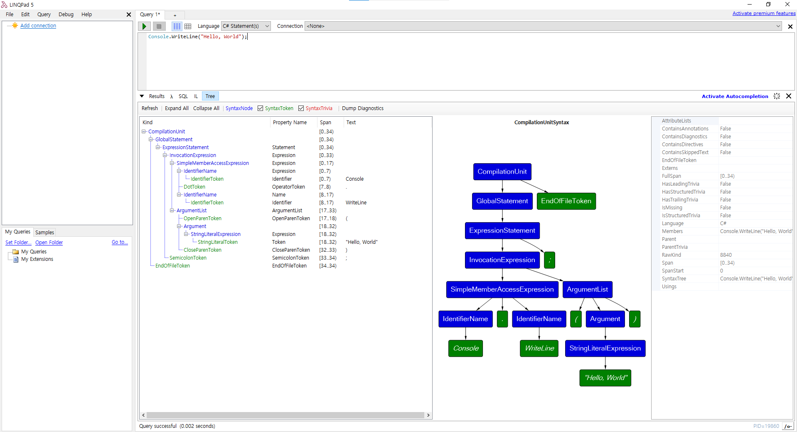

# [LINQPad5 (.netFrameWork)](https://github.com/seongmincho33/devexpress-winform/blob/main/Linq/LINQPad5.md)



1. 링큐패드 소개
2. 링큐패드 튜토리얼
    - 5분 튜토리얼
        - Hello LINQPad!
        - A simple query expression
        - Multiple statements
        - The Big Dump
        - Custom methods and types
        - What about querying a database!
        - But I dont't havve NORTHWIND!
        - More on database querying
        - PredicateBuilder is included!
    - Ui 둘러보기
    - 스크래치패드 특징들
    - 스트립팅 및 자동화 특징들
    - 데이터베이스 쿼리 특징들
3. 링큐패드 링큐 -> 람다링큐
4. 링큐패드 람큐 -> SQL
5. 링큐패드 IL 분석
6. 링큐패드 Tree
7. 단축기

__________________________________________________

<br>

# 1. 링큐패드 소개


링큐패드를 다운로드하는데 .NET Framework 4.6/4.7/4.8 까지 최신 릴리즈 버전을 사용하신다면 LINQPad5를 다운받으셔야 합니다. C#을 그냥 돌리는데 사용한다면 둘중에 아무거나 상관없습니다. C# 플레이그라운드로 만들어졌다고 합니다. 웬만한 객체에 .Dump() 만 붙여주면 링큐패드 결과창에 값이 보여지게 됩니다. 조사식대신 쓰기 좋습니다.

__________________________________________________

<br> 

# 2. 링큐패드 튜토리얼

## 1. 5분 튜토리얼

### 1) Hello LINQPad!

"Hello, world!" 를 치고 F5만 눌러도 결과창에 스트링값이 보여집니다. 덤프 안써도 나옵니다.... 음..? 

```C#
// Here it is, the simplest "hello, world" ever!  (Just hit F5)

"Hello, world!"
```

보통은 Console.WriteLine("Hello, world"); 가 C#의 테스트용 기본 구문인데 이건 말그대로 콘솔창을 호출하는거라서 링큐패드에서는 좀 다른방식을 써야했나봅니다. .Dump() 메서드를 사용하면 거의 모든것들을 렌더링하고 값을 추출하고 그냥 다 보여진다고 보면 될것 같습니다. 심지어 이미지 비트맵까지 먹힙니다. 아래는 사이트 설명입니다.


### 2) A simple query expression 

```C#
// Now for a simple LINQ-to-objects query expression (notice no semicolon):

from word in "The quick brown fox jumps over the lazy dog".Split()
orderby word.Length
select word


// Feel free to edit this... (no-one's watching!) You'll be prompted to save any
// changes to a separate file.
//
// Tip:  You can execute part of a query by highlighting it, and then pressing F5.
```


__________________________________________________

<br> 

# 7. 단축기

To find a sample by name:  Edit | Navigate To Query   (Ctrl+,)

To search sample content:  Edit | Search All Queries  (Ctrl+Shift+F)

Be sure to tick the 'Search samples' checkbox.
