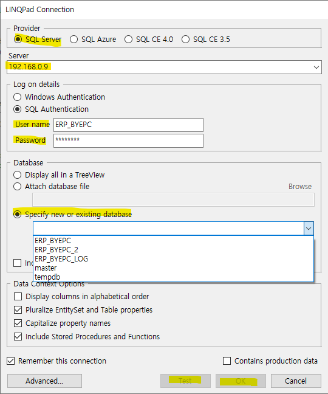
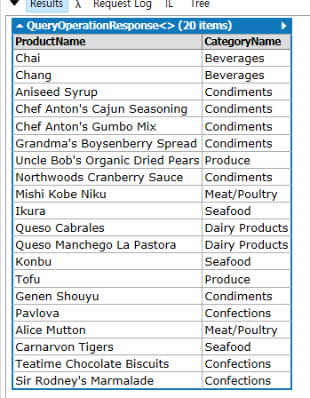

# LINQPad5 (.netFrameWork)


1. 링큐패드 소개
2. 링큐패드 튜토리얼
    - 5분 튜토리얼
        - Hello LINQPad!
        - A simple query expression
        - Multiple statements
        - The Big Dump
        - Custom methods and types
        - What about querying a database!
        - But I dont't havve NORTHWIND!
        - More on database querying
        - PredicateBuilder is included!
    - Ui 둘러보기
    - 스크래치패드 특징들
    - 스트립팅 및 자동화 특징들
    - 데이터베이스 쿼리 특징들
3. 링큐패드 링큐 -> 람다링큐
4. 링큐패드 람큐 -> SQL
5. 링큐패드 IL 분석
6. 링큐패드 Tree
7. 단축기

__________________________________________________

<br>

# 1. 링큐패드 소개


링큐패드를 다운로드하는데 .NET Framework 4.6/4.7/4.8 까지 최신 릴리즈 버전을 사용하신다면 LINQPad5를 다운받으셔야 합니다. C#을 그냥 돌리는데 사용한다면 둘중에 아무거나 상관없습니다. C# 플레이그라운드로 만들어졌다고 합니다. 웬만한 객체에 .Dump() 만 붙여주면 링큐패드 결과창에 값이 보여지게 됩니다. 조사식대신 쓰기 좋습니다.

__________________________________________________

<br> 

# 2. 링큐패드 튜토리얼

## 1. 5분 튜토리얼

<br>
<br>
<br>
<hr>

### 1) Hello LINQPad!

<br>

"Hello, world!" 를 치고 F5만 눌러도 결과창에 스트링값이 보여집니다. 덤프 안써도 나옵니다.... 음..? 

```C#
// Here it is, the simplest "hello, world" ever!  (Just hit F5)

"Hello, world!"
```

보통은 Console.WriteLine("Hello, world"); 가 C#의 테스트용 기본 구문인데 이건 말그대로 콘솔창을 호출하는거라서 링큐패드에서는 좀 다른방식을 써야했나봅니다. .Dump() 메서드를 사용하면 거의 모든것들을 렌더링하고 값을 추출하고 그냥 다 보여진다고 보면 될것 같습니다. 심지어 이미지 비트맵까지 먹힙니다. 아래는 사이트 설명입니다. 아 참고로 .Dump()는 링큐패드에서만 사용하는 문법입니다!!. 


<br>
<br>
<br>
<hr>

### 2) A simple query expression 

<br>

간단한 LINQ-to-objects쿼리 표현식 (세미콜론없음) 입니다. .Split()함수를 사용하는데 앞에 붙은 스트링값을 단어마다 잘라서 배열형태로 반환합니다. 따라서 아래코드에 word는 배열이 되겠습니다. 링큐패드는 SSMS처럼 드래그해서 F5키를 누르면 그 부분만 실행되는점이 비슷합니다. 간단한 링큐식은 이렇게 표현해서 출력 가능합니다. 덤프 안써도 출력됩니다.

```C#
// Now for a simple LINQ-to-objects query expression (notice no semicolon):

from word in "The quick brown fox jumps over the lazy dog".Split()
orderby word.Length
select word


// Feel free to edit this... (no-one's watching!) You'll be prompted to save any
// changes to a separate file.
//
// Tip:  You can execute part of a query by highlighting it, and then pressing F5.
```

실행결과 : 


<br>
<br>
<br>
<hr>

### 3) Multiple statements

<br>

여러개의 링큐문을 사용해도 정상적으로 출력합니다. 하나의 문에 테이블 하나씩 생성된다고 보면 될것 같습니다. 

```C#
// Setting the query language to "C# Statement(s)" permits multiple statements:

var words =
	from word in "The quick brown fox jumps over the lazy dog".Split()
	orderby word.ToUpper()
	select word;
	
var duplicates =
	from word in words
	group word.ToUpper() by word.ToUpper() into g
	where g.Count() > 1
	select new { g.Key, Count = g.Count() };	
	
// The Dump extension method writes out queries:

words.Dump();
duplicates.Dump();

// Notice that we do need semicolons now!
```

실행결과 : 


<br>
<br>
<br>
<hr>

### 4) The Big Dump

<br>

위는 덤프를 사용하지 않았는데 덤프를 사용해서 테이블에 레전드를 줄 수도 있습니다. 이러나 저러나 상관은 없는데 앞으로 링큐패드를 사용한다면 덤프를 쓰는게 보기에 좀더 편할것 같습니다. 그냥 아무 문에나 .Dump()를 붙여주기만 하면됩니다. 덤프 문법이 또 따로 있는데 안에다가 스트링을 넣어주면 테이블에 제목으로 붙여줍니다. 시인성을 위한것입니다. 

```C#
// LINQPad's "Dump" extension method will eat just about anything!

123.Dump();

Regex.Match ("my favorite color is...", "colou?r").Dump();   // LINQPad is great for Regex testing!

// Dump accepts an optional title for formatting:

TimeZoneInfo.Local.Dump ("Bet you never knew this type existed!");

// Dump returns exactly what it was given, so you can sneakily inject
// a Dump (or even many Dumps) *within* an expression. This is useful
// for monitoring a query as it progresses:

new[] { 11, 5, 17, 7, 13 }	.Dump ("Prime numbers")
.Where (n => n > 10)		.Dump ("Prime numbers > 10")
.OrderBy (n => n)			.Dump ("Prime numbers > 10 sorted")
.Select (n => n * 10) 		.Dump ("Prime numbers > 10 sorted, times 10!");

// Or you can do this:
DateTime now = DateTime.Now.Dump();
```

실행결과 : 


<br>
<br>
<br>
<hr>

### 5) Custom methods and types

<br>

링큐패드에서는 클래스를 작성할 수 있습니다. 스케치 상단 패널에 Language룩업을 클릭하면 C# Program으로 바꿔주시면 알아서 Main() 메서드를 생성해줍니다. 여기서만 클래스를 작성하고 완성적프로그램을 돌릴수가 있습니다. 단순히 statement만 돌리고싶으시다면 필요없습니다. 여기 룩업에서 SQL도 선택해서 쿼리문도 실행 할 수 있습니다.


```C#
// You can also write your own methods and classes. Just change the language dropdown to 'C# Program'.
// LINQPad will automatically generate a 'Main' method.

void Main()
{
	MyMethod();	
	new MyClass().GetHelloMessage().Dump();
}

void MyMethod()
{
	"LINQPad is the ultimate .NET code scratchpad!".Dump();
}

class MyClass
{
	public string GetHelloMessage() => 
		"Put an end to those hundreds of Visual Studio Console projects cluttering your source folder!";
	
	// To reference any extra assemblies, or to import namespaces, just press F4!
}
```

실행결과 : 


<br>
<br>
<br>
<hr>

### 6) What about querying a database!

<br>

앞서 다른 예제들과는 다르게 데이터베이스랑 연결해줘서 테이블을 끌어와야합니다. 제일 먼저 왼쪽 상단의 Add connection 버튼을 눌러줍니다(아래 이미지).


그다음 팝업이 뜨는데 라디오버튼 Build data context automatically를 선택하시고 Default (LINQ to SQL) 을 선택하고 Next> 를 클릭합니다. 아래 WCF Data Services 5.5(OData 3) 는 .svc를 가져오는 방법으로 URI값을 넣어주면 거기서 데이터를 가져오는 형식입니다. 여튼 먼저 SQL Server에서 가져오겠습니다. 


아래 창에서 SQL Server라디오를 체크합니다. Server의 이름을 선택하거나 적어주시고 SQL Authentication 라디오를 체크하셔서 User name 과 Password를 작성합니다. 먼저 이것을 해야 Specify new or existing database 에서 데이터베이스를 선택할 수 있습니다. 선택한 후 하단의 Test를 눌러서 테스트 후 OK버튼을 눌러주시면 됩니다.



아래와 같은 예제 코드를 돌리고싶으시다면 데이터베이스에 데이터를 넣어줘야합니다..

```C#
/*	Knew you'd ask!

	To query a database, first click 'Add connection' (on the TreeView to the left),
	then select the desired database in the query's "Connection" combo (above).
	
	LINQPad will magically generate a typed data context behind the scenes.

	For example, the following query will work on the NORTHWND sample database:  */

from p in Products
let spanishOrders = p.OrderDetails.Where (o => o.Order.ShipCountry == "Spain")
where spanishOrders.Any()
orderby p.ProductName
select new
{
	p.ProductName,
	p.Category.CategoryName,
	Orders = spanishOrders.Count(),	
	TotalValue = spanishOrders.Sum (o => o.UnitPrice * o.Quantity)
}

// Database and connection details are saved with each query, so next time you
// open the query, the schema tree on the left will conveniently reappear.
```

그런데 사용중인 데이터베이스에 NORTHWIND데이터를 넣고 예제 연습을 하는것은 현실적으로 어려우므로 인터넷에서 SVC를 가져오는 방법이 하나있습니다. 

먼저 왼쪽 상단에 Add connection 링크를 클릭해주시면 아래와 같은 팝업이 뜹니다. 여기서 WCF Data Services 5.5(OData 3)를 클릭하고 Next> 를 클릭해주세요.


그럼 아래와 같은 팝업창이 나옵니다. URI 에 이 링크 https://services.odata.org/V3/Northwind/Northwind.svc/ 를 붙여주고 OK 버튼을 눌러주세요


그런데 예제 코드를 실행시키면 테이블 컬럼명이 몇개 없다고 오류를 냅니다. 아마 이 svc가 옛날버전이라 그런것같습니다. 없는 컬럼명을 고려해서 연습을 진행하면 될것 같습니다. 아래코드를 가지고 실행해봅니다.

```C#
from p in Products

select new
{
	p.ProductName,
	p.Category.CategoryName,

}
```

실행 결과:



<br>
<br>
<br>
<hr>

### 7) But I dont't have NORTHWND!

<br>

NORTHWIND 예제 테이블이 없는경우 SQL 쿼리문으로 생성해주는 스크래치 코드입니다. 이걸 사용하면 테이블이랑 데이터가 만들어지는데 사용권장하지 않습니다. 

```C#
-- LINQPad also lets you run old-fashioned SQL queries.

-- To illustrate, the following script creates a small fragment of the NORTHWND
-- database, allowing the LINQ query in the preceding example to execute!

-- Before running this, click "Add connection" and create a suitable empty database,
-- then pick that database in the dropdown above.

create table Categories
(
	CategoryID int not null primary key,
	CategoryName varchar(100) not null
)

create table Products
(
	ProductID int not null primary key,
	ProductName varchar(100) not null,
	CategoryID int references Categories (CategoryID)
)

create table Orders
(
	OrderID int not null primary key,
	OrderDate DateTime,
	ShipCountry varchar(100) not null
)

create table OrderDetails
(
	OrderID int not null references Orders (OrderID),
	ProductID int not null references Products (ProductID),
	UnitPrice decimal,
	Quantity int,
	constraint PK_OrderDetails primary key (OrderID, ProductID)
)

insert Categories values (1, 'Seafood')
insert Categories values (2, 'Beverages')
insert Categories values (3, 'Confections')
insert Categories values (4, 'Meat/Poultry')
insert Categories values (5, 'Dairy Products')

insert Products values (1, 'Boston Crab Meat', 1)
insert Products values (2, 'Chai', 2)
insert Products values (3, 'Teatime Chocolate Biscuits', 3)

insert Orders values (1, '2007-1-1', 'Spain');
insert Orders values (2, '2007-2-2', 'Spain');
insert Orders values (3, '2007-3-3', 'Spain');

insert OrderDetails values (1, 1, 23.5, 2)
insert OrderDetails values (2, 2, 143, 5)
insert OrderDetails values (3, 3, 77, 1)
insert OrderDetails values (3, 2, 70, 3)

PRINT 'Voila!'
PRINT ''
PRINT 'Now go back to the preceding example and re-run the LINQ to SQL query.'
PRINT '(Remember to set the Database).'
```

<br>
<br>
<br>
<hr>

### 8) More on database querying

<br>

본인의 개인 테이블이 있다면 외래 키 제약조건을 설정해야 합니다. 부모와 자식이 파란색과 녹색으로 나타나게 만들려면 외래키 제약조건이 필수입니다. 아니면 SQL join문을 써서 일일이 붙여야하는데 이건 좋지 않은 방법입니다. 데이터베이스에 이미 커스텀한 제약조건이 있다면 상관없습니다. 

이를 TYPED DataContext라 하는데 이를 써줄 필요는 없습니다. 링큐패드가 알아서 이러한 세부사항을 처리해줍니다. 

<br>
<br>
<br>
<hr>

### 9) PredicateBuilder is Included!

<br>

먼저 PredicateBuilder를 사용하기전에 알아둬야하는 기본적인 내용의 순서가 있습니다.

1. delegate
2. Action<T> Delegate
3. Func<T, TResult> Delegate
4. Predicate<T> Delegate

먼저 알아둬야하는 내용은 delegate입니다. 이는 따로 작성한 내용의 링크를 확인해 주세요 [링크]

다음은 Action<T> Delegate 에 관해서입니다. 하나의 파라미터를 받는데 리턴값이 없습니다. 따라서 Action<T> 에 함수를 작성해서 등록을 해줄텐데 그 작성한 함수에는 return 자체가 있으면 안됩니다. 따라서 형식은 무조건 void형식입니다. 또한 파라미터는 0개부터 16까지 넣어줄 수 있는데 이거는 System 네임스페이스에서 마이크로소프트사가 미리 일일히 다 만들어 놓은것입니다. Action, Action<T>, Action<T1, T2>, Action<T1, T2, T3>...... 이런식으로 미리 만들어놨습니다.

Func<T> Delegate 에 관해서 설명하겠습니다. Action<T>와는 다르게 리턴값이 존재합니다. 리턴값을 무조건 등록해주는 함수에 작성해줘야합니다. 따라서 Func<T> 는 있어도 Func는 없습니다. 리턴값을 위한 파라미터 를 넘겨야 하기 때문에 파라미터 한개는 무조건 리턴값입니다. Func<T> 도 Action<T>처럼 파라미터 인자로 0부터 16개 까지 받을 수 있습니다. 
가령 예를들어 등록하는 함수의 파라미터를 0개부터 3개 를 등록받는 Func<T>를 정의하자면 아래와같이됩니다.

```
input 파라미터 0개  -> Func<T>
input 파라미터 1개  -> Func<T(input), T(return)>
input 파라미터 2개  -> Func<T(input), T(input), T(return)>
input 파라미터 3개  -> Func<T(input), T(input), T(input), T(return)>
.
.
.
```

마지막으로 Predicate<T> Delegate에 대해서 알아봅니다. 위 두개의 delegate와는 다르게 리턴값이 무조건 bool 형식이어야 합니다. 위의 Action과 Func와는 달리 입력파라미터는 1개입니다. 입력파라미터의 개수는 1개만 가능합니다. 리턴값을 파라미터에 넣지는 않습니다. 따라서 모양은 Predicate<T>만이 유일합니다. 

<br>

사실 PredicateBuilder 를 자세히 알 필요까지는 없어보여서 아래 내용은 딱히 신경 안써도 되지만 조사를 해봤습니다.

먼저 Predicates 에는 Expression<Func<T, bool>> 형이 있고 이는 predicate expression 이라고 합니다. 근데 왜 PredicateBuilder가 필요한가? 생각해보면 서로 다른 predicatefmf 합치는게 어렵기 때문입니다. 가령 예를들어 아래와 같은 코드가 있다고 칩시다.

```C#
Expression<Func<Customer, bool>> expr1 = (Customer c) => c.CompanyName.StartsWith("A");
Expression<Func<Customer, bool>> expr2 = (Customer c) => c.CompanyName.Contains("e");
```

두개를 동시에 쿼리하고 싶은데 아래와같이하면 잘 안될겁니다. 명확하지가 않기 때문입니다. 

```C#
	
var query1 = myEntityManager.Customers.Where(expr1); // ok
var query2 = myEntityManager.Customers.Where(expr2); // ok
var queryBoth = myEntityManager.Customers.Where(expr1 && expr2) // BAD - won't compile.
```

PredicateBuilder는 두개의 predicates를 새로운 predicate로 만들고 이 새로만들어진 객체를 쿼리의 Where() 절에 넘겨버립니다.

```C#
var expr3 = PredicateBuilder.And(expr1, expr2);
var queryBoth = myEntityManager.Customers.Where(expr3); // this works
```

PredicateBuilder클래스를 실험하는 가장 쉬운 방법은 LINQPad를 사용하는 것 입니다. LINQPad를 사용하면 데이터베이스 또는 로컬 컬렉션에 대해 LINQ 쿼리를 즉시 테스트할 수 있으며 PredicateBuilder를 직접 지원합니다(F4 키를 누르고 'PredicateBuilder 포함' 선택).

```C#
// LINQPad also includes PredicateBuilder - to use, simply press F4 and tick
// 'Include PredicateBuilder'. PredicateBuilder is a simple class for dynamically
// building query filter expressions. Here's an example with Northwind's Categories table:

var predicate = PredicateBuilder.False<Categories>();

predicate = predicate.Or (c => c.CategoryName.Contains ("Dairy"));
predicate = predicate.Or (c => c.CategoryName.Contains ("Meat"));

Categories.Where (predicate).Dump();

// Go to http://www.albahari.com/expressions/ for more info on PredicateBuilder.
```

[참고링크](http://drc.ideablade.com/xwiki/bin/view/Documentation/predicatebuilder-methods#HWhydoweneedthePredicateBuider3F)
__________________________________________________

<br> 

# 7. 단축기

To find a sample by name:  Edit | Navigate To Query   (Ctrl+,)

To search sample content:  Edit | Search All Queries  (Ctrl+Shift+F)

Be sure to tick the 'Search samples' checkbox.

F4 : To reference any extra assemblies, or to import namespaces, just press F4!
