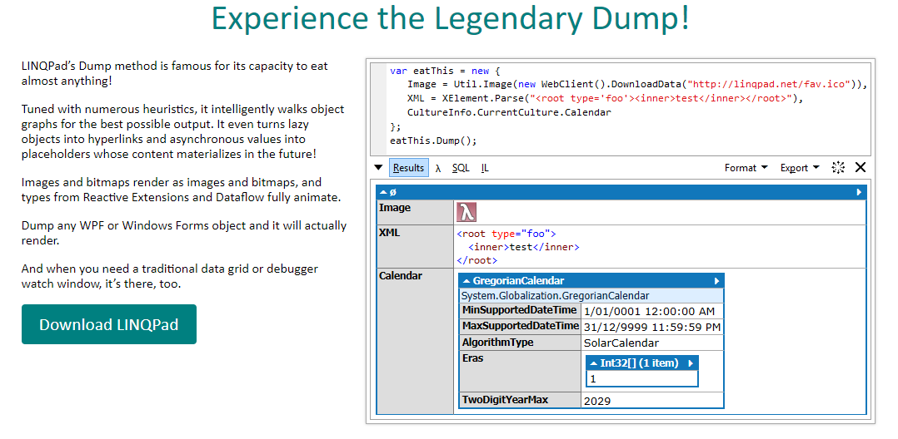
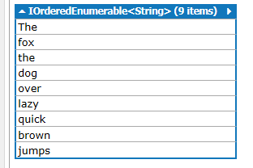
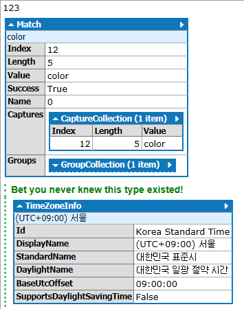
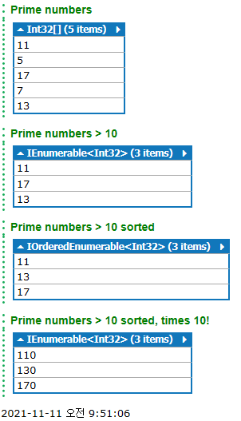

# LINQPad5 (.netFrameWork)


1. 링큐패드 소개
2. 링큐패드 튜토리얼
    - 5분 튜토리얼
        - Hello LINQPad!
        - A simple query expression
        - Multiple statements
        - The Big Dump
        - Custom methods and types
        - What about querying a database!
        - But I dont't havve NORTHWIND!
        - More on database querying
        - PredicateBuilder is included!
    - Ui 둘러보기
    - 스크래치패드 특징들
    - 스트립팅 및 자동화 특징들
    - 데이터베이스 쿼리 특징들
3. 링큐패드 링큐 -> 람다링큐
4. 링큐패드 람큐 -> SQL
5. 링큐패드 IL 분석
6. 링큐패드 Tree
7. 단축기

__________________________________________________

<br>

# 1. 링큐패드 소개


링큐패드를 다운로드하는데 .NET Framework 4.6/4.7/4.8 까지 최신 릴리즈 버전을 사용하신다면 LINQPad5를 다운받으셔야 합니다. C#을 그냥 돌리는데 사용한다면 둘중에 아무거나 상관없습니다. C# 플레이그라운드로 만들어졌다고 합니다. 웬만한 객체에 .Dump() 만 붙여주면 링큐패드 결과창에 값이 보여지게 됩니다. 조사식대신 쓰기 좋습니다.

__________________________________________________

<br> 

# 2. 링큐패드 튜토리얼

## 1. 5분 튜토리얼

<br>
<br>
<br>

### 1) Hello LINQPad!

"Hello, world!" 를 치고 F5만 눌러도 결과창에 스트링값이 보여집니다. 덤프 안써도 나옵니다.... 음..? 

```C#
// Here it is, the simplest "hello, world" ever!  (Just hit F5)

"Hello, world!"
```

보통은 Console.WriteLine("Hello, world"); 가 C#의 테스트용 기본 구문인데 이건 말그대로 콘솔창을 호출하는거라서 링큐패드에서는 좀 다른방식을 써야했나봅니다. .Dump() 메서드를 사용하면 거의 모든것들을 렌더링하고 값을 추출하고 그냥 다 보여진다고 보면 될것 같습니다. 심지어 이미지 비트맵까지 먹힙니다. 아래는 사이트 설명입니다.



<br>
<br>
<br>

### 2) A simple query expression 

간단한 LINQ-to-objects쿼리 표현식 (세미콜론없음) 입니다. .Split()함수를 사용하는데 앞에 붙은 스트링값을 단어마다 잘라서 배열형태로 반환합니다. 따라서 아래코드에 word는 배열이 되겠습니다. 링큐패드는 SSMS처럼 드래그해서 F5키를 누르면 그 부분만 실행되는점이 비슷합니다. 

```C#
// Now for a simple LINQ-to-objects query expression (notice no semicolon):

from word in "The quick brown fox jumps over the lazy dog".Split()
orderby word.Length
select word


// Feel free to edit this... (no-one's watching!) You'll be prompted to save any
// changes to a separate file.
//
// Tip:  You can execute part of a query by highlighting it, and then pressing F5.
```



<br>
<br>
<br>

### 3) Multiple statements

```C#
// Setting the query language to "C# Statement(s)" permits multiple statements:

var words =
	from word in "The quick brown fox jumps over the lazy dog".Split()
	orderby word.ToUpper()
	select word;
	
var duplicates =
	from word in words
	group word.ToUpper() by word.ToUpper() into g
	where g.Count() > 1
	select new { g.Key, Count = g.Count() };	
	
// The Dump extension method writes out queries:

words.Dump();
duplicates.Dump();

// Notice that we do need semicolons now!
```


<br>
<br>
<br>

### 4) The Big Dump

```C#
// LINQPad's "Dump" extension method will eat just about anything!

123.Dump();

Regex.Match ("my favorite color is...", "colou?r").Dump();   // LINQPad is great for Regex testing!

// Dump accepts an optional title for formatting:

TimeZoneInfo.Local.Dump ("Bet you never knew this type existed!");

// Dump returns exactly what it was given, so you can sneakily inject
// a Dump (or even many Dumps) *within* an expression. This is useful
// for monitoring a query as it progresses:

new[] { 11, 5, 17, 7, 13 }	.Dump ("Prime numbers")
.Where (n => n > 10)		.Dump ("Prime numbers > 10")
.OrderBy (n => n)			.Dump ("Prime numbers > 10 sorted")
.Select (n => n * 10) 		.Dump ("Prime numbers > 10 sorted, times 10!");

// Or you can do this:
DateTime now = DateTime.Now.Dump();
```




<br>
<br>
<br>

### 5) Custom methods and types

```C#
// You can also write your own methods and classes. Just change the language dropdown to 'C# Program'.
// LINQPad will automatically generate a 'Main' method.

void Main()
{
	MyMethod();	
	new MyClass().GetHelloMessage().Dump();
}

void MyMethod()
{
	"LINQPad is the ultimate .NET code scratchpad!".Dump();
}

class MyClass
{
	public string GetHelloMessage() => 
		"Put an end to those hundreds of Visual Studio Console projects cluttering your source folder!";
	
	// To reference any extra assemblies, or to import namespaces, just press F4!
}
```


<br>
<br>
<br>

### 6) What about querying a database!

앞서 다른 예제들과는 다르게 데이터베이스랑 연결해줘서 테이블을 끌어와야합니다. 제일 먼저 왼쪽 상단의 Add connection 버튼을 눌러줍니다(아래 이미지).


그다음 팝업이 뜨는데 라디오버튼 Build data context automatically를 선택하시고 Default (LINQ to SQL) 을 선택하고 Next> 를 클릭합니다. 아래 WCF Data Services 5.5(OData 3) 는 .svc를 가져오는 방법으로 URI값을 넣어주면 거기서 데이터를 가져오는 형식입니다. 여튼 먼저 SQL Server에서 가져오겠습니다. 


아래 창에서 SQL Server라디오를 체크합니다. Server의 이름을 선택하거나 적어주시고 SQL Authentication 라디오를 체크하셔서 User name 과 Password를 작성합니다. 먼저 이것을 해야 Specify new or existing database 에서 데이터베이스를 선택할 수 있습니다. 선택한 후 하단의 Test를 눌러서 테스트 후 OK버튼을 눌러주시면 됩니다.


```C#
/*	Knew you'd ask!

	To query a database, first click 'Add connection' (on the TreeView to the left),
	then select the desired database in the query's "Connection" combo (above).
	
	LINQPad will magically generate a typed data context behind the scenes.

	For example, the following query will work on the NORTHWND sample database:  */

from p in Products
let spanishOrders = p.OrderDetails.Where (o => o.Order.ShipCountry == "Spain")
where spanishOrders.Any()
orderby p.ProductName
select new
{
	p.ProductName,
	p.Category.CategoryName,
	Orders = spanishOrders.Count(),	
	TotalValue = spanishOrders.Sum (o => o.UnitPrice * o.Quantity)
}

// Database and connection details are saved with each query, so next time you
// open the query, the schema tree on the left will conveniently reappear.
```


<br>
<br>
<br>

### 7) But I dont't have NORTHWND!

```C#
-- LINQPad also lets you run old-fashioned SQL queries.

-- To illustrate, the following script creates a small fragment of the NORTHWND
-- database, allowing the LINQ query in the preceding example to execute!

-- Before running this, click "Add connection" and create a suitable empty database,
-- then pick that database in the dropdown above.

create table Categories
(
	CategoryID int not null primary key,
	CategoryName varchar(100) not null
)

create table Products
(
	ProductID int not null primary key,
	ProductName varchar(100) not null,
	CategoryID int references Categories (CategoryID)
)

create table Orders
(
	OrderID int not null primary key,
	OrderDate DateTime,
	ShipCountry varchar(100) not null
)

create table OrderDetails
(
	OrderID int not null references Orders (OrderID),
	ProductID int not null references Products (ProductID),
	UnitPrice decimal,
	Quantity int,
	constraint PK_OrderDetails primary key (OrderID, ProductID)
)

insert Categories values (1, 'Seafood')
insert Categories values (2, 'Beverages')
insert Categories values (3, 'Confections')
insert Categories values (4, 'Meat/Poultry')
insert Categories values (5, 'Dairy Products')

insert Products values (1, 'Boston Crab Meat', 1)
insert Products values (2, 'Chai', 2)
insert Products values (3, 'Teatime Chocolate Biscuits', 3)

insert Orders values (1, '2007-1-1', 'Spain');
insert Orders values (2, '2007-2-2', 'Spain');
insert Orders values (3, '2007-3-3', 'Spain');

insert OrderDetails values (1, 1, 23.5, 2)
insert OrderDetails values (2, 2, 143, 5)
insert OrderDetails values (3, 3, 77, 1)
insert OrderDetails values (3, 2, 70, 3)

PRINT 'Voila!'
PRINT ''
PRINT 'Now go back to the preceding example and re-run the LINQ to SQL query.'
PRINT '(Remember to set the Database).'
```


<br>
<br>
<br>

### 8) More on database querying

```C#
//	DO I NEED TO SET UP FOREIGN KEY CONSTRAINTS ON MY TABLES?
	
		"YES!!!".Dump ("Foreign key constraints");

/*	Foreign key constraints are essential if you want parent and child properties to
	magically appear in blue and green. Otherwise you'll have to join manually like in
	old SQL (ugghh!) No doubt you already have such constraints in your databases, right? 

	DO I NEED TO BUILD A TYPED DATACONTEXT?									*/

		"NO!!!".Dump ("Typed DataContext");

//	LINQPad takes care of this detail :)  Just start querying!
```


<br>
<br>
<br>

### 9) PredicateBuilder is Included!

```C#
// LINQPad also includes PredicateBuilder - to use, simply press F4 and tick
// 'Include PredicateBuilder'. PredicateBuilder is a simple class for dynamically
// building query filter expressions. Here's an example with Northwind's Categories table:

var predicate = PredicateBuilder.False<Categories>();

predicate = predicate.Or (c => c.CategoryName.Contains ("Dairy"));
predicate = predicate.Or (c => c.CategoryName.Contains ("Meat"));

Categories.Where (predicate).Dump();

// Go to http://www.albahari.com/expressions/ for more info on PredicateBuilder.
```


__________________________________________________

<br> 

# 7. 단축기

To find a sample by name:  Edit | Navigate To Query   (Ctrl+,)

To search sample content:  Edit | Search All Queries  (Ctrl+Shift+F)

Be sure to tick the 'Search samples' checkbox.

F4 : To reference any extra assemblies, or to import namespaces, just press F4!
