# ADO.NET

1. 개요
    - MS SQL 설치
2. `ADO.NET` 개요
    - 역할
    - 연결 형식
    - 구성 요소
    - `ADO.NET` DataProvider 구성요소
    - 연결형식별 `ADO.NET` Data Provider 구성요소 조합
    - `ADO.NET` 네임스페이스
3. SqlConnection클래스
    - 상속 계층 구조
    - SqlConnection 연결
    - SqlConnection 연결 문자열
3. 간단한 예시 (폼 생성후, DB와 연결)
    - DB 생성
    - 간단한 화면 작성
4. 연결형 데이터베이스 프로그래밍


<hr />
<br />
<br />
<br />

## 1. 개요

데이터 베이스는 여러사람이 공유할 목적으로 통합해서 관리하는 데이터 집합입니다. 데이터 베이스 관리 시스템(DBMS) 는 Oracle, MySQL등이 있지만 C#을 다룬다면 MS에서 제공하는 MS SQL Server를 사용하는것이 좋습니다. 이 DBMS를 설치하는 컴퓨터는 서버 컴퓨터가 됩니다. 다른컴퓨터에 설치하는것이 좋지만 연습할때는 그냥 아무컴퓨터에 설치해도 됩니다. 이전에는 비쌌던 MSSQL 을 이제는 연습만 한다면 공짜로 EXPRESS 버전을 사용 할 수 있습니다.

<br />

### MS SQL 설치

먼저 MS SQL을 설치해주어야 합니다. MS 사이트에 가셔서 MS SQL Express 무료 버전을 설치합니다. Developer를 설치해도 됩니다. 저는 Express 버전을 설치했습니다.


<br />
<br />
<br />
<br />

설치 파일을 다운로드 받고 실행하면 아래와 같은 화면이 뜹니다. 사용자 지정버튼을 눌러주세요.

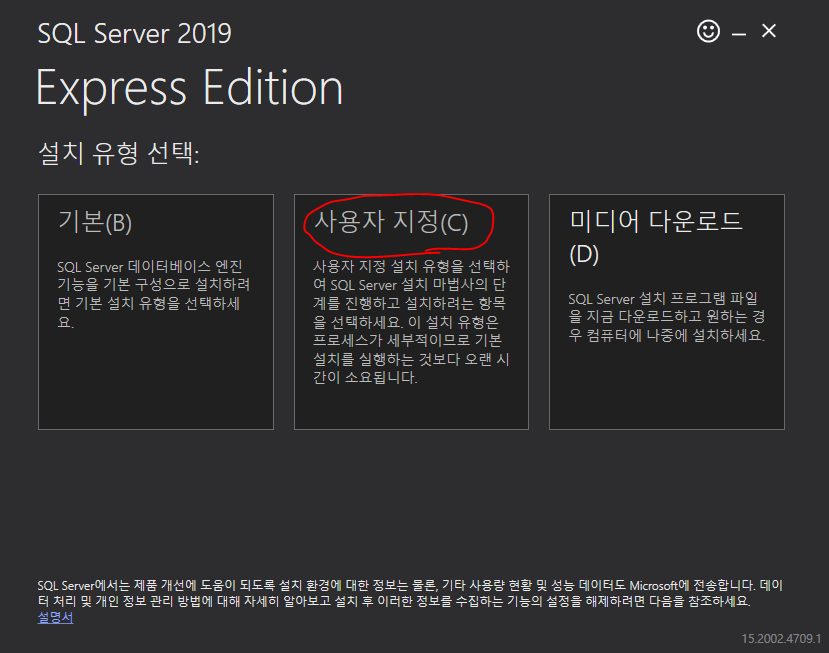
<br />
<br />
<br />
<br />

언어는 한국어로 선택하고 설치하고 싶은 위치 경로를 설정해주고 다음을 누릅니다.


<br />
<br />
<br />
<br />

왼쪽 탭의 설치를 누르고, [새 SQL Server 독립 실행형 설치 또는 기존 설치에 기능 추가] 항목을 클릭합니다.


<br />
<br />
<br />
<br />

[사용조건] 에서 동의함을 누르고 다음을 눌러주세요.


<br />
<br />
<br />
<br />

[전역규칙]은 자동으로 넘어가고 Microsoft 업데이트를 주기적으로 받을지에 대해서 체크박스가 있습니다. 원하시면 체크하고 다음을 눌러주세요.

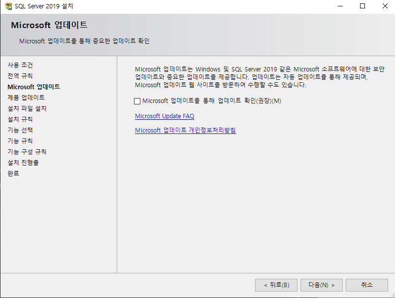
<br />
<br />
<br />
<br />

[설치 파일 설치]는 자동으로 실행하고 넘어갑니다. 아니면 다음을 눌러주세요.

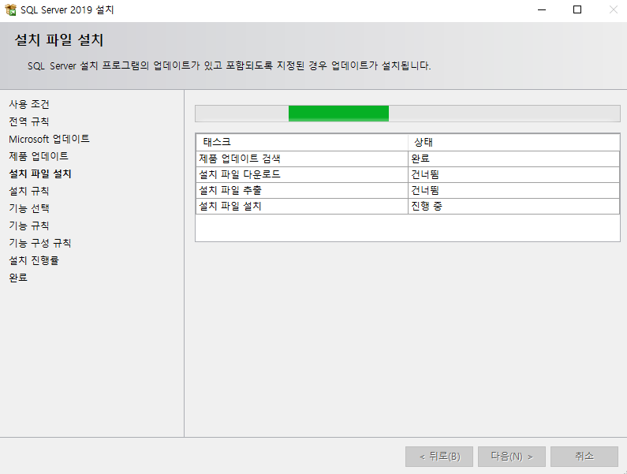
<br />
<br />
<br />
<br />

[설치 규칙]에서는 별 내용이 없다면 기본 셋팅값으로 다음을 눌러주세요.


<br />
<br />
<br />
<br />

[기능 선택]화면 에서는 웬만하면 아래와 같은 항목들을 체크해주어야 합니다.


- [x] 데이터베이스 엔진 서비스
- [x] SQL Server 복제
- [x] 검색을 위한 전체 텍스트 및 의미 체계 추정
- [x] 클라이언트 도구 연결
- [x] 클라이언트 도구 이전 버전과의 호환성
- [x] 클라이언트 도구 SDK
- [x] SQL 클라이언트 연결 SDK

인스턴스 루트 디렉터리를 원하는 경로로 바꿔주세요. 이를 마치면 다음을 눌러주세요.


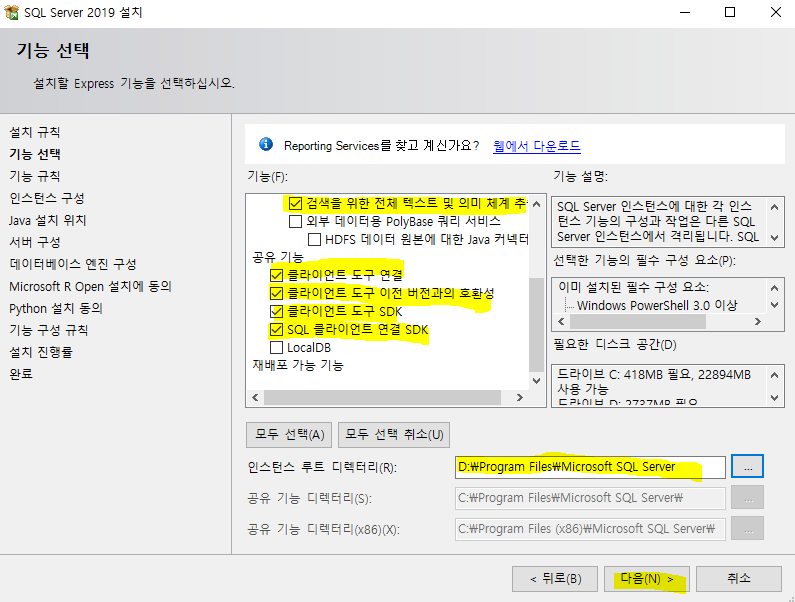
<br />
<br />
<br />
<br />

[인스턴스 구성] 화면에서는 이름을 지어줍니다. 여기서는 그냥 디폴트 값인 SQLExpress 를 사용하겠습니다.

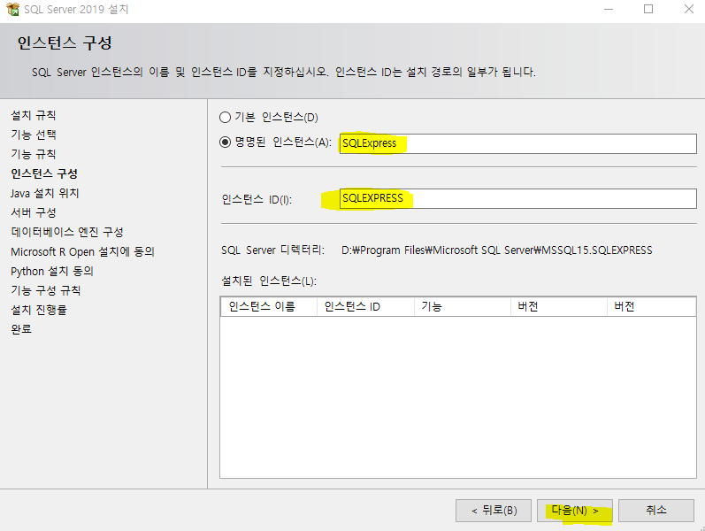
<br />
<br />
<br />
<br />

[Java 설치 위치] 에서는 자바의 경로를 물어봅니다. 사용하고 있는 자바가 있다면 경로를 주어서 사용할 수 있습니다. 저는 같이 딸려오는 자바를 받았습니다.(귀찮아...)

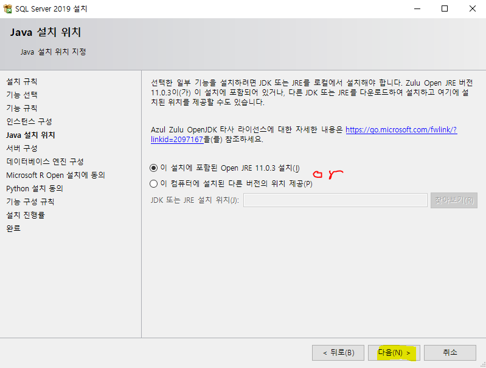
<br />
<br />
<br />
<br />

[서버구성] SQL Server 데이터베이스 엔진의 시작유형을 자동으로 설정하면 컴퓨터가 켜지면 자동으로 서버가 열립니다. 데이터 정렬탭을 누르면 Korean_Wansung_CL_AS가 디폴트로 있을텐데 아니라면 이걸로 바꿔주세요. 디폴트값을 그대로 두고 다음을 눌러줍니다.

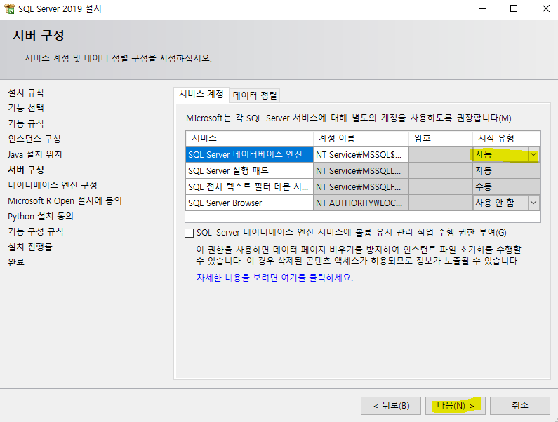
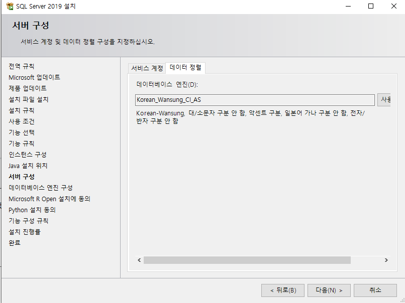
<br />
<br />
<br />
<br />


[데이터베이스 엔진 구성] 여기서는 혼합모드를 체크하고 암호를 입력해줍니다. 로그인 할 때 쓰는 설정입니다. 현재 사용자가 자동으로 붙어있지 않다면 현재 사용자를 넣어줍니다. 현재 사용자는 모든 권한을 가지게 됩니다. 마치면 다음을 눌러줍니다.

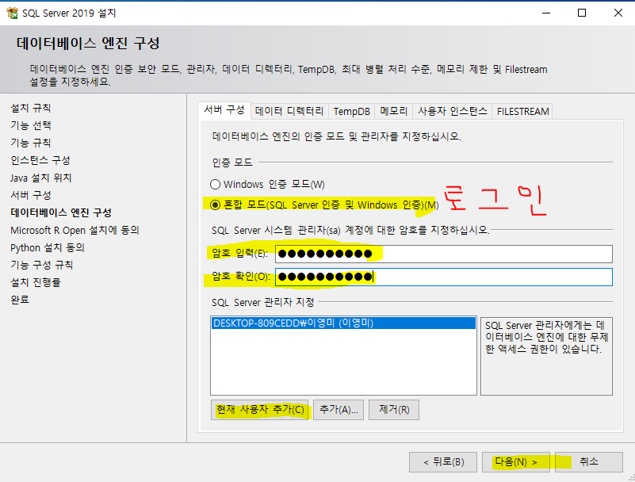
<br />
<br />
<br />
<br />

[Microsoft R Open 설치에 동의] 그냥 동의하고 다음을 눌러줍니다. R에 관한거 같습니다.


<br />
<br />
<br />
<br />

[Python 설치 동의] 이것도 마찬가지로 동의하고 다음을 눌러줍니다.

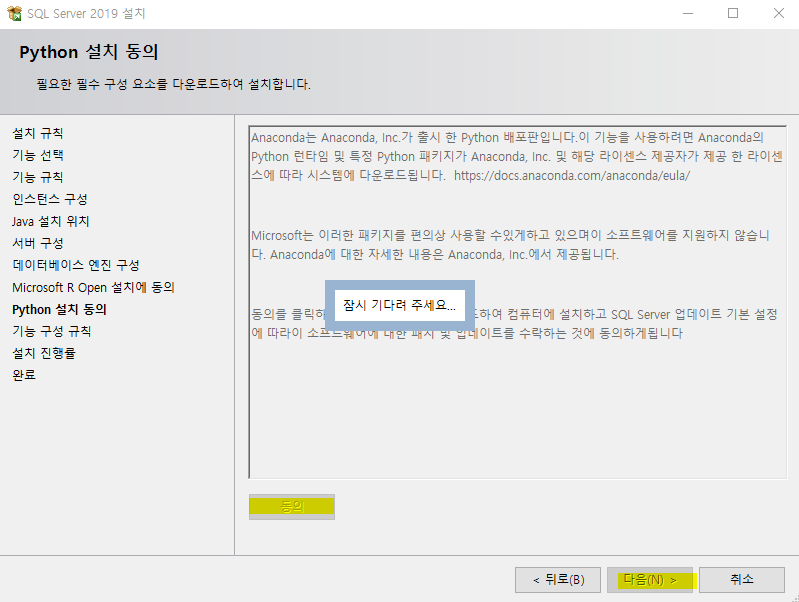
<br />
<br />
<br />
<br />

[설치를 진행률] 설치를 진행합니다. 시간이 많이 걸립니다. 


<br />
<br />
<br />
<br />

[완료] 설치가 완료되었습니다 와아~! 'ㅁ' !!

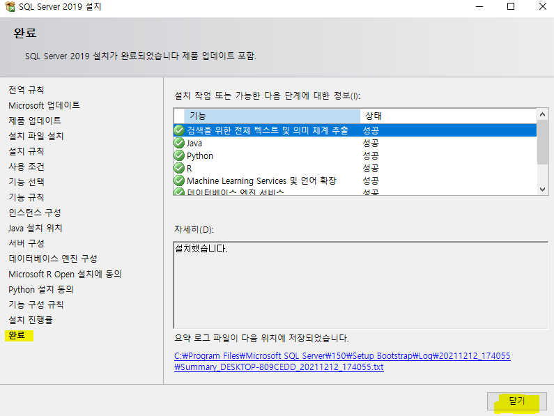
<br />
<br />
<br />
<br />

그런데 MSSQL 을 사용하려면 SSMS가 깔려있어야 합니다. 둘은 같은게 아니고 MSSQL이 설치되면 관련된 도구로서 SSMS가 존재합니다. SSMS에서 쿼리를 편집하고 실행 할 수 있습니다. 다시 SQL Server 설치 센터로 간다음에 설치 -> SQL Server 관리도구 설치 를 클릭해줍니다.

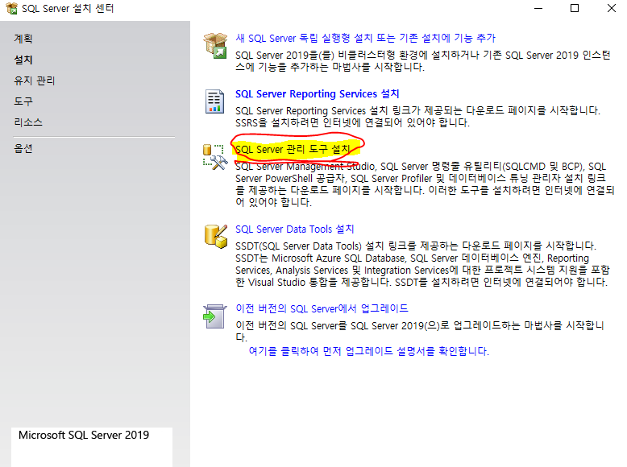
<br />
<br />
<br />
<br />

그러면 SSMS를 다운로드 할 수 있는 링크 보여줍니다.


<br />
<br />
<br />
<br />

아래와 같이 설치 파일을 실행하고 경로를 원하는 경로로 바꿔준 다음에 설치를 눌러줍니다.


<br />
<br />
<br />
<br />

SSMS 를 실행할 수 있습니다.


<br />
<br />
<br />
<br />

<hr />
<br />
<br />
<br />
<br />
<br />
<br />

## 2. ADO.NET

ADO.NET을 사용해서 클라이언트와 서버가 통신하는법을 배우기 위해서는 이론적으로 알아둘 부분이 있습니다. MSDN 에도 아주 자세히 설명이 되어있지만 
이렇게 좀 축약한 버전을 보고 MSDN을 본다면 좀더 정리가 편할 것 같습니다.

ADO.NET을 배운다는 것은 결국 라이브러리안에 있는 클래스의 사용법을 익히는것입니다.
<hr />

### 역할
- 데이터베이스 직접 접속 (응용프로그램은 코드만 제공) -> DBMS가 달라져도 코드에 영향 없음
- 데이터베이스 관련 라이브러리 제공 (클래스 형태로 제공 : 핵심 기능)
ADO.NET은 기본적인 프레임이 있습니다. 프레임워크를 이용해서 접속을 해야지만 ADO.NET을 이용해서 DBMS에 있는 데이터를 가져 올 수 있습니다.


<hr />

### 연결 형식
- 연결형
    - 실시간으로 연결된 형태
    - 다수 접속시 서버 부하가 높다.
- 비연결형(메모리형 데이터베이스)
    - 데이터를 읽거나 쓸 때만 연결하는 형태
 
연결 형식에는 두가지가 있습니다. 위의 방식은 필요에 따라서 두개중 선택합니다.

연결형 같은경우 실시간으로 연결된 형태입니다. 따라서 내가 A라는것을 클라이언트 쪽에서 바꾸면 서버도 바로 A로 바뀌게 됩니다. 그래서 서버는 다수접속시에는 부가가 크게 거립니다. 왜냐하면 여러명이 계속 연결되어있으면 서버의 핸들링으로 데이터를 계속 주고받으면서 통신하기 때문입니다. 따라서 연결형 같은경우에는 즉시! 처리해야하거나 아주 중요한 데이터들을 처리할 때 사용합니다.

비연결형 같은 경우는 사용자의 메모리에 서버의 데이터를 가져오고, 사용자의 처리가 끝나고 통신하는 방식입니다. 근데 문제가 있습니다. 만약 내가 데이터를 불러오고 수정하기 전에 다른 사용자가 데이터를 수정했다면 나의 데이터를 서버에 저장할때 충돌이 나는 문제가 생깁니다. 따라서 이러한 문제도 고려해야합니다.


<hr />

### 구성 요소
- Data Provider(데이터 공급자) : DB 접속, 읽기, 조작에 관여 -> ADO.NET 라이브러리의 클래스를 사용합니다.
- Data Set(데이터 셋) : 비연결형의 메모리형 데이터베이스


<hr />

### `ADO.NET` DataProvider 구성요소

아래 테이블은 DataProvider 클래스중에서 자주쓰이는것을 설명합니다.

|구성요소|설명|
|--|--|
|SqlConnection|SQL Server와 데이터베이스에 연결|
|SqlCommand|SQL 명령 실행|
|SqlDataReader|연결성 데이터베이스로 연결 및 순방향 읽기|
|SqlDataAdapter|비연결성 데이터베이스로 연결 및 DataSet에 데이터 저장|

<hr />

### 연결형식별 `ADO.NET` Data Provider 구성요소 조합

클래스를 조합해서 쓸때, 연결형식에 따라서 조합을 해서 사용해야 합니다. 아래 테이블처럼 사용합니다. 테이블을 보면 SqlConnection은 공통으로 사용합니다. 이유는 database에 연결할때는 SqlConnection을 사용해야 하기 때문입니다. 처리하는 방법만 다르게 합니다. 

|연결형식|구성요소 조합|
|--|--|
|연결형|SqlConnection, SqlCommand, SqlDataReader|
|비연결형|SqlConnection, DataAdapter, DataSet|


<hr />

### `ADO.NET` 네임스페이스

최소한의 네임스페이스정도를 알아둬야 합니다. MSDN을 참고해주세요.

|네임스페이스|설명|
|--|--|
|System.Data|기본 네임스페이스|
|System.Data.SqlClient|MS SQL Server 7.0 이상에서 지원하는 .NET Framework Data Provider|
|System.Data.SqlTypes|SQL Server 데이터형 클래스|

<hr />
<br />
<br />
<br />
<br />

## SqlConnection 클래스

### 상속 계층 구조
```
- System.Object
    - System.MarshalByRefObject
        -System.ComponentModel.Component
            - System.Data.Common.DbConnection
                -System.Data.SqlClient.SqlConnection
```
### SqlConnection 연결

- 생성자를 통해 연결 SqlConnection(String)
- 생성자 + ConectionString SqlConnection()
- 연결문자열 만들기
    - 대소문자 구분하지 않음
    - MSDN 참조
    - 기본적인 연결 문자열

아래 메서드는 MSDN에서 가져온 SqlConnection의 예제코드입니다. 여기 파라미터로 연결 문자열을 넣어줘야하는데 형식이 당연히 정해져 있습니다. 알맞지 않은 상상속의 형식을 준다면 작동하지 않을겁니다.

```C#
private static void CreateCommand(string queryString, string connectionString)
{
    using (SqlConnection connection = new SqlConnection(
               connectionString))
    {
        SqlCommand command = new SqlCommand(queryString, connection);
        command.Connection.Open();
        command.ExecuteNonQuery();
    }
}
```

### SqlConnection연결문자열

- data source 또는 server 키워드에 연결문자열을 저장합니다.

example
```C#
//SQLEXPRESS는 "본인컴퓨터이름"\"DB생성했을때 이름" 에서 DB생성했을때 이름이다. 위에서 DB생성할때 이름을 SQLEXPRESS 디폴트로 주었던것을 기억해주세요. (local) 안에 아이피 주소를 넣으면 로컬이 아니고 다른컴퓨터에서도 접속이 가능해집니다.
data source = .\\SQLEXPRESS;
              (local)\SQLEXPRESS;
              (localhost)\SQLEXPRESS  
```

- initial catalog 또는 database , database = 데이터베이스명;
- integrated security 또는 trusted_connection
    - 사용자 ID와 암호 사용 : integrated security = false;
    - 윈도우즈 인증 : integrated security = true;
        - 생략시에는 false로 기본설정됨.
- user id 또는 uid : SQL 로그인 계정
- password 또는 pwd : 비밀번호
- connect timeout 또는 connection timeout 또는 timeout = 초 : 연결 대기시간으로 기본은 15초
- 기본적인 연결 문자열 예시 : "server=.\\SQLEXPRESS;database=test;uid=sa;pwd=12345;"
- 데이터베이스 연결 열기
    - public override void Open()
- 데이터베이스 버전 및 상태 출력
    - ServerVersion 속성
    - State
        - public override ConnectionState State {get;}
        - public enum ConnectionState -> Broken, Open, Closed, Connecting, Executing

<hr />
<br />
<br />
<br />
<br />

## 간단한 예시 (폼 생성후, DB와 연결)

### DB 생성

이제 DB를 생성해줍니다. 데이터베이스를 오른쪽 클릭하고 새 데이터베이스를 클릭해줍니다.


데이터베이스 이름을 test로 정해주고 확인을 눌러줍니다.


그러면 아래와 같이 데이터베이스가 하나 생성됩니다.
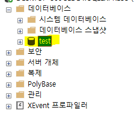

<hr />

### 간단한 컨트롤 작성

폼을 하나 생성하고, 그림과 같이 컨트롤들을 도구상자에서 드래그앤 드롭방식으로 간단하게 만들어줍니다.


아래 코드를 작성해줍니다. 이벤트 등록은 컨트롤을 더블클릭하는방식으로 합니다. 그냥 연습이니깐 이렇게 편하게 만들어줍니다.

```C#
using System;
using System.Collections.Generic;
using System.ComponentModel;
using System.Data;
using System.Data.SqlClient;
using System.Drawing;
using System.Linq;
using System.Text;
using System.Threading.Tasks;
using System.Windows.Forms;

namespace DataBaseConnectionTest001
{
    public partial class Form1 : Form
    {
        SqlConnection Conn = null;

        public Form1()
        {
            InitializeComponent();
        }

        private void Form1_Load_1(object sender, EventArgs e)
        {
            textBox_ServerConnection.Text = "해제";
        }

        //서버 연결
        private void btn_ServerConnect_Click(object sender, EventArgs e)
        {
            String ConnectionString;
            ConnectionString =
                "server=.\\SQLEXPRESS;" +
                "database=" + textBox_DBName.Text + ";" +
                "user id=" + textBox_User_ID.Text + ";" +
                "pwd=" + textBox_User_Password.Text + ";";

            if(Conn != null)
            {
                Conn.Dispose(); //Close()역할 까지 함
            }

            Conn = new SqlConnection(ConnectionString);

            /*
            //아래와 같이 해도 된다.
            Conn = new SqlConnection();
            Conn.ConnectionString =
                "server=.\\SQLEXPRESS;" +
                "database=" + textBox_DBName.Text + ";" +
                "user id=" + textBox_User_ID.Text + ";" +
                "pwd=" + textBox_User_Password.Text + ";";
            */


            if (Conn != null)
                textBox_ServerConnection.Text = "연결";
            else
                textBox_ServerConnection.Text = "해제";
        }

        private void btn_DBOpen_Click(object sender, EventArgs e)
        {
            Conn.Open();
            if(Conn.State == ConnectionState.Open)
            {
                MessageBox.Show("데이터베이스 열었습니다.");
            }
            else
            {
                MessageBox.Show("데이터베이스 Open 에러");
            }
        }

        private void btn_DBClose_Click(object sender, EventArgs e)
        {
            Conn.Close();
            if (Conn.State == ConnectionState.Closed)
            {
                MessageBox.Show("데이터베이스 닫았습니다.");
            }
            else
            {
                MessageBox.Show("데이터베이스 Close 에러");
            }
        }

        private void btn_ServerConnectionClose_Click(object sender, EventArgs e)
        {
            Conn.Dispose();
            Conn = null;
            textBox_ServerConnection.Text= "해제";
            MessageBox.Show("서버 연결 해제");
        }
    }
}
```

<hr />

### 실행 결과

코드를 실행하고 폼에 데이터베이스 이름과 사용자 아이디와 비밀번호를 입력합니다.


서버 연결을 누르면 서버에 연결됩니다.

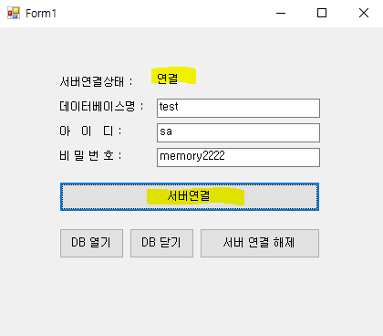

데이터베이스를 오픈합니다.

\

데이터베이스를 닫습니다.


서버를 닫습니다. 

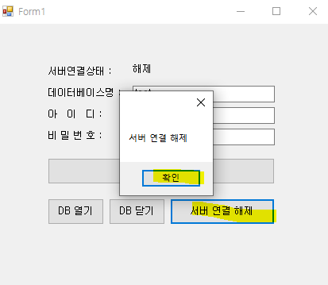


<br />
<br />
<br />
<br />


