## 1. 개요

데이터 베이스는 여러사람이 공유할 목적으로 통합해서 관리하는 데이터 집합입니다. 데이터 베이스 관리 시스템(DBMS) 는 Oracle, MySQL등이 있지만 C#을 다룬다면 MS에서 제공하는 MS SQL Server를 사용하는것이 좋습니다. 이 DBMS를 설치하는 컴퓨터는 서버 컴퓨터가 됩니다. 다른컴퓨터에 설치하는것이 좋지만 연습할때는 그냥 아무컴퓨터에 설치해도 됩니다. 이전에는 비쌌던 MSSQL 을 이제는 연습만 한다면 공짜로 EXPRESS 버전을 사용 할 수 있습니다.

 

### MS SQL 설치

먼저 MS SQL을 설치해주어야 합니다. MS 사이트에 가셔서 MS SQL Express 무료 버전을 설치합니다. Developer를 설치해도 됩니다. 저는 Express 버전을 설치했습니다.

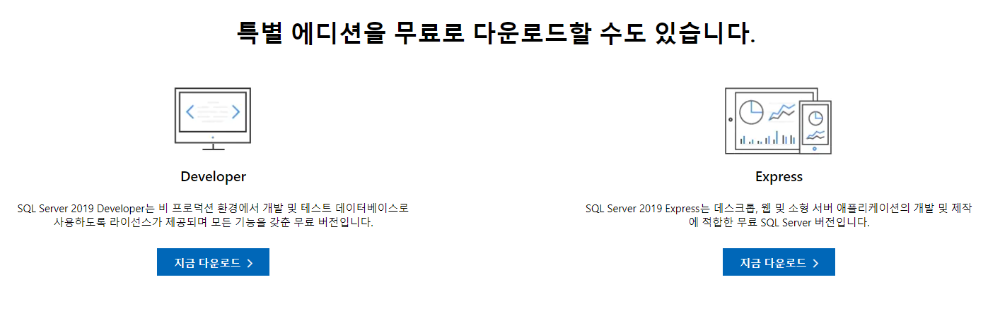
 
 
 
 

설치 파일을 다운로드 받고 실행하면 아래와 같은 화면이 뜹니다. 사용자 지정버튼을 눌러주세요.

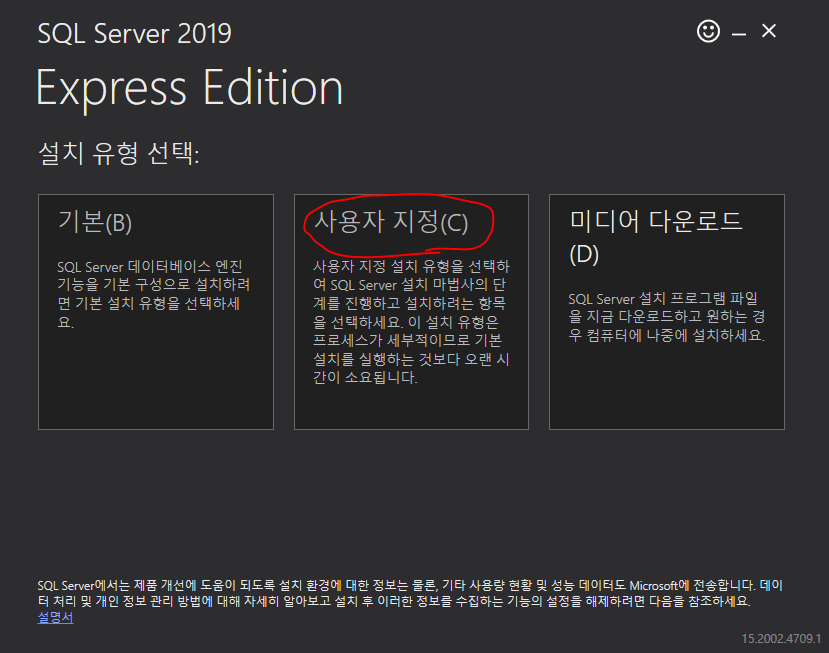
 
 
 
 

언어는 한국어로 선택하고 설치하고 싶은 위치 경로를 설정해주고 다음을 누릅니다.

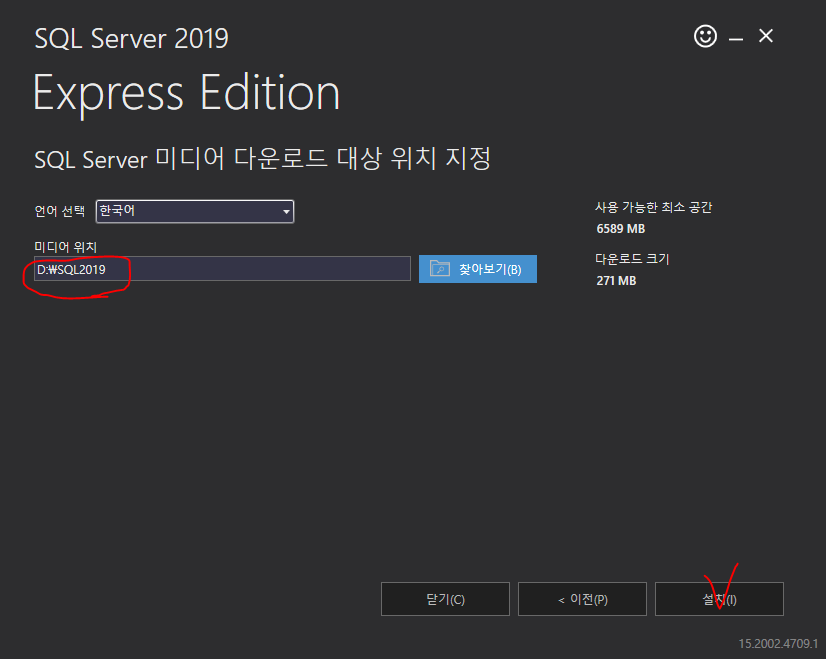
 
 
 
 

왼쪽 탭의 설치를 누르고, [새 SQL Server 독립 실행형 설치 또는 기존 설치에 기능 추가] 항목을 클릭합니다.

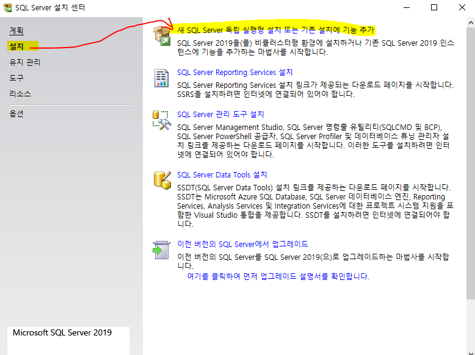
 
 
 
 

[사용조건] 에서 동의함을 누르고 다음을 눌러주세요.

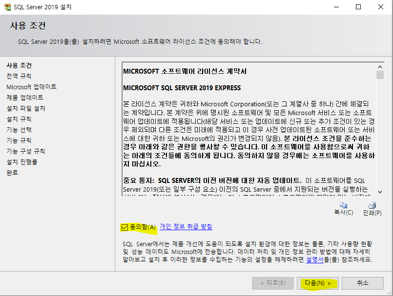
 
 
 
 

[전역규칙]은 자동으로 넘어가고 Microsoft 업데이트를 주기적으로 받을지에 대해서 체크박스가 있습니다. 원하시면 체크하고 다음을 눌러주세요.

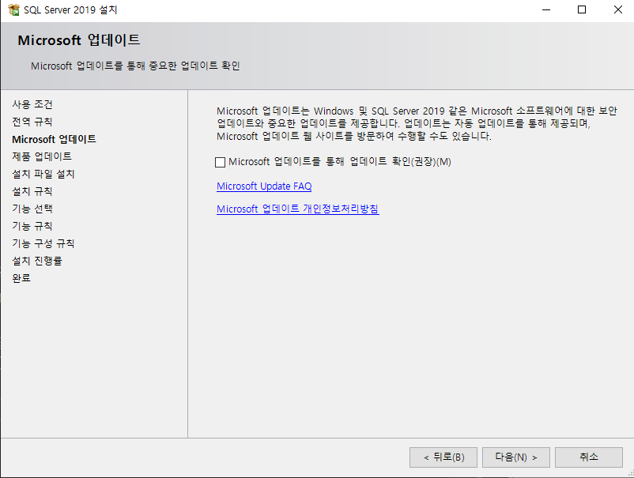
 
 
 
 

[설치 파일 설치]는 자동으로 실행하고 넘어갑니다. 아니면 다음을 눌러주세요.

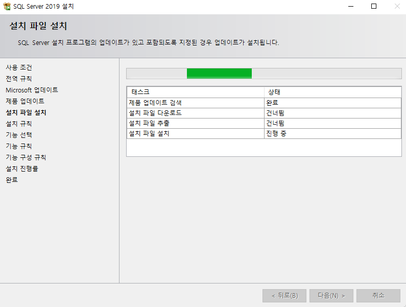
 
 
 
 

[설치 규칙]에서는 별 내용이 없다면 기본 셋팅값으로 다음을 눌러주세요.

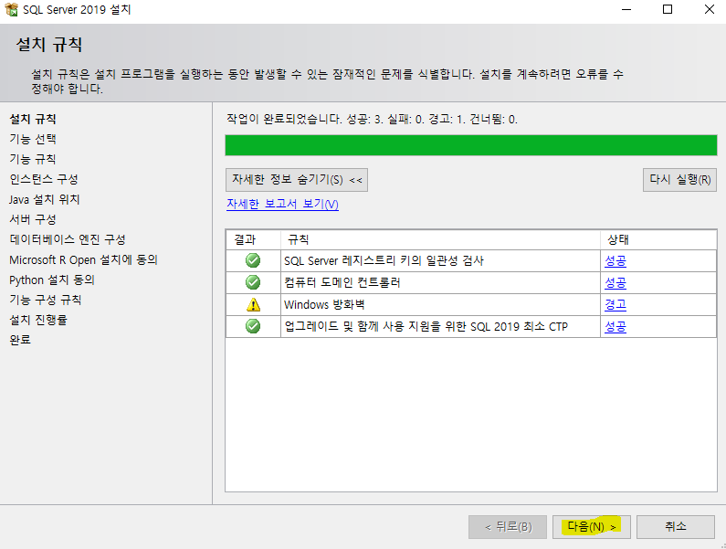
 
 
 
 

[기능 선택]화면 에서는 웬만하면 아래와 같은 항목들을 체크해주어야 합니다.

- [x] 데이터베이스 엔진 서비스
- [x] SQL Server 복제
- [x] 검색을 위한 전체 텍스트 및 의미 체계 추정
- [x] 클라이언트 도구 연결
- [x] 클라이언트 도구 이전 버전과의 호환성
- [x] 클라이언트 도구 SDK
- [x] SQL 클라이언트 연결 SDK

인스턴스 루트 디렉터리를 원하는 경로로 바꿔주세요. 이를 마치면 다음을 눌러주세요.

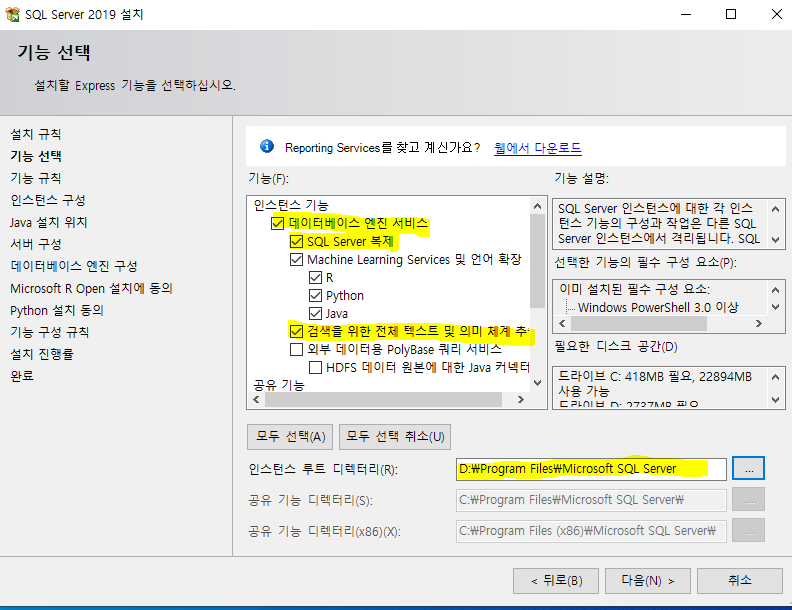
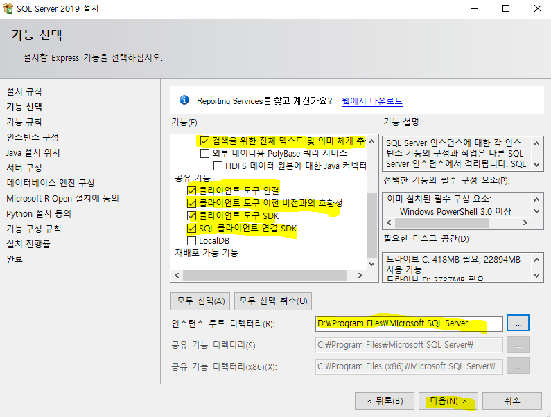
 
 
 
 

[인스턴스 구성] 화면에서는 이름을 지어줍니다. 여기서는 그냥 디폴트 값인 SQLExpress 를 사용하겠습니다.

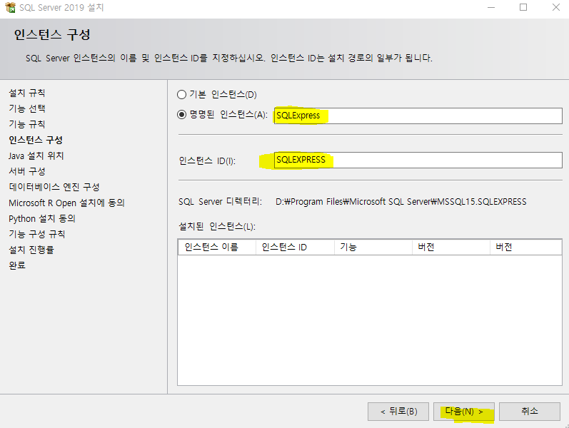
 
 
 
 

[Java 설치 위치] 에서는 자바의 경로를 물어봅니다. 사용하고 있는 자바가 있다면 경로를 주어서 사용할 수 있습니다. 저는 같이 딸려오는 자바를 받았습니다.(귀찮아...)

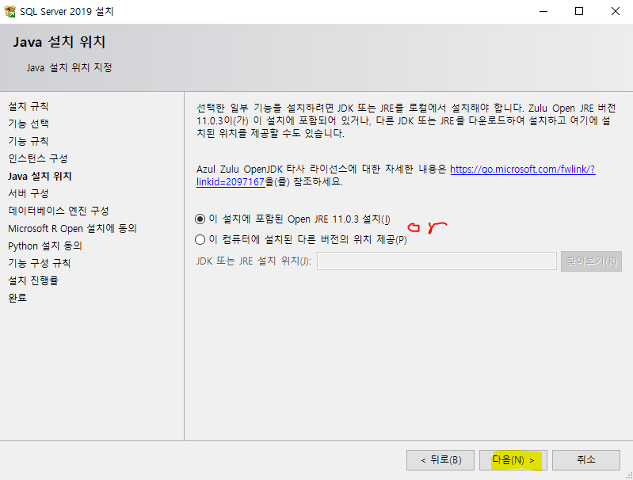
 
 
 
 

[서버구성] SQL Server 데이터베이스 엔진의 시작유형을 자동으로 설정하면 컴퓨터가 켜지면 자동으로 서버가 열립니다. 데이터 정렬탭을 누르면 Korean_Wansung_CL_AS가 디폴트로 있을텐데 아니라면 이걸로 바꿔주세요. 디폴트값을 그대로 두고 다음을 눌러줍니다.

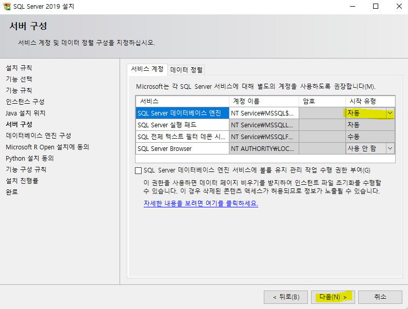
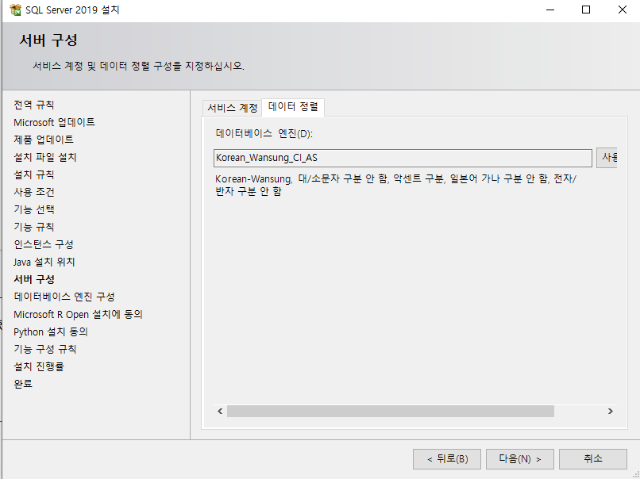
 
 
 
 

[데이터베이스 엔진 구성] 여기서는 혼합모드를 체크하고 암호를 입력해줍니다. 로그인 할 때 쓰는 설정입니다. 현재 사용자가 자동으로 붙어있지 않다면 현재 사용자를 넣어줍니다. 현재 사용자는 모든 권한을 가지게 됩니다. 마치면 다음을 눌러줍니다.

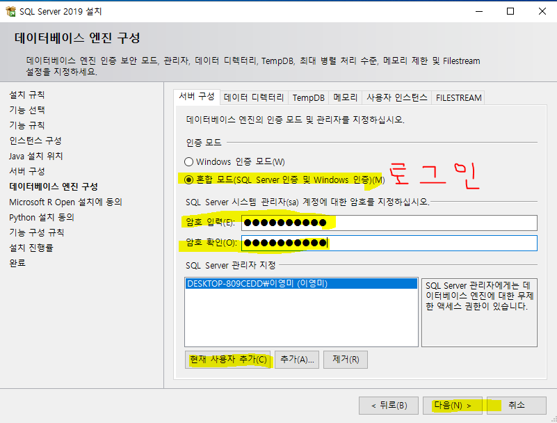
 
 
 
 

[Microsoft R Open 설치에 동의] 그냥 동의하고 다음을 눌러줍니다. R에 관한거 같습니다.

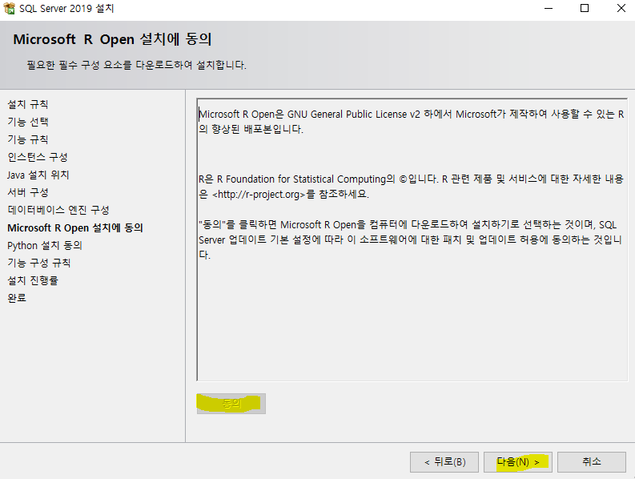
 
 
 
 

[Python 설치 동의] 이것도 마찬가지로 동의하고 다음을 눌러줍니다.

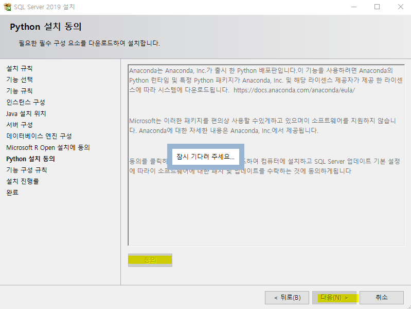
 
 
 
 

[설치를 진행률] 설치를 진행합니다. 시간이 많이 걸립니다. 

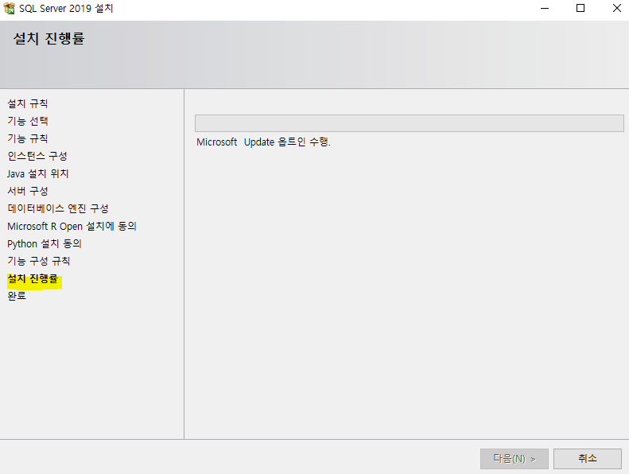
 
 
 
 

[완료] 설치가 완료되었습니다 와아~! 'ㅁ' !!

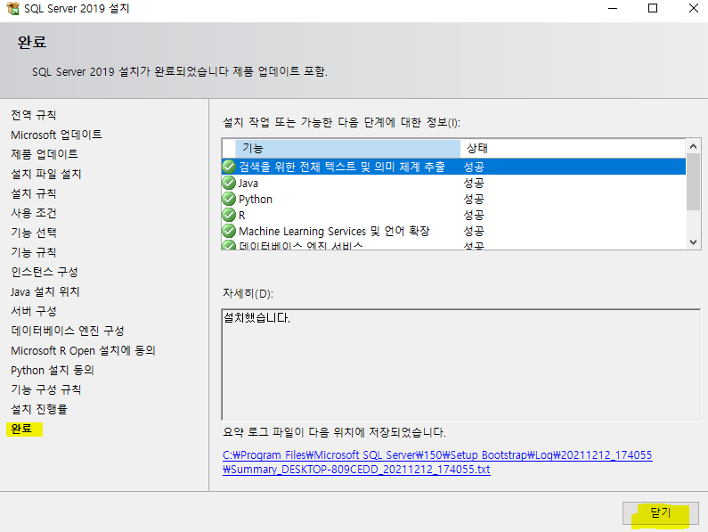
 
 
 
 

그런데 MSSQL 을 사용하려면 SSMS가 깔려있어야 합니다. 둘은 같은게 아니고 MSSQL이 설치되면 관련된 도구로서 SSMS가 존재합니다. SSMS에서 쿼리를 편집하고 실행 할 수 있습니다. 다시 SQL Server 설치 센터로 간다음에 설치 -> SQL Server 관리도구 설치 를 클릭해줍니다.

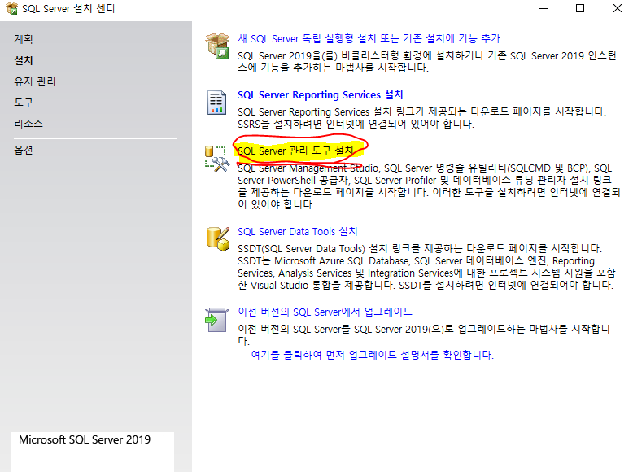
 
 
 
 

그러면 SSMS를 다운로드 할 수 있는 링크 보여줍니다.

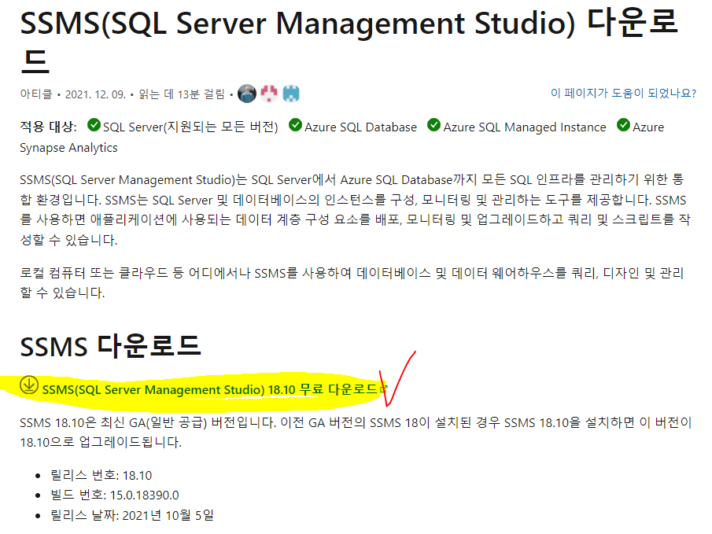
 
 
 
 

아래와 같이 설치 파일을 실행하고 경로를 원하는 경로로 바꿔준 다음에 설치를 눌러줍니다.

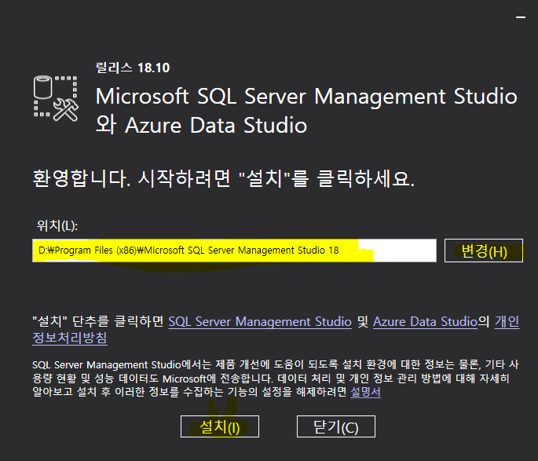
 
 
 
 

SSMS 를 실행할 수 있습니다.

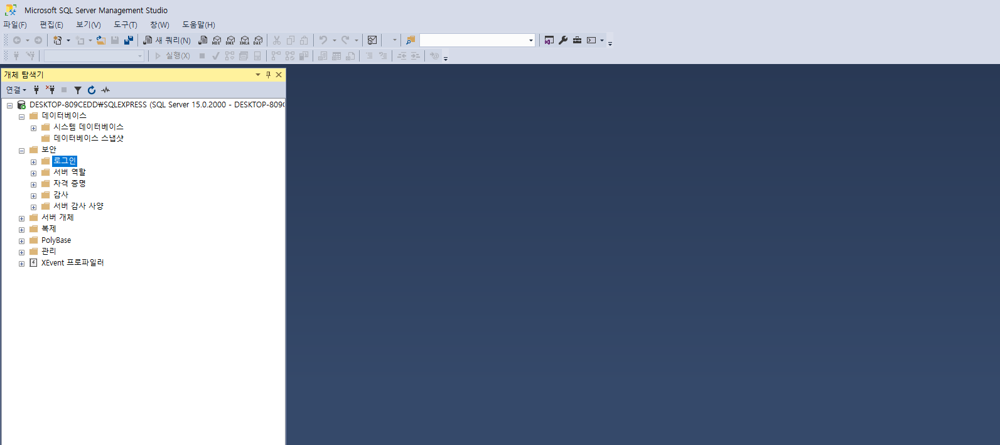
 
 
 
 

 
 
 
 
 
 