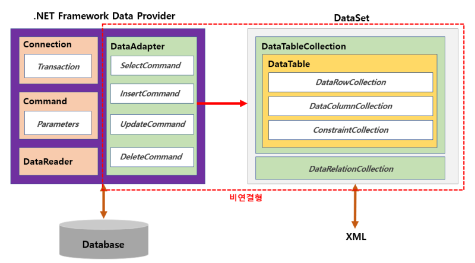
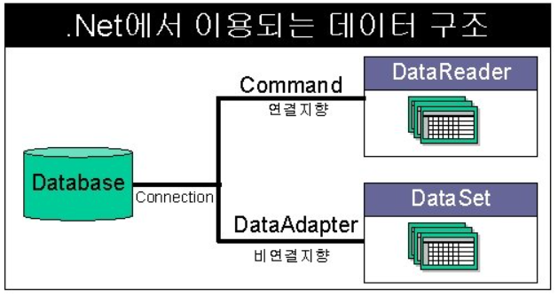

## 2. ADO.NET

ADO.NET을 사용해서 클라이언트와 서버가 통신하는법을 배우기 위해서는 이론적으로 알아둘 부분이 있습니다. MSDN 에도 아주 자세히 설명이 되어있지만 
이렇게 좀 축약한 버전을 보고 MSDN을 본다면 좀더 정리가 편할 것 같습니다.

ADO.NET을 배운다는 것은 결국 라이브러리안에 있는 클래스의 사용법을 익히는것입니다.

### 역할
- 데이터베이스 직접 접속 (응용프로그램은 코드만 제공) -> DBMS가 달라져도 코드에 영향 없음
- 데이터베이스 관련 라이브러리 제공 (클래스 형태로 제공 : 핵심 기능)
ADO.NET은 기본적인 프레임이 있습니다. 프레임워크를 이용해서 접속을 해야지만 ADO.NET을 이용해서 DBMS에 있는 데이터를 가져 올 수 있습니다.

### 연결 형식
- 연결형
    - 실시간으로 연결된 형태
    - 다수 접속시 서버 부하가 높다.
- 비연결형(메모리형 데이터베이스)
    - 데이터를 읽거나 쓸 때만 연결하는 형태
 
연결 형식에는 두가지가 있습니다. 위의 방식은 필요에 따라서 두개중 선택합니다.

연결형 같은경우 실시간으로 연결된 형태입니다. 따라서 내가 A라는것을 클라이언트 쪽에서 바꾸면 서버도 바로 A로 바뀌게 됩니다. 그래서 서버는 다수접속시에는 부가가 크게 거립니다. 왜냐하면 여러명이 계속 연결되어있으면 서버의 핸들링으로 데이터를 계속 주고받으면서 통신하기 때문입니다. 따라서 연결형 같은경우에는 즉시! 처리해야하거나 아주 중요한 데이터들을 처리할 때 사용합니다.

비연결형 같은 경우는 사용자의 메모리에 서버의 데이터를 가져오고, 사용자의 처리가 끝나고 통신하는 방식입니다. 근데 문제가 있습니다. 만약 내가 데이터를 불러오고 수정하기 전에 다른 사용자가 데이터를 수정했다면 나의 데이터를 서버에 저장할때 충돌이 나는 문제가 생깁니다. 따라서 이러한 문제도 고려해야합니다.

### 구성 요소
- Data Provider(데이터 공급자) : DB 접속, 읽기, 조작에 관여 -> ADO.NET 라이브러리의 클래스를 사용합니다.
- Data Set(데이터 셋) : 비연결형의 메모리형 데이터베이스

### `ADO.NET` DataProvider 구성요소

아래 테이블은 DataProvider 클래스중에서 자주쓰이는것을 설명합니다.

|구성요소|설명|
|--|--|
|SqlConnection|SQL Server와 데이터베이스에 연결|
|SqlCommand|SQL 명령 실행|
|SqlDataReader|연결성 데이터베이스로 연결 및 순방향 읽기|
|SqlDataAdapter|비연결성 데이터베이스로 연결 및 DataSet에 데이터 저장|

### 연결형식별 `ADO.NET` Data Provider 구성요소 조합

클래스를 조합해서 쓸때, 연결형식에 따라서 조합을 해서 사용해야 합니다. 아래 테이블처럼 사용합니다. 테이블을 보면 SqlConnection은 공통으로 사용합니다. 이유는 database에 연결할때는 SqlConnection을 사용해야 하기 때문입니다. 처리하는 방법만 다르게 합니다. 

|연결형식|구성요소 조합|
|--|--|
|연결형|SqlConnection, SqlCommand, SqlDataReader|
|비연결형|SqlConnection, DataAdapter, DataSet|

### `ADO.NET` 네임스페이스

최소한의 네임스페이스정도를 알아둬야 합니다. MSDN을 참고해주세요.

|네임스페이스|설명|
|--|--|
|System.Data|기본 네임스페이스|
|System.Data.SqlClient|MS SQL Server 7.0 이상에서 지원하는 .NET Framework Data Provider|
|System.Data.SqlTypes|SQL Server 데이터형 클래스|

 
 
 
 