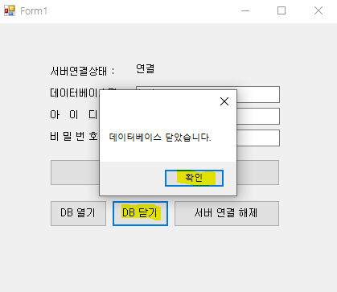

## 간단한 예시 (폼 생성후, DB와 연결)

### DB 생성

이제 DB를 생성해줍니다. 데이터베이스를 오른쪽 클릭하고 새 데이터베이스를 클릭해줍니다.


데이터베이스 이름을 test로 정해주고 확인을 눌러줍니다.


그러면 아래와 같이 데이터베이스가 하나 생성됩니다.


<hr />

### 간단한 컨트롤 작성

폼을 하나 생성하고, 그림과 같이 컨트롤들을 도구상자에서 드래그앤 드롭방식으로 간단하게 만들어줍니다.


아래 코드를 작성해줍니다. 이벤트 등록은 컨트롤을 더블클릭하는방식으로 합니다. 그냥 연습이니깐 이렇게 편하게 만들어줍니다.

```C#
using System;
using System.Collections.Generic;
using System.ComponentModel;
using System.Data;
using System.Data.SqlClient;
using System.Drawing;
using System.Linq;
using System.Text;
using System.Threading.Tasks;
using System.Windows.Forms;

namespace DataBaseConnectionTest001
{
    public partial class Form1 : Form
    {
        SqlConnection Conn = null;

        public Form1()
        {
            InitializeComponent();
        }

        private void Form1_Load_1(object sender, EventArgs e)
        {
            textBox_ServerConnection.Text = "해제";
        }

        //서버 연결
        private void btn_ServerConnect_Click(object sender, EventArgs e)
        {
            String ConnectionString;
            ConnectionString =
                "server=.\\SQLEXPRESS;" +
                "database=" + textBox_DBName.Text + ";" +
                "user id=" + textBox_User_ID.Text + ";" +
                "pwd=" + textBox_User_Password.Text + ";";

            if(Conn != null)
            {
                Conn.Dispose(); //Close()역할 까지 함
            }

            Conn = new SqlConnection(ConnectionString);

            /*
            //아래와 같이 해도 된다.
            Conn = new SqlConnection();
            Conn.ConnectionString =
                "server=.\\SQLEXPRESS;" +
                "database=" + textBox_DBName.Text + ";" +
                "user id=" + textBox_User_ID.Text + ";" +
                "pwd=" + textBox_User_Password.Text + ";";
            */


            if (Conn != null)
                textBox_ServerConnection.Text = "연결";
            else
                textBox_ServerConnection.Text = "해제";
        }

        private void btn_DBOpen_Click(object sender, EventArgs e)
        {
            Conn.Open();
            if(Conn.State == ConnectionState.Open)
            {
                MessageBox.Show("데이터베이스 열었습니다.");
            }
            else
            {
                MessageBox.Show("데이터베이스 Open 에러");
            }
        }

        private void btn_DBClose_Click(object sender, EventArgs e)
        {
            Conn.Close();
            if (Conn.State == ConnectionState.Closed)
            {
                MessageBox.Show("데이터베이스 닫았습니다.");
            }
            else
            {
                MessageBox.Show("데이터베이스 Close 에러");
            }
        }

        private void btn_ServerConnectionClose_Click(object sender, EventArgs e)
        {
            Conn.Dispose();
            Conn = null;
            textBox_ServerConnection.Text= "해제";
            MessageBox.Show("서버 연결 해제");
        }
    }
}
```

<hr />

### 실행 결과

코드를 실행하고 폼에 데이터베이스 이름과 사용자 아이디와 비밀번호를 입력합니다.


서버 연결을 누르면 서버에 연결됩니다.


데이터베이스를 오픈합니다.

\

데이터베이스를 닫습니다.



서버를 닫습니다. 


<br />
<br />
<br />
<br />
