# `ASP.NET`

1. 시작
    - 처음 웹폼 생성해보기
        - Page클래스
    - 관련 확장자
2. `ASP.NET` 주요 내부 개체
    - Response
    - Request
    - Server
    - Application
    - Session
3. 추후 추가예정
4. 추후 추가예정

 
 
 

# 1. 시작

 

## 처음 웹폼 생성해보기

 

시작은 프로젝트 를 생성합니다. 솔루션은 하나만 존재하고 프로젝트는 솔루션 하위에 여러개가 있을수 있습니다. 네임스페이스는 곧 패키지 입니다. 솔루션은 왜 만드냐면 프로젝트는 솔루션 아래 있어야해서 그렇습니다. 

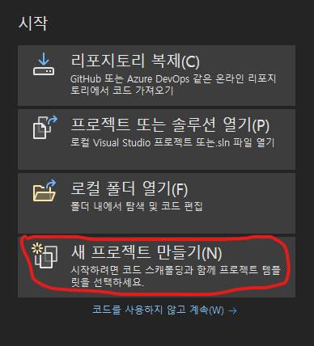

 

생성할때 ASP.NET 웹 애플리케이션(.NET Framework)를 선택해주세요

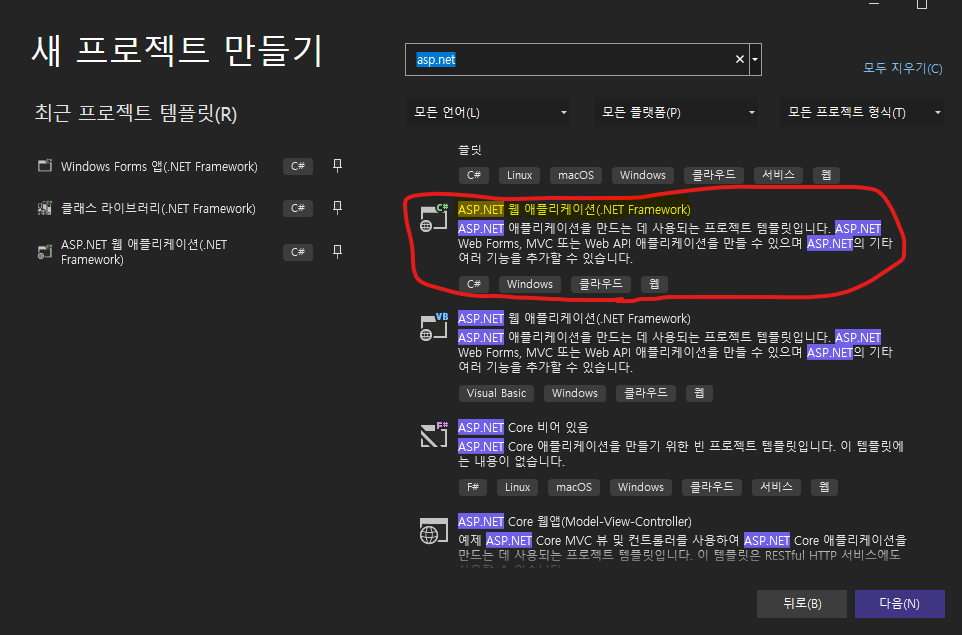

 

선택하셨다면 다음에 뜨는창은 2021 기준으로 설명하자면 비어있음을 선택하시고 웹폼을 선택후 만들기를 눌러주세요.

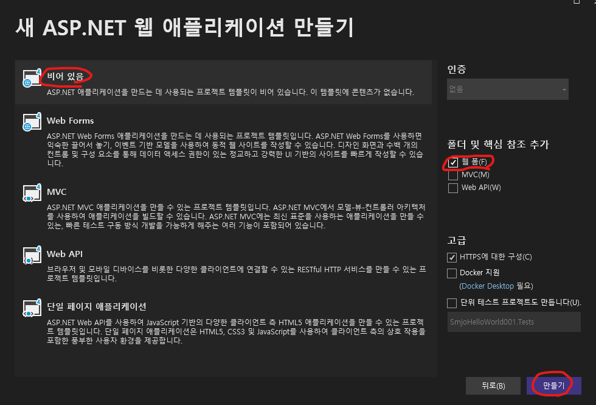

 
 
그러면 아래와 같은 솔루션과 프로젝트가 생성되는것을 확인할 수 있습니다. 

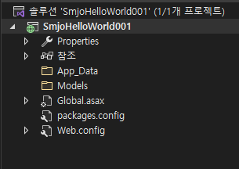

 

마우스 왼쪽 클릭으로 새로운 항목을 클릭합니다

 

웹폼을 만들어 줍니다. 확장자는 .aspx입니다. 그림과 같이 하세요. 이름은 원하는대로 씁니다.

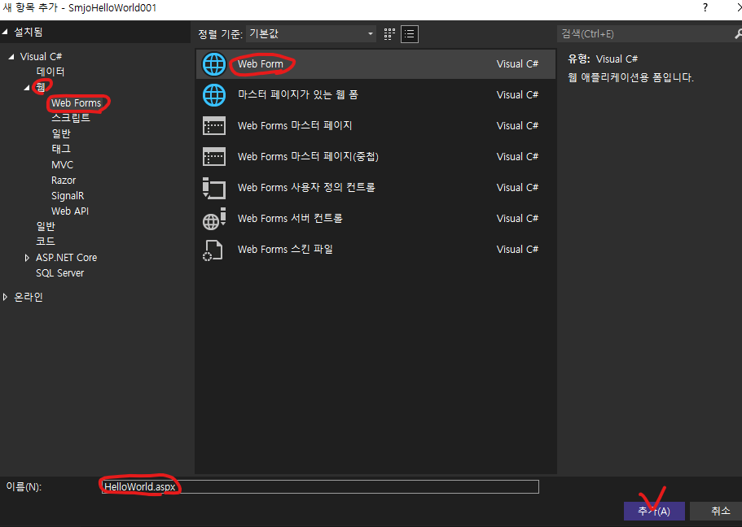

 

만들어지면 웹폼을 오른쪽클릭하고 디자이너 보기를 누릅니다. 그러면 디자인뷰 화면이 나옵니다.

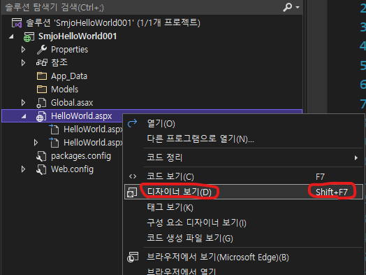

 

보기 -> 도구상자 에서 원하는 컨트롤을 드래그 앤 드랍으로 가져다놓을 수 있습니다. 오른쪽클릭-> 속성 에 들어가면 여러가지 attribute(속성) 들을 확인할 수 있고 수정도 가능합니다. 이게 디자인뷰가 윈폼이아니라 웹폼이어서 HTML이고 이 HTML에 드래그 엔 드랍으로 편리하게 디자인한다고 볼 수 있습니다.

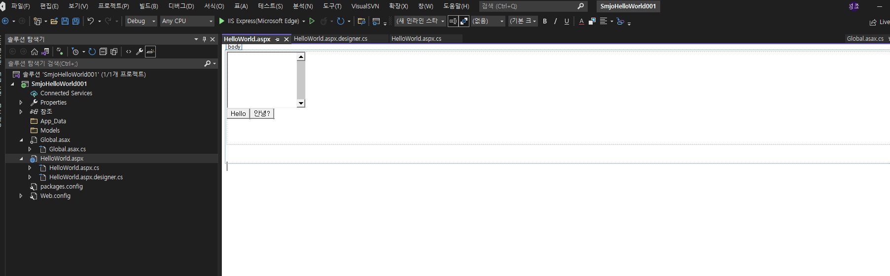

 

HelloWorld.aspx 파일을 더블클릭하면 HTML에 웹폼 컨트롤이 사이에 껴있는것을 확인할 수 있습니다..'ㅁ'!!! 여기서 속성을 관리해도 됩니다. 사진의  runat="server" 속성이 있는데 이는 서버 컨트롤로 바꿔주는 기능을 합니다. 

그러면 서버 컨트롤은 무었인가 하면, HTML에 모양이 있고 동작가능한 컨트롤을 말합니다. 근데 이게 C#코드랑 같이 동작하게 된다면 ASP.NET컨트롤이라고 할 수 있습니다. ASP.NET은 여러가지 컨트롤을 제공합니다.

- HTML서버컨트롤
- Web 서버컨트롤(표준)
- Validation 컨트롤(유효성검사)
- User컨트롤(사용자정의)

그런데 서버컨트롤을 보면 HTML에 코드가 엄청 늘어나는것을 볼 수 있습니다. HTML크기가 크면 데이터 전송 량도 많아지는것이기떄문에 이는 별로 좋지 않다고 볼 수 있습니다. 

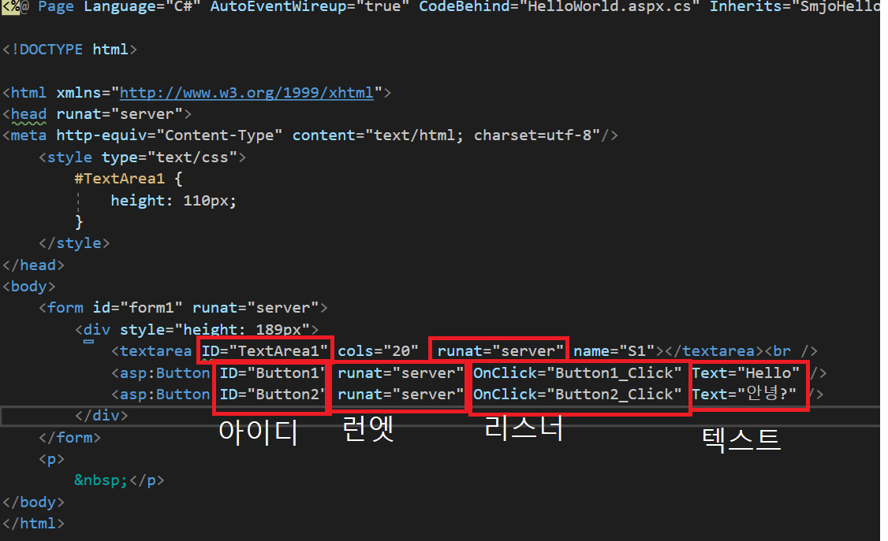

 

숨김파일에 HelloWorld.aspx.cs를 확인하면 콜백함수들이 있는것을 확인할 수 있습니다. 직접 콜백함수를 작성하거나 다자이너 뷰에서 컨트롤을 더블클릭하면 자동생성됩니다. 리스너 등록은 위에 HTML파일에서 하는겁니다. OnClick 속성에 콜백함수 버튼이름을 스트링으로 등록하면 됩니다. 

상속클래스는 System.Web.UI.Page클래스입니다. 모든 ASP.NET의 각 웹페이지는 Page클래스에서 모든기능을 받아옵니다. 여기서 Page_Load 이벤트가 Main메서드같은 역할을 합니다. 여기가 페이지의 실행 시작점입니다. 

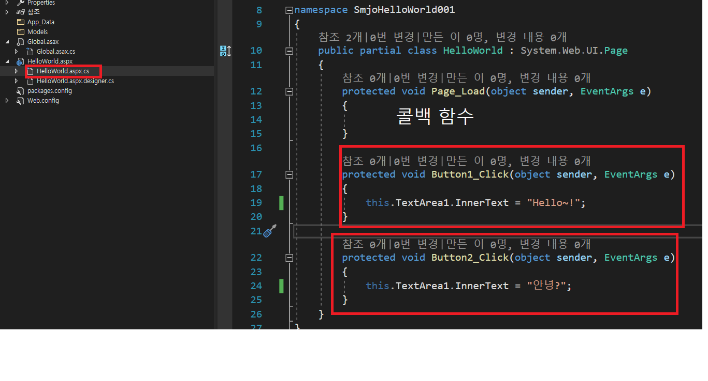

 

빌드하고 실행하면 아래와같이 로컬호스트를 통해서 브라우저가 열리고 컨트롤이 보이는것을 확인할 수 있습니다. 처음 웹폼 만들기를 해봤습니다.

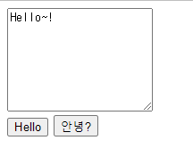
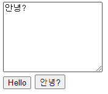

 

## 관련 확장자

- aspx : 웹폼 입니다.
- ascx : aspx에 포함된 웹폽 사용자정의  컨트롤입니다. 혼자서는 안돕니다.
- cshtml : ASP>NET MVC에서 뷰 페이지를 C#문법으로 작성합니다.
- config : 환경설정하는 파일입니다. web.config, bundle.config등이 있습니다.
- master : 웹사이트 공통 레이아웃을 담고있는 마스터 페이지 확장자.

 
 
 

# 2. `ASP.NET` 주요 내부 개체

    - Response
    - Request
    - Server
    - Application
    - Session

 

`1). Response 개체 주요 메서드 및 속성`

|메서드 및 속성|설명|
|---|---|
|Write()|사용자에게 보낼 HTML페이지에 문자열 삽입|
|WriteFile()|사용자에게 보낼 HTML페이지에 파일내용 넣기 스트림(파일)을 출력합니다|
|Redirect()|다른페이지로, 지정된페이지로이동|
|Expires|현재 페이지의 소멸시간을 설정|
|Buffer|버퍼링 사용여부 결정|
|Flush()|현재 버퍼의 내용 출력|
|Clear()|현재 버퍼의 내용 비우기|
|End()|현재 페이지 종료, End()메서드 이후의 코드는 실행하지 않습니다.|
|Cookies[]|쿠키 저장|

 

`2). Request 개체 주요 메서드 및 속성`
|메서드 및 속성|설명|
|---|---|
|QueryString[]|Get 방식으로 넘어온 쿼리스트링 값인 key와 value를 받고자 할 때 사용한다.|
|Form[]|Post 방식으로 넘어온 key와 value 값을 받고자 할 때 사용한다|
|Params[]|사용자에게 전송된 Get/Post 방식을 모두 받고자 할 때 사용한다|
|UserHostAddress|현재 접속자의 IP주소 문자열을 반환한다|
|ServerVariables[]|현재 접속자의 주요 서버 환경 변숫값을 알려 준다|
|Cookies[]|저장된 쿠키 값을 읽어 온다|
|Url|현재 웹 페이지의 URL을 반환한다|
|PhysicalApplicationPath|현재 웹 사이트의 가상 디렉터리의 물리적인 경로를 알려 준다|

 

`3). Server 개체 주요 메서드 및 속성`
|메서드 및 속성|설명|
|--|--|
|MapPath(".")|현재 파일과 같은 경로 반환 ".", "../"식으로 원하는 경로의 물리적 경로를 받아 올 수 있음|
|Execute()|다른 파일 포함(인클루드) 후 제어권 돌아옴|
|Transfer()|다른 파일 포함(인클루드) 후 제어권 넘김|
|UrlPathEncode()|넘어온 쿼리스트링을 유니코드로 변환(한글 처리)|
|ScriptTimeout|서버에서 현재 aspx페이지를 몇 초간 처리할 건지 설정|

 

`4). Application 개체 주요 메서드 및 속성`
|메서드 및 속성|설명|
|--|--|
|Lock()|애플리케이션 변수를 잠그는 메서드|
|UnLock()|잠긴 애플리케이션 변수를 해제하는 메서드|
|Add()|애플리케이션 변수를 만들 때 사용|
|Application_Start()|웹 애플리케이션이 시작될 때 발생(웹 사이트에 첫 번째 사용자가 방문할 때 발생.) Global.asax에서 설정|
|Application_End()|웹 응용 프로그램이 끝날 때 발생(웹 사이트에서 마지막 사용자가 나간 후 발생.) Global.asax에서 설정|

 

`5). Session개체 주요 메서드 및 속성`
|메서드 및 속성|설명|
|--|--|
|SessionId|현재 세션의 고유 번호 값 반환|
|SessionTimeout|세션 시간 기록: 기본값 20분. 더 추가하거나 줄일경우 사용|
|Abandon()|현재 세션 지우기|
|Session_Start()|사용자(세션)한 명이 방문할 때 실행|
|Session_End()|사용자 한명이 나간 후 실행|

 

`6).Page클래스 주요 메서드 및 속성`

|메서드 및 속성|설명|
|--|--|
|IsPostBack|현재 페이지를 처음 로드했는지. 다시 게시(포스트백)했는지 확인한다|
|ClientScript.RegisterClientScriptBlock()|자바스크립트를 동적으로 웹 페이지에 추가한다|
|Header|현재 웹 폼의 `<head>` 태그 부분을 정의한다|
|Title|현재 웹 폼의 제목을 동적으로 설정하거나 가져온다|
|SetFocuse()|다른 컨트롤의 ID값을 지정해주면 웹 폼이 로드할 때 해당 컨트롤에 포커스가 지정된다|

 
 
 

### 1. Response

먼저 연습을 해봅니다.
.aspx 웹폼 페이지 하나를 만들어줍니다. 아래 코드와 같이 쳐줍니다. <%= %>는 Response.Write()와 같은 기능을 합니다. 버튼 리스너 2개를 만들어 줍니다. 이걸 리스너라고 해야해도 되는지 모르겠네요.

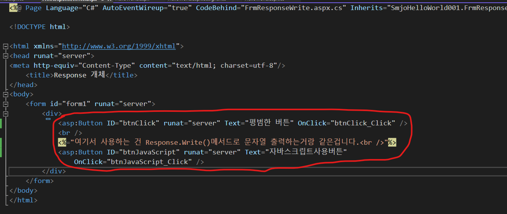

.aspx.cs 코드 숨길 파일에 이벤트 처리를 해줍니다. 이벤트 등록, 콜백 메서드 작성 등 용어가 여러개 일것 같습니다. 자바스크립트 콜백 메서드 안에는 스트링으로 자바스크립트 코드를 넣어주고 Response.Write()에게 넘겨주면 자바스크립트가 실행되는것을 확인 할 수 있습니다 'ㅁ'?!?

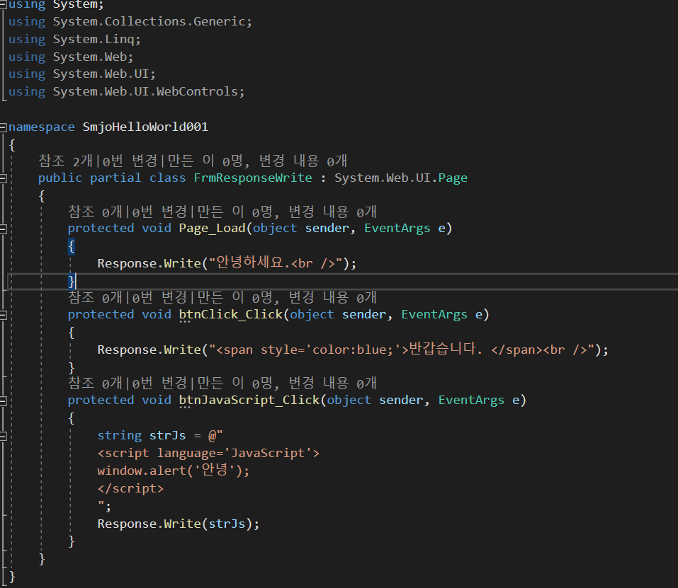

CTLR + F5 를 누르고 실행하면 아래와 같이 됩니다.

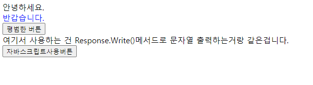

자바스크립트 버튼을 누르면 자바스크립트가 실행되는것을 볼 수 있습니다.

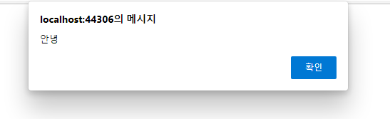

 
 
 

새로운 웹폼을 만들고 숨김페이지의 Page_Load()부분에 Response개체가 할 수 있는일에 대해서 알아보겠습니다. 아래와 같이 코드를 작성해봅니다. 

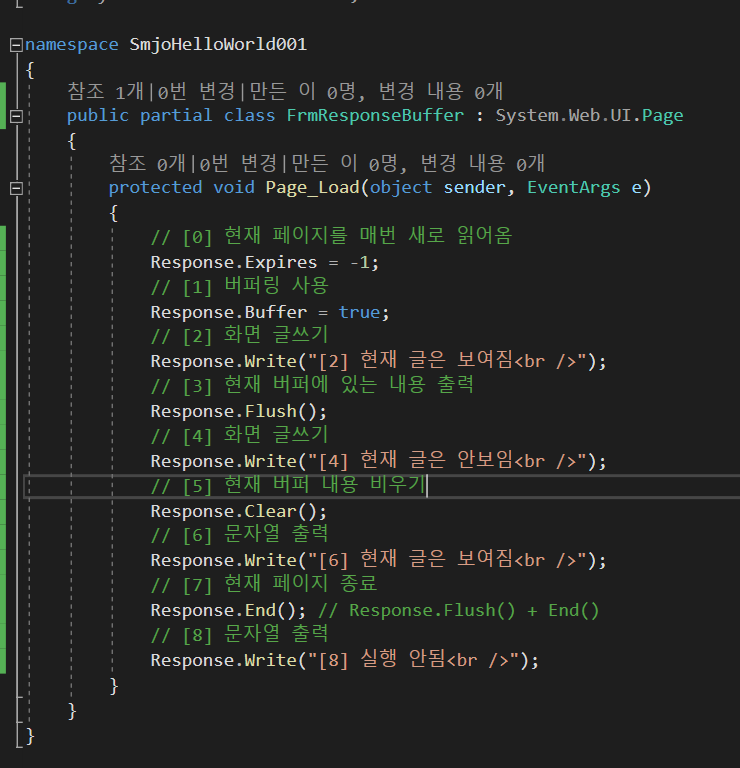

실행 결과 : 

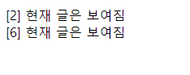

 
 
 

Redirect() 메서드를 사용해서 ASP.NET 페이지에서 특정 URL페이지를 이동해보겠습니다.

새로운 웹폼을 만들고 .aspx 소스를 아래와 같이 수정합니다.

