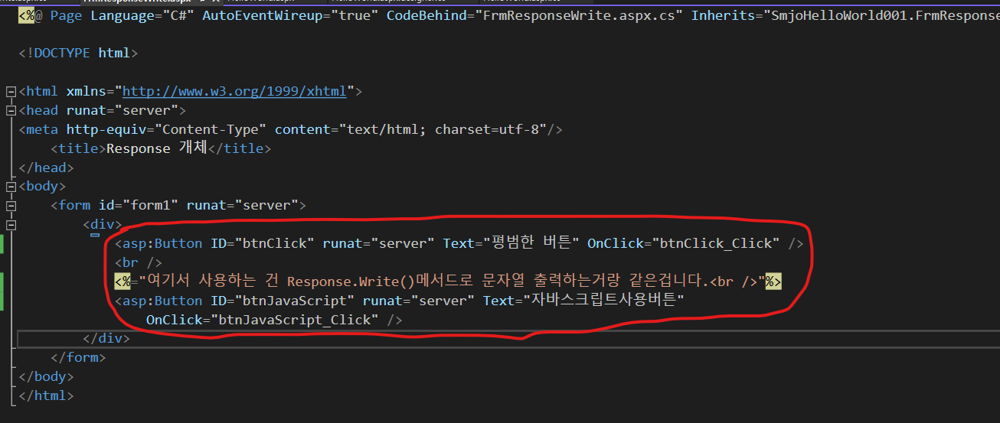
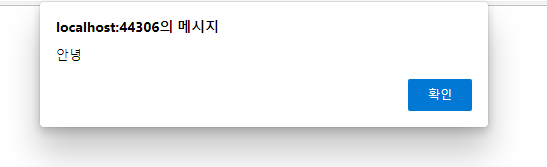
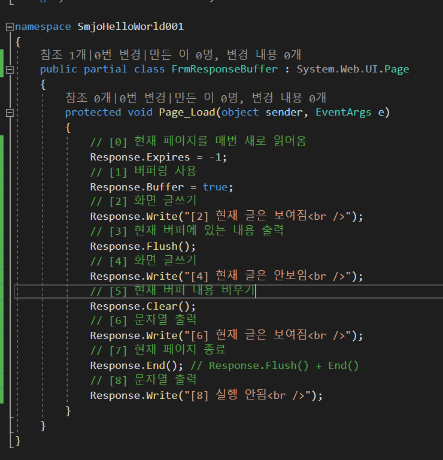

# 2. `ASP.NET` 주요 내부 개체

    - Response
    - Request
    - Server
    - Application
    - Session

 

`1). Response 개체 주요 메서드 및 속성`

|메서드 및 속성|설명|
|---|---|
|Write()|사용자에게 보낼 HTML페이지에 문자열 삽입|
|WriteFile()|사용자에게 보낼 HTML페이지에 파일내용 넣기 스트림(파일)을 출력합니다|
|Redirect()|다른페이지로, 지정된페이지로이동|
|Expires|현재 페이지의 소멸시간을 설정|
|Buffer|버퍼링 사용여부 결정|
|Flush()|현재 버퍼의 내용 출력|
|Clear()|현재 버퍼의 내용 비우기|
|End()|현재 페이지 종료, End()메서드 이후의 코드는 실행하지 않습니다.|
|Cookies[]|쿠키 저장|

 

`2). Request 개체 주요 메서드 및 속성`
|메서드 및 속성|설명|
|---|---|
|QueryString[]|Get 방식으로 넘어온 쿼리스트링 값인 key와 value를 받고자 할 때 사용한다.|
|Form[]|Post 방식으로 넘어온 key와 value 값을 받고자 할 때 사용한다|
|Params[]|사용자에게 전송된 Get/Post 방식을 모두 받고자 할 때 사용한다|
|UserHostAddress|현재 접속자의 IP주소 문자열을 반환한다|
|ServerVariables[]|현재 접속자의 주요 서버 환경 변숫값을 알려 준다|
|Cookies[]|저장된 쿠키 값을 읽어 온다|
|Url|현재 웹 페이지의 URL을 반환한다|
|PhysicalApplicationPath|현재 웹 사이트의 가상 디렉터리의 물리적인 경로를 알려 준다|

 

`3). Server 개체 주요 메서드 및 속성`
|메서드 및 속성|설명|
|--|--|
|MapPath(".")|현재 파일과 같은 경로 반환 ".", "../"식으로 원하는 경로의 물리적 경로를 받아 올 수 있음|
|Execute()|다른 파일 포함(인클루드) 후 제어권 돌아옴|
|Transfer()|다른 파일 포함(인클루드) 후 제어권 넘김|
|UrlPathEncode()|넘어온 쿼리스트링을 유니코드로 변환(한글 처리)|
|ScriptTimeout|서버에서 현재 aspx페이지를 몇 초간 처리할 건지 설정|

 

`4). Application 개체 주요 메서드 및 속성`
|메서드 및 속성|설명|
|--|--|
|Lock()|애플리케이션 변수를 잠그는 메서드|
|UnLock()|잠긴 애플리케이션 변수를 해제하는 메서드|
|Add()|애플리케이션 변수를 만들 때 사용|
|Application_Start()|웹 애플리케이션이 시작될 때 발생(웹 사이트에 첫 번째 사용자가 방문할 때 발생.) Global.asax에서 설정|
|Application_End()|웹 응용 프로그램이 끝날 때 발생(웹 사이트에서 마지막 사용자가 나간 후 발생.) Global.asax에서 설정|

 

`5). Session개체 주요 메서드 및 속성`
|메서드 및 속성|설명|
|--|--|
|SessionId|현재 세션의 고유 번호 값 반환|
|SessionTimeout|세션 시간 기록: 기본값 20분. 더 추가하거나 줄일경우 사용|
|Abandon()|현재 세션 지우기|
|Session_Start()|사용자(세션)한 명이 방문할 때 실행|
|Session_End()|사용자 한명이 나간 후 실행|

 

`6).Page클래스 주요 메서드 및 속성`

|메서드 및 속성|설명|
|--|--|
|IsPostBack|현재 페이지를 처음 로드했는지. 다시 게시(포스트백)했는지 확인한다|
|ClientScript.RegisterClientScriptBlock()|자바스크립트를 동적으로 웹 페이지에 추가한다|
|Header|현재 웹 폼의 `<head>` 태그 부분을 정의한다|
|Title|현재 웹 폼의 제목을 동적으로 설정하거나 가져온다|
|SetFocuse()|다른 컨트롤의 ID값을 지정해주면 웹 폼이 로드할 때 해당 컨트롤에 포커스가 지정된다|

 
 
 

### 1. Response

먼저 연습을 해봅니다.
.aspx 웹폼 페이지 하나를 만들어줍니다. 아래 코드와 같이 쳐줍니다. <%= %>는 Response.Write()와 같은 기능을 합니다. 버튼 리스너 2개를 만들어 줍니다. 이걸 리스너라고 해야해도 되는지 모르겠네요.

.aspx.cs 코드 숨길 파일에 이벤트 처리를 해줍니다. 이벤트 등록, 콜백 메서드 작성 등 용어가 여러개 일것 같습니다. 자바스크립트 콜백 메서드 안에는 스트링으로 자바스크립트 코드를 넣어주고 Response.Write()에게 넘겨주면 자바스크립트가 실행되는것을 확인 할 수 있습니다 'ㅁ'?!?

CTLR + F5 를 누르고 실행하면 아래와 같이 됩니다.

자바스크립트 버튼을 누르면 자바스크립트가 실행되는것을 볼 수 있습니다.

 
 
 

새로운 웹폼을 만들고 숨김페이지의 Page_Load()부분에 Response개체가 할 수 있는일에 대해서 알아보겠습니다. 아래와 같이 코드를 작성해봅니다. 

실행 결과 : 

 
 
 

Redirect() 메서드를 사용해서 ASP.NET 페이지에서 특정 URL페이지를 이동해보겠습니다.

새로운 웹폼을 만들고 .aspx 소스를 아래와 같이 수정합니다.

