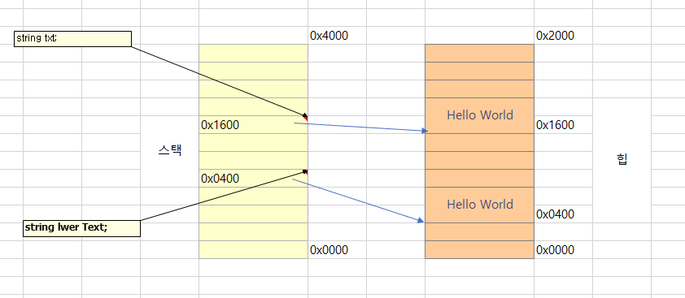

# 2. 문자열 처리 

- [2. 문자열 처리](#2-문자열-처리)
  - [1. System.String](#1-systemstring)
  - [2. System.Text.StringBuilder](#2-systemtextstringbuilder)
  - [3. System.Text.Encoding](#3-systemtextencoding)
  - [4. System.TextRegularExpresssions.Regex](#4-systemtextregularexpresssionsregex)
  

<hr />
<br />
<br />
<br />

## 1. System.String

문자열 처리는 대부분 string 타입에서 제공됩니다. 자주 사용되는 메서드를 정리하면 다음과 같습니다.

|맴버|유형|설명|
|--|--|--|
|Contains|인스턴스메서드|인자로 전달된 문자열을 포함하고 있는지 여부를 true/false 로 반환|
|EndsWith|인스턴스메서드|인자로 전달된 문자열로 끝나는지 여부를 true/false 로 반환|
|Format|인스턴스메서드|형식에 맞는 문자열을 생성해 반환|
|GetHashCode|인스턴스메서드|문자열의 해시값을 반환|
|IndexOf|인스턴스메서드|문자 또는 문자열을 포함하는 경우 그 위치를 반환하고 없으면 -1을 반환|
|Replace|인스턴스메서드|첫 번째 인자의 문자 또는 문자열을 두 번째 인자의 값으로 치환된 문자열을 반환|
|Split|인스턴스메서드|주어진 문자 또는 문자열을 구분자로 나뉜 문자열의 배열을 반환|
|StartsWith|인스턴스메서드|인자로 전달된 문자열로 시작하는지 여부를 true/false로 반환|
|Substring|인스턴스메서드|시작과 길이에 해당하는 만큼의 문자열을 반환|
|ToLower|인스턴스메서드|문자열을 소문자로 변환해서 반환|
|ToUpper|인스턴스메서드|문자열을 대문자로 변환해서 반환|
|Trim|인스턴스메서드|문자열의 앞뒤에 주어진 문자가 있는 경우 삭제한 문자열을 반환, 문자가 지정되지 않으면 기본적으로 공백 문자를 제거해서 반환|
|Length|인스턴스 속성|문자열의 길이를 정수로 반환|
|!=|정적 연산자|문자열이 같지 않다면 true를 반환|
|==|정적 연산자|문자열이 같다면 true를 반환|
|인덱서[]|인스턴스 속성|주어진 정수 위치에 해당하는 문자를 반환|

아래는 이 중에서 Format메서드를 제외하고 각 메서드를 사용한 예제입니다.

```C#
using System;

class Program
{
    static void Main(string[] args)
    {
        string txt = "Hello World";
        Console.WriteLine(txt + " Contains(\"Hello\"): " + txt.Contains("Hello"));
        Console.WriteLine(txt + " Contains(\"Halo\"): " + txt.Contains("Halo"));
        Console.WriteLine();

        Console.WriteLine(txt + " EndsWith(\"World\"): " + txt.EndsWith("World"));
        Console.WriteLine(txt + " EndsWith(\"ello\"): " + txt.EndsWith("ello"));
        Console.WriteLine();

        Console.WriteLine(txt + " GetHashCode(): " + txt.GetHashCode());
        Console.WriteLine("Hello GetHashCode(): " + "Hello".GetHashCode());
        Console.WriteLine();

        Console.WriteLine(txt + " IndexOf(\"World\"): " + txt.IndexOf("World"));
        Console.WriteLine(txt + " IndexOf(\"Halo\"): " + txt.IndexOf("Halo"));
        Console.WriteLine();

        Console.WriteLine(txt + " Replace(\"World\", \"\"): " + txt.Replace("World", ""));
        Console.WriteLine(txt + " Replace('o', 't'): " + txt.Replace('o', 't'));
        Console.WriteLine();

        Console.Write(txt + " Split('o'): ");
        OutputArrayString(txt.Split('o'));

        Console.Write(txt + " Split(' '): ");
        OutputArrayString(txt.Split(' '));
        Console.WriteLine();

        Console.WriteLine(txt + " StartsWith(\"Hello\"): " + txt.StartsWith("Hello"));
        Console.WriteLine(txt + " StartsWith(\"ello\"): " + txt.StartsWith("ello"));
        Console.WriteLine();

        Console.WriteLine(txt + " Substring(1): " + txt.Substring(1));
        Console.WriteLine(txt + " Substring(2, 3): " + txt.Substring(2, 3));
        Console.WriteLine();

        Console.WriteLine(txt + " ToLower(): " + txt.ToLower());
        Console.WriteLine(txt + " ToUpper(): " + txt.ToUpper());
        Console.WriteLine();

        Console.WriteLine("\" Hello World \" Trim(): " + " Hello World ".Trim());
        Console.WriteLine(txt + " Trim('H'): " + txt.Trim('H'));
        Console.WriteLine(txt + " Trim('d'): " + txt.Trim('d'));
        Console.WriteLine(txt + " Trim('H', 'd'): " + txt.Trim('H', 'd'));
        Console.WriteLine();

        Console.WriteLine(txt + " Length: " + txt.Length);
        Console.WriteLine("Hello Length: " + "Hello".Length);
        Console.WriteLine();

        Console.WriteLine("Hello != World: " + ("Hello" != "World"));
        Console.WriteLine("Hello == World: " + ("Hello" == "World"));
        Console.WriteLine("Hello == HELLO: " + ("Hello" == "HELLO"));
        Console.WriteLine();
    }

    private static void OutputArrayString(string[] arr)
    {
        foreach (string txt in arr)
        {
            Console.Write(txt + ", ");
        }

        Console.WriteLine();
    }
}
```

영문자를 다루면서 빠질 수 없는 사항이 바로 대소문자 구분입니다. 위 표에 나열된 메서드 가운데 대소문자 구분의 오버로드 버전을 제공하는 메서드로 EndsWith, IndexOf, StartsWith가 있습니다. 이 메서드들은 각각 StringComparison열거형 인자를 추가로 받을 수 있습니다. 이 인자를 생략하면 기본적으로 대소문자 구분을 하고, 대소문자 구분을 하고 싶지 않다면 StringComparison, OrdinalIgnoreCase인자를 함께 전달하면 됩니다. 

```C#
using System;

class Program
{
    static void Main(string[] args)
    {
        {
            string txt = "Hello World";

            Console.WriteLine(txt + " EndsWith(\"WORLD\"): " + txt.EndsWith("WORLD", StringComparison.OrdinalIgnoreCase));
            Console.WriteLine();

            Console.WriteLine(txt + " IndexOf(\"WORLD\"): " + txt.IndexOf("WORLD", StringComparison.OrdinalIgnoreCase));
            Console.WriteLine();

            Console.WriteLine(txt + " StartsWith(\"HELLO\"): " + txt.StartsWith("HELLO", StringComparison.OrdinalIgnoreCase));

            Console.WriteLine();
        }

        {
            string txt = "Hello";
            Console.WriteLine(txt + " == HELLO: " + (txt == "HELLO")); // 출력 결과: False
            Console.WriteLine(txt + " == HELLO: " + txt.Equals("HELLO",
            StringComparison.OrdinalIgnoreCase)); // 출력 결과: True
            Console.WriteLine();
        }
    }
}
```

문자열의 "=="비교 연산자는 대소문자를 무시하는 기능은 없지만 대신 Equals메서드로 바꾸면 가능합니다.

```C#
string txt = "Hello";

Console.WriteLine(txt + " == Hello: " + (txt == "Hello")); //출력결과 false
Console.WriteLine(txt + " == Hello: " + (txt.Equals("Hello", String Comparison.OrdinalIgnoreCase))); //출력결과 true

Console.WriteLine();
```

마지막으로 Format메서드에 대해서 알아봅니다. 이 메서드의 주된 기능은 인자를 형식 문자열에 포함된 번호와 맞춰서 치환하는 기능입니다. 다음코드를 보면 쉽게 이해됩니다.

```C#
string txt = "Hello {0}: {1}";

string output = string.Format(txt, "Wordl", "Anderson");

Console.WriteLine(output);

//결과 : Hello World: Anderson
```

string.Format의 첫 번째 인자에는 중괄호로 둘러싸인 번호를 포함할 수 있습니다. 여기서 사용된 번호는 보다싶이 뒤어아 나오는 인자의 위치와 대응되어 치환됩니다.

여튼 이런식의 string.Format은 다른곳에서도 적용되는데~! 몰랐지만 대표적인 사례가 Console.WriteLine메서드입니다.

```C#
string txt = "Hello {0}: {1}";

Console.WriteLine(txt, "Wordl", "Anderson");
```

또한 형식 문자열의 번호는 중복 사용이 가능하고 순서에도 제약이 없습니다.

```C#
string txt = "{2} {0} = {0} : {1}";

Console.WriteLine(txt, "Hello", "World", "Hi");

//출력결과
//Hi Hello == Hello : World
```

번호와 대응되는 인자가 반드시 string 형식일 필요는 없습니다. 닷넷의 모든 타입은 object를 상속받기 때문에 ToString 메서드가 제공되므로 string.Format은 string형식이 아닌 타입의 인스턴스가 인자로 대응되면 그것의 ToString 메서드를 호출한 결과를 출력합니다. 

```C#
string txt = "{0} * {1} == {2}";

Console.WriteLine(txt, 5, 6, 5 * 6);

//출력결과
//5 * 6 == 30
```

string.Format의 인자를 지정할 때는 해당 문자열을 어떻게 형식화할 것인지에 대한 표현도 함께 제공됩니다. 이에 대한 정확한 형식은 다음과 같습니다.

```
{번호[,정렬][:형식문자열]}

번호(필수): 지금까지의 예에서 본 것처럼 숫자 0부터 시작하는 번호를 지정합니다. 

정렬(선택): 번호와 대응되는 문자열의 최소 너비를 지정, 대응 문자열의 길이는 5인데 정렬로 지정된 숫자가 10이라면 나머지 너비는 공백으로 채워집니다. 정렬값이 음수이면 왼쪽, 양수이면 우측 정렬이 됩니다. 정렬값이 생략되면 대응되는 문자열의 길이대로 출력됩니다.

형식문자열(선택): 대응되는 인자의 타입에서 직접 구현하고 있는 형식 문자열이 사용됩니다. 따라서 Int32, Double등의 타입에 따라서 그에 맞는 형식 문자열을 찾아서 지정합니다. 
```

먼저 다음은 간단하게 정렬 옵션까지 지정된 string.Format을 사용하는 예 입니다.

```C#
string txt = "{0, -10} * {1} == {2, 10}";
Console.WriteLine(txt, 5, 6, 5 * 6);

//출력결과
//5         * 6 ==         30
```

첫 번째 대응되는 인자의 정렬값은 음수 10이므로 좌측정렬기준으로 5가 출력되고 나머지 9칸은 공백으로 출력됩니다. 두 번째 대응 인자는 정렬 숫자값이 생략됬으므로 정확히 숫자 6에 대한 ToString결과 문자열만 출력됩니다. 마지막 세 번째 대응 인자는 양수 10이므로 우측 정렬기준으로 10이 출력되고 나머지 8칸은 공백으로 출력됩니다. 

형식 문자열을 적용하려면 타입에서 제공되는 형식 문자열을 미리 알고 있어야 합니다. 다음은 각 타입별로 제공되는 대표적인 형식 문자열을 보여줍니다. 

|타입|유형|의미|Format예제|한글 윈도우 출력|
|--|--|--|--|--|
|숫자형|C|통화|"{0:C}", -123|-\123|
||D|10진수|"{0:D}", -123|-123|
||E|공학|"{0:E}", -123f|-1234500E+002|
||F|고정 소수점|"{0:F}", -123f|-123.45|
||G|일반(기본값)|"{0:G}", -123|-123|
||N|숫자|"{0:N}", -123|-123.00|
||P|백분율|"{0:P}", -123f|-12,345.00 %|
||R|반올림 숫자|"{0:R}", -123|-123.45|
||X|16진수|"{0:X}", -123|FFFFFF85|
|날짜형|DateTime now = DateTime.Now|
||d|단축날짜|"{0:d}", now|2013-02-13|
||D|상세날짜|"{0:D}", now|2013년 2월 13일 수요일|
||t|단축시간|"{0:t}", now|오후 1:27|
||T|상세시간|"{0:T}", now|오후 1:27:52|
||f|전체날짜/단축시간|"{0:f}", now|2013년 2월 13일 수요일 오후 1:27|
||F|전체날짜/상세시간|"{0:F}", now|2013년 2월 13일 수요일 오후 1:27:52|
||g|일반날짜/단축시간|"{0:g}", now|2013-02-13 오후 1:27|
||G|일반날짜/상세시간|"{0:G}", now|2013-02-13 오후 1:27:52|
||M|달|"{0:M}", now|2월 13일|
||Y|년|"{0:Y}", now|2013년 2월|

아래는 인자번호, 정렬, 형식 문자열을 모두 사용한 예입니다.

```C#
string txt = "날짜: {0, -20:D}, 판매수량: {1, 15:N}";

Console.WriteLine(txt, DateTime.Now, 267);

//출력결과
//날짜: 2013년 2월 13일 수요일    , 판매수량 :       267.00
```

<br />
<br />
<br />

## 2. System.Text.StringBuilder

string을 다루면 반드시 함께 설명되는 클래스가 바로 StringBuilder입니다. string타입은 불변 객체(immutable object)이기 때문에 string에 대한 모든 변환은 새로운 메모리 할당을 발생시킵니다. 예를 들어 string.ToLower메서드를 보겠습니다. 

```C#
string txt = "Hello World";
string lwrText = txt.ToLower();
```

txt변수는 힙ㄴ에 있는 "Hello World"를 가리킵니다. 그 상태에서 ToLower메서드를 호출하면 txt변수에 담긴 문자열이 소문자로 변경되는 것이 아니라 원문이 통째로 복사된 다음 그것이 소문자로 변경되어 반환되는 절차를 거칩니다.



불변 타입의 string 클래스가 발생시키는 가장 큰 문제는 문자열을 더할때 입니다. 예를 들어 다음코드를 보겠습니다.

```C#
string txt = "Hello World";

for(int i = 0; i <300000; i++)
{
    txt = txt + "1";
}
```

이 코드를 실행시키면 30초 정도 걸리게 됩니다. 왜 이렇게 오래걸리는지는 내부동작을 살펴보면 알 수 있습니다.

1. 힙에 "Hello World"문자열을 담은 공간을 할당합니다.
2. 스택에 있는txt 변수에 1번 과정에서 할당된 힙의 주소를 저장합니다.
3. txt + "1"동작을 수행하기 위해 txt.Length + "1".Length에 해당하는 크기의 메모리를 힙에 할당합니다. 그 메모리에 txt변수가 가리키는 힙의 문자열과 "1"문자열을 복사합니다. 
4. 다시 스택에 있는 txt변수에 3번 과정에서 새롭게 할당된 힙의 주소를 저장합니다. 
5. 3번과 4번의 과정을 30만번 반복합니다. 

문제는 3번과정에 있습니다. 끊임없이 메모리를 할당하고 이전의 문자열을 다시 복사하는 과정을 거치기 때문에 실행 시간이 30초나 걸린것입니다. 

바로 이런 문제를 해결하기 위해 BCL에 추가된 클래스가 StringBuilder입니다. StringBuilder는 Append메서드를 제공하는데 위 코드를 개선하면 아래와 같아집니다.

```C#
string txt = "Hello World";

StringBuilder sb = new StringBuilder();
sb.Append(txt);

for(int i = 0; i < 300000; i++)
{
    sb.Append("1");
}

string newText = sb.ToString();
```

이 코드를 실행하는데는 3ms 가 채 걸리지 않습니다. 아주 획기적인 성능향상입니다. 내부연산과정을 보면 이유를 알 수 있습니다.

1. StringBuilder는 내부적으로 일정한 양의 메모리를 미리 할당합니다.
2. Append메서드에 들어온 인자를 미리 할당한 메모리에 복사합니다.
3. 2번 과정을 30만번 반복합니다. Append로 추가된 문자열이 미리 할당한 메모리보다 많아지면 새롭게 여유분의 메모리를 할당합니다. 
4. ToString 메서드를 호출하면 연속적으로 연결된 하나의 문자열을 반환합니다. 

즉, 잦은 메모리 할당과 복사가 없어졌기 때문에 그만큼 성능이 향상된 것입니다. 이 때문에 문자열을 연결하는 작업이 많을 때는 반드시 StringBuilder를 사용하는것을 권장합니다.

<br />
<br />
<br />

## 3. System.Text.Encoding

'A', 'B', 'C' 라는 문자는 시스템에 내장된 폰트를 기반으로 출력된 일종의 "그림"에 불과합니다. 내부적으로 이런 문자는 숫자에 대응됩니다. 이처럼 문자가 숫자로 표현되는것을 인코딩(encoding:부호화)이라고 합니다.

이런것은 약속을 통해 문자를 인코딩할 수 있습니다. 예를들어, 'A'는 1, 'B'는 2 'C'는 3... 과같은식으로 영문자를 숫자 코드로 대응시키는 것입니다. 이렇게 대응된 방식에 이름을 붙여 "SMT 코드"라고 합시다. 그런데 누군가는 또 다른방식의 숫자코드를 사용할 수 있습니다. 'A'는 65.... 처럼말입니다. 실제로 미국에서는 이런 식으로 숫자 코드를 대응시켜 ASCII 라는 표준을 마련했습니다.

이렇게 데이터 자체는 그래도지만 그것을 어떤 코드에 대응시키느냐에 따라 'A' 문자가 1이 될수도 있고, 65가 될 수도 있습니다. 또한 서로 다른 인코딩 방식끼리 데이터를 호환하려면 별도의 변환과정을 거쳐야 합니다. 예를들어 "SMT코드를" 따르는 'A'문자를 'ASCII'코드로 변환하려면 코드값을 1에서 65로 바꿔줘야 하는것입니다. 

"SMT 코드"는 설명을 위한 만들어낸 코드이지만 사실상 코드 체계는 필요에 의해 만들면 되기 때문에 현재 다양한 인코딩 방식이 산재합니다. 우선 초기의 ASCII코드는 7비트(0~127)만 사용했기 때문에 알파벳 대소문자, 숫자, 일부 통신용 제어코드를 포함하는 수준에서 결정되었습니다. 물론 7비트의 ASCII코드로는 한글, 한자, 일본어 등의 언어를 표현할 수 없었기 때문에 전 세계에서 자국의 언어를 표현하기 위해 코드를 확장하기 시작했습니다. 한글도 이 과정에서 EUC-KR, CP949, KS_C_5601-1987 등의 다양한 인코딩 방식이 나왔습니다. 

시간이 지나면서 유니코드라는 산업 표준이 나오긴 했지만 이것마저도 부호화를 어떻게 하느냐에 따라 UTF-7, UTF-8, UTF-16, UTF-32 로 나뉘게 됩니다. 이렇게 복잡해진 코드 체계를 쉽게 사용할 수 있도록 BCL에서는 Encoding 타입을 제공합니다. 다음은 Encoding타입의 대표적인 정적 속성을 보여줍니다. 

|정적속성|설명|
|--|--|
|ASCII|7비트 ASCII문자셋을 위한 인코딩|
|Default|시스템 기본 문자셋을 위한 인코딩(한글 윈도우의 경우 ks_c_5601-1987, 영문윈도우의 경우 iso-8859-1)|
|Unicode|유니코드 문자셋의 UTF-16 인코딩|
|UTF32|유니코드 문자셋의 UTF-32 인코딩|
|UTF8|유니코드 문자셋의 UTF-8 인코딩|

예를들어, 자바와 C#간의 문자열 교환을 UTF-8인코딩으로 합의했다고 가정해봅니다. 그럼 상호 주고받은 문자열 데이터를 다음과 같이 UTF-8로 변환/복원하는 과정을 거쳐야 합니다. 

```C#
string textData = "Hello World";

byte[] buf = Encoding.UTF8.GetBytes(textData);
//생략 : buf 바이트 배열을 자바 프로그램에 전달

byte[] received = .....//생략 : 자바 프로그램으로부터 전달받은 바이트 배열 데이터
string data = Encoding.UTF8.GetString(received);
```

효율상의 이유로 최근에는 UTF-8인코딩 방식을 자주쓰고 있습니다. 

<br />
<br />
<br />

## 4. System.TextRegularExpresssions.Regex

정규 표현식(regular expression)은 문자열 처리에 대한 일반적인 규칙을 표현하는 형식 언어입니다. 즉, 그 자체가 하나의 언어로서 다뤄질 수 있는데, 너무 많아서 모든 내용을 다룰 수는 없고 C#에서 간단하게 정규 표현식을 사용하는방법을 알아봅니다.

웹 사이트에 회원 가입을 하다 보면 전자 메일 주소를 입력하곤 합니다. 그런 경우 입력된 문자열이 전자 메일 형식에 어긋나면 정상적인 메일 주소를 입력하라는 메시지 창이 뜨는데, 이 기능은 어떻게 구현된것일까요? 이를 위해 우선 허용되는 전자 메일의 규칙을 정리해야 합니다. 

1. 반드시 '@' 문자를 한번 포함해야 합니다. 
2. @ 문자 이전의 문자열에는 문자와 숫자만 허용됩니다.(특수문자를 포함해서는 안됩니다.)
3. @ 문자 이후의 문자열에는 문자와 숫자만 허용되지만 반드시 하나 이상의 점(Dot)을 포함해야 합니다. 

이런 규칙에 따라 코드를 만들면 아래와 같습니다.

```C#
/* ================= 예제 주어진 문자열이 전자 메일 형식인지 확인 ================= */

using System;

class Program
{
    static void Main(string[] args)
    {
        string email = "tester@test.com";
        Console.WriteLine(IsEmail(email)); // 출력 결과: True
    }

    static bool IsEmail(string email)
    {
        string[] parts = email.Split('@');

        if (parts.Length != 2)
        {
            return false;
        }

        if (IsAlphaNumeric(parts[0]) == false)
        {
            return false;
        }

        parts = parts[1].Split('.');

        if (parts.Length == 1)
        {
            return false;
        }

        foreach (string part in parts)
        {
            if (IsAlphaNumeric(part) == false)
            {
                return false;
            }
        }

        return true;
    }

    static bool IsAlphaNumeric(string text)
    {
        foreach (char ch in text)
        {
            if (char.IsLetterOrDigit(ch) == false)
            {
                return false;
            }
        }

        return true;
    }
}
```

비교를 위해 이와 동일한 기능을 정규 표현식으로 구현해 봅니다. 전자 메일 형식을 만족하는 정규 표현식은 아래와 같습니다. 

```regex
^([0-9a-zA-Z]+)@([0-9a-zA-Z]+)( \.[0-9a-zA-Z]+){1,}$

1. ^ : 문장의 시작이 다음 규칙을 만족해야 함
2. ([0-9a-zA-Z]+) : 영숫자가 1개 이상
3. @ : 반드시 '@'문자가 있음
4. ([0-9a-zA-Z]+) : 영숫자가 1개 이상
5. ( \.[0-9a-zA-Z]+) : 점(.)과 1개 이상의 영숫자
6. {1,} : 이전 규칙이 1번이상 반복(즉, 점과 1개 이상의 영숫자 반복)
7. $ : 이전의 규칙을 만족하면서 끝남(즉, 점과 1개 이상의 영숫자가 1번 이상 반복되면서 끝남)
```

정규 표현식에 해당하는 문자열을 뽑아내기 위한 준비 학습이 필요하긴 하지만 일단 이렇게 추출된 문자열로 코드를 만들면 아래와 같이 좀더 간결하게 문제를 해결할 수 있습니다. 

```C#
using System;
using System.Text.RegularExpressions;

class Program
{
    static void Main(string[] args)
    {
        string email = "tester@test.com";
        Console.WriteLine(IsEmail2(email)); // 출력 결과: True
    }

    static bool IsEmail2(string email)
    {
        Regex regex = new Regex(@"^([0-9a-zA-Z]+)@([0-9a-zA-Z]+)(\.[0-9a-zA-Z]+){1,}$");
        return regex.IsMatch(email);
    }
}
```

Regex 타입에는 패턴 일치를 판단하는 IsMatch 메서드 뿐 아니라 패턴과 일치하는 문장을 다른 문장으로 치환하는 Replace메서드도 제공됩니다.

Replace 기능은 string 타입에서도 제공되지만 아쉽게도 대소문자가 구분되어 동작합니다. 즉, string.Replace("World", "Universe"); 코드는 대소문자가 다른 "world" 단어는 치환하지 못합니다. 물론, 대소문자를 구분하지 않는 Replace메서드를 여러분이 직접 새롭게 만들어도 되지만 정규 표현식을 이용하는 편이 더 쉬울 수 있습니다. 

```C#
using System;
using System.Text.RegularExpressions;

class Program
{
    static void Main(string[] args)
    {
        string txt = "Hello, World! Welcome to my world!";
        Regex regex = new Regex("world", RegexOptions.IgnoreCase);

        string result = regex.Replace(txt, funcMatch);

        Console.WriteLine(result); // 출력 결과: Hello, Universe! Welcome to my Universe!
    }

    static string funcMatch(Match match)
    {
        return "Universe";
    }
}
```

Regex 타입의 Replace메서드는 생성자에서 미리 입력받은 패턴을 첫 번째 인자로 전달된 문자열에 서 찾습니다. 위의 예제에서 "Hello, World! Welcome to my world!" 문장에서 대소문자 구분없이 "world"단어를 찾는 것입니다. 패턴에 부합하는 문자열을 찾으면 Replace메서드는 두 번째 인자로 전달된 델리게이트 메서드를 호출해서 결과를 알립니다. Replace메서드는 치환 기능을 하기 때문에 델리게이트 메서드가 반환하는 문자열로 패턴에 해당하는 문자열을 교체합니다. 따라서 위의 코드에서는 funcMatch메서드에서 대소문자 구분없이 "world"단어가 검색될 때마다 "Universe"문자열을 반환하기 때문에 결국 "Hello, Universe! Welcome to my Universe!" 로 바뀌는 것입니다.