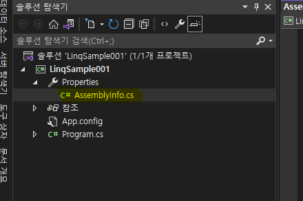
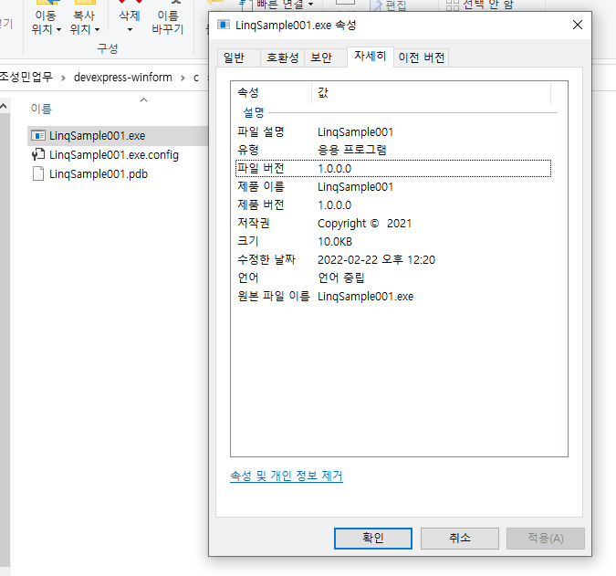

# 1. 문법 요소

1. 구문
    1. 전처리기 지시문    
    2. 리터럴에도 적용되는 타입
    3. 특성
        - 사용자 정의 특성
        - 특성이 적용될 대상을 제한
        - 다중 적용과 상속
        - AssemblyInfo.cs
2. 예약어
    1. 연산 범위 확인 : checked, unchecked
    2. 가변 매개변수 : params
    3. Win32 API 호출 : extern
    4. 안전하지 않은 컨텍스트 : unsafe
    5. 참조 형식의 맴버에 대한 포인터 : fixed
    6. 고정 크기 버퍼 : fixed
    7. 스택을 이용한 값 형식 배열 : stackalloc
    
<hr />
<br />
<br />
<br />

## 1. 구문

### 1). 전처리기 지시문

C#
의 전처리기 지시문(preprocessor directive)은 특정 소스코드를 상황에 따라서 컴파일 과정에서 추가/제거하고 싶을때 사용한다. 예를 들어, 다음의 Program.cs파일을 보면

```C#
static void Main(string[] args)
{
    string txt = Console.ReadLine();

    if(string.IsNullOrEmpty(txt) == false) 
    {
        Console.WriteLine("사용자 입력 : " + txt);
    }
}
```

Console.ReadLine메서드는 엔터 키가 눌릴 때까지의 키보드 입력을 받는 역할을 한다. 즉, Console.ReadLine메서드가 실행되면 콘솔 화면에는 입력을 기다리는 프롬프트가 깜빡이고 키보드로 입력된 내용을 내부적으로 저장해 뒀다가 엔터 키가 눌리면 반환값으로 돌려준다. 이어서 string.IsNullOrEmpty메서드는 인자로 들어온 string 객체가 null이거나 빈 문자열 ("")을 담고 있으면 true를 반환하고 1개이상의 문자를 담고 있으면 false를 반환합니다. 따라서 위 코드는 사용자에게서 입력받은 내용이 "test"라면 화면에 "사용자 입력: test"라는 문자열을 출력하고, 그냥 아무 내용 없이 엔터키만 눌렀다면 아무것도 하지 않습니다.

근데 위 프로그램을 사용하는 특정고객으로부터 아무입력도 안받는다면 "입력되지 않음이라는 메세지를 출력해달라는 요청을 받았습니다. 이 요청을 반영하려면 소스코드를 다음과 같이 고칩니다. 

```C#
static void Main(string[] args)
{
    string txt = Console.ReadLine();

    if(string.IsNullOrEmpty(txt) == false) 
    {
        Console.WriteLine("사용자 입력 : " + txt);
    }
    else 
    {
        Console.WriteLine("입력되지 않음");
    }
}
```

문제는 모든 고객이 이런 변경을 찬성하지 않았을 때 발생합니다. 그렇다면 원본 program.cs를 복사해서 program2.cs파일을 만들어 위의 변경사항을 관리해야 합니다. 그래서 program.cs와 program2.cs로 부터 각각 program.exe를 만들어서 원하는 고객에게 전달해야 합니다. 

이렇게 소스코드 파일이 나뉘면 여러가지 문제가 발생합니다. 하나의 소스코드에서 변경된 사항을 다른 소스코드에반영해야 하는 관리상의 부담이 생깁니다. 메서드를 통해 중복 코드를 방지한 것처럼 소스코드 파일 역시 중복을 지양해야 합니다. 

바로 이럴때 사용할 수 있는 기법이 #if/#endif전처리기 지시문 입니다.
```C#
static void Main(string[] args)
{
    string txt = Console.ReadLine();

    if(string.IsNullOrEmpty(txt) == false) 
    {
        Console.WriteLine("사용자 입력 : " + txt);
    }
    #if OUTPUT_LOG
    else 
    {
        Console.WriteLine("입력되지 않음");
    }
    #endif
}
```

위 예제에서는 OUTPUT_LOG 전처리 상수(preprocessor constant)가 정의돼 있으면 #if/#endif 사이의 소스코드를 포함해서 컴파일하게 만들고, 정의돼 있지 않으면 컴파일 과정에서 제거합니다. 개발자는 컴파일러에게 /define옵션을 통해 전처리 상수를 설정할 수 있습니다. 

```
참고)
[OUTPUT_LOG가 정의되지 않은 컴파일]
csc program.cs
[OUTPUT_LOG가 정의된 컴파일]
csc /define:OUTPUT_LOG program.cs
```

바로 위 코드는 터미널에서의 사용법이었고 비주얼 스튜디오 환경에서는 솔루션 탐색기에서 프로젝트 항목을 선택한 후 마우스 오른쪽버튼 누르면 나오는 메뉴에서 "속성(Properites)" 을 선택합니다. 그리고 "프로젝트 속성" 창이 나타나면 "빌드(Build)"탭을 선택하고 "조건부 컴파일 기호(Conditional compilation symbols)"입력 상자에 OUTPUT_LOG 를 입력합니다. 

이렇게 전처리기를 이용하면 하나의 소스코드 파일로 여러가지 상황을 만족하는 프로그램을 만들 수 있습니다. 

#if, #endif가 조건문이기에 이를 보완하기 위한 #else, #elif 지시자도 있습니다. 그리고 전처리기 기호를 csc.exe의 옵션을 지정하지 않고 소스코드에서 직접 지정할 수 있도록 #define문도 제공되며, 반대로 정의를 취소할 수 있는 #undef문도 있습니다. 아래는 예시입니다.

```C#
#define __X86__
#undef OUTPUT_LOG

usning System;

class Program 
{
    static void Main(string[] args)
    {
        #if OUTPUT_LOG
            Console.WriteLine("OUTPUT_LOG가 정의됨");
        #else
            Console.WriteLine("OUTPUT_LOG가 정의 안됨");
        #endif

        #if __X86__
            Console.WriteLine("__X86__정의됨");
        #elif __X64__
            Console.WriteLine("__X64__정의됨");
        #else
            Console.WriteLine("아무것도 정의 안 됨");
        #endif
    }
}
```

```
참고)
#define / #undef 문은 반드시 소스코드보다 먼저 나타나야합니다. 일례로, 위의 소스코드에서 #define구문을 using 문 다음으로 옮기면 컴파일할때 오류가 나타납니다.
```

### 2). 리터럴에도 적용되는 타입

코드 내에서 사용되는 리터럴도 그에 해당하는 타입이 적용됩니다. 예를 들어 숫자 5는 int 형의 인스턴스이고 값이 고정된 변수처럼 사용될 수 있습니다. 즉, 숫자 5를 통해서도 System.Int32 타입의 맴버를 그대로 사용할 수 있습니다. 

```
Console.WriteLine(5.ToString() + 6.ToString()); //출력결과 : 56
```

마찬가지로, 문자열도 string 타입의 인스턴스로 취급되어 다음과 같은 호출이 가능합니다.

```
Console.WriteLine("test".ToUpper()); //출력결과 TEST
```

### 3). 특성 

개발자는 소스코드에 주석을 이용해 원하는 정보를 남길 수 있습니다. 예를들어 소스코드 작성자를 아래와 같이 기입할 수 있습니다. 

```C#
/*
개발자 : 조성민
*/
public class Dummy {}
```

하지만 이 정보는 소스코드 파일에만 존재할 뿐, 컴파일러에 의해 빌드된 후 생성되는 EXE/DLL파일에는 남지 않습니다. 이 문제를 해결 할 수 있는것이 바로 특성(attribute)입니다.

닷넷의 어셈블리 파일에는 해당 어셈블리 스스로를 기술하는 메타데이터가 포함되어 있습니다. 예를 들어, 어셈블리 내에서 구현하고 있는 타입, 그 타입 내에 구현된 맴버 등의 정보가 메타데이터에 해당합니다. 특성은 이런 메타데이터와 함께 포함되며, 원하는 데이터를 보관하는 특성을 자유롭게 정의해서 사용합니다. 재미있는점은 특성 자체도 클래스라는 것입니다. 특성은 클래스로서 마이크로 소프트에서 미리 만들어둔 BCL에 포함된것도 있지만 당연히 외부 개발자도 특성을 만들 수 있습니다. 

<br />
<br />
<br />

- 사용자 정의 특성

특성은 System.Attribute를 상속받았다는 점을 제외하고는 여느 클래스와 차이점이 없다. 관례상 특성 클래스의 이름에는 Attribute라는 접미사를 붙인다. 예를 들어, 다음은 Author 라는 특성을 정의한 예입니다.

```C#
class AuthorAttribute : System.Attribute
{

}
```

특성을 정의하는 클래스도 여느 클래스와 다름없이 new 연산자로 인스턴스를 만들 수 있습니다. 하지만 그렇게 쓰는경우는 거의 없습니다. 대신 특성 클래스를 인스턴스화 할 수 있는 독특한 구문이 제공됩니다. 바로 대괄호 입니다. 특성은 세가지 방식으로 적용 할 수 있습니다.

```C#
[AuthorAttribute]
class Dummy1
{

}

[Author] // C#에서는 Attribute 접미사를 생략해도 됩니다.
class Dummy2 
{

}

[Author()] // 마치 new Author(); 한 것처럼 생성자를 표현하는 구문도 사용할 수 있습니다.
class Dummy3 
{

}
```

물론 특성 클래스에 매개변수가 포함된 생성자를 추가할 수도 있습니다. Author 특성을 좀 더 확장해보겠습니다.

```C#
class AuthorAttribute : System.Attribute
{
    string name;

    public AuthorAttribute(string name)
    { 
        this.name = name;
    }
}
```

string 타입의 매개변수를 하나 받는 생성자를 정의했기 때문에 Author특성을 사용할 때도 문자열을 전달해야 합니다. 

```C#
[Author("Anders")] // new Author("Anders");와 같은 사용 구문을 연상하면 됩니다.
class Program
{
    static void Main(string[] args)
    {

    }
}
```

선택적으로 값을 지정하고 싶다면 특성 클래스의 속성으로 정의하는 편이 좋습니다. 예를들어, 버전 기록을 위해 int 속성을 다음과 같이 추가하고,

```C#
class AuthorAttribute : System.Attribute
{
    // ----[생략]----
    int _version;
    public int Version
    {
        get {return _version;}
        set {_version = value;}
    }
}
```

특성을 사용하는 대괄호 구문에서는 Version 속성이 생성자에 명시된 것은 아니므로 별도로 "이름 = 값" 형식으로 전달해야 합니다. 

```C#
[Author("Anders", Version = 1)]
class Program
{
    //----[생략]----
}
```

이제 코드를 빌드한후 생성되는 EXE파일을 JustDecompile 역컴파일러로 열어서 확인해보면 코드가 보이는것을 확인 할 수 있습니다. 이렇게 특성은 프로그램의 흐름에 직접적인 영향을 끼치지 않으면서 개발자로 하여금 정보를 남길 수 있는 기능을 제공합니다. 

```
참고)
비록 특성 스스로는 프로그램의 동작 방식에 관여할 수 없지만 나중에 Reflection 기술과 결합되면 응용범위가 확장됩니다.
```

<br />
<br />
<br />

- 특성이 적용될 대상을 제한

아래와 같은 [Flags]특성을 다음과 같이 클래스에 설정하고 컴파일해보면

```C#
[Flags()]
class Program
{
    //생략
}
```

그럼 " 'Flags"특성은 이 선언형식에서 사용할 수 없습니다. 'enum'선언에만 사용할 수 있습니다." 같은 오류메시지가 발생할것입니다. 왜냐하면 Flags 특성은 enum 타입의 동작 방식을 바꾸는 용도로 사용되기 때문에 class정의에 사용될 이유가 없습니다. 

닷넷에서는 특성의 용도를 제한할 목적으로 System.AttributeUsageAttribute라는 또 다른 특성을 제공합니다. AttributeUsage특성에는 enum 타입의 AttributeTargets값을 인자로 받는 생성자가 정의돼 있는데, 바로 이 AttributeTargets에 정의된 값을 보면 특성을 적용될 수 있는 대상을 확인할 수 있습니다.

|AttributeTargets 값|의미|
|--|--|
|Assembly|어셈블리가 대상인 특성|
|Module|모듈이 대상인 특성|
|Class|class가 대상인 특성|
|Struct|struct가 대상인 특성|
|Enum|enum이 대상인 특성|
|Constructor|타입의 생성자가 대상인 특성|
|Method|타입의 메서드가 대상인 특성|
|Property|타입의 속성이 대상인 특성|
|Field|타입의 필드가 대상인 특성|
|Event|타입의 이벤트가 대상인 특성|
|Interface|interface가 대상인 특성|
|Parameter|메서드의 매개변수가 대상인 특성|
|Delegate|delegate가 대상인 특성|
|ReturnValue|메서드의 반환값에 지정되는 특성|
|GenericParameter|C# 2.0에 추가된 제네릭 매개변수에 지정되는 특성|
|All|AttributeTargets에 정의된 모든 대상을 포함|

보시다시피 메서드 내부의 코드를 제외한 C#의 모든 소스코드에 특성을 부여하는 것이 가능합니다. 

특성을 정의할 때 AttributeUsage를 지정하지 않으면 기본값으로 AttributeTargets.ALL이 지정된 것과 같습니다. 따라서 위에서 만든 Author특성은 위의 표에 지정된 모든 대상에 적용할 수 있습니다. 만약 Author특성의 적용대상을 클래스와 메서드로 제한하고 싶다면 다음과 같이 AttributeUsage특성을 사용할 수 있습니다. 

```C#
[AttributeUsage(AttributeTargets.Class | AttributeTargets.Method)]
class AuthorAttribute : System.Attribute
{
    //생략...
}
```

특성을 사용하는 대괄호 구문에는 특성이 적용될 대상(target)을 명시하는 것이 가능합니다. 예를들어, Author특성을 다음과 같이 사용할 수 있습니다. 

```C#
[type: Author("Tester")]
class Program
{
    [method: Author("Tester")]
    static void Main(string[] args)
    {

    }
}
```

|AttributeTargets 값| [target: ----]|
|--|--|
|Assembly|assembly|
|Module|module|
|Class|type|
|Struct|type|
|Enum|type|
|Constructor|method|
|Method|method|
|Property|property|
|Field|field|
|Event|event|
|Interface|type|
|Parameter|param|
|Delegate|type|
|ReutrnValue|return|
|GenericParameter|typevar|

일반적으로 대상을 생략하면 특성이 명시된 코드의 유형에 따라 위의 표의 대상이 자동으로 선택됩니다. 하지만 경우에 따라서 반드시 명시해야 하는 특성도 있습니다. 예를들어, BCL의 MarshalAs 라는 특성은 적용대상이 Field, Parameter, ReturnValue로 돼 있습니다. 이중에서 MarshalAs를 ReturnValue대상으로 적용하는 경우를 보겠습니다. 이런경우 대상을 생략하고 MarshalAs 특성을 지정하면 

```C#
[MarshalAs(UnmanagedType.I4)]
static int Main(string[] args)
{
    return 0;
}
```

컴파일 할 때 "'MarshalAs'특성은 이 선언 형식에서 사용할 수 없습니다 'field, param, return'선언에만 사용할수 있습니다. " 라는 오류가 발생합니다 왜냐하면 특성이 적용된 코드가 Main메서드이기 때문에 자동으로 [method: MarshalAs(----)]로 지정되고, method는 MarshalAs의 대상인 Field, Parameter, ReturnValue에 속하지 않기 때문입니다. 따라서 이런 경우에는 명시적으로 return 값에 적용된다는 의미로 대상을 설정해야 합니다. 

```C#
[return: MarshalAs(UnmanagedType.I4)]
static int Main(string[] args)
{
    return 0;
}
```

<br/>
<br/>
<br/>

- 다중 적용과 상속

AttributeUsage특성에는 생성자로 입력받는 AttributeTargets말고도 두가지 속성이 더 제공됩니다. 

|속성타입|속성이름|의미|
|--|--|--|
|bool|AllowMultiple|대상에 동일한 특성이 다중으로 정의 가능(기본값 : false)|
|bool|Inherited|특성이 지정된 대상을 상속받는 타입도 자동으로 부모의 특성을 물려받음. 일반적으로 잘 사용되지 않는다(기본값: true)|

AllowMultiple, Inherited속성은 AttributeUsage 클래스의 생성자에 매개변수로 정의돼 있지 않고 속성으로만 정의돼 있기 때문에 특성을 적용하는 대괄호 구문에서 "이름 = 값"의 쌍으로 전달합니다.

만약 위의 Author특성을 다음과 같이 다중으로 지정하면 "특성이 중복되었습니다"라는 컴파일 오류가 발생합니다. 

```C#
[Author("Anders", Version = 1)]
[Author("Anders", Version = 2)]
class Program 
{

}
```

이렇게 동일한 특성을 두개 이상 지정하려면 Author 클래스의 AttributeUsage 설정에 AllowMultiple 속성을 true로 지정해주어야 합니다.

```C#
[AttributeUsage(AttributeTargets.All, AllowMultiple = true)]
class AuthorAttribute : System.Attribute
{
    //생략
}
```

참고로 같은 특성이 아니라면 AllowMultiple 여부에 상관없이 대상 코드에 여려개의 특성을 지정하는것이 가능합니다. 예를 들어, enum 타입에 Flags와 Author특성을 지정하면 다음과 같습니다. 

```C#
[Flags]
[Author("Anders")]
enum Days{ /*생략*/}
```

또는 대괄호 내에 연속해서 정의하는 것도 가능합니다. 

```C#
[Flags, Author("Anders")]
enum Days{ /*생략*/}
```

<br />
<br />
<br />

- AssemeblyInfo.cs



비주얼 스튜디오로 프로젝트를 만들었다면 "Properties"라는 폴더가 기본적으로 생성되고, 그 안에는 AssemblyInfo.cs파일이 있습니다. 그것은 일반적인 C# 코드 파일과 동일하기 때문에 클래스를 내부에 정의해도 됩니다. 하지만 관례상 AssemblyInfo.cs파일은 어셈블리 수준에서 적용되는 특성만을 모아두는 용도로만 사용합니다. 아래 예제를 보면,

```C#
using System.Reflection;
using System.Runtime.CompilerServices;
using System.Runtime.InteropServices;

// 어셈블리에 대한 일반 정보는 다음 특성 집합을 통해 
// 제어됩니다. 어셈블리와 관련된 정보를 수정하려면
// 이러한 특성 값을 변경하세요.
[assembly: AssemblyTitle("LinqSample001")]
[assembly: AssemblyDescription("")]
[assembly: AssemblyConfiguration("")]
[assembly: AssemblyCompany("")]
[assembly: AssemblyProduct("LinqSample001")]
[assembly: AssemblyCopyright("Copyright ©  2021")]
[assembly: AssemblyTrademark("")]
[assembly: AssemblyCulture("")]

// ComVisible을 false로 설정하면 이 어셈블리의 형식이 COM 구성 요소에 
// 표시되지 않습니다. COM에서 이 어셈블리의 형식에 액세스하려면
// 해당 형식에 대해 ComVisible 특성을 true로 설정하세요.
[assembly: ComVisible(false)]

// 이 프로젝트가 COM에 노출되는 경우 다음 GUID는 typelib의 ID를 나타냅니다.
[assembly: Guid("57dff80d-c249-4b42-9d4d-c4a83f740ac8")]

// 어셈블리의 버전 정보는 다음 네 가지 값으로 구성됩니다.
//
//      주 버전
//      부 버전 
//      빌드 번호
//      수정 버전
//
// 모든 값을 지정하거나 아래와 같이 '*'를 사용하여 빌드 번호 및 수정 번호를
// 기본값으로 할 수 있습니다.
// [assembly: AssemblyVersion("1.0.*")]
[assembly: AssemblyVersion("1.0.0.0")]
[assembly: AssemblyFileVersion("1.0.0.0")]

```
여기에 정의된 모든 특성(예 : AssemblyTitle)은 AttributeTargets.Assembly 가 설정된 것입니다 그런데 왜 굳이 [assembly: ----]라고 대상을 명시해야만 했을까요? 대상이 지정되지 않은 경우 특성은 그다음에 나오는 코드를 보고 자동으로 대상을 선택하는데 assembly라는 대상 자체를 표현할 수 있는 코드가 존재하지 않으므로 불가능합니다. 따라서 어셈블리에 적용되는 특성은 항상 [assembly: ----]로 지정해야 합니다. 

여기서 모든 assembly특성을 설명할 수는 없습니다. 이중에서 AssemblyTitle, AssemblyFileVersion, AssemblyProduct, AssemblyCopyright 특성과 여기에 나와있지는 않지만 AssemblyInformationalVersion특성에 지정된 값은 윈도우 탐색기의 파일 속성창에 그 결과가 반영됩니다. 예를들어, 각 값을 다음과 같이 설정하고 빌드한 후 

```C#
// 생략
[assembly : AssemblyTitle("LinqSample001")]
[assembly : AssemblyFileVersion("1.0.0.0")]
[assembly : AssemblyProduct("LinqSample001")]
[assembly : AssemblyInformationalVersion("1.0.0.1")]
[assembly : AssemblyCopyright("Copyright ©  2021")]
// 생략
```

생성된 EXE파일의 속성창을 탐색기에서 보면 개별 특성의 역할을 확인할 수 있습니다.



<hr />
<br />
<br />
<br />

## 2. 예약어

### 1). 연산범위 확인 : checked, unchecked

정수 계열 타입의 산술 연산을 하거나, 서로 다른 정수 타입 간의 형변환을 하게 되면 표현 가능한 숫자의 범위를 넘어서는 경우가 발생한다. 예를 들어, 2바이트 정수인 short 타입은 -32.768~+32.767사이의 값을 표현할 수 있는데 그 수를 넘어서는 상황이 되면 어떻게 처리해야 할까? 

```C#
short c = 32767;
c++
Console.WriteLine(c); // 출력 : -32768

int n = 32768;
c = (short)n;
Console.WriteLine(c); // 출력 : -32768
```

32,767 에 1을 더한 결과가 -32,768 이 됬다 그 이유는 2진수로 보면 알 수 있습니다.

```
숫자 32767: 2진수(01111111 11111111)
01111111 11111111 + 1 = 10000000 00000000
최상위 비트가 1로 바뀌어서 음수값이 되며, C# 은 음수를 2의 보수(complement)로 표현하기 때문에 값이 -32,768 이 된다.
```

반대의 경우도 동일한 현상이 발생한다. 

```C#
short c = -32767;
c--
Console.WriteLine(c); // 출력 : 32767

int n = -32768;
c = (short)n;
Console.WriteLine(c); // 출력 : 32767
```

이런식으로 데이터가 상한값을 넘어 하한값으로 돌아가는 것을 오버플로(overflow)라 하고, 반대의 현상을 언더플로(underflow) 라고 합니다. 

```
참고)
엄밀하게 정의를 하면, 정수에서의 상한 및 하한을 넘어서는 모든 결과를 오버플로라고 하며 언더플로는 특별히 부동 소수점 연산에서 0에 가깝지만 정밀도의 함계로 표현할 수 없을때 아예 0 으로 만들어 버리는 것을 의미합니다.
```

그런데 오버플로와 언더플로가 과연 개발자가 의도한 동작일까요? 산술 연산은 경우에 따라서 결괏값이 매우 민감하게 받아들여질 수 있습니다. 가령 화폐 연산에서 이런 식의 연산 결과가 나왔는데 이 사실을 모르고 계속 진행하면 분명 문제가 될 수 있습니다. 이 때문에 개발자는 연산식에서 오버플로나 언더플로가 발생한 경우 C#으로 하여금 오류를 발생시키라고 명시할 수 있는데, 이때 checked예약어가 그과 같은역할을 합니다. 

```C#
short c = 32767;
int n = 32768;

checked 
{
    c++ // 예외발생
}
```

산술 연산 코드에 checked를 적용하면 타입이 지정한 범위를 넘어서는 연산을 시도하는 경우 System.OverflowException 오류가 발생하면서 프로그램 실행이 멈춥니다. 

경우에 따라서 checked 예약어의 명시적인 사용은 개발자로 하여금 실수할 수 있는 여지를 남깁니다. 이 때문에 C#은 컴파일러 수준에서 checked 상황을 전체 소스코드에 걸쳐 강제로 적용할 수 있는 옵션을 제공합니다. 따라서 checked를 명시하지 않은 예제에 /checked 옵션을 적용해 컴파일하면 실행 시에 OverflowException이 발생합니다. 'ㅁ'!!

```
참고) 'ㅁ'
비주얼 스튜디오에서는 프로젝트 속성창의 "빌드" 탭을 선택한 후 "고급---" 버튼을 누르면 "산술연산오버플로/언더플로 확인(Check for arithmetic overflow/underflow)" 옵션이 나옵니다.~!
```

이처럼 /checked 옵션과 함께 컴파일된 경우, 반대로 특정 영역의 산술 연산에 대해서는 오버플로나 언더플로가 발생해도 오류를 내지 말라고 개발자가 unchecked 예약어를 지정할 수 있습니다.

```C#
short c = 32767;

unchecked 
{
    c++ // 컴파일러에 /checked 옵션을 적용해 컴파일된 경우에도 오류가 발생하지 않습니다. 
}
```

### 2). 가변 매개변수 : params

메서드를 정의할 때 몇개의 인자를 받아야 할지 정할 수 없을때가 있습니다. 예를 들어, Add 메서드를 2개의 인자만 입력받는 것으로 정의했다고 가정해봅니다. 하지만 메서드를 사용하다 보니 인자가 더 필요해져서 다음과 같은 식으로 메서드를 추가했습니다. 

```C#
static int Add(int a, int b)
{
    return a + b;
}

static int Add(int a, int b, int c)
{
    return a + b + c;
}
```

그런데 이게 끝이 아니라면? 4개 5개....의 인자를 받게 해야 한다면 그때마다 일일이 상응하는 메서드를 정의해야할까요?
이런상황에서 params 예약어를 사용해 가변인자를 지정할 수 있습니다. 

```C#
static void Main(string[] args)
{
    Console.WriteLine(Add(1 , 2, 3 ,4 ,5));
    Console.WriteLine(Add(1 , 2, 3 ,4 ,5, 6, 7, 8, 9, 10));
}

static int Add(params int[] values) 
{
    int result = 0;

    for(int i = 0; i < values.Length; i++)
    {
        result += values[i];
    }

    return result;
}
```

params매개변수를 정의할 때는 입력받을 인자의 타입에 해당하는 배열을 선언한 다음 params예약어를 붙이면 됩니다. 예제의 Add 메서드는 정수를 입력받으므로 int의 배열로 선언했고 params예약어를 추가했습니다. 

입력 타입을 지정할 수 없다면 모든 타입의 부모인 object를 사용할 수 있습니다. 

```C#
static void Main(string[] args)
{
    PrintAll(1.05, "Result", 3);
}

private static void PrintAll(params object[] values)
{
    foreach (object value in values) 
    {
        Console.WriteLIne(value);
    }
}
// 출력결과 
/*
1.05
Result
3
*/
```

### 3).Win32 API 호출 : extern 

여기는 C/C++ 언어와의 호환성을 위해 제공됩니다 따라서 C/C++언어를 모르면 가볍게 지나갑니다. 

닷넷 호환 언어로 만들어진 관리 코드(managed code)에서 C/C++같은 언어로 만들어진 비관리 코드(unmanaged code)의 기능을 사용하는 수단으로 플랫폼 호출(P/Invoke: platform invocation)이 있습니다. extern 예약어는 C# 에서 PInvoke호출을 정의하는 구문에 사용됩니다. 

extern구문을 작성하려면 다음과 같은 세가지 정보가 필요합니다. 

- 비관리 코드를 제공하는 DLL이름
- 비관리 코드의 함수 이름 
- 비관리 코드의 함수 형식(signature)

한 예로 윈도우에서 제공되는 MessageBeep 함수를 C#에서 호출해 볼 텐데, 필요한 정보는 MSDN 에 있습니다. ~!
```
MessageBeep function (Windows)
- 함수 이름 및 형식 : BOOL WINAPI MessageBeep(_In_UNIT uType);
- 함수가 제공되는 DLL이름 : User32.dll
```

이 정보를 토대로 extern 예약어를 사용하는 방법은 일반적인 정적 메서드를 정의하는 방법과 유사합니다. 

```C#
using System.Runtime.InteropServices;

class Program
{
    [DllImport("user32.dll")]
    static extern int MessageBeep(uint uType);

    static int TestMethod(uint type) //비교를 위한 정적 메서드
    {
        return 0;
    }
}
```

사실 extern 예약어 자체는 메서드에 코드가 없어도 컴파일 되게 하는 역할만 합니다. 해당 Win32 API와 C# 코드를 연결하는 역할은 DllImport 특성을 적용해야만 이용할 수 있습니다 닷넷 CLR은 DllImport특성으로 전달된 DLL파일명에 extern 예약어가 지정된 메서드와 시그니처가 동일한 Win32 API를 연결합니다. 이렇게 정의된 extern 정적 메서드를 사용하는 방법은 일반덕인 정적 메서드를 사용하는 방법과 동일합니다. 

```C#
static void Main(string[] args)
{
    MessageBeep(0);
}
```

위의 코드를 실행하면 컴퓨터에서 간단한 경고음(Beep)이 발생합니다. 

extern구문 자체는 어렵지 않지만 현업에서 extern 정적 메서드를 사용하는것은 그다지 쉽지 않습니다. 왜냐하면 C/C++에서 복잡한 자료형을 쓴다거나 포인터 구문을 사용하면 이를 C#의 자료형과 맞춰줘야 하기 때문입니다. 참고로 잘알려진 Win32 API에 대한 PInvoke구문이 필요하다면 www.pinvoke.net 웹사이트를 먼저 이용해봅시다. 이곳에서는 Win32 API 를 검색하면 그에 대응되는 C# 및 VB.NET언어로 금방 가져다 쓸 수 있는 extern 구문을 제공합니다. 

### 4).안전하지 않은 컨텍스트 : unsafe

여기는 C/C++ 언어와의 호환성을 위해 제공됩니다 따라서 C/C++언어를 모르면 가볍게 지나갑니다. 

관리언어인 C#의 독특한 특징 중 하나는 기존 네이티브 C/C++ 언어와의 호환성을 위한 기능이 추가됬다는 점이다. Win32 API를 직접 호출할 수 있는 extern 예약어도 그러한 사례중 하나입니다. C/C++와의 호환성을 높이기 위해 존재하는 또 한가지 사례가 바로 안전하지 않은 컨텍스트(unsafe context)에 대한 지원입니다. 안전하지 않은 컨텍스트(문맥)이란 안전하지 않은 코드를 포함한 영역을 의미하며, 안전하지 않은 코드란 포인터(pointer)를 사용하는것을 의미합니다.

간단히 C#은 C/C++언어의 포인터를 지원하며, unsafe 예약어는 포인터를 쓰는 코드를 포함하는 클래스나 그것의 맴버 또는 블록에 사용합니다. 아래는 포인터 연산자 (*, &)와 unsafe를 사용한 간단한 예제입니다. 

```C# 
unsafe static void GetAddResult(int* p, int a, int b)
{
    *p = a + b;
}

static void Main(string[] args)
{
    int i;

    unsafe 
    {
        GetAddResult(&i, 5, 10);        
    }

    Console.WriteLine(i);
}
```

포인터 연산자 (*, &)가 사용된 곳에는 반드시 unsafe 예약어를 지정해야 합니다. 코드를 보면 GetAddResult메서드는 포인터 형식의 인자를 받고 내부에 포인터 연산자(\*)를
사용하는 코드가 있으므로 메서드 자체를 unsafe로 지정했습니다. 반면 Main 메서드에는 GetAddResult를 호출하는 부분에만 포인터 연산자 (&)을 사용하므로 블록을 지정해 unsafe를 적용합니다. 

unsafe 예약어를 사용한 소스코드는 반드시 컴파일러 옵션으로 /unsafe를 지정해야 합니다. 

```
c:\temp\ConsoleApp>csc /unsafe program.cs
```

비주얼 스튜디오 환경이라면 프로젝트 속성 창의 "빌드(Build)"탭에서 "안전하지 않은 코드 허용(Allow unsafe code)" 옵션을 설정합니다.

### 5). 참조 형식의 맴버에 대한 포인터 : fixed

여기는 C/C++ 언어와의 호환성을 위해 제공됩니다 따라서 C/C++언어를 모르면 가볍게 지나갑니다. 

unsafe 문맥에서 포인터를 사용할 수 있는 것은 스택에 데이터가 저장된 변수에 한해 적용됩니다. 즉, 지역 변수나 메서드의 매개변수 타입이 값 형식인 경우엔만 포인터 연산자 (*, &)을 사용할 수 있습니다. 

반면 참조 형식의 데이터는 직접적인 포인터 연산을 지원할 수 없습니다. 왜냐하면 참조 형식의 인스턴스는 힙에 할당되고 그 데이터는 가비지 수집기가 동작할 때마다 위치가 바뀔 수 있기 때문입니다. 이로 인해 포인터를 이용해 그 위치를 가리키면 가비지 수집 이후 엉뚱한 메모리를 가리킬 수 있다는 위험이 따릅니다. 바로 이런 문제를 해결하기 위해 C#에는 fixed예약어를 도입했습니다. fixed예약어가 하는 정확한 역할은 힙에 할당된 참조 형식의 인스턴스를 가비지 수집기가 움직이지 못하도록 고정시킴으로써 포인터가 가리키는 메모리를 유효하게 만드는 것입니다. 다음은 예제입니다.

```C#
using System;

class Managed
{
    public int Count;
    public string Name;
}

class Program
{
    unsafe static void Main(string[] args)
    {
        Managed inst = new Managed();
        inst.Count = 5;
        inst.Name = "text";        
    }

    fixed(int* pValue = &ints.Count)
    {
        *pValue = 6;
    }

    fixed(char* pChar = inst.Name.ToCharArray())
    {
        for (int i = 0; i < inst.Name.Length; i++)
        {
            Console.WriteLine(*(pChar + i));
        }
    }
}
```

Managed 타입의 객체인 inst변수에 대해 직접 포인터를 가져오지 않았다는 점에 유의할 필요가 있습니다. C#은 객체 인스턴스의 포인터를 가져오는 것을 허용하지 않습니다. 대신 해당 객체가 가진 맴버 데이터가 값 형식이거나 값 형식의 배열인 경우에만 포인터 연산을 할 수 있습니다. 하지만 fixed되는 대상은 객체의 데이터를 포함한 객체가 됩니다. 따라서 프로그램 실행이 fixed블록의 끝에 다다를 때까지는 가비지 컬렉터가 해당 객체를 이동시킬 수 없습니다.

보통 fixed된 포인터는 관리 프로그램의 힙에 할당된 데이터를 관리되지 않은 프로그램에 넘기는 용도로 쓰입니다. 

### 6). 고정 크기 버퍼 : fixed


### 7). 스택을 이용한 값 형식 배열 : stackalloc