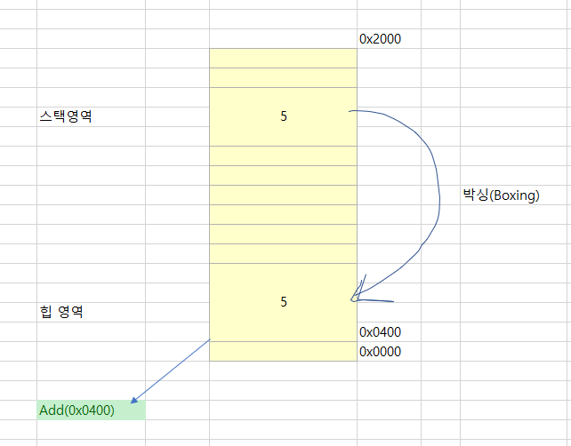

# 제네릭

1. 형식 매개변수에 대한 제약 조건
2. BCL에 적용된 제네릭

<hr />
<br />
<br />
<br />

제네릭(Generic)을 쉽게 이해하려면 기존의 문제점을 먼저 알아보면 됩니다. C# 1.0 의 문법에서는 기본 형식(primitive types)으로 컬렉션 객체를 사용하는 경우 박싱/언박싱 문제가 발생합니다. 예를 들어, ArrayList에 int타입의 데이터를 담는 코드를 봅시다.

```C#
int n = 5;
ArrayList ar = new ArrayList();
ar.Add(n);
```

ArrayList는 모든 타입의 컬렉션을 구성할 수 있도록 만들어졌기 때문에 Add메서드는 인자로 object타입을 받습니다. 하지만 int 는 값 형식이고, object는 참조 형식이므로 정수형 데이터5 는 박싱돼 힙에 object인스턴스를 할당하고 그 참조 개체가 ArrayList의 Add메서드에 전달됩니다. 



이 문제를 해결하려면 ArrayList가 다루는 데이터 타입이 int로 고정돼야 합니다. 그런데 문제는 이렇게 타입이 고정되면 각 타입마다 ArrayList코드를 구현해야 한다는 단점이 생깁니다. 즉, int를 받는 IntArrayList, long을 받는 LongArrayList와 같은 식이 됩니다. 

닷넷 프레임워크 2.0에서는 제네릭이 도입된 새로운 컬렉션 타입을 발표했는데, ArrayList를 보완한 List<T>타입이 그것입니다. 여기서 <T>는 제네릭을 위한 새로운 문법을 나타내는데, T는 타입으로 대체할 수 있습니다. 다음 코드는 정수형 타입을 보관하는 List<T>의 사용법을 보여줍니다.

```C#
int n = 5;
List<int> list = new List<int>();
list.Add(n);
```

List<int>의 Add메서드는 object가 아닌 int를 받기 때문에 박싱과정을 거치지 않고 컬렉션에 항목이 추가됩니다. 마찬가지로 어떤 타입이든 우리가 원하는 타입을 List<T>에 대체해서 생성할 수 있습니다. 

```C#
List<bool> boolList = new List<bool>();
List<byte> byteList = new List<byte>();
List<short> shortList = new List<short>();
List<double> doubleList = new List<double>();
```

물론 List<T>처럼 제네릭을 이용한 타입을 직접 만드는 것도 가능합니다. 예를들어 Stack자료구조를 구현한다고 가정했을때 C#1.0문법이었다면 다음과 같은식으로 구현해야만 했습니다. 


