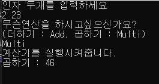
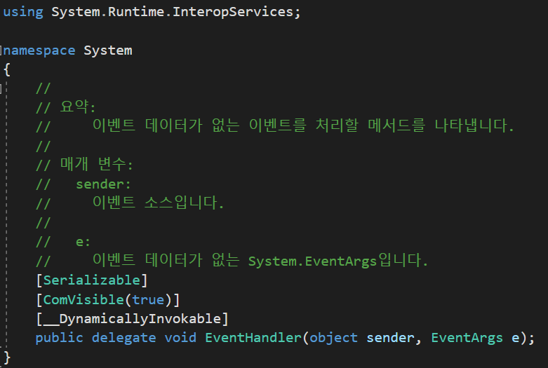

# C# 

1. [프로퍼티](#1-프로퍼티)
2. [delegate(델리게이트)](#2-delegate델리게이트)

    1. 일반적인경우
    2. delegate 사용
    3. 언제 사용하지
    4. 어디서 본듯한 delegate
    5. 이벤트
    6. MS 제공 델리게이트
        - Action<T> delegate
        - Func<T> delegate
        - Predicate<T> delegate

3. [링큐](#3-링큐)
    1. 기본사용
    2. LINQ 확장메서드 사용
    3. 기본사용 CROSS JOIN
    4. 기본사용 INNER JOIN
    5. LEFT JOIN
    6. GROUP JOIN
    7. INNER JOIN MULTI 조건
    8. Dictionary LINQ
    9. LINQ를 이용한 UPDATE001
    10. LINQ를 이용한 UPDATE002
    11. LINQ를 이용한 DELETE001
    12. LINQ를 이용한 DELETE002
    13. 링큐패드5 (LINQPad5 .netFrameWork)

_____________________________________________________

<br>
<br>
<br>
<br>

# 1. 프로퍼티

<br>
<br>
<hr>
<br>
<br>
<br>


# 2. delegate(델리게이트)

델리게이트는 함수를 인자(파라미터) 로 받기 위해서 탄생했습니다. 파라미터로는 원래 int나 decimal이나 뭐 등등 클래스화 된것만 받는걸 썼는데, 파라미터값으로 함수를 받으면 생기는 이점이 있습니다. 

앞서 설명하자면 함수를 인자로 받을시 장점은 2가지정도를 예를들어 생각해 볼 수 있겠습니다. 첫째는 하나의 메서드가 여러번 호출당할때 그 메서드가 여러개의 메서드를 참조하고 있을때이고, 두번째는 여러사람이 일을 나누어서 메서드를 작성할 때 입니다. 이 외에도 사용을 고려해야 하는 이유들이 많습니다. 

먼저 계산기 프로그램을 만들어 보았습니다. 사용자로부터 2개의 인자를 받고 Add 또는 Multi값을 받습니다. 결과값으로 계산값을 화면에 보여줍니다. 아래와 같은 코드가 됩니다. 
```C#
namespace delegateSample001
{
    class Program
    {
        public delegate void DeleCalculation(int v1, int v2);
        static void Main(string[] args)
        {
            Console.WriteLine("인자 두개를 입력하세요");
            string[] input_value = Console.ReadLine().Split();
            Console.WriteLine("무슨연산을 하시고싶으신가요?\n(더하기 : Add, 곱하기 : Multi)");
            string input_calculate = Console.ReadLine();

            if (input_calculate == "Add")
            {
                Add(Int32.Parse(input_value[0]), Int32.Parse(input_value[1]));
            }
            else if (input_calculate == "Multi")
            {
                Multi(Int32.Parse(input_value[0]), Int32.Parse(input_value[1]));
            }

            Console.ReadKey();
        }

        static void Add(int value1, int value2)
        {
            Console.WriteLine($"더하기 : {value1 + value2}");
        }

        static void Multi(int value1, int value2)
        {
            Console.WriteLine($"곱하기 : {value1 * value2}");
        }
    }
}

```

그런데 위의 코드를 보고 추가하고 싶은 내용이 생겼습니다. 계산을 실행 할때마다 "계산기를 실행시켜줍니다" 라는 메세지를 추가하고 싶어졌습니다(실제로는 더 많은 기능 추가). 그래서 함수하나를 만들고 여기서 공통된 기능을 추가하고 파라미터값으로 덧셈 곱셈 메서드를 받게 됩니다. 

아래와같은 코드로 수정하면 얻게 되는 이점은 무엇이냐면, 일단 가령 if else문이 길어졌다 가정합니다. 그러면 그때마다 "계산기를 실행시켜줍니다"(실제로는 더 많은 기능 추가)를 추가해줘야합니다. 이를 줄여줄 수 있습니다. 따라서 만약 사람이 두명이고 프로그램을 만들어야 할때 한명은 Calculator같은 메서드들을 만들고 한명은 Add, Multi, ...등등 메서드들을 만들면 일이 편하게 됩니다. 

```C#
namespace delegateSample001
{
    class Program
    {
        public delegate void DeleCalculation(int v1, int v2);
        static void Main(string[] args)
        {
            Console.WriteLine("인자 두개를 입력하세요");
            string[] input_value = Console.ReadLine().Split();
            Console.WriteLine("무슨연산을 하시고싶으신가요?\n(더하기 : Add, 곱하기 : Multi)");
            string input_calculate = Console.ReadLine();

            if(input_calculate == "Add")
            {
                Calculator(Add, input_value);
            }
            else if(input_calculate == "Multi")
            {
                Calculator(Multi, input_value);
            }

            Console.ReadKey();
        }

        static void Calculator(DeleCalculation deleCalculate, string[] input_value)
        {
            Console.WriteLine("계산기를 실행시켜줍니다.");
            deleCalculate(Int32.Parse(input_value[0]), Int32.Parse(input_value[1]));
        }

        static void Add(int value1, int value2)
        {
            Console.WriteLine($"더하기 : {value1 + value2}");
        }

        static void Multi(int value1, int value2)
        {
            Console.WriteLine($"곱하기 : {value1 * value2}");
        }
    }
}

```
실행 결과 :



아래부터는 처음부터 delegate에 관해서 설명합니다. 

<br>
<br>
<br>

## 1). 일반적인경우

일반적인 함수 호출은 이런식일 것입니다. Main메서드에서 Add 함수를 가져옵니다. Add 메서드안에 파라미터 두개를 넣습니다.

```C#
namespace delegateSample001
{
    class Program
    {
        static void Main(string[] args)
        {
            Add(1, 2);

            Console.ReadKey();
        }

        static void Add(int value1, int value2)
        {
            Console.WriteLine($"더하기 : {value1 + value2}");
        }
    }
}

```

실행결과 :


<br>
<br>
<br>

## 2). delegate 사용

delegate 를 사용해보겠습니다. delegate는 클래스 안이나 밖에 상관없이 선언이 가능합니다. DeleCalculation을 선언해보겠습니다. 

delegate 선언방식은 이렇습니다. (한정자) delegate (형식) 델리게이트이름 ((형)파라미터1, (형)파라미터2, ...);

파라미터의 개수와 형식이 맞는 모든 메서드들을 받아줄 수 있습니다. 

```C#
namespace delegateSample001
{
    class Program
    {
        //델리게이트 선언 
        public delegate void DeleCalculation(int v1, int v2);

        static void Main(string[] args)
        {
           DeleCalculation Calc;
           Calc = Add;
           Calc += Multi;
           Calc(1, 2);

           Console.ReadKey();
        }

        static void Add(int value1, int value2)
        {
            Console.WriteLine($"더하기 : {value1 + value2}");
        }

        static void Multi(int v1, int v2)
        {
            Console.WriteLine($"곱하기 : {v1 * v2}");
        }
    }
}
```

실행결과 :


<br>
<br>
<br>

## 3). 언제 사용하지

아래 예제에서는 DeleCalculation 대리자를 선언했지만 Run() 메서드에서는 실제적으로 사용하지 않았습니다. 대신 Action<int, int> 를 사용했는데요. 이는 매번 대리자를 사용하려면 선언해야하는데 이름을 지어줘야합니다. 그리고 대리자 선언을 어디에 했는지 잘 모르게 되는데요. 이를 MS가 알고 미리 0부터 16개 까지 인자로 받아줄 수 있는 Action 델리게이트를 미리 System 라이브러리에 선언해놓았습니다. 아래 이것에 대해서 더 설명하겠습니다. 꺽쇠 안에 int는 제너릭 폼인것을 알 수 있습니다. 여튼 여기서는 메서드가! 메서드를! 파라미터로 받아서 사용하는것을 확인했습니다. 

```C#
namespace delegateSample001
{
    class Program
    {
        //델리게이트 선언 
        public delegate void DeleCalculation(int v1, int v2);

        static void Main(string[] args)
        {
            Run(Add);
            Run(Multi);

            Console.ReadKey();
        }

        static void Add(int value1, int value2)
        {
            Console.WriteLine($"더하기 : {value1 + value2}");
        }

        static void Multi(int v1, int v2)
        {
            Console.WriteLine($"곱하기 : {v1 * v2}");
        }

        static void Run(Action<int, int> deleValue)
        {
            deleValue(1, 2);
        }
    }
}
```

실행결과 :


<br>
<br>
<br>

## 4). 어디서 본듯한 delegate

네 사실 delegate는 이벤트와 같은 콜백기능을 가지고있다고 봐도 좋습니다 따라서 아래와같은 형식을 제일 많이 보게 됩니다. 아래 코드에서 사용한 EventHandler는 사실 MS가 미리 선언해둔 이벤트입니다. 이벤트는 = 델리게이트입니다만 차이가 있습니다.

```C#
namespace delegateSample001
{
    class Program
    {
        static void Main(string[] args)
        {
            EventHandler Calc = null;
            Calc += txtBox_Clicked;
            Calc(new object(), new EventArgs());

            Console.ReadKey();
        }

        static void txtBox_Clicked(object s, EventArgs e)
        {
            Console.WriteLine($"이벤트 처리");
        }
    }
}
```

실행결과 :


먼저 EvnetHandler 에 대해서 좀 알아보자면 아래와 같이 선언되어있습니다.



바로 위 사진을 보면 public delegate void EventHandler(object sender, EventArgs e);로 선언되어있는것을 볼 수 있습니다. 따라서 등록해주는 함수(본인의 함수)의 파라미터도 첫번째는 object형이고 두번째는 EventArgs이어야 합니다. 용어정리를 하자면, 콜백 메서드는 본인의 메서드입니다. 등록해주는 메서드 = 콜백 메서드 입니다. 이벤트던 델리게이트(대리자)던 콜백메서드를 호출하고 콜백메서드가 일을하게 만듭니다. 따라서 위의 콜백 메서드는 txtBox_Clicked() 가 되겠습니다. 

delegate와 event의 차이라면 델리게이트는 자신의 하는 일을 하는 도중에도 콜백메서드를 호출하고 콜백 메서드가 리턴하는 리턴값을 가지고 계산을하던 뭘하던 자신이 하고싶은일을 하지만, 이벤트는 무조건 void형 콜백 메서드를 받고 자신의 할 일을 다 마친후에 마지막에 콜백 메서드를 호출한다는 차이점이 있습니다. 

<br>
<br>
<br>

## 5). 이벤트

먼저 솔루션 하위 프로젝트 구조입니다. MyButtonClass프로젝트를 delegateSample002가 참조하고있습니다.


아래는 폼 클래스입니다.

```C#
using System;
using System.Collections.Generic;
using System.ComponentModel;
using System.Data;
using System.Drawing;
using System.Linq;
using System.Text;
using System.Threading.Tasks;
using System.Windows.Forms;

namespace delegateSample002
{
    public partial class Form1 : Form
    {
        MyButtonClass.Button btn001 = new MyButtonClass.Button();
        public Form1()
        {
            InitializeComponent();
            btnTest01.Click += BtnTest01_Click;
            
            btn001.Clicked += Btn001_Clicked;
            btn001.Clicked2 += Btn001_Clicked2;
        }

        private void BtnTest01_Click(object sender, EventArgs e)
        {
            lstBox.Items.Add("클릭 이벤트 처리");
            btn001.OnClick();

            btn001.CallBackTest01(Add);
            btn001.CallBackTest01((v1, v2) => { lstBox.Items.Add($"{v1} + {v2}"); });
            btn001.CallBackTest01(delegate (int v1, int v2) { lstBox.Items.Add($"{v1} + {v2}"); });
            btn001.CallBackTest02(Add, 2, 2);
            btn001.CallBackTest02((v1, v2) => { lstBox.Items.Add($"{v1} + {v2}"); }, 2, 2);
            btn001.CallBackTest02(delegate (int v1, int v2) { lstBox.Items.Add($"{v1} + {v2}"); }, 2, 2);
        }

        private void Btn001_Clicked(object sender, EventArgs e)
        {
            lstBox.Items.Add("내 버튼 클릭 이벤트 처리");
        }

        private void Btn001_Clicked2(object arg1, EventArgs arg2)
        {
            lstBox.Items.Add("내 버튼 클릭 이벤트 처리2");
        }

        private void Add(int v1, int v2)
        {
            lstBox.Items.Add($"{v1} + {v2}");
        }
    }
}

```

<br>

MyButtonClass 네임스페이스 하위 Button.cs입니다. 

```C#
using System;
using System.Collections.Generic;
using System.Linq;
using System.Text;
using System.Threading.Tasks;

namespace MyButtonClass
{
    public class Button
    {
        public event EventHandler Clicked;

        public delegate void DeleCall(int v1, int v2);
        public event Action<object, EventArgs> Clicked2;
        public void OnClick()
        {
            if (Clicked != null)
                Clicked(this, new EventArgs());

            if (Clicked2 != null)
                Clicked2(this, new EventArgs());
        }

        public void CallBackTest00(DeleCall delCall)
        {
            delCall(1, 2);
        }

        public void CallBackTest01(Action<int, int> delCall)
        {
            delCall(1, 2);
        }

        public void CallBackTest02(Action<int, int> delCall, int v1, int v2)
        {
            delCall(v1, v2);
        }
    }
}

```

실행 결과 :


## 6). MS 제공 델리게이트

(아래 3가지보다 더있습니다.)
1. Action\<T> Delegate
2. Func\<T, TResult> Delegate
3. Predicate\<T> Delegate

Action\<T> Delegate 에 관해서입니다. 하나의 파라미터를 받는데 리턴값이 없습니다. 따라서 Action\<T> 에 함수를 작성해서 등록을 해줄텐데 그 작성한 함수에는 return 자체가 있으면 안됩니다. 따라서 형식은 무조건 void형식입니다. 또한 파라미터는 0개부터 16까지 넣어줄 수 있는데 이거는 System 네임스페이스에서 마이크로소프트사가 미리 일일히 다 만들어 놓은것입니다. Action, Action\<T>, Action\<T1, T2>, Action\<T1, T2, T3>...... 이런식으로 미리 만들어놨습니다.

```
input 파라미터 0개  -> Action<T>
input 파라미터 1개  -> Action<T(input), T(input)>
input 파라미터 2개  -> Action<T(input), T(input), T(input)>
input 파라미터 3개  -> Action<T(input), T(input), T(input), T(input)>
.
.
.
```

Func\<T> Delegate 에 관해서 설명하겠습니다. Action\<T>와는 다르게 리턴값이 존재합니다. 리턴값을 무조건 등록해주는 함수에 작성해줘야합니다. 따라서 Func\<T> 는 있어도 Func는 없습니다. 리턴값을 위한 파라미터 를 넘겨야 하기 때문에 파라미터 한개는 무조건 리턴값입니다. Func\<T> 도 Action\<T>처럼 파라미터 인자로 0부터 16개 까지 받을 수 있습니다. 
가령 예를들어 등록하는 함수의 파라미터를 0개부터 3개 를 등록받는 Func\<T>를 정의하자면 아래와같이됩니다.

```
input 파라미터 0개  -> Func<T(return)>
input 파라미터 1개  -> Func<T(input), T(return)>
input 파라미터 2개  -> Func<T(input), T(input), T(return)>
input 파라미터 3개  -> Func<T(input), T(input), T(input), T(return)>
.
.
.
```

마지막으로 Predicate\<T> Delegate에 대해서 알아봅니다. 위 두개의 delegate와는 다르게 리턴값이 무조건 bool 형식이어야 합니다. 위의 Action과 Func와는 달리 입력파라미터는 1개입니다. 입력파라미터의 개수는 1개만 가능합니다. 리턴값을 파라미터에 넣지는 않습니다. 따라서 모양은 Predicate\<T>만이 유일합니다. 

```
input 파라미터 무조건 1개 -> Predicate\<T(input)> 
```

<hr>
<br>
<br>
<br>
<br>

# 3. 링큐

링큐 이전의 코딩에서는 List와 Array형의 자료에서 데이터를 쉽게 뽑아낼수 없었습니다. 이를 좀더 쉽게 뽑아내기 위한아이디어에서 링큐가 탄생했습니다. 링큐는 SQL의 쿼리문과 정말 비슷하게 만들어졌습니다. 따라서 유의할점이 몇가지가 있는데 쿼리문이랑 비슷하다고 해서 쿼리문처럼 쓰면 오류가 나는 부분이 몇군데가 있습니다. 

가령 링큐는 원래 UPDATE라는것이 없습니다. 엄밀히 SQL 에서도 UPDATE는 SELECT 한것중에서 UPDATE하는것이고 DELETE도 마찬가지입니다. JOIN 할때도 ON 뒤에 오는 구문에서 컬럼을 비교해주는데 조인할 컬럼과 조인될 컬럼의 순서가 중요하지 않습니다. 반면 링큐에서는 반드시 조인'될' 컬럼이 먼저오고 그다음 '=' 연산자를 사용할 수 없기 때문에 equals를 사용한뒤 조인'할' 컬럼을 써주어야 합니다. 

<br />

## 처음세팅

처음 셋팅입니다. 3개의 클래스 Product, Order, ProductNOrder는 자료형으로 (테이블과 같음) 쓸 데이터클래스이고 Program은 메인메서드를 가지고 있습니다. 아래코드 다음에 있는 예시들을 실행시키려면 메인메서드에 넣어주기만 하면 됩니다. 

```C#
public class Product
{
    public int ProductId { get; set; }
    public string Name { get; set; }
    public int Price { get; set; }
}

public class Order
{
    public int OrderId { get; set; }
    public int? ProductId { get; set; }
    public int? Price { get; set; }
}

public class ProductNOrder
{
    public int ProductId { get; set; }
    public string Name { get; set; }
    public int OrderId { get; set; }
}

class Program
{
    static void Main(string[] args)
    {
        //products
        List<Product> products = new List<Product>();
        products.Add(new Product() { ProductId = 1, Name = "Product1", Price = 25 });
        products.Add(new Product() { ProductId = 2, Name = "Product2", Price = 15 });
        products.Add(new Product() { ProductId = 3, Name = "Product3", Price = 20 });

        //orders
        List<Order> orders = new List<Order>();
        orders.Add(new Order() { OrderId = 1, ProductId = 1, Price = 25 });
        orders.Add(new Order() { OrderId = 2, ProductId = 1, Price = 10 });
        orders.Add(new Order() { OrderId = 3, ProductId = 2, Price = 15 });
        orders.Add(new Order() { OrderId = 4, ProductId = null, Price = null });


        //여기에 링큐 구문을 넣어주세요


        Console.ReadKey();
    }
}
```
<br />
<br />
<br />

## 1. 기본사용

아래 코드는 아주 기본적인 사용방법입니다. 

```C#
#region 기본사용001
    var result01 = from p in products
                    where p.Price > 15
                    orderby p.Price ascending
                    select p;

    //값 확인
    Console.WriteLine("값 확인");
    foreach (var item in result01)
    {
        Console.WriteLine($"{item.ProductId} : {item.Name} : {item.Price}");
    }
#endregion 기본사용001
```
실행 결과 :
```
값 확인
3 : Product3 : 20
1 : Product1 : 25
```
위의 실행결과를 보면 Product3가 먼저 찍히고 다음에 Product1이 오는것을 알 수 있습니다. 이는 orderby절에서 price에 대한 ascending 효과를 주었기 때문입니다. 따라서 result01 은 IEnumerable<> 인터페이스가 아니라 IOrderedEnumerable<> 인터페이스 형식을 띄게 됩니다.

링큐절을 사용할때 반환값이 IEnumerable<> 일지 IOrderedEnumberanle<> 일지 등등 은 orderby나 select 에서 결정되는데 코딩하다보면 무슨형식이 반환될지는 잘 모를 수 있습니다. 따라서 링큐로 리턴하는값을 받을때는 'var' 로 선언하는게 이롭습니다. 물론 명시적으로 지정할 수 있지만 상당히 복잡해지는 결과를 낼 수 있을것 같습니다.

<br />
<br />
<br />

## 2. LINQ 확장메서드 사용

``` C#
#region Linq 확장메서드사용
    var resultMethod = products.Where(p => p.Price > 15).OrderBy(p => p.Price);
    //값 확인
    Console.WriteLine("값 확인");
    foreach (var item in resultMethod)
    {
        Console.WriteLine($"{item.ProductId} : {item.Name} : {item.Price}");
    }
#endregion Linq 확장메서드사용
```

실행 결과 :

```
값 확인
3 : Product3 : 20
1 : Product1 : 25
```

똑같은 값이 나오는데 다른점은 확장메서드를 사용했다는 점입니다. (확장메서드에 관해서 설명-->추후 추가예정)

<br />
<br />
<br />

## 3. 기본사용 CROSS JOIN

아래는 from절 두개를 사용해서 두개의 리스트의 크로스 조인을 실행해보는 예제입니다. cross조인은 두개의 테이블중 하나의 테이블의 각각의 요소에 다른테이블의 모든데이터를 조인한다~ 라는 것입니다. 

```C#
#region 기본사용 cross join
    var result02 = 
                    from p in products
                    from o in orders
                    select new { p, o };
    //값 확인
    Console.WriteLine("값 확인");
    foreach (var item in result02)
    {
        Console.WriteLine($"{item.p.ProductId} : {item.p.Name} : {item.o.OrderId}");
    }
#endregion 기본사용 cross join
```

실행 결과 :

```
값 확인
1 : Product1 : 1
1 : Product1 : 2
1 : Product1 : 3
1 : Product1 : 4
2 : Product2 : 1
2 : Product2 : 2
2 : Product2 : 3
2 : Product2 : 4
3 : Product3 : 1
3 : Product3 : 2
3 : Product3 : 3
3 : Product3 : 4
```

위의 실행결과를 보시면 cross join 이 도출된다는 것을 알 수 있습니다. 그럼 만약 from p in products 와 from o in orders 의 순서를 바꾸면 어떻게 될까 실행해 보았습니다.

```C#
#region 기본사용 cross join
    var result02 = 
                    from o in orders
                    from p in products
                    select new { p, o };
    //값 확인
    Console.WriteLine("값 확인");
    foreach (var item in result02)
    {
        Console.WriteLine($"{item.p.ProductId} : {item.p.Name} : {item.o.OrderId}");
    }
#endregion 기본사용 cross join
```

실행결과 :

```
값 확인
1 : Product1 : 1
2 : Product2 : 1
3 : Product3 : 1
1 : Product1 : 2
2 : Product2 : 2
3 : Product3 : 2
1 : Product1 : 3
2 : Product2 : 3
3 : Product3 : 3
1 : Product1 : 4
2 : Product2 : 4
3 : Product3 : 4
```

이 결과로 부터 알 수 있는것은 result02를 반환할때 from 의 순서에 따라서 다른 결과의 crossjoin 오더를 만든다는 것입니다. 처음에 온 from 절의 모든요소들을 처음부터 하나씩 뽑아서 두번째 from 절의 데이터 전부를 계속 조인하는 방식인것을 알 수 있습니다. 

<br />
<br />
<br />

## 4. 기본사용 INNER JOIN

from 절 다음에 바로 join 절을 쓴다면 LEFT JOIN 이 아니라 기본적으로 INNER JOIN 이 됩니다. 그리고 여기서 주의할 점이 있는데 sql의 쿼리문과는 다르게 on 절에서는 '='기호를 사용할 수 없습니다. equals로 대체해서 사용해야합니다. 더 주의할점은 on 절의 테이블들의 join 순서입니다. 무조건 from 절 에서 가져온 테이블이 먼저 선언되고 equals를 사용한뒤 join 절 에서 가져온 테이블을 선언해야 합니다.... 'ㅁ'!! 아래의 예시에서 그것을 확인할 수 있습니다. 만약 순서가 다르다면 에러를 냅니다. 

```C#
#region 기본사용 inner join
    var result04 = 
                from p in products
                join o in orders on p.ProductId equals o.ProductId
                where o.Price > 10
                select new { p, o };


    Console.WriteLine("값 확인");
    foreach (var item in result04)
    {
        Console.WriteLine($"{item.p.ProductId} : {item.p.Name} : {item.o.Price}");
    }
#endregion 기본사용 inner join
```

실행 결과 :

```
값 확인
1 : Product1 : 25
2 : Product2 : 15
```

<br />
<br />
<br />

## 5. LEFT JOIN

```C#
#region left join
    var result05 = 
                    from p in products
                    join o in orders on p.ProductId equals o.ProductId into g
                    from f in g.DefaultIfEmpty()
                    select new { p, f };

    Console.WriteLine("값 확인");
    foreach (var item in result05)
    {
        Console.WriteLine($"{item.p.ProductId} : {item.p.Name} : {item.f?.OrderId}");
    }
#endregion left join
```

실행결과 :

```
값 확인
1 : Product1 : 1
1 : Product1 : 2
2 : Product2 : 3
3 : Product3 :
```

<br />
<br />
<br />

## 6. GROUP JOIN

```C#
#region group join
    var result06 = 
                    from p in products
                    join o in orders on p.ProductId equals o.ProductId into g
                    select new { p, g };
    Console.WriteLine("값 확인");
    foreach (var item in result06)
    {
        Console.WriteLine($"{item.p.ProductId} : {item.p.Name} : {item.p.Price}");
        foreach (var item2 in item.g)
        {
            Console.WriteLine($"\t{item2.OrderId} : {item2.ProductId} : {item2.Price}");
        }
    }
#endregion group join
```

<br />
<br />
<br />

## 7. INNER JOIN MULTI 조건

```C#
#region inner join multi조건
    var result07 = 
                    from p in products
                    join o in orders on new { ProductId = p?.ProductId, Price = p?.Price } equals new { ProductId = o?.ProductId, Price = o?.Price }
                    where o.Price > 10
                    select new { p, o };
    Console.WriteLine("값 확인");
    foreach (var item in result07)
    {
        Console.WriteLine($"{item.p.ProductId} : {item.p.Name} : {item.o.Price}");
    }
#endregion inner join multi조건
```

<br />
<br />
<br />

## 8. Dictionary LINQ

```C#
#region dictionary linq
    Dictionary<int, List<Order>> dic = new Dictionary<int, List<Order>>();
    List<Order> l1 = new List<Order>();
    l1.Add(new Order() { OrderId = 1, ProductId = 1, Price = 10 });
    l1.Add(new Order() { OrderId = 2, ProductId = 1, Price = 25 });
    dic.Add(1, l1);
    List<Order> l2 = new List<Order>();
    l2.Add(new Order() { OrderId = 3, ProductId = 2, Price = 20 });
    dic.Add(2, l2);

    var result08 = 
                    from d in dic
                    from i in d.Value
                    where i.Price >= 20
                    group i by d.Key into g
                    select g;
    foreach (var item in result08)
    {
        Console.WriteLine($"{item.Key}");
        foreach (var item2 in item)
        {
            Console.WriteLine($"\t{item2.OrderId} : {item2.ProductId} : {item2.Price}");
        }
    }
#endregion dictionary linq
```

<br />
<br />
<br />

## 9. LINQ를 이용한 UPDATE001

```C#
#region linq를 이용한 update001
    var result09 = 
                    from p in products
                    where p.Price > 15
                    select p;
    //값 확인
    Console.WriteLine("값 확인");
    foreach (var item in products)
    {
        Console.WriteLine($"{item.ProductId} : {item.Name} : {item.Price}");
    }
    //값 변경
    foreach (var item in result09)
    {
        item.Price += 100;
    }

    Console.WriteLine("변경후 값 확인");
    foreach (var item in products)
    {
        Console.WriteLine($"{item.ProductId} : {item.Name} : {item.Price}");
    }
#endregion linq를 이용한 update001
```

<br />
<br />
<br />

## 10. LINQ를 이용한 UPDATE002

```C#
#region linq를 이용한 update002
    값 확인
    Console.WriteLine("값 확인");
    foreach (var item in products)
    {
        Console.WriteLine($"{item.ProductId} : {item.Name} : {item.Price}");
    }
    //값 변경
    (
        from p in products
        where p.Price > 15
        select p
    ).ToList().ForEach(x => x.Price += 100);

    Console.WriteLine("변경후 값 확인");
    foreach (var item in products)
    {
        Console.WriteLine($"{item.ProductId} : {item.Name} : {item.Price}");
    }
#endregion linq를 이용한 update002
```

<br />
<br />
<br />

## 11. LINQ를 이용한 DELETE001

```C#
#region linq를 이용한 delete001
    값 확인
    Console.WriteLine("값 확인");
    foreach (var item in products)
    {
        Console.WriteLine($"{item.ProductId} : {item.Name} : {item.Price}");
    }
    //products.RemoveAll(x => x.Price > 15);

    //값 변경
    (
        from p in products
        where p.Price > 15
        select p
    ).ToList().ForEach(x => { products.Remove(x); });

    Console.WriteLine("변경후 값 확인");
    foreach (var item in products)
    {
        Console.WriteLine($"{item.ProductId} : {item.Name} : {item.Price}");
    }
#endregion linq를 이용한 delete001
```

<br />
<br />
<br />

## 12. LINQ를 이용한 DELETE002

```C#
#region linq를 이용한 delete002
    값 확인
    Console.WriteLine("products 값 확인");
    foreach (var item in products)
    {
        Console.WriteLine($"{item.ProductId} : {item.Name} : {item.Price}");
    }
    Console.WriteLine("orders 값 확인");
    foreach (var item in orders)
    {
        Console.WriteLine($"{item.OrderId} : {item.ProductId} : {item.Price}");
    }

    //값 변경
    var result10 = (
                        from p in products
                        join o in orders on p.ProductId equals o.ProductId
                        where p.Price > 15
                        select new { p, o }
                    ).ToList();

    Console.WriteLine("검색된 products 값 확인");
    foreach (var item in result10)
    {
        Console.WriteLine($"{item.p.ProductId} : {item.p.Name} : {item.p.Price}");
    }
    Console.WriteLine("검색된 orders 값 확인");
    foreach (var item in result10)
    {
        Console.WriteLine($"{item.o.OrderId} : {item.o.ProductId} : {item.o.Price}");
    }

    result10.ForEach(x => { products.Remove(x.p); orders.Remove(x.o); });
    //변경된 결과
    Console.WriteLine("변경후 값 확인");
    foreach (var item in products)
    {
        Console.WriteLine($"{item.ProductId} : {item.Name} : {item.Price}");
    }
    Console.WriteLine("orders 값 확인");
    foreach (var item in orders)
    {
        Console.WriteLine($"{item.OrderId} : {item.ProductId} : {item.Price}");
    }
#endregion linq를 이용한 delete002
```
<br>


