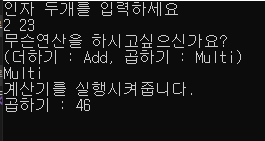
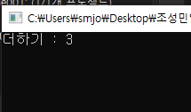
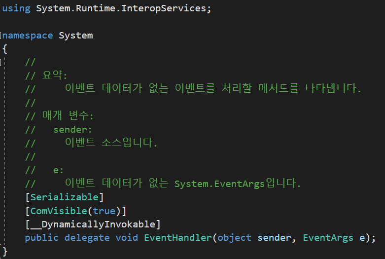
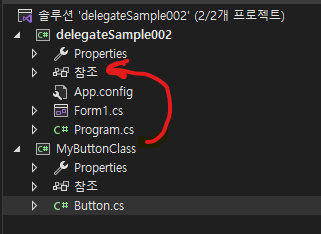
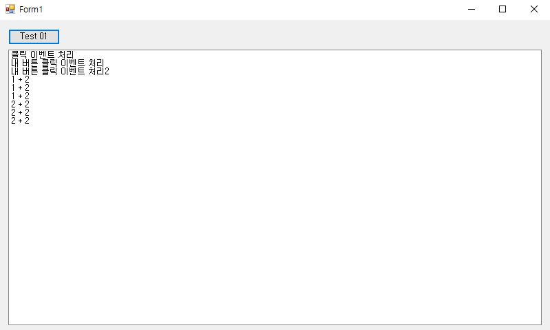

# 2. delegate(델리게이트)

델리게이트는 함수를 인자(파라미터) 로 받기 위해서 탄생했습니다. 파라미터로는 원래 int나 decimal이나 뭐 등등 클래스화 된것만 받는걸 썼는데, 파라미터값으로 함수를 받으면 생기는 이점이 있습니다. 

앞서 설명하자면 함수를 인자로 받을시 장점은 2가지정도를 예를들어 생각해 볼 수 있겠습니다. 첫째는 하나의 메서드가 여러번 호출당할때 그 메서드가 여러개의 메서드를 참조하고 있을때이고, 두번째는 여러사람이 일을 나누어서 메서드를 작성할 때 입니다. 이 외에도 사용을 고려해야 하는 이유들이 많습니다. 

먼저 계산기 프로그램을 만들어 보았습니다. 사용자로부터 2개의 인자를 받고 Add 또는 Multi값을 받습니다. 결과값으로 계산값을 화면에 보여줍니다. 아래와 같은 코드가 됩니다. 
```C#
namespace delegateSample001
{
    class Program
    {
        public delegate void DeleCalculation(int v1, int v2);
        static void Main(string[] args)
        {
            Console.WriteLine("인자 두개를 입력하세요");
            string[] input_value = Console.ReadLine().Split();
            Console.WriteLine("무슨연산을 하시고싶으신가요?\n(더하기 : Add, 곱하기 : Multi)");
            string input_calculate = Console.ReadLine();

            if (input_calculate == "Add")
            {
                Add(Int32.Parse(input_value[0]), Int32.Parse(input_value[1]));
            }
            else if (input_calculate == "Multi")
            {
                Multi(Int32.Parse(input_value[0]), Int32.Parse(input_value[1]));
            }

            Console.ReadKey();
        }

        static void Add(int value1, int value2)
        {
            Console.WriteLine($"더하기 : {value1 + value2}");
        }

        static void Multi(int value1, int value2)
        {
            Console.WriteLine($"곱하기 : {value1 * value2}");
        }
    }
}

```

그런데 위의 코드를 보고 추가하고 싶은 내용이 생겼습니다. 계산을 실행 할때마다 "계산기를 실행시켜줍니다" 라는 메세지를 추가하고 싶어졌습니다(실제로는 더 많은 기능 추가). 그래서 함수하나를 만들고 여기서 공통된 기능을 추가하고 파라미터값으로 덧셈 곱셈 메서드를 받게 됩니다. 

아래와같은 코드로 수정하면 얻게 되는 이점은 무엇이냐면, 일단 가령 if else문이 길어졌다 가정합니다. 그러면 그때마다 "계산기를 실행시켜줍니다"(실제로는 더 많은 기능 추가)를 추가해줘야합니다. 이를 줄여줄 수 있습니다. 따라서 만약 사람이 두명이고 프로그램을 만들어야 할때 한명은 Calculator같은 메서드들을 만들고 한명은 Add, Multi, ...등등 메서드들을 만들면 일이 편하게 됩니다. 

```C#
namespace delegateSample001
{
    class Program
    {
        public delegate void DeleCalculation(int v1, int v2);
        static void Main(string[] args)
        {
            Console.WriteLine("인자 두개를 입력하세요");
            string[] input_value = Console.ReadLine().Split();
            Console.WriteLine("무슨연산을 하시고싶으신가요?\n(더하기 : Add, 곱하기 : Multi)");
            string input_calculate = Console.ReadLine();

            if(input_calculate == "Add")
            {
                Calculator(Add, input_value);
            }
            else if(input_calculate == "Multi")
            {
                Calculator(Multi, input_value);
            }

            Console.ReadKey();
        }

        static void Calculator(DeleCalculation deleCalculate, string[] input_value)
        {
            Console.WriteLine("계산기를 실행시켜줍니다.");
            deleCalculate(Int32.Parse(input_value[0]), Int32.Parse(input_value[1]));
        }

        static void Add(int value1, int value2)
        {
            Console.WriteLine($"더하기 : {value1 + value2}");
        }

        static void Multi(int value1, int value2)
        {
            Console.WriteLine($"곱하기 : {value1 * value2}");
        }
    }
}

```
실행 결과 :



아래부터는 처음부터 delegate에 관해서 설명합니다. 

<br>
<br>
<br>

## 1). 일반적인경우

일반적인 함수 호출은 이런식일 것입니다. Main메서드에서 Add 함수를 가져옵니다. Add 메서드안에 파라미터 두개를 넣습니다.

```C#
namespace delegateSample001
{
    class Program
    {
        static void Main(string[] args)
        {
            Add(1, 2);

            Console.ReadKey();
        }

        static void Add(int value1, int value2)
        {
            Console.WriteLine($"더하기 : {value1 + value2}");
        }
    }
}

```

실행결과 :



<br>
<br>
<br>

## 2). delegate 사용

delegate 를 사용해보겠습니다. delegate는 클래스 안이나 밖에 상관없이 선언이 가능합니다. DeleCalculation을 선언해보겠습니다. 

delegate 선언방식은 이렇습니다. (한정자) delegate (형식) 델리게이트이름 ((형)파라미터1, (형)파라미터2, ...);

파라미터의 개수와 형식이 맞는 모든 메서드들을 받아줄 수 있습니다. 

```C#
namespace delegateSample001
{
    class Program
    {
        //델리게이트 선언 
        public delegate void DeleCalculation(int v1, int v2);

        static void Main(string[] args)
        {
           DeleCalculation Calc;
           Calc = Add;
           Calc += Multi;
           Calc(1, 2);

           Console.ReadKey();
        }

        static void Add(int value1, int value2)
        {
            Console.WriteLine($"더하기 : {value1 + value2}");
        }

        static void Multi(int v1, int v2)
        {
            Console.WriteLine($"곱하기 : {v1 * v2}");
        }
    }
}
```

실행결과 :


<br>
<br>
<br>

## 3). 언제 사용하지

아래 예제에서는 DeleCalculation 대리자를 선언했지만 Run() 메서드에서는 실제적으로 사용하지 않았습니다. 대신 Action<int, int> 를 사용했는데요. 이는 매번 대리자를 사용하려면 선언해야하는데 이름을 지어줘야합니다. 그리고 대리자 선언을 어디에 했는지 잘 모르게 되는데요. 이를 MS가 알고 미리 0부터 16개 까지 인자로 받아줄 수 있는 Action 델리게이트를 미리 System 라이브러리에 선언해놓았습니다. 아래 이것에 대해서 더 설명하겠습니다. 꺽쇠 안에 int는 제너릭 폼인것을 알 수 있습니다. 여튼 여기서는 메서드가! 메서드를! 파라미터로 받아서 사용하는것을 확인했습니다. 

```C#
namespace delegateSample001
{
    class Program
    {
        //델리게이트 선언 
        public delegate void DeleCalculation(int v1, int v2);

        static void Main(string[] args)
        {
            Run(Add);
            Run(Multi);

            Console.ReadKey();
        }

        static void Add(int value1, int value2)
        {
            Console.WriteLine($"더하기 : {value1 + value2}");
        }

        static void Multi(int v1, int v2)
        {
            Console.WriteLine($"곱하기 : {v1 * v2}");
        }

        static void Run(Action<int, int> deleValue)
        {
            deleValue(1, 2);
        }
    }
}
```

실행결과 :


<br>
<br>
<br>

## 4). 어디서 본듯한 delegate

네 사실 delegate는 이벤트와 같은 콜백기능을 가지고있다고 봐도 좋습니다 따라서 아래와같은 형식을 제일 많이 보게 됩니다. 아래 코드에서 사용한 EventHandler는 사실 MS가 미리 선언해둔 이벤트입니다. 이벤트는 = 델리게이트입니다만 차이가 있습니다.

```C#
namespace delegateSample001
{
    class Program
    {
        static void Main(string[] args)
        {
            EventHandler Calc = null;
            Calc += txtBox_Clicked;
            Calc(new object(), new EventArgs());

            Console.ReadKey();
        }

        static void txtBox_Clicked(object s, EventArgs e)
        {
            Console.WriteLine($"이벤트 처리");
        }
    }
}
```

실행결과 :


먼저 EvnetHandler 에 대해서 좀 알아보자면 아래와 같이 선언되어있습니다.



바로 위 사진을 보면 public delegate void EventHandler(object sender, EventArgs e);로 선언되어있는것을 볼 수 있습니다. 따라서 등록해주는 함수(본인의 함수)의 파라미터도 첫번째는 object형이고 두번째는 EventArgs이어야 합니다. 용어정리를 하자면, 콜백 메서드는 본인의 메서드입니다. 등록해주는 메서드 = 콜백 메서드 입니다. 이벤트던 델리게이트(대리자)던 콜백메서드를 호출하고 콜백메서드가 일을하게 만듭니다. 따라서 위의 콜백 메서드는 txtBox_Clicked() 가 되겠습니다. 

delegate와 event의 차이라면 델리게이트는 자신의 하는 일을 하는 도중에도 콜백메서드를 호출하고 콜백 메서드가 리턴하는 리턴값을 가지고 계산을하던 뭘하던 자신이 하고싶은일을 하지만, 이벤트는 무조건 void형 콜백 메서드를 받고 자신의 할 일을 다 마친후에 마지막에 콜백 메서드를 호출한다는 차이점이 있습니다. 

<br>
<br>
<br>

## 5). 이벤트

먼저 솔루션 하위 프로젝트 구조입니다. MyButtonClass프로젝트를 delegateSample002가 참조하고있습니다.



아래는 폼 클래스입니다.

```C#
using System;
using System.Collections.Generic;
using System.ComponentModel;
using System.Data;
using System.Drawing;
using System.Linq;
using System.Text;
using System.Threading.Tasks;
using System.Windows.Forms;

namespace delegateSample002
{
    public partial class Form1 : Form
    {
        MyButtonClass.Button btn001 = new MyButtonClass.Button();
        public Form1()
        {
            InitializeComponent();
            btnTest01.Click += BtnTest01_Click;
            
            btn001.Clicked += Btn001_Clicked;
            btn001.Clicked2 += Btn001_Clicked2;
        }

        private void BtnTest01_Click(object sender, EventArgs e)
        {
            lstBox.Items.Add("클릭 이벤트 처리");
            btn001.OnClick();

            btn001.CallBackTest01(Add);
            btn001.CallBackTest01((v1, v2) => { lstBox.Items.Add($"{v1} + {v2}"); });
            btn001.CallBackTest01(delegate (int v1, int v2) { lstBox.Items.Add($"{v1} + {v2}"); });
            btn001.CallBackTest02(Add, 2, 2);
            btn001.CallBackTest02((v1, v2) => { lstBox.Items.Add($"{v1} + {v2}"); }, 2, 2);
            btn001.CallBackTest02(delegate (int v1, int v2) { lstBox.Items.Add($"{v1} + {v2}"); }, 2, 2);
        }

        private void Btn001_Clicked(object sender, EventArgs e)
        {
            lstBox.Items.Add("내 버튼 클릭 이벤트 처리");
        }

        private void Btn001_Clicked2(object arg1, EventArgs arg2)
        {
            lstBox.Items.Add("내 버튼 클릭 이벤트 처리2");
        }

        private void Add(int v1, int v2)
        {
            lstBox.Items.Add($"{v1} + {v2}");
        }
    }
}

```

<br>

MyButtonClass 네임스페이스 하위 Button.cs입니다. 

```C#
using System;
using System.Collections.Generic;
using System.Linq;
using System.Text;
using System.Threading.Tasks;

namespace MyButtonClass
{
    public class Button
    {
        public event EventHandler Clicked;

        public delegate void DeleCall(int v1, int v2);
        public event Action<object, EventArgs> Clicked2;
        public void OnClick()
        {
            if (Clicked != null)
                Clicked(this, new EventArgs());

            if (Clicked2 != null)
                Clicked2(this, new EventArgs());
        }

        public void CallBackTest00(DeleCall delCall)
        {
            delCall(1, 2);
        }

        public void CallBackTest01(Action<int, int> delCall)
        {
            delCall(1, 2);
        }

        public void CallBackTest02(Action<int, int> delCall, int v1, int v2)
        {
            delCall(v1, v2);
        }
    }
}

```

실행 결과 :



## 6). MS 제공 델리게이트

(아래 3가지보다 더있습니다.)
1. Action\<T> Delegate
2. Func\<T, TResult> Delegate
3. Predicate\<T> Delegate

Action\<T> Delegate 에 관해서입니다. 하나의 파라미터를 받는데 리턴값이 없습니다. 따라서 Action\<T> 에 함수를 작성해서 등록을 해줄텐데 그 작성한 함수에는 return 자체가 있으면 안됩니다. 따라서 형식은 무조건 void형식입니다. 또한 파라미터는 0개부터 16까지 넣어줄 수 있는데 이거는 System 네임스페이스에서 마이크로소프트사가 미리 일일히 다 만들어 놓은것입니다. Action, Action\<T>, Action\<T1, T2>, Action\<T1, T2, T3>...... 이런식으로 미리 만들어놨습니다.

```
input 파라미터 0개  -> Action<T>
input 파라미터 1개  -> Action<T(input), T(input)>
input 파라미터 2개  -> Action<T(input), T(input), T(input)>
input 파라미터 3개  -> Action<T(input), T(input), T(input), T(input)>
.
.
.
```

Func\<T> Delegate 에 관해서 설명하겠습니다. Action\<T>와는 다르게 리턴값이 존재합니다. 리턴값을 무조건 등록해주는 함수에 작성해줘야합니다. 따라서 Func\<T> 는 있어도 Func는 없습니다. 리턴값을 위한 파라미터 를 넘겨야 하기 때문에 파라미터 한개는 무조건 리턴값입니다. Func\<T> 도 Action\<T>처럼 파라미터 인자로 0부터 16개 까지 받을 수 있습니다. 
가령 예를들어 등록하는 함수의 파라미터를 0개부터 3개 를 등록받는 Func\<T>를 정의하자면 아래와같이됩니다.

```
input 파라미터 0개  -> Func<T(return)>
input 파라미터 1개  -> Func<T(input), T(return)>
input 파라미터 2개  -> Func<T(input), T(input), T(return)>
input 파라미터 3개  -> Func<T(input), T(input), T(input), T(return)>
.
.
.
```

마지막으로 Predicate\<T> Delegate에 대해서 알아봅니다. 위 두개의 delegate와는 다르게 리턴값이 무조건 bool 형식이어야 합니다. 위의 Action과 Func와는 달리 입력파라미터는 1개입니다. 입력파라미터의 개수는 1개만 가능합니다. 리턴값을 파라미터에 넣지는 않습니다. 따라서 모양은 Predicate\<T>만이 유일합니다. 

```
input 파라미터 무조건 1개 -> Predicate\<T(input)> 
```