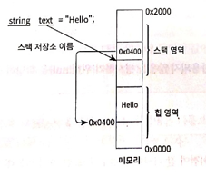

# 스택과 힙

Call-by-Reference 와 Call-by-Value를 정확히 알아둘 필요가 있습니다. 그전에 C#의 스택과 힙에 값이 어떻게 들어가는지를 이해해야 합니다. 

값/참조 형식의 차이점을 이해하려면 스택과 힙을 이해할 필요가 있습니다. 윈도우 프로그램은 기본적으로 하나의 스레드를 가집니다. 그리고 개별 스레드마다 전용으로 사용할 수 있는 장소가 메모리에 할당되는데 그 영역을 스택이라고 합니다. 반면 힙은 프로그램에서 필요에 의해 메모리를 사용하겠다고 요청했을 때 사용할 수 있는 저장소 입니다 특별히 닷넷에서는 CLR이 직접 프로그램에서 사용될 힙을 관리합니다. 

일반적으로 메모리를 사용한 후에는 그것을 더는 사용하지 않겠다는 표현이 필요합니다. 즉 시스템으로부터 메모리를 할당 받았으면 그것을 해제할 수도 있어야 합니다. 할당만 하고 헤제를 하지 않으면 유한한 자원인 메모리는 일정 시간 후에는 더는 사용할 영역이 남아있지 않아 프로그램의 실행과정에서 오류가 발생합니다. 

개발자 입장에서 스택은 변수를 선언하는 것 자체만으로 스택 내의 특정 메모리 영역을 사용할 수 있게 C# 컴파일러에 의해 자동할당 및 헤재됩니다. 따라서 스택의 메모리를 할당하고 헤제하는 것은 걱정 ㄴㄴ. 하지만 힙에 메모리를 할당하는 것은 개발자가 명시적으로 요청한 것이므로 헤제과정이 필요합니다. 바로 이 해제 과정에서 네이티브 환경과 관리 환경이 구분됩니다. 기존의 네이티브 환경에서는  C/C++ 언어 등으로 프로그램을 만들면 메모리 할당과 해제를 반드시 쌍으로 맞춰야만 했습니다. 반면 C#프로그램환경에는 오직 할당만 하고 해제는 관리환경 내의 특정 구성요소가 담당합니다(가비지 컬렉터).

## 값 형식을 가리키는 변수

"값 형식"을 가리키는 변수의 경우 "값" 자체가 스택 영역에 할당되고 변수는 그 메모리를 가리키는 프로그램 내의 식별자입니다. 아래 그림에서 숫자 5는 스택에 저장됩니다. 이러한 "값 형식"에 속한 것으로는 sbyte, byte, char, short, ushort, int, uint, long, ulong, float, double, decimal, bool 이 있습니다.


## 참조 형식을 가리키는 변수

"참조 형식" 에는 string, 배열, 클래스, object 등이 있습니다. 

변수의 경우 "값 형식"과 "참조 형식"의 유일한 차이점은 바로 "값"을 스택에 저장하느냐 힙에 저장하느냐에 있습니다. 앞서 설명한 대로 "값 형식"은 그 변수의 타입에 해당하는 값을 스택에 저장하지만 "참조 형식"을 위한 변수는 그 값을 담기 위해 별도로 힙 영역의 메모리를 할당하고, 스택의 변수 값은 다시 힙의 데이터 주소를 가리키게 됩니다. 



그렇다면 값을 할당하지 않은 string 변수는 어떤 값을 갖게 될까요?

```C#
string text;
```

위의 경우에는 스택 변수의 값이 숫자 0을 담고 있습니다. 즉, 가리킬 수 있는 힙 주소가 없는 것입니다. 하지만 참조형 변수의 경우 숫자 0을 대입할 수는 없으므로 이럼 목적으로 C#은 특별하게 null예약어를 준비해뒀습니다. 따라서 아래의 두가지 스택 변수는 동일하게 숫자 0을 담고있게 됩니다. 

```C#
string text1;
string text2 = null;
```

즉, 초기화 되지 않은 모든 참조형 변수는 null 값을 가집니다. 


또는 참조형 변수가 더는 사용되지 않음을 명시하기 위해 null을 할당하기도 합니다.

```C#
string name = "C#";
name = null;
```

값 형식과 참조 형식의 차이점을 잘 나타내는 경우가 또 한가지 있는데, 바로 변수의 값을 또 다른 변수에 대입했을 때 입니다. 

```C#
int n1 = 5;
int n2 = n1;

Console.WriteLine(n1);
Console.WriteLine(n2);

string txt1 = "C#";
string txt2 = txt1;

Console.WriteLine(txt1);
Console.WriteLine(txt1);
```

n1과 n2 가 같은 값이고, txt1과 txt2 역시 같은 값을 출력하지만 값 형식과 참조 형식에 따라 메모리의 표현 방식은 다음과 같이 서로 다릅니다. 


차이를 아시겠나요? 값 형식의 n1, n2는 스택의 각각 다른 위치에 동일한 값이 복사돼 개별 값을 가리키는 반면, 참조 형식의 txt1, txt2는 힙 메모리에 하나의 값만 위치한 상태에서 스택의 변수 값이 같은 힙 위치를 가리킵니다. 

어째서 값 형식과 참조 형식으로 나눴는지에 대한 구체적인 설명은 나중에합니다. 위의 특징을 꼭 기억해두세요 'ㅁ'~~!