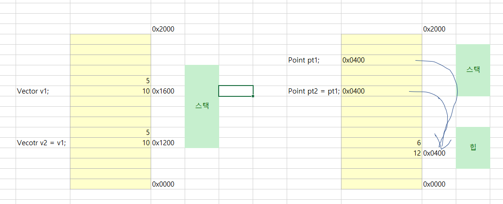

# 구조체 

기본 타입에서 숫자형과 char, bool 타입이 값 형식에 속합니다. 참조 형식은 string, object와 class로 정의 되는 모든 타입이 포함됩니다. 그런데 값 형식에도 class처럼 사용자 정의 형식을 둘 수는 없을까요? 이에 대한 해답이 바로 구조체(struct) 입니다. 

구조체는 클래스를 정의하는 문법과 매우 유사합니다. 단지 class예약어를 struct예약어로 대체한다는것과 함께 다음의 차이점이 있을 뿐입니다. 

1. 인스턴스 생성을 new로 해도 되고, 안해도 됩니다.
2. 기본 생성자는 명시적으로 정의할 수 없습니다. 
3. 매개변수를 갖는 생성자를 정의해도 기본 생성자가 C#컴파일러에 의해 자동으로 포함됩니다. (클래스의 경우에는 포함되지 않습니다.)
4. 매개변수를 받는 생성자의 경우, 반드시 해당 코드 내에서 구조체의 모든 필드에 값을 할당해야 합니다. 

따라서 다음과 같이 struct를 정의해서 사용할 수 있습니다.

```C#
usnig System;

namespace ConsoleApp1
{
    struct Vector
    {
        public int X;
        public int Y;

        public Vector(int x, int y) //매개변수를 가진 생성자를 정의
        {
            this.X = x;
            this.Y = y;
        }

        public override string ToString() //System.Object의 ToString을 재정의
        {
            return "X: " + X + ", Y = " + Y;
        }        
    }

    class Program
    {
        static void Main(string[] args) 
        {
            Vector v1 = new Vector(); // new 를 사용해 인스턴스 생성가능
            Vector v2;                // new 가 없어도 인스턴스 생성가능
            
            Vector v3 = new Vector(5, 10); //명시적으로 생성자 지정 가능

            Console.WriteLine(v3);
        }
    }
}
```

구조체 인스턴스를 new로 생성하는 것은 어떤 의미가 있을까요? 값 형식의 변수를 new로 생성하면 해당 변수의 모든 값을 0으로 할당하는 것과 동일한 효과를 갖습니다. 따라서 다음의 v1, v2, v3변수는 같은 의미의 서로 다른 표현일 뿐입니다. 

```C#
Vector v1 = new Vector();

Vector v2;
v2.X = 0;
v2.Y = 0;

Vector v3 = new Vector(0, 0);
```

이 규칙은 구조체에만 해당하는것이 아닙니다. 기본형도 동일하게 new로 할당할 수 있는데, 이 역시 같은 방식으로 해석될 수 있습니다. 

```C#
//n1, n2, n3는 같은 표현
int n1 = new int();

int n2;
n2 = 0;

int n3 = 0;
```

그런데 여기서 한가지 의문을 갖을 수 있습니다. 앞에서 값 형식의 변수를 다루면서 값 형식에 속하는 모든 타입은 기본적으로 메모리 상태가 0으로 초기화 된다는것을 알았습니다. 그렇다면 개발자가 값을 명시적으로 할당하든 하지 않든 new로 생성한 인스턴스와 같은 상태일 텐데 왜 굳이 명시적으로 0을 할당해야 하는 것일까요? 이는 C#컴파일러의 규칙으로 발생하는 차이점 때문입니다. C#컴파일러는 개발자가 직접 코드 상에서 값을 할당하지 않는 변수를 사용하는 것을 "오류"라고 판단합니다. 이 떄문에 다음 코드는 C#컴파일러가 빌드할때 오류를 냅니다.

```C#
int n; // n은 0의 값을 갖지만 개발자가 할당한것은 아니다. 

Console.WriteLine(n);// 컴파일 오류~!
```

클래스를 잘 공부했다면 구조체는 덤입니다. 하지만 구조체가 클래스와 너무 유사하다보니 그 둘의 차이를 간과할 때가 종종 있습니다. 클래스는 참조형이고 구조체는 값 형식인점을 잊어서는 안됩니다. 

<br />

## 깊은 복사와 얕은 복사

값 형식과 참조 형식의 결정적인 차이점은 인스턴스의 대입이 일어날 때 뚜렷해집니다. 가령 다음과 같은 두가지 사용자 정의 타입이 있고

```C#
struct Vector
{
    public int X;
    public int Y;
}

class Point
{
    public int X;
    public int Y;
}
```

이를 각각 사용하는 경우를 예로 들어보겠습니다.

```C#
Vector v1;

v1.X = 5;
v1.Y = 10;

Vector v2 = v1; //값 형식에 대입

Point pt1 = new Point();
pt1.X = 6;
pt1.Y = 12;

Point pt2 = pt1; //참조 형식의 대입
```

Vector구조체는 값 형식이고 Point클래스는 참조 형식입니다. v1과 pt1이 대입된 v2, pt2의 변수 상태는 어떻게 변할까요? 아래와 같이 변합니다. 



그림에서는 구조체는 인스턴스가 가진 메모리 자체가 복사되어 새로운 변수에 대입되는 것을 볼 수 있는데 이를 다른 말로 깊은 복사(deep copy)라고 합니다. 반면 참조 형ㅅ기의 변수가 대입되는 방식을 일걸어 얕은 복사(shallow copy)라고 합니다. 

깊은 복사와 얕은 복사의 차이점은 다음의 코드를 통해 더욱 확연하게 나타납니다.

```C#
Vector v1;

v1.X = 5;
v1.Y = 10;

Vector v2 = v1; //값 형식의 대입은 인스턴스의 메모리 자체가 복사됨.

v2.X = 7;
v2.Y = 14;

Console.WriteLine("v1: X = " + v1.X + ", Y = " + v1.Y);
Console.WriteLine("v2: X = " + v2.X + ", Y = " + v2.Y);

//출력결과

//v1: X = 5, Y = 10
//v2: X = 7, Y = 14
```

v1의 값을 v2에 대입한 것은 메모리 상에서 깊은 복사가 일어나고 v2는 새로운 인스턴스를 가리키게 됩니다. 따라서 v2의 값을 바꿔도 그 변화가 v1과는 전혀 무관하게 이뤄집니다. 하지만 얕은 복사가 일어나는 참조형식은 다른 결과를 냅니다.

```C#
Point pt1;

pt1.X = 5;
pt1.Y = 10;

Point v2 = v1; //값 형식의 대입은 인스턴스의 메모리 자체가 복사됨.

pt2.X = 7;
pt2.Y = 14;

Console.WriteLine("pt1: X = " + pt1.X + ", Y = " + pt1.Y);
Console.WriteLine("pt2: X = " + pt2.X + ", Y = " + pt2.Y);

//출력결과

//pt1: X = 7, Y = 14
//pt2: X = 7, Y = 14
```

pt1과 pt2는 같은 메모리상의 인스턴스를 가리키고 있으므로 둘 중 어느 하나라도 해당 필드의 값을 변경하면 변수의 결괏값이 함께 변경된 것 처럼 보입니다.

이런 규칙은 메서드에 인자로 넘길 때도 동일하게 적용됩니다. 다음은 값 형식을 Change메서드에 인자로 전달한 결과를 보여줍니다. 

```C#
static void Main(string[] args)
{   
    Vector v1;

    v1.X = 5;
    v1.Y = 10;

    Change(v1); //메서드 호출 후 v1의 값에는 변함이 없음.
    Console.WriteLine("v1: X = " + v1.X + ", Y = " + v1.Y);
}

private static void Change(Vector vt)
{
    vt.X = 7;
    vt.Y = 14;
}
```

값 형식의 v1인스턴스는 메서드로 전달 될 때 복제되어 또 다른 인스턴스가 생성되고 해당 인스턴스를 새롭게 vt변수가 가리킵니다. 따라서 Change메서드 내에서 vt의 변수 값을 변경하는 것은 원래의 v1변수에 영향을 미치지 않습니다. 반면 참조형식이라면 바뀌게 되겠죠.

```C#
static void Main(string[] args)
{   
    Point pt1;

    pt1.X = 5;
    pt1.Y = 10;

    Change(pt1); //메서드 호출 후 pt1 값에는 변함.
    Console.WriteLine("pt1: X = " + pt1.X + ", Y = " + pt1.Y);
}

private static void Change(Point pt)
{
    pt.X = 7;
    pt.Y = 14;
}
```

pt1과 pt변수는 동일한 인스턴스를 가리킵니다. 즉, 메서드에 넘겨지는 것은 변수가 가진 참조 주소일 뿐입니다. 이 때문에 메서드에서 값을 변경하면 그 영향이 메서드를 호출한 측의 참조 변수에도 미칩니다. 

깊은 복사의 장점은 값의 변경에 대한 간섭을 일으키지 않음으로써 개발자가 당연히 원했던 동작을 한다는 것입니다. 이말은 곧 참조 주소만을 전달함으로서 때때로 원치 않는 값의 변경이 발생하는 얕은 복사의 단점을 설명해줍니다. 하지만 때로는 그런 깊은 복사의 장점이 단점으로 바뀔 수 있습니다. 예를들어, 구조체가 내부에 많은 필드를 담게 되어 크기가 1,024바이트까지 커졌다고 가정합니다. 해당 구조체 변수를 메서드에 전달할 때마다 컴퓨터는 1KB의 메모리 영역을 매번 복사하는 작업을 해야 한다는 부담이 생깁니다. 반면 그와 같은 내용을 클래스로 정의했다면 메서드를 호출 할 때마다 참조 주솟값만 복사하면 되므로 구조체와 비교해 월등한 성능향상을 가져옵니다. 

구조체와 클래스를 선택하는 기준을 알아봅니다.

1. 일반적으로 모든 사용자 정의 타입은 클래스로 구현합니다.
2. 깊은/얕은 복사의 차이가 민감한 타입은 선택적으로 구조체로 구현합니다. 
3. 참조 형식 GC에 부담을 주는데 이런상황을 피해야 하는경우 구조체를 선택합니다. 