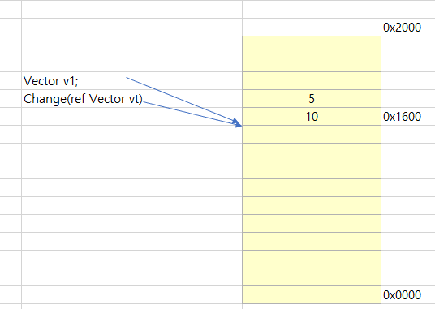
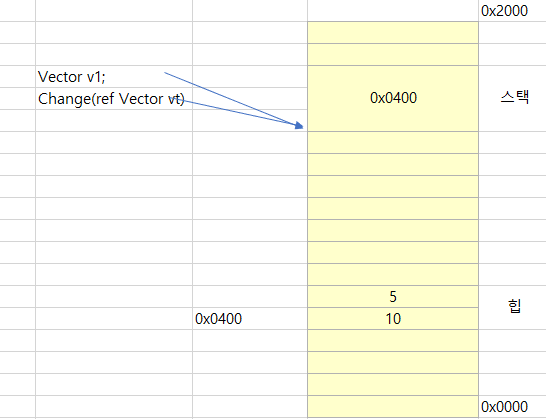
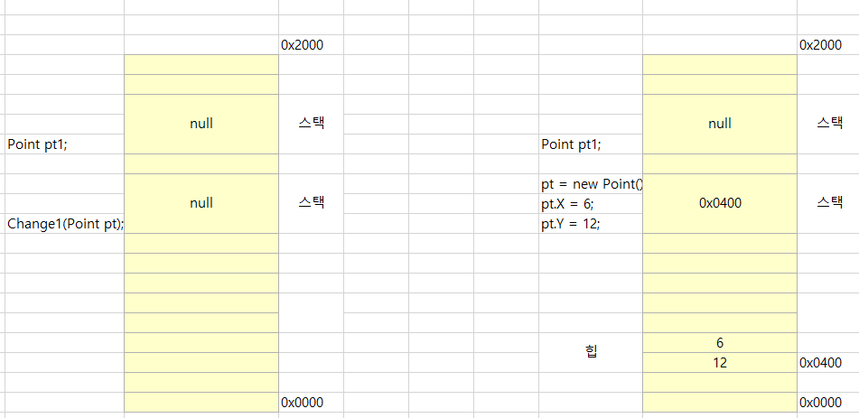

# ref/out 예약어

<br />

## 1. ref 예약어

얕은 복사와 깊은 복사의 동작 방식에 공통점이 하나있는데 다름아닌 변수의 스택값은 여전히 복사된다는 점입니다. 값 형식의 변수는 해당 변수가 실제 값을 기리키고 있고, 따라서 그 값이 복사되어 전달됩니다. 반면 참조 형식의 변수는 힙에 존재하는 실제 데이터의 주솟값을 가리키고 있으며 따라서 그 주솟값이 복사되어 전달됩니다.

이렇게 "변수의 스택값" 이 복사되는 상황을 특별히 메서드의 인자 전달과 관련해 값에 의한 호출(CBV: call by value)라고 합니다.

이와 구분해서 참조에 의한 호출(CBR: call by reference)라는 방법도 있습니다. 이 방식으로 메서드에 인자를 전달하면 변수의 스택 값이 복사되는 것이 아니라 해당 변수의 스택 값을 담고 있는 주소 자체가 전달 됩니다. C#에서는 "참조에 의한 호출"을 지원하기 위해 두가지 예약어를 추가했는데 바로 ref 와 out입니다.

"참조에 의한 호출" 이 어떤 의미를 갖는지 ref예약어를 사용한 예제와 함께 알아봅시다. ref예약어는 두 군데에서 사용해야 하는데

1. 메서드의 매개변수를 선언할 때 함께 표기해야 하고
2. 해당 메서드를 호출하는 측에서도 명시해야 합니다.

다음은 값 형식의 구조체에 ref예약어를 사용한 예제인데 출력 결과를 자세히 볼 필요가 있습니다.

```C#
static void Main(string[] args)
{
    //Vector는 구조체
    Vector v1;

    v1.X = 5;
    v1.Y = 10;

    Change(ref v1); //메서드 호출 시 ref예약어 사용
    Console.WriteLine("v1: X = " + v1.X + ", Y = " + v1.Y);
}

static void Change(ref Vector vt)  // 메서드 측에도 해당 매개변수에 ref예약어 사용
{
    vt.X = 7;
    vt.Y = 14;
}
```

```
//출력결과 
//v1: X = 7, Y = 14
```

얼핏 보면 ref예약어는 구조체를 클래스처럼 "얕은 복사"로 전달한 것과 동일한 효과를 냅니다. 하지만 얕은 복사와 ref예약어는 분명하게 동작 방식에 차이가 있습니다. ref를 사용하지 않았을 때는 전형적인 값 형식의 스택 복사가 있었지만, 이를 사용하게 되면 메서드의 vt 변수가 호출 측의 v1변수와 동일한 주소를 가리키게 됩니다. 다음은 ref를 사용하는 예를 보여줍니다.



기존의 얕은 복사와 깊은 복사는 변수의 스택 값이 복사되어 전달 됬지만 위의 그림에서는 v1변수가 가리키고 있는 데이터의 주솟값(0x1600)이 vt에도 그대로 전달되어 결국 같은 메모리의 주소를 가리키는 것을 볼 수 있습니다. ref 예약어는 참조형 변수에도 사용할 수 있습니다. 그런데 값 형식에 대해 얕은 복사 효과를 내는 ref예약어가 참조형 변수에 대해서는 어떤 동작을 하는걸까요? 아래 그림을 보면 해답을 알 수 있습니다. 



위의 그림을 보면 참조형 변수가 ref예약어 때문에 동작 방식이 달라졌음을 알 수 있습니다. 하지만 일반적인 예제로는 그 차이를 느낄 수 없습니다. 

```C#
static void Main(string[] args)
{   
    //Point는 클래스
    Point pt1 = new Point();

    pt1.X = 5;
    pt1.Y = 10;

    Change1(pt1); //메서드 호출 : 얕은 복사
    Console.WriteLine("pt1: X = " + pt1.X + ", Y = " + pt1.Y);

    Change2(ref pt1); //메서드 호출 : ref 사용
    Console.WriteLine("pt1: X = " + pt1.X + ", Y = " + pt1.Y);

    //둘의 출력은 동일합니다.
}

private static void Change1(Point pt) // 얕은 복사
{
    pt.X = 6;
    pt.Y = 12;
}

private static void Change2(ref Point pt) //ref를 이용한 참조에 의한 호출
{
    pt.X = 7;
    pt.Y = 14;
}
```
```
//출력결과
//pt1 : X = 6, Y = 12
//pt1 : X = 7, Y = 14
```

따라서 효과를 구분하기 위해서는 좀더 특수한 상황이어야 합니다. 

```C#
static void Main(string[] args)
{   
    //Point는 클래스
    Point pt1 = null;
    Change1(pt1); //메서드 호출 : 얕은 복사
    Console.WriteLine("pt1: X = " + pt1.X + ", Y = " + pt1.Y);

    Change2(ref pt1); //메서드 호출 : ref 사용
    Console.WriteLine("pt1: X = " + pt1.X + ", Y = " + pt1.Y);
}

private static void Change1(Point pt) // 얕은 복사
{
    pt = new Point();

    pt.X = 6;
    pt.Y = 12;
}

private static void Change2(ref Point pt) //ref를 이용한 참조에 의한 호출
{
    pt = new Point();

    pt.X = 7;
    pt.Y = 14;
}
```

```
//출력결과
//pt1 : 
//pt1 : X = 7, Y = 14
```

Change1 메서드와 Change2 Change2메서드의 호출 결과가 왜 달라지는지 역시 그림으로 설명하면 확실히 알 수 있습니다. Change1 메서드를 호출하면 참조값이 또 다른 메모리에 복사되어 전달 되므로 메서드 내에서의 new메모리 할당이 원래의 pt1변수에 영향을 미치지 않습니다. 



하지만 ref예약어와 함께 전달하는 경우에는 결과가 달라집니다. pt1변수의 스택 주솟값이 직접 전달되므로 pt1과 pt변수는 같은 곳을 가리키게 되고 Change2의 메서드 내에서의 new할당이 그대로 원본 pt1변수에도 반영됩니다.


구조체와 클래스가 아닌 기본 자료형에도 "참조에 의한 호출"을 사용할 수 있습니다. 예를들어, 다음예제는 ref예약어를 사용해 메서드를 호출한 측의 두 변수의 값을 바꾸는 동작을 보여줍니다. 

```C#
static void Main(string[] args) 
{
    int value1 = 5;
    int value2 = 10;

    SwapValue(ref value1, ref value2);

    Console.WriteLine("value1 == " + value1 + ", value2 == " + value2);
}

private static void SwapValue(ref inte value1, ref int value2) 
{
    int temp = value1;
    value1 = value2;
    value2 = temp;
}
```

마지막으로 메서드에 ref인자로 전달되는 변수는 호출하는 측에서 반드시 값을 할당해야만 한다는것을 알아둡시다. 할당될 값으로는 null이든 new든 상관없이 어떤 값이든 개발자가 지정하기만 하면 됩니다.

```C#
int value1; // 값이 없으므로 ref인자로 전달 할 수 없음
string text = null //null값을 가지므로 ref인자로 전달 가능
int value2;
value2 = 5; //메서드 호출전에 값을가진다면 ref인자로 전달 가능

Vector vt;
vt.X = 5; // X, Y가 포함된Vector구조체에 Y 값이 초기화 되지 않았으므로 ref인자로 부적절

Vector vt2 = new Vector(); //X, Y필드가 0으로 초기화됬으므로 ref인자로 전달 가능
```

## out 예약어

참조에 의한 호출을 가능케 하는 또 하나의 예약어가 out입니다. 하지만 out은 ref 와 비교했을때 몇 가지 차이점이 있습니다. 

1. out으로 지정된 인자에 넘길 변수는 초기화 되지 않아도 됩니다. 초기화 돼 있더라도 out인자를 받는 메서드에서는 그 값을 사용할 수 없습니다. 
2. out으로 지정된 인자를 받는 메서드는 반드시 변수에 값을 넣어서 반환해야 합니다. 

사실 out예약어가 사용되는 곳에 ref예약어를 사용해 구현하는 것도 가능합니다. 즉, out예약어는 ref예약어의 기능 가운데 몇 가지를 강제로 제한함으로써 개발자가 좀 더 특별한 용도로 사용하게끔 일부러 제공된것입니다. 어떨때가 사용할때 적합할까요?

예를들어, 메서드는 단 1개의 반환값만 가질 수 있지만 out으로 지정된 매개변수를 사용함으로써 여러개의 값을 반환할 수 있습니다. 한 예로 나눗셈을 수행하는 메서드를 구현해봅니다. 특이하게도 사칙 연산 가운데 오직 나눗셈만이 제약이 하나있는데 그것은 절대로 분자를 0으로 나눌 수 없다는 규칙이빈다. 따라서 나눗셈을 구현하는 메서드가 있다면 분모가 0인 경우에 대해 나눗셈 결과를 따로 반환하도록 코드를 작성해야 합니다. 

```C#
int Divide(int n1, int n2) 
{
    if(n2 == 0 ) 
    {
        return 0;
    }

    return n1/n2;
}
```

얼핏 보면 위의 메서드가 타당할 것 같지만 0으로 나올 수 있는 올바른 연산결과가 있다는 점을 감안 했을때 분모가 0인 경우도 동일한 값을 반환하는 것은 분명 잘못된 구현입니다. 이를 더 나은 코드로 개선하려면 나누기를 할 수 있는지 여부를 함께 불린형으로 반환해야 합니다. 이때 구조체를 통해 이를 구현 할 수 있습니다.

```C#
struct DivideResult
{
    public bool Success;
    public int Result;
}

DivideResult Divide(int n1, int n2)
{
    DivideResult ret = new DivideResult();

    if(n2 == 0)
    {
        ret.Success = false;
        return ret;
    }

    ret.Success = true;
    ret.Result = n1/n2;
    return ret;
}
```

하지만 확실히 코드가 지저분해보입니다. 이런 상황을 out예약어로 개선하면 깔끔해집니다.

```C#
bool Divide(int n1, int n2, out int result) 
{
    if (n2 == 0)
    {
        result = 0;
        return false;
    }

    result = n1/n2;
    return true;
}

//Divide 메서드 사용예제 

int quotient;
if(Divide(15, 3, out quotient) == true)
{
    Console.WriteLine(quotient); //출력결과 : 5
}
```

out예약어가 "참조에 의한 호출"로 값을 넘기지 않는다면 위와같은 구현은 가능하지 않습니다. out으로 지정된 result변수는 메서드가 return하기 전에 반드시 초기화돼 있어야 합니다. 만약 5번째 줄의 result = 0;을 제거하면 C#컴파일러는 6번줄의 return 시점에 초기화가 되지 않았다는 이유로 빌드할때 오류를 냅니다. 

이와 유사한 용도로 닷넷 프레임워크에서는 각 기본 타입에 TryParse라는 메서드를 제공합니다. 

```C#
//System.Int32 타입에 정의된 TryParse정적 메서드
public static bool TryParse(string s, out int result);
```

이 메서드는 변환이 성공했는지 여부를 true/false로 반환하고, 변환이 성공했다면 out으로 지정된 result변수에 값을 반환합니다. 

```C#
//예시
int n;
if(int.TryParse("1234567", out n) == true)
{
    Console.WriteLine(n);
}
```

TryParse와 System.Object로부터 재 정의된 ToString은 문자열과 타입간의 변환에 있어 쌍을 이룹니다. 가령 다음과 같이 타입을 문자열로 변환하고, 그로부터 값을 복원하는 것이 가능합니다.

```C#
int n = 500;
string txt = n.ToString();//int 형 값을 문자열로 반환
int result;
int.TryParse(txt, out result); //문자열로부터 int형 값을 복원
```

이 원리를 이용하면 타입의 값을 프로그램 외부에 저장하고 복원할 수 있습니다~!!

ref와 out을 정리해봅니다. ref 는 메서드를 호출하는 측에서 변수의 값을 초기화함으로써 메서드 측에 의미있는 값을 전달합니다. 반면 out은 메서드 측에서 반드시 값을 할당해서 반환함으로써 메서드를 호출한 측에 의미 있는 값을 반환합니다. 하지만 ref도 out처럼 참조에 의한 전달이기 때문에 메서드 측에서 의미있는 값을 호출하는 측에 전달 할 수 있습니다. 

ref와 out의 특성을 IN, OUT이라는 표현으로 간단하게 나타내기도 합니다. ref는 값을 메서드 측에 전달(IN)하고 전달받기(OUT)도 하기 때문에 [IN, OUT] 특성을 띤다고 합니다. 반면 out은 메서드 측으로부터 전달받기(OUT만 가능하므로 [OUT]특성을 띱니다.
