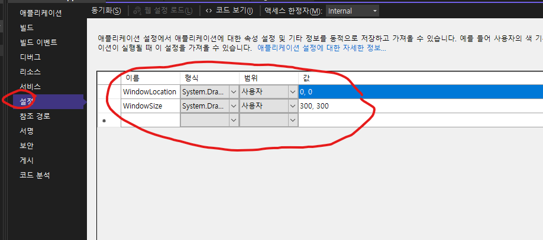
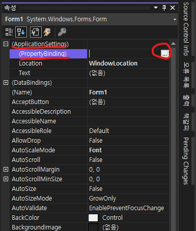
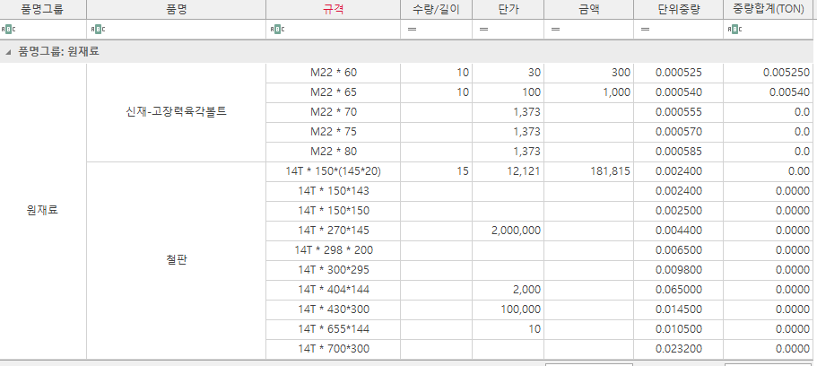

# 목차

1. [컨트롤 공통속성](#컨트롤-공통속성)
2. [GridControl](#gridcontrol)
3. [SpreadSheetControl](#spreadsheetcontrol)
4. [DateEditControl](#dateeditcontrol)
5. [TextEditControl](#textedit)

<hr />
<br />
<br />
<br />

# 컨트롤 공통속성

1. ApplicationSettings
2. DataBindings
3. AllowDrop
4. AllowHtmlTextInToolTip
5. CausesValidation
6. EnterMoveNextControl
7. GenerateMember
8. ImeMode
9. Menumanager
10. StyleController
11. SuperTip
12. TabIndex
13. TabStop
14. Tag
15. ToolTipAnchor
16. ToolTipController
17. UseWaitCursor

<hr />
<br />

## 1. ApplicationSettings

이 속성은 모든 컨트롤에 있는 속성인데 사용자가 값을 바꾸면 셋팅값으로 저장했다가 다시 불러오는 기능입니다. 쉽게 설명하자면 윈도우 사이즈를 사용자가 줄이거나 늘렸을때 프로그램을 끄고 다시키면 사용자가 설정한 값을 다시 불러오는 기능입니다. 물론 이건 하나의 예시고 다른용도입니다. 아래는 예시입니다.

먼저 프로젝트에 셋팅값 변수를 생성해 주어야 합니다. 프로젝트를 오른쪽 클릭한 후 속성을 눌러주세요.


프로젝트의 셋팅값 변수를 할당합니다. 여기에 이름과 형식 법위 값이 중요한데 값이 없으면 nullexception을 냅니다. 형식에 따라서 ApplicationSettings 하위에 PropertyBinding 속성에 바인딩 할 수 있는 속성이 달라집니다.



메인 폼 컨트롤의 속성으로 들어가면 ApplicationsSettings 하위에 PropertyBinding속성 컬렉션이 있습니다. 눌러줍니다.



아래와 같이 팝업이 뜨면서 바인딩할 변수를 선택해 줄 수 있습니다. 위에서 작성한 WindowLocation이 보이죠? 이걸 인제 선택할 수 있습니다. 


이로써 사용자가 프로그램을 실행하고 사용할 때 프로그램의 위치를 기억해서 프로젝트의 WindowLocation 변수에 값을 저장했다가 다시 프로그램을 실행시키면 그 위치로 생성됨을 알 수 있습니다. 

이와 달리 코드단에서도 더 많은 기능을 수행할 수 있습니다. 이벤트를 사용해서 초기 셋팅값을 주는 방식입니다. 아래는 예제 코드입니다. 

```C#
public partial class Form1 : Form
{     
    public Form1()
    {
        InitializeComponent();
        SetControls();
    }

    private void SetControls()
    {
        this.Load += FormMain_Load; //Form1의 Load 이벤트 핸들러에게 FormMain_Load를 등록합니다.          
    }

    private void FormMain_Load(object sender, EventArgs e)
    {
        // Set window location
        if (Settings.Default.WindowLocation != null)
        {
            this.Location = Settings.Default.WindowLocation;
        }

        // Set window size
        if (Settings.Default.WindowSize != null)
        {
            this.Size = Settings.Default.WindowSize;
        }
        this.FormClosing += FormMain_FormClosing;
    }

    private void FormMain_FormClosing(object sender, FormClosingEventArgs e)
    {
        // Copy window location to app settings
        Settings.Default.WindowLocation = this.Location;

        // Copy window size to app settings
        if (this.WindowState == FormWindowState.Normal)
        {
            Settings.Default.WindowSize = this.Size;
        }
        else
        {
            Settings.Default.WindowSize = this.RestoreBounds.Size;
        }

        // Save settings
        Settings.Default.Save();
    }
}
```

위와같이 컨트롤마다 컨트롤 생성 이벤트 핸들러에 위의 FormMain_Load, FormMain_FormClosing이벤트를 등록해주는 방법이 있습니다만 그러면 컨트롤 개수마다 
커스텀한 이벤트들을 작성해 주어야 하므로 코드양이 매우 길어질 수 있습니다. 따라서 모든 컨트롤에는 속성값으로 ApplicationSettings와 하위에 
PropertyBinding 속성을 제공합니다. 여기에 필요한 셋팅값을 줄 수 있습니다. 

<hr />
<br />

## 2. DataBindings

데이터 바인딩은 컨트롤단에서 사용자가 값을 바꾸면 연결된 데이터 모델/db도 자동으로 수정되게 만드는 기능입니다. Binding이란 뜻이 우리나라 말로 "묶다"라는 의미를 가지고 있습니다. 즉 컨트롤과 데이터를 한데로 묶어서 연결시킨다~ 라는 개념입니다. 모델이나 db등에 데이터가 바뀐다면 자연스럽게 묶여버린 컨트롤에도 값이 바뀌겠죠. 

가령 예를 들어 Devexpress의 TextEdit 컨트롤과 모델클래스를 바인딩 해보겠습니다. 아래 평범한 모델 Person.cs를 생성합니다.

```C#
public class Person 
{
    public string Name {get;set;}
    public DateTime DateOfBirth {get;set;}
}
```

그리고 나서 TextEdit컨트롤에 (ControlBindingsCollection)Databinding 프로퍼티의 Add메서드를 호출해줍니다. 첫 인자는 컨트롤의 속성(프로퍼티) 두번째 인자는 모델, 세번째 인자는 모델의 속성 (프로퍼티)을 차례대로 넣어줍니다.

```C#
this.textEdit1.DataBindings.Add("Text", person, "Name");
```

그런데 이렇게만 하면 사용자가 값을 아무리 바꾸어도 모델의 값이 바뀌지 않습니다. 이유는 바인딩은 되었지만 UI에게 값이 바뀌었다고 알려주지 않았기 때문입니다(속성값이 변경되었음을 클라이언트에게 알려줌). 모델에 INotifyPropertyChanged 인터페이스를 상속받게 하고 UI에게 값이 바뀌었다고 알려줘야 합니다. 참으로.. 이게 뭔상황인지.. 그래서 Person.cs를 아래와 같이 고쳐줘야 합니다. 

```C#
public class Person : INotifyPropertyChanged
{
    private string name;
    public string Name
    {
        get { return name; }
        set
        {
            name = value;
            NotifyPropertyChanged("name");
        }
    }
    private DateTime dateOfBirth;
    public DateTime DateOfBirth
    {
        get { return dateOfBirth; }
        set
        {
            dateOfBirth = value;
            NotifyPropertyChanged("dateOfBirth");
        }
    }

    public event PropertyChangedEventHandler PropertyChanged;

    private void NotifyPropertyChanged(String info)
    {
        var handler = PropertyChanged;
        if (handler != null)
        {
            handler(this, new PropertyChangedEventArgs(info));
        }
    }
}
```

또한 바인딩의 Add메서드의 아규먼트 formattingEnabled와 updateMode에 각각 true와 DataSourceUpdateMode.OnPropertyChanged를 넣어줘야 합니다. 

```C#
this.textEdit1.DataBindings.Add("Text", person, "Name", true, DataSourceUpdateMode.OnPropertyChanged);
```

보면 여기서 DateOfBirth도 있는데 상식적으로 생각해보면 컨트롤에서 TextEdit은 입력값을 하나만 받아서 속성으로 "Text"라는것이 있는데 이거는 이미 Person클래스의 Name과 바인딩 했습니다. 그러면 DatOfBirth도 바인딩을 하고싶어도 못합니다. 다른 컨트롤을 사용해야합니다. 아니면 TextEdit의 컨트롤을 하나더 생성해서 DateOfBirth와 바인딩 해도 됩니다. 

근데 DataSource는 컬렉션을 줄 수도 있습니다. 하나의 MSDN으로 부터 가져온 예제를 보면 알 수 있습니다. 먼저 폼에 TextEdit 2개를 만들고 Button하나를 생성합니다. 그리고 아래와 같이 State.cs클래스를 하나 만들어봅니다. 

```C#
public class State
{
    private string stateName;
    public string Name
    {
        get { return stateName; }
    }

    private string stateCapital;
    public string Capital
    {
        get { return stateCapital; }
    }

    public State(string name, string capital)
    {
        stateName = name;
        stateCapital = capital;
    }
}
```

아래와 같이 코드를 작성하면 버튼을 누를때마다 ArrayList에 있는 State모델들을 하나씩 꺼내서 보여주게 됩니다. 여기서 중요한점은 DataBinding 프로퍼티에게 DataSource를 넘길때 컬랙션 스타일을 넘겨도 된다는 것입니다. 

```C#
public partial class Form1 : Form
{
    ArrayList states;
    BindingSource bindingSource1;

    public Form1()
    {
        InitializeComponent();
        SetTextEditAndBox();
    }

    private void SetTextEditAndBox()
    {              
        states = new ArrayList();
        states.Add(new State("California", "Sacramento"));
        states.Add(new State("Oregon", "Salem"));
        states.Add(new State("Washington", "Olympia"));
        states.Add(new State("Idaho", "Boise"));
        states.Add(new State("Utah", "Salt Lake City"));
        states.Add(new State("Hawaii", "Honolulu"));
        states.Add(new State("Colorado", "Denver"));
        states.Add(new State("Montana", "Helena"));

        bindingSource1 = new BindingSource();
        bindingSource1.DataSource = states;

        this.textEdit1.DataBindings.Add("Text", bindingSource1, "Name");
        this.textEdit2.DataBindings.Add("Text", bindingSource1, "Capital");

        this.button1.Click += button1_Click;        
    }

    private void button1_Click(object sender, EventArgs e)
    {
        // If items remain in the list, remove the first item.
        if (states.Count > 0)
        {
            states.RemoveAt(0);

            // Call ResetBindings to update the textboxes.
            bindingSource1.ResetBindings(false);
        }
    }
}
```

위의 코드 또한 INotifyPropertyChanged State.cs에 부여하지 않았기 때문에 컨트롤에서 값을 바꾸어도 모델값은 바뀌지 않습니다. 아래는 완전히 정리한 예제 입니다. 아래의 NotifyPropertyChanged의 구현이 위와는 다릅니다. [CallerMemberName]속성을 파라미터에 부여했는데요. 이는 호출한 프로퍼티의 멤버이름을 자동으로 가져옵니다. 따라서 NotifyPropertyChanged(stateName);이렇게 하지 않고 NotifyPropertyChanged();만 프로퍼티 안에서 호출해주면 자동으로 stateName이 파라미터값으로 들어가게 됩니다. 

```C#
public class State : INotifyPropertyChanged
    {
        private string stateName;
        public string Name
        {
            get { return stateName; }
            set 
            {
                if(value != stateName)
                {
                    stateName = value;
                    NotifyPropertyChanged();
                }
            }
        }

        private string stateCapital;

        public string Capital
        {
            get { return stateCapital; }
            set
            {
                if(value != stateCapital)
                {
                    stateCapital = value;
                    NotifyPropertyChanged();
                }                    
            }
        }

        public State(string name, string capital)
        {
            stateName = name;
            stateCapital = capital;
        }

        public event PropertyChangedEventHandler PropertyChanged;
        // This method is called by the Set accessor of each property.  
        // The CallerMemberName attribute that is applied to the optional propertyName  
        // parameter causes the property name of the caller to be substituted as an argument.  
        private void NotifyPropertyChanged([CallerMemberName] String propertyName = "")
        {
            PropertyChanged?.Invoke(this, new PropertyChangedEventArgs(propertyName));
        }    
    }


public partial class Form1 : Form
{
    ArrayList states;
    BindingSource bindingSource1;

    public Form1()
    {
        InitializeComponent();
        SetTextEditAndBox();
    }

    private void SetTextEditAndBox()
    {              
        states = new ArrayList();
        states.Add(new State("California", "Sacramento"));
        states.Add(new State("Oregon", "Salem"));
        states.Add(new State("Washington", "Olympia"));
        states.Add(new State("Idaho", "Boise"));
        states.Add(new State("Utah", "Salt Lake City"));
        states.Add(new State("Hawaii", "Honolulu"));
        states.Add(new State("Colorado", "Denver"));
        states.Add(new State("Montana", "Helena"));

        bindingSource1 = new BindingSource();
        bindingSource1.DataSource = states;

        //바인딩 파라미터로 true 와 DataSourceUpdateMode.OnPropertyChanged를 넘겨줘야 합니다. 
        this.textEdit1.DataBindings.Add("Text", bindingSource1, "Name", true, DataSourceUpdateMode.OnPropertyChanged);
        this.textEdit2.DataBindings.Add("Text", bindingSource1, "Capital", true, DataSourceUpdateMode.OnPropertyChanged);

        this.button1.Click += button1_Click;        
    }

    private void button1_Click(object sender, EventArgs e)
    {
        // If items remain in the list, remove the first item.
        if (states.Count > 0)
        {
            states.RemoveAt(0);

            // Call ResetBindings to update the textboxes.
            bindingSource1.ResetBindings(false);
        }
    }
}
```


<hr />
<br />
<br />
<br />
<br />
<br />
<br />

# GridControl


1. [컬럼 클릭 방지](#1-컬럼-클릭-방지)
2. [셀값 바뀌면 다른셀값도 세팅해주는 방법](#2-셀값-바뀌면-다른셀값도-세팅해주는-방법)
	- 셀값이 바뀔때 테이블에서 링큐걸어서 같은로우에 있는 다른 셀값들을 불러올 수 있다. 
3. [셀의 크기와 컬럼헤더(밴드뷰면 밴드 헤더) 크기 셀의 색을 바꿔줄 수 있다.](#3-셀의-크기와-컬럼헤더밴드뷰면-밴드-헤더-크기-셀의-색을-바꿔줄-수-있다)
    - 로우셀들에게 색깔 주기(readonly 회색 포함)
4. [그룹핑 및 컬럼소팅](#4-그룹핑-및-컬럼소팅)
	- 컬럼 소팅 이벤트정의 (정규표현식)
	- 풋터(footer)의 종류에 대해서
    	- 풋터에 합, 평균 등 계산값 정리해주기
    - Custom Summary 등록 및 CustomSummaryCalculate 이벤트 (동적컬럼)
5. [그리드뷰의 종류 : 밴드그리드뷰 (BandedGridView)](#5-그리드뷰의-종류--밴드그리드뷰-bandedgridview) 
	- BandedGridView 컬럼 Header 에 색깔주기
    - BandedGridView 컬럼 Header 에 색을 주면서 동시에 아래 셀들에게도 색깔을 주는 방법
6. [동적컬럼](#6-동적컬럼)
    - 동적컬럼 바인딩 했을때 컬럼의 크기 ~DataModel에서 자동으로 맞춰주기 
    - 동적컬럼 바인딩 했을때 만약 ~DataModel의 바인딩인포가 readonly여서 색이 검정이면 바꿔주기
	- 동적컬럼 CU 저장할때 컬럼 잘라서 넘기기. 아래 두 메서드는 바로 위 DataSave() 에서 사용은 안했는데 사용할수도 있으니 참고바람. 출처는 MS Q&A
7. [그리드뷰의 로우를 위 아래로 옮겨주기(위아래 버튼만들기)](#7-그리드뷰의-로우를-위-아래로-옮겨주기위아래-버튼만들기)
8. [로우 추가할때 순서대로 번호든 문자든 주기](#8-로우-추가할때-순서대로-번호든-문자든-주기)
9. [정규식으로 컬럼에 정해진값만 작성할 수 있게 만들어주기](#9-정규식으로-컬럼에-정해진값만-작성할-수-있게-만들어주기)
    - 정규식: C# 에서 sql처럼 like형식으로 사용하는 방법 이유 -> like방식이 syntax가 아주 쉽기 때문이다.
10. [그리드뷰 필터에 관해서 ](#10-그리드뷰-필터에-관해서)
	- 필터를 안보이게 하는법
	- 필터가 BOOLEAN 일때 기본 디폴트값을 FALSE로 주는 방법 (기본은 NULL인듯 하다)
11. [그리드 컨트롤 화면단에 불필요한 0 이 있을때 안보이게 하는 방법](#11-그리드-컨트롤-화면단에-불필요한-0-이-있을때-안보이게-하는-방법)
12. [그리드 컨트롤 CheckBoxSelector(그리드뷰에 체크박스를 넣어줘서 선택하게 만듬)](#12-그리드-컨트롤-CheckBoxSelector그리드뷰에-체크박스를-넣어줘서-선택하게-만듬)
    - 팝업창에서 그리드 컨트롤 CheckBoxSelector 으로 체크한 것들 메인 그리드에 저장해주기
13. [그리드뷰의 특정 컬럼을 수정하면 전체 데이터가 수정됨(ex: 모든 로우셀이 boolean체크박스인데 하나 체크하고 다른거 체크하면 전체가 풀려야함)](#13-그리드뷰의-특정-컬럼을-수정하면-전체-데이터가-수정됨ex-모든-로우셀이-boolean체크박스인데-하나-체크하고-다른거-체크하면-전체가-풀려야함)
14. [컨트롤단에서 밴디드그리드뷰던 그냥 그리드뷰던 visible false주기](#14-컨트롤단에서-밴디드그리드뷰던-그냥-그리드뷰던-visible-false주기)
15. Unbound Column 주지 않고 커스텀 계산한 컬럼 만드는법
16. 이벤트 헤제와 등록을 통해서 특정 이벤트의 무한루프 런타임에 다른이벤트 실행하는 방법
17. 텝페이지가 바뀔때 저장할건지 물어보기 VALIDATION포함.
18. TextEditControl의 값을 선택못하게 하고 보여지게 만드는법
19. 컬럼셀 클릭시 포멧스트링이 변환되는데 이를 막거나 바꾸는 방법
20. 그리드 뷰 안의 특정 날짜 선택 컬럼의 포멧을 바꾸는 방법
21. 그리드 뷰 로우 더블클릭 이벤트(ex:더블클릭하면 팝업등이 보여지게 함)
22. 그리드 뷰의 컬럼사이즈를 수정하고 유지하는방법
23. 현재 화면의 컨트롤을 클릭하면 커서가 진행중으로 바뀌게 하는방법
24. CellMerge 이벤트를 사용해서 셀 병합하는 방법
25. 포커스가 먼저 주어진 그리드의 행에 색을 주는 방법(특이케이스)
26. 데이터 바인딩이 된 그리드뷰는 행을 추가할 수 없다.
27. 그리드뷰의 CellValueChanging 의 Cancel이 없기 때문에 셀의 Validation을 KeyPress로 해결하는 방법
28. 그리드뷰 행 멀티 삭제
29. PopulateColumns 에 관하여
30. XtraTabPageControl의 텝페이지를 마우스로 옮기는 방법
_________________________________________________________________________
<br>


# 1. 컬럼 클릭 방지

아래는 그리드뷰의 컬럼을 사용자가 선택하지 못하게 막는 이벤트르 사용했다.
ShowingEditor를 사용하고 e.cancle = true; 로 하면 선택이 되지 않는다. 
스위치문을 사용해서 특정 컬럼만을 대상으로 선택을 막을 수 있다.
gridview.FocusedColumn.FieldName 으로 선택한(포커스된) 셀의 컬럼이름을 비교하여
원하는 컬럼에만 showingeditor 이벤트를 사용할 수 있다. 
```c#
Grid_Something.ShowingEditor += Grid_Something_ShowingEditor;

private void Grid_Something_ShowingEditor(object sender, System.ComponentModel.CancelEventArgs e)
{
    switch (Grid_Something.DefaultView.FocusedColumn.FieldName)
    {
        case "CAR_NUMBER":
        case "PHONE_NUMBER":
        case "TON_CAR":
        case "FC_NAME":
            e.Cancel = true;
            break;
        default:
            e.Cancel = false;
            break;
    }
    
}
```
_________________________________________________________________________
<br>

# 2. 셀값 바뀌면 다른셀값도 세팅해주는 방법
CellValueChanged 이벤트를 사용해서 선택한 셀이 바뀔때 하려는일을 정해줄 수 있다.
``` C#
gridview.CellValueChanged += gridview_CellValueChanged;
```
따라서 선택한 셀값이 바뀔때 다른셀에도 값을 넣어줄 수 있게된다. 보통은 LookUp안의 내용을
선택하면 같은 로우의 다른 셀값들이 자동으로 바인딩되는 식의 일이 많다.
``` C#
private void gridview_CellValueChanged(object sender, DevExpress.XtraGrid.Views.Base.CellValueChangedEventArgs e)
{
    var item = this.gridview.GetFocusedRow<ISOMETHINGModel>();
    if (item == null) return;

    //SOMETHING_ID셀값을 바꿔주면 차량번호,연락처,차량톤수,거래처 를 자동으로 붙여줍니다. 
    if(e.Column.FieldName == "SOMETHING_ID")
    {
        var items = this.SomethingDataTable.AsEnumerable().Where(i => i["SOMETHING_ID"].ToString() == item.SOMETHING_ID.ToString());

        if(items.Count() > 0)
        {
            DataRow row = items.FirstOrDefault();
            if (row["CAR_NUMBER"] != DBNull.Value)
            {
                item.CAR_NUMBER = row["CAR_NUMBER"].ToString();
            }
            if (row["PHONE_NUMBER"] != DBNull.Value)
            {
                item.PHONE_NUMBER = row["PHONE_NUMBER"].ToString();
            }
            if (row["TON_CAR"] != DBNull.Value)
            {
                item.TON_CAR = row["TON_CAR"].ToString();
            }
            if (row["FC_NAME"] != DBNull.Value)
            {
                item.FC_NAME = row["FC_NAME"].ToString();
            }
        }
    }
}
```
위의 코드를 보면 선택한 그리드뷰의 로우를 GetFocusedRow\<T>() 메서드를 사용해서 item에 붙여주었다. 
```C#
if(e.Column.FieldName == "SOMETHING_ID")
```
여기 if문에서 파라미터 e는 바뀐 셀값의 컬럼을 리턴한다. 
________________________________________________________________________________________________
<br>

# 3. 셀의 크기와 컬럼헤더(밴드뷰면 밴드 헤더) 크기 셀의 색을 바꿔줄 수 있다
밴디드그리드뷰의 헤더면 그냥 그리드뷰의 헤더와 다르니깐 유의해야한다. UI설정탭에서도 설정가능하다. 
그래도 컨트롤에서 수정하는것이 좋다. 안그러면 어디서 어떻게 무엇을 바꾸었는지 잘 모르게 된다.
- XtraGrid BandedGridView.BandPanelRowHeight Property.
- XtraGrid GridView.ColumnPanelRowHeight Property.

UI설정에 여기로 가면 프로퍼티를 설정해 줄 수 있긴 하다.
이름값을 알아오는데 유용하게 쓸 수 있다.
아래 코드는 이벤트 들이다. 설명에 따라서 기능이 여러가지다. 중요한것은 폰트 크기와 색은 셀의
크기와 전혀 상관이 없다는 것이다.!! 폰트크기를 키워주면 자동으로 셀의 크기도 늘어나야 할 것 같지만
꼭 그렇지만은 않다. 셀의 크기를 변경해주는 방법은 

- 이벤트로 하나하나 생성될때 늘려주는 방법(Calc.RowHeight())
- UI에서 초기 세팅값을 바꿔주는 방법

이 있다.
```C#
//SetGridControl
        
//CustomDrawCell 이벤트 사용금지. 셀 선택 안됨. RowCellStyle 사용.
//((BandedGridView)this.gridview).CustomDrawCell += SomethingController_CustomDrawCell;
((BandedGridView)this.gridview).RowCellStyle += SomethingController_RowCellStyle;
//필요시 CalcRowHeight이벤트로 셀 크기변경 가능.
((BandedGridView)this.gridview).CalcRowHeight += SomethingController_CalcRowHeight;
((BandedGridView)this.gridview).CustomDrawBandHeader += SomethingController_CustomDrawBandHeader;
((BandedGridView)this.gridviewv).BandPanelRowHeight = 40;
```
```C#
//bandinfo의 readonly의 색을 디폴트로 바꿔줍니다. 
private void SomethingController_RowCellStyle(object sender, DevExpress.XtraGrid.Views.Grid.RowCellStyleEventArgs e)
{
    if (e.Column.OptionsColumn.ReadOnly)
        e.Appearance.BackColor = Color.Empty;
    //e.Appearance.Font = new Font("", 15);
    e.Appearance.FontSizeDelta = 10;
}
//셀의 크기를 변경해줍니다. 
private void SomethingController_CalcRowHeight(object sender, DevExpress.XtraGrid.Views.Grid.RowHeightEventArgs e)
{
    e.RowHeight = 60; 
}
//밴드헤더의 크기를 설정합니다.
private void SomethingController_CustomDrawBandHeader(object sender, BandHeaderCustomDrawEventArgs e)
{
    e.Appearance.FontSizeDelta = 10;            
}
```
아 그리고 혹시 컬럼헤더에 \n 속성값을 준다면 컬럼헤더의 위아래 너비를 키워줘야 \n이 먹는다. 그래서
이것저것 할거 없이 크기를 늘려주기만 하면 \n이 먹는다. 

```C#
((BandedGridView)this.gridviewv).BandPanelRowHeight = 100; // 밴디드 그리드뷰일 경우~!
```

혹시나 \n이 먹질 않는다면 \r\n을 먹여줘야 줄바꿈이 일어날때도 있을 수 있다. 
영어로 줄바꿈음 "line break" 또는 "multiple line" 혹은 "multiline"으로 검색하면 됩니다.

```C#
gridColumn.Caption = "Line 1" + Environment.NewLine + "Line 2";  
```

특정 컬럼에다가 색을 주는 방법이다. 이름이 SOMETHING(N)인 컬럼에는 엘리스 블루 색깔을 주고 나머지는 READONLY의 회색색깔을 주는 방법이다. READONLY회색은 아래와같이 선언해서 써야한다.
```C#
private void DefaultView_RowCellStyle(object sender, DevExpress.XtraGrid.Views.Grid.RowCellStyleEventArgs e)
{
    Skin currentSkin = CommonSkins.GetSkin(DevExpress.LookAndFeel.UserLookAndFeel.Default);
    Color readOnlyColor = currentSkin.Colors["ReadOnly"];
    GridView currentView = sender as GridView;
    if(
        e.Column.FieldName == "SOMETHING1" ||
        e.Column.FieldName == "SOMETHING2" ||
        e.Column.FieldName == "SOMETHING3" ||
        e.Column.FieldName == "SOMETHING4" ||
        e.Column.FieldName == "SOMETHING5"
        )
    {
        e.Appearance.BackColor = Color.AliceBlue;
    }
    else
    {
        e.Appearance.BackColor = readOnlyColor;
    }
}
```

__________________________________________________________________________
<br>

# 4. 그룹핑 및 컬럼소팅
셀들을 병합 머징 해줘서 보기 편하게 만들어줍니다.

처음에는 아래와 같이 이벤트를 등록합니다. AllowCellMerge 프로퍼티를 true로 셋팅해줘야합니다.
```C#
this.gridview.OptionsView.AllowCellMerge = true;	
this.gridview.CellMerge += Grid_CellMerge	
```
아래는 이벤트 메서드 입니다.
```C#
private void Grid_CellMerge(object sender, DevExpress.XtraGrid.Views.Grid.CellMergeEventArgs e)
{
    DevExpress.XtraGrid.Views.Grid.GridView view = sender as DevExpress.XtraGrid.Views.Grid.GridView;
    try
    {
        if (e.Column.FieldName == "SOMETHING_COLUMN_NAME")
        {
            string class1 = view.GetRowCellDisplayText(e.RowHandle1, "SOMETHING_COLUMN_NAME");
            string class2 = view.GetRowCellDisplayText(e.RowHandle2, "SOMETHING_COLUMN_NAME");
            e.Merge = (class1 == class2);
            e.Handled = true;
        }
        else
        {
            e.Merge = false;
            e.Handled = true;
        }
    }
    catch (Exception ex)
    {
    }
}
```
아래는 그룹핑 함수를 만들어 보았습니다. 화면에 그리드가 여러개 이고 탭으로 나누어져 있다고 가정해 보면 그리드마다 아래와같이 써줘야 하므로 함수 하나 만드는게 이득입니다.
``` C#
private void SetGroup(GridControl gcControl, string group_col_NAME)
{
    gcControl.Columns[group_col_NAME].FieldNameSortGroup = group_col_NAME;
    gcControl.Columns[group_col_NAME].SortMode = DevExpress.XtraGrid.ColumnSortMode.Default;
    gcControl.Columns[group_col_NAME].SortOrder = DevExpress.Data.ColumnSortOrder.Descending;
    gcControl.Columns[group_col_NAME].Group();
    gcControl.DefaultView.ExpandAllGroups();

    //gcControl.DefaultView.GroupFormat = "{1}"; //그룹핑 컬럼명을 지우고 싶을때 코드입니다. 자세한 프로퍼티 설명은 URL을 참고해주세요
    //https://docs.devexpress.com/WindowsForms/DevExpress.XtraGrid.Views.Grid.GridView.GroupFormat
}
```
<br>
<br>
<br>

- 1. 컬럼 소팅 이벤트정의 (정규표현식)

아래 코드는 이벤트 CustomColumnSort 를 그리드뷰에 등록합니다.
```C#
this.gridview.CustomColumnSort += gridview_CustomColumnSort;
```
등록한 이벤트를 정의해줍니다.
```C#
private void gridview_CustomColumnSort(object sender, DevExpress.XtraGrid.Views.Base.CustomColumnSortEventArgs e)
{
    string pattern = @"^[a-zA-Z0-9가-힣]*$";
    if ((Regex.IsMatch(e.Value2.ToString(), pattern)) && (Regex.IsMatch(e.Value1.ToString(), pattern)))
    {
        try
        {
            int value1 = Convert.ToInt32(e.Value1);
            int value2 = Convert.ToInt32(e.Value2);
            e.Result = value1.CompareTo(value2); //new line  
            e.Handled = true; //new line  
        }
        catch { }
    }
}
```
<br>
<br>
<br>

- 2. 풋터(footer)의 종류에 대해서
  
footer에는 여러 종류가 있는데 거의 두종류가 쓰입니다. 하나는 그리드뷰 전체를 서머리(summary)주는 풋터가 있고 또다른 하나는 그룹핑을 했을때 서머리 주는 풋터가 있습니다. 그 외에도 있는데 devexpress 홈페이지를 확인해주세요. 서머리는 컬럼을 엑셀과 비슷하게 자동 계산해서 보여주는 기능입니다. 다른점은 함수를 구현하는 것이 아니고 자동으로 만들어 져 있는 메서드랑 프로퍼티를 가져다 씁니다. 매우 편리하고 직관적이지만 문법이 좀 있습니다.

- 풋터에 합, 평균 등 계산값 정리해주기
  
먼저 그리드뷰의 옵션뷰를 참으로 설정해줘야 합니다.
```C#
this.gridview.OptionsView.ShowFooter = true; //이건 그룹핑 안했을때
this.gridview.OptionsView.GroupFooterShowMode = GroupFooterShowMode.VisibleAlways; //이건 그룹핑 했을때
```
아래는 그룹핑이 아닐때 예제이다. 보통 온데이터 리트리브 할때 안에다 써주자 이유는 데이터가 바인딩 되어야 합계등 계산값도 바인딩 가능한 것이기 때문입니다. 아래 예제에 None, Sum 말고도 여러가지 기능이 있으니 홈페이지 참고 바랍니다.
```C#
//Summary.Add(DevExpress.Data.SummaryItemType.None 
this.gridview.Columns["SOMETHING_COL1"].Summary.Add(DevExpress.Data.SummaryItemType.None, "SOMETHING_COL1", "보여지는부분:");
//DevExpress.Data.SummaryItemType.Sum
this.gridview.Columns["SOMETHING_COL2"].Summary.Add(DevExpress.Data.SummaryItemType.Sum, "SOMETHING_COL2", "포멧스트링사용가능:{0}");
```

마지막으로 정리하자면, 사용할 그룹핑 커스텀 셋팅 함수를 정의합니다. 그룹핑의 서머리도 있습니다.
```C#
private void SetGroup(GridControl gcControl, string group_col)
{
    gcControl.Columns[group_col].FieldNameSortGroup = group_col;
    gcControl.Columns[group_col].SortMode = DevExpress.XtraGrid.ColumnSortMode.Default;
    gcControl.Columns[group_col].SortOrder = DevExpress.Data.ColumnSortOrder.Descending;
    gcControl.Columns[group_col].Group();
    gcControl.DefaultView.ExpandAllGroups();
    gcControl.DefaultView.OptionsView.ShowFooter = true;
    gcControl.OptionsView.GroupFooterShowMode = DevExpress.XtraGrid.Views.Grid.GroupFooterShowMode.VisibleAlways;
    gcControl.DefaultView.GroupSummary.Add(DevExpress.Data.SummaryItemType.Sum, "SOME_COL", gcControl.Columns["SOME_COL"], "합계={0:n0}"); //그룹 서머리
    gcControl.Columns["SOME_COL"].Summary.Add(DevExpress.Data.SummaryItemType.Sum, "SOME_COL", "총합{0:n0}"); // 전체 서머리
}
```

2022-01-03 추가 그룹핑 및 서머리 총정리

```C#
private void SetGroupingAndGroupSummary()
{
    this.SetGroup(this.Grid_CarDriveLog, "GROUPING_COLUMN_NAME");
    this.SetGroupSummary(this.Grid_CarDriveLog, "GROUPING_SUMMARY_COLUMN_NAME1");
    this.SetGroupSummary(this.Grid_CarDriveLog, "GROUPING_SUMMARY_COLUMN_NAME2");
}
    private void SetGroup(IHGridControl gcControl, string group_col)
{
    gcControl.Columns[group_col].FieldNameSortGroup = group_col;
    gcControl.Columns[group_col].SortMode = DevExpress.XtraGrid.ColumnSortMode.Default;
    gcControl.Columns[group_col].SortOrder = DevExpress.Data.ColumnSortOrder.Descending;
    gcControl.Columns[group_col].Group();
    gcControl.DefaultView.ExpandAllGroups();
    gcControl.DefaultView.OptionsView.ShowFooter = true;
    gcControl.OptionsView.GroupFooterShowMode = DevExpress.XtraGrid.Views.Grid.GroupFooterShowMode.VisibleAlways;
    gcControl.DefaultView.GroupFormat = "{1}";
}
private void SetGroupSummary(IHGridControl gridControl, string columnName)
{
    GridGroupSummaryItem item = new GridGroupSummaryItem(); 
    item.FieldName = columnName; 
    item.SummaryType = SummaryItemType.Sum; 
    item.ShowInGroupColumnFooter = gridControl.Columns[columnName];
    item.DisplayFormat = "{0:###,###,###}";
    gridControl.DefaultView.GroupSummary.Add(item);                  
}
```
<br>
<br>
<br>

- 3. Custom Summary 등록 및 CustomSummaryCalculate 이벤트 (동적컬럼)
[데브 익스프레스 CustomSummaryCalculate 튜토리얼](https://docs.devexpress.com/WindowsForms/114633/controls-and-libraries/data-grid/getting-started/walkthroughs/summaries/tutorial-custom-summary-functions?f=customsummarycalculate)
Summary를 커스터미이징 할 수도 있습니다. 그럼 좀더 자유로운 Summary를 구현할 수 있게 됩니다.

먼저 3가지 단계가 있습니다. 처음엔 GridControl의 속성을 바꿔줘야하고 다음엔 잠시 데이터를 저장할 변수를 필드에 선언해야 합니다. 이벤트를 등록해준 다음 이벤트 함수(콜백메서드 : CustomSummaryCalculate())를 작성합니다.

```
1. GridControl 속성 바꾸기 (뷰어단이 아닌 컨트롤단에서 코딩으로)
2. 데이터 저장변수 필드에 선언
3. 이벤트 등록 및 이벤트 작성
```

먼저 GridControl의 속성을 변경합니다.
```C#
gridview_Something.Column[index_Somthing].SummaryItem.SummaryType = SummaryItemType.Custom;
gridview_Something.Column[index_Somthing].SummaryItem.DisplayFormat = "{0:0.0}";
gridview_Something.Column[index_Somthing].SummaryItem.Tag = index_Somthing; //꼭 컬럼인덱스와 같은값을 줄 필요 없음 아무거나 줘도 됩니다.
```

다음으로는 임시로 데이터를 저장할 변수를 필드에! 선언해주어야합니다.
```C#
double totalPrice = 0;
```

마지막으로는 CustomSummaryCalculate 이벤트 메서드를 정의합니다. 메서드 안에는 총 3단계로 나눠서 작성해야합니다. Initialize, Calculate, Finalize단계가 있습니다. 아래 코드를 보면 CustomSummaryProcess 프로퍼티와 e.SummaryProcess 와 비교를 합니다. 이 과정을 지켜주어야 제대로 Custom서머리가 화면에 붙습니다. 

이벤트가 작동하는 원리에 대해서 생각을 해보겠습니다. 이벤트가 등록된 GridControl은 sender로서, 항상 같은값입니다. 문제는 아규먼트 e 값인데 이게 sender의 모든 셀을 훑습니다. 제 생각엔 이벤트의 포인터가 2개라는것입니다. 하나는 컬럼을 가리키고 하나는 셀을 가리킵니다. 컬럼포인터는 좌에서 우로 움직이고 셀포인터가 모든셀의 탐색을 마치면 다음 컬럼으로 움직입니다. 셀포인터는 자신의 로우에서 좌에서 우로 한번 탐색을 마치면 RowHandler를 하나 올리고 다음줄을 탐색합니다. (셀포인터는 컬럼의 개수만큼 모든셀을 탐색함을 알 수 있습니다. 전체컬럼개수 x 모든셀 개수 = 탐색수)

따라서 e.TotalValue는 하나의 컬럼에 대한 서머리값입니다~ 'ㅁ' ~~!!

아래 예시는 데브 홈페이지 예제와는 좀 다릅니다. 동적컬럼을 대비해서 생각해봤습니다.

```C#
private void DefaultView_CustomSummaryCalculate(object sender, DevExpress.Data.CustomSummaryEventArgs e)
{
    //등록된 그리드컨트롤의 그리드뷰가 sender입니다.
    GridView view = sender as GridView;           
    // GridControl의 속성을 변경했을때 서머리 아이템에 태그를 부여했습니다. 
    // 그 특정 컬럼의 태그를 summaryID에 넣어줍니다. 이건 이벤트가 불려질때마다 수행됩니다.
    int summaryID = Convert.ToInt32((e.Item as GridSummaryItem).Tag);

    //initialize 시작
    if (e.SummaryProcess == CustomSummaryProcess.Start)
    {
        totalPrice = 0;
    }

    //Calculate 계산
    if (e.SummaryProcess == CustomSummaryProcess.Calculate)
    {
        e.TotalValue = 0;
        //스위치문으로 해도 됩니다. 원래 코드는 for if else밖에 안되서 이렇게 했습니다.
        //여러가지 조건을 만들어낼 수 있습니다 여기가 커스터마이징 하는곳입니다.
        for (int i = 0; i < this.dataTable_Something.Columns.Count; i++)
        {
            if (summaryID == i)
            {
                //현재 포커싱된 셀(e)의 값을 totalPrice 필드변수에 임시로 저장합니다.
                totalPrice += Convert.ToDouble(e.FieldValue);
                
                ////커스터마이징 예시        
                // if(view.GetRowCellValue(e.RowHandle, "특정컬럼 이름").ToString() == Somthing_Value)
                // {
                //     totalPrice += Convert.ToDouble(e.FieldValue);
                // }
                // else
                // {
                //     totalPrice -= Convert.ToDouble(e.FieldValue);
                // }
            }
        }
    }

    // Finalization. 서머리 footer에 값을 붙여줍니다. 여기가 마지막입니다.
    if (e.SummaryProcess == CustomSummaryProcess.Finalize)
    {
        for (int i = 0; i < this.dataTable_Something.Columns.Count; i++)
        {
            if (summaryID == i)
            {
                e.TotalValue = totalPrice;
                break;
            }
        }
    }
}

```

_____________________________________________________________________

<br>

# 5. 그리드뷰의 종류 : 밴드그리드뷰 (BandedGridView) 

- BandedGridView 컬럼 Header 에 색깔주기

아래 코드는 좀 과한건데 그라데이션을 넣어줄 수 있는 코드입니다. 혹시해서 기록해둡니다.
출처 링크 : https://docs.devexpress.com/WindowsForms/DevExpress.XtraGrid.Views.BandedGrid.BandedGridView.CustomDrawBandHeader

```C#
private void bandedGridView1_CustomDrawBandHeader(object sender, DevExpress.XtraGrid.Views.BandedGrid.BandHeaderCustomDrawEventArgs e) {
    if (e.Band == null) return;
    if (e.Info.State != ObjectState.Pressed) return;
    using (Brush brushPressed = new LinearGradientBrush(e.Bounds, Color.WhiteSmoke, Color.Gray, LinearGradientMode.ForwardDiagonal)) {
        Rectangle r = e.Bounds;
        Draw3DBorder(e.Cache, r);
        r.Inflate(-1, -1);
        //Fill the background
        e.Cache.FillRectangle(brushPressed, r);

        //Draw a band glyph
        foreach (DrawElementInfo info in e.Info.InnerElements) {
            if (!info.Visible) continue;
            GlyphElementInfoArgs glyphInfoArgs = info.ElementInfo as GlyphElementInfoArgs;
            if (glyphInfoArgs == null) continue;
            info.ElementInfo.OffsetContent(1, 1);
            ObjectPainter.DrawObject(e.Cache, info.ElementPainter, info.ElementInfo);
            info.ElementInfo.OffsetContent(-1, -1);
            break;
        }

        //Draw the band's caption with a shadowed effect
        Rectangle textRect = e.Info.CaptionRect;
        textRect.Offset(2, 2);
        e.Appearance.DrawString(e.Cache, e.Info.Caption, textRect, Brushes.White);
        textRect.Offset(-1, -1);
        e.Appearance.DrawString(e.Cache, e.Info.Caption, textRect, Brushes.Black);

        //Prevent default painting
        e.Handled = true;
    }
}

private void Draw3DBorder(GraphicsCache cache, Rectangle rect) {
    //Draw a 3D border
    BorderPainter painter = BorderHelper.GetPainter(DevExpress.XtraEditors.Controls.BorderStyles.Style3D);
    AppearanceObject borderAppearance = new AppearanceObject();
    borderAppearance.BorderColor = Color.DarkGray;
    painter.DrawObject(new BorderObjectInfoArgs(cache, borderAppearance, rect));
}
```

- BandedGridView 컬럼 Header 에 색을 주면서 동시에 아래 셀들에게도 색깔을 주는 방법

아래는 열(컬럼)에 포함되는 셀들의 색도 칠해주는 방법입니다. RowCellStyle이벤트를 등록을 해주고 아래 코드와같이 작성해줍니다.

```C#
private void DefaultView_RowCellStyle(object sender, RowCellStyleEventArgs e)
{          
    //Skin currentSkin = CommonSkins.GetSkin(DevExpress.LookAndFeel.UserLookAndFeel.Default);
    //Color readOnlyColor = currentSkin.Colors["ReadOnly"];
    GridView currentView = sender as GridView;
    if (
        e.Column.FieldName == "SOMETHING_COLUMN_NAME1" ||
        e.Column.FieldName == "SOMETHING_COLUMN_NAME2" ||
        e.Column.FieldName == "SOMETHING_COLUMN_NAME3"          
        )
    {
        e.Appearance.BackColor = Color.AliceBlue;
    }
    else if ( e.Column.FieldName == "SOMETHING_COLUMN_NAME4")
    {
        e.Appearance.BackColor = Color.LightYellow;
    }           
}
private void BaseController_CustomDrawBandHeader(object sender, BandHeaderCustomDrawEventArgs e)
{
    if (e.Band == null) return;
    if (e.Band.FieldName == "SOMETHING_COLUMN_NAME1" ||
        e.Band.FieldName == "SOMETHING_COLUMN_NAME2" ||
        e.Band.FieldName == "SOMETHING_COLUMN_NAME3")
    {
        e.Band.AppearanceHeader.BackColor = Color.AliceBlue;    
    }
    else if(e.Band.FieldName == "SOMETHING_COLUMN_NAME4")
    {
        e.Band.AppearanceHeader.BackColor = Color.LightYellow;
    }
    
}
```
____________________________________________________________________________________

<br>

# 6. 동적컬럼

#### 1) 바인딩 인포 자동맞춤
동적컬럼 바인딩 했을때 컬럼의 크기 ~DataModel에서 자동으로 맞춰주기는 방법으로는 인덱스값으로
길이에 8을 곱하고 40정도를 더하면됩니다. 맘에 안들면 조금씩 조정하세요.

```C#
this.BindingControlInfo.AddBand("", $"{i.ColumnName}", $"{i.ColumnName}", $"{i.ColumnName}", true, index++, true, true, ($"{i.ColumnName}".Length)*8+40, HAlignment.Center, false);
```
<br>
<br>
<br>

#### 2) 동적컬럼 바인딩 했을때 만약 ~DataModel의 바인딩인포가 readonly여서 색이 검정이면 바꿔주기

바인딩 인포의 AddBand던 Add던간에 readonly 가 true이면 화면의 선택은 못하고 클릭못하고 검정색일것입니다.
검정색을 디폴드 색으로 바꿔주는 방법입니다. RowCellStyle이벤트는 그리드뷰의 셀들의 스타일을 바꿔주는 이벤트임을
위에서 알았는데요, Color.Empty는 디폴트 색입니다.

```C#
private void SomethingGridView_RowCellStyle(object sender, DevExpress.XtraGrid.Views.Grid.RowCellStyleEventArgs e)
{
    if (e.Column.OptionsColumn.ReadOnly)
        e.Appearance.BackColor = Color.Empty;
}
```
! 주의점 ! : ShowingEditor를 사용할 때 스위치문에서 아래와 같이 default: e.cancle = false;를 하면 안됩니다. 이유는 동적그리드가 바인드에 붙을때 readonly로 이미 되어
있는데 또 e.Cancle = false;해주면 이상하게 됩니다. 따라서 ShowingEditor도 고려해주세요.
```C#
private void Grid_Something_ShowingEditor(object sender, System.ComponentModel.CancelEventArgs e)
{
    switch (Grid_Something.DefaultView.FocusedColumn.FieldName)
    {
        case "CAR_NUMBER":
        case "PHONE_NUMBER":
        case "TON_CAR":
        case "FC_NAME":
            e.Cancel = true;
            break;
        default:
            e.Cancel = false;
            break;
    }
    
}
```
TextEdit컨트롤은 좀 다릅니다. 만약 텍스트박스를 클릭방지하면 연한 회색이 되므로 딱봐도 클릭방지임을 알 수는 있지만 디폴트색으로 바꿔줘야하는 상황이 있습니다.
아래는 디폴트색을 주는방법입니다. 그런데 디폴트처럼 보이게하려면 하양을 줘야합니다. 
```C#
private void Txt_setting(TextEdit txt)
{
    txt.Enabled = false;
    txt.ReadOnly = true;
    txt.Properties.AppearanceReadOnly.BackColor = Color.White;
}
```

<br>
<br>
<br>

#### 3) 동적컬럼 CU 저장할때 컬럼 잘라서 넘기기. 아래 두 메서드는 바로 위 DataSave() 에서 사용은 안했는데 사용할수도 있으니 참고바람. 출처는 MS Q&A

동적컬럼을 저장할때는 데이터 테이블의 커럼을 잘라서 넘길것입니다. 사용자 정의 테이블 형식은 정해진 컬럼들만 받을 수 있기 때문에 동적으로 생성된 커럶들은
잘라주어야 됩니다. 그렇지 않으면 오류를 냅니다. 근데 정말 주의해야할 것이 사용자 정의 테이블의 컬럼명들 순서와 테이블 데이터의 컬럼명들 순서가 같아야 한다는
것입니다.....'ㅁ'...!!! 그래서 테이블을 바꿔주던가 잘라줄때 잘 잘라주어야 합니다. 아래는 12번째 컬럼을 계속 잘라주는 방법입니다. 테이블 컬럼 사이가 아니라
뒤에 동적으로 컬럼들이 붙으면 이렇게 계속 똑같은 위치에 오는 컬럼을 잘라주는 방법을 씁니다.

```C#
int index = dataTable.Columns.Count;
for (int i = 12; i < index; i++)
{
    dataTable.Columns.RemoveAt(12);
}
```

참고하면 좋은 메서드들을 기록해둡니다. 출처는 MS Q&A

```C#
//데이터 테이블 컬럼이름을 받아서 잘라주는 메서드입니다. 
public static DataTable CutDataTableByString(DataTable dt, IList<string> columnsToRemove,
                            bool keepData = true)
{
    DataTable newDt = (keepData ? dt.Copy() : dt.Clone());
    foreach (string colName in columnsToRemove)
    {
        if (!newDt.Columns.Contains(colName)) continue;
        newDt.Columns.Remove(colName);
    }

    return newDt;
}
```
<br>

```C#
//데이터 테이블 인덱스로 자르는 방법입니다.
public static DataTable CutDataTableByIndex(DataTable dt, int index_count, bool keepData = true)
{
    DataTable newDt = (keepData ? dt.Copy() : dt.Clone());
    for (int i = 12; i < index_count; i++)
    {
        newDt.Columns.RemoveAt(12);
    }

    return newDt;
}
```
_______________________________________________________________________________________________

<br>

# 7. 그리드뷰의 로우를 위 아래로 옮겨주기(위아래 버튼만들기)

위아래 버튼권한을 줘야합니다. IS_EDIT. 포커스는 사실 구글에 검색할때는 selection이라고 검색해야 편할겁니다. selection 은 셀을 클릭하면 보라색 혹은 파란색
으로 바뀌면서 선택된 느낌이 들게 하는겁니다. 이게 왜 위아래로 옮기는 버튼을 만드는데 중요하냐면 선택한 로우가 위아래로 바뀔려면 포커스를 줘야하기 때문입니다.
먼저 버튼 리스너를 등록합니다.

```C#
button.Click += Btn_Click;
```
리스너를 정의 하구
```C#
private void Btn_Click(object sender, EventArgs e)
{
    var btn = sender as SimpleButton
    switch(btn.Text) 
    {
        case "Up":
            Btn_Up();
            break;
        case "Down":
            Btn_Down();
            break;   
    }
}
```

위아래니깐 버튼 두개 메서드를 만들어줍니다.

```C#
private void Btn_Up()
{
    if (this.DateEdit_SEQ.DateTime == DateTime.MinValue)
    {
        XMsgBx.ShowInfoOK("순서 변경 전, 도착일을 지정해야합니다.");
    }
    else
    {
        int index = ((BandedGridView)this.Grid_SEQ.DefaultView).FocusedRowHandle;
        if (index <= 0) return;

        DataRow row1 = ((BandedGridView)this.Grid_SEQ.DefaultView).GetDataRow(index);
        DataRow row2 = ((BandedGridView)this.Grid_SEQ.DefaultView).GetDataRow(index - 1);

        object[] val1 = row1.ItemArray;
        object[] val2 = row2.ItemArray;

        row1.ItemArray = val2;
        row2.ItemArray = val1;

        row1["SORT_NO"] = val1[0];
        row2["SORT_NO"] = val2[0];
        
        ColumnView cv = ((ColumnView)((BandedGridView)this.Grid_SEQ.DefaultView).GridControl.FocusedView);
        cv.MovePrev();
        cv.Focus();
    }
```

```C#
private void Btn_Down()
{
    if(this.DateEdit_SEQ.DateTime == DateTime.MinValue)
    {
        XMsgBx.ShowInfoOK("순서 변경 전, 도착일을 지정해야합니다.");
    }
    else
    {
        int index = ((BandedGridView)this.Grid_SEQ.DefaultView).FocusedRowHandle;
        GridColumn index_col = ((BandedGridView)this.Grid_SEQ.DefaultView).FocusedColumn;
        if (index >= ((BandedGridView)this.Grid_SEQ.DefaultView).DataRowCount - 1) return;

        DataRow row1 = ((BandedGridView)this.Grid_SEQ.DefaultView).GetDataRow(index);
        DataRow row2 = ((BandedGridView)this.Grid_SEQ.DefaultView).GetDataRow(index + 1);

        object[] val1 = row1.ItemArray;
        object[] val2 = row2.ItemArray;

        row1.ItemArray = val2;
        row2.ItemArray = val1;

        row1["SORT_NO"] = val1[0];
        row2["SORT_NO"] = val2[0];
        ColumnView cv = ((ColumnView)((BandedGridView)this.Grid_SEQ.DefaultView).GridControl.FocusedView);
        cv.MoveNext();
        cv.Focus();
    }
}
```

2022-03-18 추가

행 여러개를 선택하고 옮기는 위아래 버튼입니다. 

```C#
private void BtnUp_Click(object sender, EventArgs e)
{
    int[] rows_index = bandedGridView1.GetSelectedRows();

    //change value
    foreach (int row_index in rows_index)
    {
        DataRow row1 = bandedGridView1.GetDataRow(row_index);
        DataRow row2 = bandedGridView1.GetDataRow(row_index - 1);

        if (row1 == null || row2 == null)
        {
            return;
        }

        object[] val1 = row1.ItemArray;
        object[] val2 = row2.ItemArray;

        row1.ItemArray = val2;
        row2.ItemArray = val1;

        row1[2] = val1[2];
        row2[2] = val2[2];                
    }

    //select multiple rows
    bandedGridView1.ClearSelection();            
    foreach(var row_index in rows_index)
    {
        bandedGridView1.SelectRow(row_index - 1);
    }
}

private void BtnDown_Click(object sender, EventArgs e)
{           
    int[] rows_index = bandedGridView1.GetSelectedRows();           
    //change value
    foreach (int row_index in rows_index.Reverse())
    {
        DataRow row1 = bandedGridView1.GetDataRow(row_index);
        DataRow row2 = bandedGridView1.GetDataRow(row_index + 1);

        if(row1 == null || row2 == null)
        {
            return;
        }

        object[] val1 = row1.ItemArray;
        object[] val2 = row2.ItemArray;

        row1.ItemArray = val2;
        row2.ItemArray = val1;

        row1[2] = val1[2];
        row2[2] = val2[2];
    }

    //select multiple rows
    bandedGridView1.ClearSelection();
    foreach (var row_index in rows_index)
    {
        bandedGridView1.SelectRow(row_index + 1);
    }
}
```
______________________________________________________________________________________________________

<br>

# 8. 로우 추가할때 순서대로 번호든 문자든 주기

먼저 방식이 2가지가 있습니다. 그리드뷰 컬럼에 NO.라는 컬럼을 줄때일것 같은데 sql 프로시저에서 관리하거나
아니면 직접 C#코드에서 데이터로우를 추가할때마다 새로 생성하는 방식을 코딩하는것입니다. sql에서 관리한다면
IDENTITY 속성 을 테이블 컬럼에 부여해야하는데 테이블 수정을 원하지 않는다면 C#단에서 해결하는것이 좋습니다. 
<br>
먼저 SQL 에서 가져올때부터 저장이 먼저된순으로 부여된 IDENTITY값을 가져올수 있게 테이블을 만드는법을 
살펴보겠습니다.

```SQL
CREATE TABLE dbo.Something(
    SOMETHING_ID INT IDENTITY(1,1),
    BEGINDATE DATE NULL,
    ENDDATE DATE NULL,
    SOMETHING_COL VARCHAR(100) NULL
)
GO
```

데이터를 추가해 보겠습니다.

```SQL
INSERT INTO dbo.SOMETHING(
    , BEGINDATE
    , ENDDATE
    , SOMETHING_COL)
    VALUES('2021-10-27', '2021-10-28', 'HELLO_SQL')


INSERT INTO dbo.SOMETHING(
    , BEGINDATE
    , ENDDATE
    , SOMETHING_COL)
    VALUES('2021-10-28', '2021-10-29', 'BYE_SQL')
```
그러면 테이블은 이런식이 될것입니다.
||SOMETHING_ID|BEGINDATE|ENDDATE|SOMETHING_COL|
|---|---|---|---|---|
|1|1|2021-10-27|2021-10-28|HELLO_SQL|
|2|2|2021-10-28|2021-10-29|BYE_SQL|

그런데 IDENTITY의 속성열이 같는 특징은 이전행을 지워도 지워진값이 채워지는것이 아닌 그냥 다음것이 쭉 증가되는값이
계속 저장된다는것입니다. 해결방법은 나중에 설명을 쓰겠습니다(추후 수저예정)
<br>
이제 C#단에서 해결하는방법입니다. 데이터모델단에서 추가해줘야합니다.

```C# 
//먼저 사용중인 테이블의 모양이 같은 로우객체를 생성합니다.
DataRow row = this.somethingtable.NewRow();
```

그리고 생성한 row 객체에 원하는 스트링포멧을 주고 데이터를 넣어줍니다. 

```C#
~Model add = ~Model.CreateInstance(row);
add.SOMETHINGCOLUMN = string.Format(DateTime.Now.Year.ToString().Substring(2), (property + 1).ToString("0000"));

```

마지막으로 row객체를 데이터테이블에 넣어줍니다.

```C#
this.somethingtable.Rows.Add(row);
```
______________________________________________________________________________________________________

<br>

# 9. 정규식으로 컬럼에 정해진값만 작성할 수 있게 만들어주기
정규표현식 참고 블로그 https://jacking75.github.io/csharp_RegularExpression/
<br>
ColumnView.CustomColumnSort 이벤트에 대해서 알아보겠습니다.
원래는 커스텀 컬럼소트는 어떠한 컬럼에 숫자들이 있을때 정렬을 도와주는 이벤트입니다.
왜 이게 필요하냐면, 갸령 3, 10, 1 숫자가 있다고 합시다. 그러면 문자열로 비교되어 소팅되기 때문에
1, 10, 3 이런식으로 리턴받게 됩니다. 1, 3, 10 이런식으로 만들어주기 위해 CustomColumSort가 있습니다.
사용하기에 앞서서 먼저 그리드 컨트롤의 소팅할 컬럼에 이벤트를 등록하고, 컬럼의 소팅모드를 커스텀으로 바꿔줘야합니다.

```C#
gridControl.gridview.CustomColumnSort += GridView_CustomColumnSort;
gridControl.Columns["SOMETHING_COL"].SortMode = Devexpress.XtraGrid.ColumnSortMode.Custom;
```

모드를 추가했으면 이벤트를 작성해줍니다. 아래는 정규표현식을 사용해서 소팅합니다. 이러면 아래에 정규식으로 패턴을 부여했는데
부여한 패턴만 화면에 붙습니다.

```C#
private void GridView_CustomColumnSort(object sender, DevExpress.XtraGrid.Views.Base.CustomColumnSortEventArgs e)
{
    string pattern = @"^[a-zA-Z0-9가-힣]*$";
    if ((Regex.IsMatch(e.Value2.ToString(), pattern)) && (Regex.IsMatch(e.Value1.ToString(), pattern)))
    {
        try
        {
            int value1 = Convert.ToInt32(e.Value1);
            int value2 = Convert.ToInt32(e.Value2);
            e.Result = value1.CompareTo(value2); //new line  
            e.Handled = true; //new line  
        }
        catch { }
    }
}
```

<br>
<br>
<br>

#### 정규식: C# 에서 sql처럼 like형식으로 사용하는 방법 이유 -> like방식이 syntax가 아주 쉽기 때문이다.

참고 사이트입니다. https://stackoverflow.com/questions/19582256/unable-to-cast-object-of-type-system-int32-to-type-system-string-in-dataread

이건 스테틱이 아닌 그저 프라이빗 함수입니다. 스태틱으로 하면 클래스를 새로만들어줘야하니 위 참고링크를 따라가세요. 아래 메서드는 C# 에서 마치 sql의 like를 정규식을 사용해서 쓸수 있게 만들어줍니다. 유용합니다.

```C#
 private bool Like(string toSearch, string toFind)
{
    return new Regex(
        @"\A" + new Regex(@"\.|\$|\^|\{|\[|\(|\||\)|\*|\+|\?|\\")
        .Replace(toFind, ch => @"\" + ch)
        .Replace('_', '.')
        .Replace("%", ".*") + @"\z", RegexOptions.Singleline
        ).IsMatch(toSearch);
}

```

아래는 사용 예시입니다.

```C#
 if(
    Like((string)a.ToString(), "1%") ||
    Like((string)a.ToString(), "2%") ||
    Like((string)a.ToString(), "3%") ||
    Like((string)a.ToString(), "4%") ||
    Like((string)a.ToString(), "5%") 
    )
{
    a = "M" + a;
}
```
______________________________________________________________________________________________________

<br>

# 10. 그리드뷰 필터에 관해서

참고링크 데브익스프레스 명세 : https://docs.devexpress.com/WindowsForms/1428/controls-and-libraries/data-grid/visual-elements/grid-view-elements/auto-filter-row

<br>

#### 1). 필터를 안보이게 하는법

아래는 그리드뷰에 필터를 없애는 코드입니다.

```C#
this.GridControl.OptionsView.ShowAutoFilterRow = false;
```

#### 2). 필터가 BOOLEAN 일때 기본 디폴트값을 FALSE로 주는 방법 (기본은 NULL인듯 하다)

필터가 Boolean일때는 디폴트로 null이 들어가있습니다. 즉 검정색 네모가 조그만 하양네모를 채우고있는.. 이것이 false 인지 null인지 true 인지 정말
알기 힘듭니다. 따라서 sql에서 셀에 데이터가 null로 들어가있는것도 표현해주기 위함인듯 합니다. 그런데 사용자는 null이 false와 어짜피 같다고 생각하기
때문에 필터의 디폴트를 바꿔줄 필요가 있습니다.

```C#
this.GridControl.gridview.SetAutoFilterValue(GridControl.Columns["컬럼이름"], false, AutoFilterCondition.Default);
```

그리고 그리드 컨트롤에 boolean null값이 들어가있는걸 보여주면 안됩니다. (입력하지 않았으면 상황상 false임)
따라서 sql단에서 보내줄때 boolean null은 false로 보내줍시다.

```SQL
SELECT 
        ISNULL(SOMETHING_BOOLEAN, 0)
    FROM SOMETHING_TABLE
```

______________________________________________________________________________________________________

<br>

# 11. 그리드 컨트롤 화면단에 불필요한 0 이 있을때 안보이게 하는 방법

CustomColumnDisplayText 이벤트를 사용합니다.

먼저 이벤트를 등록합니다.

```C#
some_gridControl.CustomColumnDisplayText += Some_gridControl_CustomColumnDisplayText;
```

이벤트를 등록했으면 아래와 같이 이벤트를 정의해줍니다.

```C#
private void Some_gridControl_CustomColumnDisplayText(object sender, DevExpress.XtraGrid.Views.Base.CustomColumnDisplayTextEventArgs e)
{
    if(e.Value != null && e.Value != DBNull.Value)
    {
        if (e.Value.GetType() != typeof(string) && e.Value.GetType() != typeof(int))
        {
            if ((decimal)e.Value == 0)
            {
                e.DisplayText = "";
            }
        }
    }
}
```

2022-01-06 수정

```C#
private void Some_gridControl_CustomColumnDisplayText(object sender, DevExpress.XtraGrid.Views.Base.CustomColumnDisplayTextEventArgs e)
{
    if (e.Value != null && e.Value != DBNull.Value)
    {
        if (e.Value.GetType() == typeof(decimal))
        {
            if ((decimal)e.Value == 0)
            {
                e.DisplayText = "";
            }
        }
    }
}
```
______________________________________________________________________________________________________

<br>

# 12. 그리드 컨트롤 CheckBoxSelector(그리드뷰에 체크박스를 넣어줘서 선택하게 만듬)

먼저 셋팅을 해줍니다.
```C#
this.GridContol.OptionsSelection.MultiSelect = true;
this.GridContol.OptionsSelection.MultiSelectMode = GridMultiSelectMode.CheckBoxRowSelect;
this.GridContol.OptionsSelection.ShowCheckBoxSelectorInGroupRow = DevExpress.Utils.DefaultBoolean.True; //이건 그룹핑할때 쓰는것.. 꼭 필요하지는 않음
```

그리고 만약 체크박스를 클릭했을때 필드값에 저장해야하므로 필드명을 주고싶을땐 아래코드를 추가합니다.

```C#
this.GridContol.OptionsSelection.CheckBoxSelectorField = "SOMETHING_SELLECTED"; 
```

#### 1). 팝업창에서 그리드 컨트롤 CheckBoxSelector 으로 체크한 것들 메인 그리드에 저장해주기

먼저 유의해야할것이 팝업창은 Menuitem이 없으니깐 이벤트 핸들러로 메인뷰의 Menuitem을 불러서 붙여줘야합니다.

컨트롤러의 OnDataSave() 메서드와 ~DataList의 OnDataSave() 를 만들어줘야합니다. 팝업이니깐 ~DataList에 
기존의 OnDataSave()가 있을테니 이름을 잘 바꿔주세요

컨트롤의 OnDataSave 가 DataList 의 OnDataSave을 호출하는 방식입니다.
______________________________________________________________________________________________________

<br>

# 13. 그리드뷰의 특정 컬럼을 수정하면 전체 데이터가 수정됨( ex: 모든 로우셀이 boolean체크박스인데 하나 체크하고 다른거 체크하면 전체가 풀려야함)

아래 코드를 보면 그리드뷰의 SetRowCellValue메서드를 사용했습니다. row는 로우 핸들러이고, 두번째 파라미터값으로 그리드컨트롤의 컬럼을 주어야합니다. 세번째 파라미터값으로는 그 컬럼에 주고싶은 값을 넣어주면 됩니다. 결국 그리드컨트롤의 모든 로우셀에 값을 주려면 그리드컨트롤의 처음 인자부터 마지막까지 foreach 문으로 읽어서 하나씩 넣어줘야합니다. 따로 메서드가 있는건 아닙니다. 아래 예시는 값으로 false를 주었는데 그리드컨트롤의 셀 형식이 boolean이었기 때문입니다. 여튼 아래와같이 코딩해주세요.

```C#
private void Grid_Something_CellValueChanging(object sender, CellValueChangedEventArgs e)
{
    ISOMETHINGModel item = this.Grid_Something.GetFocusedRow<ISOMETHINGModel>();
    if(e.Column.FieldName == "SOMETHING_COL_NAME")
    {
        if (Grid_Something.SelectedRowsCount > 0)
            foreach (int row in Enumerable.Range(0, this.Grid_Something.DefaultView.RowCount))
            {
                this.Grid_Something.DefaultView.SetRowCellValue(row, Grid_Something.Columns["SOMETHING_COL_NAME"], false);
            }
    }
}
```
______________________________________________________________________________________________________

<br>

# 14. 컨트롤단에서 밴디드그리드뷰던 그냥 그리드뷰던 visible false주기

사실 .Visible값을 false로 주면 보이지 않는 간단한 코드입니다.

```C#
((BandedGridView)Grid_Something.DefaultView).Bands["SOMETHING_COL_NAME"].Visible = false;
```

그런데 아래와 같이 밴디드뷰는 부모컬럼 아래 자식컬럼이 있습니다. 따라서 자식컬럼을 보이지 않게하고 싶다면 아래와같이 명시적으로 할당해주어야 합니다. 기억해주세요.

```C#
((BandedGridView)Grid_Something.DefaultView).Bands["SOMETHING_COL_NAME"].Children["SOMETHING_CHILDREN_COL_NAME"].Visible = false;
```

______________________________________________________________________________________________________


<br>

# 15. Unbound Column 주지 않고 커스텀 계산한 컬럼 만드는법

예를들어 하나의 로우에 특정 컬럼들의 합이나 계산값을 특정 컬럼에 모아두고 싶을때 사실 Unbound Column을 쓰게 되어있습니다. 이는 '바인딩 안된' 컬럼 이라는 뜻입니다. 그런데 이 방식으로는 만약 컬럼들을 코드단에서 미리 다 지정을 해둔 상태라면 좀 쓰기가 힘듭니다. 어느 ordinal인덱스에 컬럼이 위치해야하는지도 사실 정해주어야 하기 때문입니다. 하지만 이를 좀더 쉽게 해결하는 방법이 있습니다. CellValueChanged이벤트와 데이터를 조회할때 사용하는 개인메서드 (OndataRetrieve)에 함수를 추가하는겁니다.

아래는 예시 코드입니다.

```C#
private void CallTotal(DataRow row)
{
    decimal cnt = 0;
    decimal day = 0;
    decimal num = 0;
    foreach (DataColumn item in this.DataSomething.Something.Something.Columns)
    {
        if (item.ColumnName.StartsWith("DAY_") && !row[item].ToString().Equals(""))
        {
            decimal.TryParse(row[item].ToString(), out num);
            cnt += num;
            day++;
        }
        else
        {
            continue;
        }
    }
    row["SOMETHING_COLUMN1_HOWMANY"] = cnt;
    row["SOMETHING_COLUMN2_HOWMUCH"] = day;
}      
```

컬럼이름이 동적이거나 아니면 정말 많이 지정이 되어있다면 이들을 하나씩 검색하는건 힘든일입니다. 따라서 DataRow의 컬럼들을 조회하면서 StartsWith메서드를 사용하여 가지고올 컬럼 이름들을 검색합니다. 위의 예는 DAY_로 시작하는 컬럼들을 다 가져와서 일수와 공수값을 계산하는 코드내용입니다. 

또한 CustomDrawCell 이벤트를 사용해서 빈 컬럼에(데이터베이스 테이블에 속하지 않는 컬럼) e.DisplayValue값으로 커스텀 계산한 값을 넣어주어도 됩니다. 이 방법이 젤 쉽고 실행속도가 빠릅니다. 대신 저장하지 않고 그냥 보여주기만 하므로 주의요망.

```C#
private void DefaultView_CustomDrawCell(object sender, DevExpress.XtraGrid.Views.Base.RowCellCustomDrawEventArgs e)
{
    GridView view = sender as GridView;
    //잔여분
    if (e.Column.FieldName == "SOMETHING_COLUM_NAME")
    {
        decimal remain_money = 0;      
        for (int i = 0; i <= e.RowHandle; i++)
        {
            if (view.GetRowCellValue(i, col_name) != DBNull.Value
                && (int)view.GetRowCellValue(i, "SOMETHING_COLUMN_NAME2") == ((int)Input_Type.어떤운영비)+1)
            {
                remain_money += (decimal)(view.GetRowCellValue(i, col_name));
            }
            else if (view.GetRowCellValue(i, col_name) != DBNull.Value
                && (int)view.GetRowCellValue(i, "SOMETHING_COLUMN_NAME2") == ((int)Input_Type.어떤집행분)+1)
            {
                remain_money -= (decimal)(view.GetRowCellValue(i, col_name));
            }
            else if (view.GetRowCellValue(i, col_name) != DBNull.Value
                && (int)view.GetRowCellValue(i, "SOMETHING_COLUMN_NAME2") == ((int)Input_Type.어떤기타)+1)
            {
                remain_money -= (decimal)(view.GetRowCellValue(i, col_name));
            }
        }
        e.DisplayText = remain_money.ToString("####,####.###");        
    }
}
```
______________________________________________________________________________________________________


<br>

# 16. 이벤트 헤제와 등록을 통해서 특정 이벤트의 무한루프 런타임에 다른이벤트 실행하는 방법

이벤트를 사용하다보면 Devexpress 이벤트중에 무한루프로 돌아가는 이벤트들이 있습니다. 이벤트 핸들러를 등록하고 헤제하여서 무한루프를 잠깐동안 벗어나야하는 경우가 있습니다. 무한루프일때 다른 컨트롤들이 방해를 받기 때문에 깜빡이거나 아예 클릭으로 선택이 되질 않습니다. 이를 해결하는 여러방법이 있지만 그중 하나의 예시를 들겠습니다.

아래의 CustomDrawBandHeader라는 이벤트가 대표적인 예 입니다. 이 이벤트는 계속 화면에 밴드헤더의 이미지를 그려줘야 하기때문에 끝나질 않습니다. 
```C#
((BandedGridView)this.Grid_Somthing.DefaultView).CustomDrawBandHeader += Something_CustomDrawBandHeader;// 이벤트 등록
```

<br />

그래서 MouseDown과 MouseUp이벤트를 사용하겠습니다. 클릭할때 마우스가 눌려진 상태가 지나고 끝나는 그 시점이 MousDown 이벤트 핸들러가 실행되는 시점이고, 클릭할때 마우스가 클릭하고 올라가고 끝나는 그 바로 그시점이 MouseUp이벤트 헨들러가 호출되는 시점입니다. 이 두개의 이벤트를 사용하면 클릭할때마다 특정한 다른 이벤트를 등록하고 헤제할 수 있습니다.

먼저 MouseDown과 MouseUp이벤트를 등록합니다.
```C#
((BandedGridView)this.Grid_Somthing.DefaultView).CustomDrawBandHeader += Something_CustomDrawBandHeader;
this.Grid_Somthing.DefaultView.MouseDown += DefaultView_MouseDown;
this.Grid_Somthing.DefaultView.MouseUp += DefaultView_MouseUp;  
```

그리고 나서 이벤트 핸들러를 작성해주는데 CustomDrawBandHeader의 이벤트를 Down일땐 해제, UP일땐 등록해줍니다.
```C#
private void DefaultView_MouseDown(object sender, MouseEventArgs e)
{
    ((BandedGridView)this.Grid_Personal_Labor.DefaultView).CustomDrawBandHeader -= LaborController_CustomDrawBandHeader;
}
private void DefaultView_MouseUp(object sender, MouseEventArgs e)
{
    ((BandedGridView)this.Grid_Personal_Labor.DefaultView).CustomDrawBandHeader += LaborController_CustomDrawBandHeader;
}
```
______________________________________________________________________________________________________


<br>

# 17. 텝페이지가 바뀔때 저장할건지 물어보기 VALIDATION포함.

XtratabControl 을 사용한다면 탭 이름을 enum으로 선언해두는것이 편합니다. 인덱스끼리 비교하는방법도 있고 탭 컨트롤의 Tag에 이름을 부여하는 방법도 있습니다. 편한방법으로 하면될것 같습니다. 
```C#
enum TabPageName
{
    탭이름1, 탭이름2
}
TabPageName tabPageName;
```

왜 아래와 같이 SelectedPageChanged가 아닌 Changing을 사용하는지 생각해봤습니다. 이유는 Changed를 사용한다면 탭을 누르고 나서 이전 페이지의 그리드 컨트롤이던 데이터든간에 조회를 하는데 애초에 탭이 바뀌고 나서 그 객체들을 호출하므로 Null예외가 뜨게됩니다. 따라서 Changing을 사용해야합니다. 탭을 누르는 즉시! 발동된는 이벤트 입니다. 따라서 눌러도 이벤트 핸들러 안에서 이전 페이지들의 인스턴스들을 호출 할 수 있게됩니다. 
```c#
private void XtratabControl_SelectedPageChanging(object sender, TabPageChangingEventArgs e)
{
    if (this.XtratabControl.SelectedTabPageIndex == (int)TabPageName.탭이름1)
    {
        if (this.DataSomthing1.Something1.SOMETHING1.DataSet.GetChanges() != null)
        {
            if (XMsgBx.ShowInfoYesNo(MessageString.SAVED_SOMETHING) == System.Windows.Forms.DialogResult.Yes)
            {
                                    
            }
            else 
            {
                e.Cancle = true;
            }
        }
    }            
    else if (this.XtratabControl.SelectedTabPageIndex == (int)TabPageName.탭이름2)
    {
        if (this.DataSomthing2.Something2.SOMETHING2.DataSet.GetChanges() != null)
        {
            if (XMsgBx.ShowInfoYesNo(MessageString.SAVED_SOMETHING) == System.Windows.Forms.DialogResult.Yes)
            {
                this.DataSave();
            }
            else
            {
                e.Cancle = true;
            }
        }
    }
}
```

______________________________________________________________________________________________________


<br>

# 18. TextEditControl의 값을 선택못하게 하고 보여지게 만드는법

텍스트박스를 선택 할 수 없게 하고 배경과 폰트색을 다시 원래대로 되돌리는법입니다. 이렇게 하지않고 그냥 ReadOnly에서 멈춘다면 회색 바탕에 회색폰트가 됩니다. 만약 보여지는것은 그대로이고 선택만 불가하게 만들고 싶다면 이 메서드를 사용하세요.

```C#
this.SetTextEditReadOnlyAndDisableChanges(this.TextEdit_SomethingControl);

private void SetTextEditReadOnlyAndDisableChanges(TextEdit txt)
{
    txt.ReadOnly = true;
    txt.Enabled = false;
    txt.Properties.AppearanceReadOnly.BackColor = Color.White;
    txt.ForeColor = Color.Black;
}
```

______________________________________________________________________________________________________

<br>

# 19. 컬럼셀 클릭시 포멧스트링이 변환되는데 이를 막거나 바꾸는 방법

컬럼셀의 포멧스트링이 그리드컨트롤에 설정해준다고 하더라도 포커스를 주면(클릭한게 포커스임) 포멧스트링이 다르게 나옵니다. 이는 포커스를 주었을때랑 안주었을때 포멧스트링을 둘다 따로 주어야 함을 알 수 있습니다.... 도데체 왜 그런거냐..?

아래 메서드에 그리드컨트롤 인스턴스를 넘기고 아래 수정하고 싶은 컬럼명들을 씁니다.
```C#
private void Set_SomethingGridControl_CurrencyFormatStringFocused(GridControl gridControl)
{
    this.SetGridColumnCurrencyFormatStringFocused(gridControl.DefaultView.Columns["SOMETHING_COL1"]);
    this.SetGridColumnCurrencyFormatStringFocused(gridControl.DefaultView.Columns["SOMETHING_COL2"]);
    this.SetGridColumnCurrencyFormatStringFocused(gridControl.DefaultView.Columns["SOMETHING_COL3"]);
    this.SetGridColumnCurrencyFormatStringFocused(gridControl.DefaultView.Columns["SOMETHING_COL4"]);
    this.SetGridColumnCurrencyFormatStringFocused(gridControl.DefaultView.Columns["SOMETHING_COL5"]);
    this.SetGridColumnCurrencyFormatStringFocused(gridControl.DefaultView.Columns["SOMETHING_COL6"]);
    this.SetGridColumnCurrencyFormatStringFocused(gridControl.DefaultView.Columns["SOMETHING_COL7"]);
    this.SetGridColumnCurrencyFormatStringFocused(gridControl.DefaultView.Columns["SOMETHING_COL8"]);
    this.SetGridColumnCurrencyFormatStringFocused(gridControl.DefaultView.Columns["SOMETHING_COL9"]);
    this.SetGridColumnCurrencyFormatStringFocused(gridControl.DefaultView.Columns["SOMETHING_COL10"]);
}
```

여기에는 주고싶은 포멧스트링을 써주세요~
```C#
private void SetGridColumnCurrencyFormatStringFocused(GridColumn gridColumn)
{
    gridColumn.RealColumnEdit.EditFormat.FormatType = DevExpress.Utils.FormatType.Numeric;
    gridColumn.RealColumnEdit.EditFormat.FormatString = "###,###,###"; // 여기에 주고싶은 포멧스트링을 넣어주세요.
}
```

위에거는 잘 안되어서 2021-01-03 Reposiotory 방법으로 수정합니다
```C#
private void Set_Decimals_removed(GridControl gridControl)
{
    this.Set_SomethingGridControl_CurrencyFormatStringFocused(gridControl, "SOMETHING_COLNAME1");
    this.Set_SomethingGridControl_CurrencyFormatStringFocused(gridControl, "SOMETHING_COLNAME2");
    this.Set_SomethingGridControl_CurrencyFormatStringFocused(gridControl, "SOMETHING_COLNAME3");
    this.Set_SomethingGridControl_CurrencyFormatStringFocused(gridControl, "SOMETHING_COLNAME4");
    this.Set_SomethingGridControl_CurrencyFormatStringFocused(gridControl, "SOMETHING_COLNAME5");
    this.Set_SomethingGridControl_CurrencyFormatStringFocused(gridControl, "SOMETHING_COLNAME6");            
}
private void Set_SomethingGridControl_CurrencyFormatStringFocused(IHGridControl gridControl, string columnName)
{
    RepositoryItemTextEdit repository = new RepositoryItemTextEdit();
    repository.EditFormat.FormatType = DevExpress.Utils.FormatType.Numeric;
    repository.EditFormat.FormatString = "###,###,###";
    gridControl.DefaultView.Columns[columnName].ColumnEdit = repository;
}   
```
______________________________________________________________________________________________________

<br>

# 20. 그리드 뷰 안의 특정 날짜 선택 컬럼의 포멧을 바꾸는 방법

먼저 RepositoryItemDateEdit에 대해서 알 필요가 있습니다. 이 클래스의 새로운 객체를 만들어서 만들어진 인스턴스 객체의 프로퍼티값을 원하는 만큼 수정한 다음에 이 인스턴스가 할당가능한 곳에 넣어주는 방식입니다. 아래 상황에서는 그리드 컨트롤 객체의 ColumnEdit프로퍼티에 RepositoryItemDateEdit을 할당 할 수 있습니다. 

```C#
private void SetGridDateMask(GridControl gridControl)
{
    RepositoryItemDateEdit glu = new RepositoryItemDateEdit();
    glu.EditMask = "yyyy/MM"; // 원하는 포멧을 정함. 
    glu.VistaCalendarViewStyle = DevExpress.XtraEditors.VistaCalendarViewStyle.YearView;
    glu.Mask.UseMaskAsDisplayFormat = true; // 디스플레이 포멧을 변경가능하게만들어줌
    glu.ShowClear = false; // clear버튼 삭제
    gridControl.Columns["SomethingColName"].ColumnEdit = glu;
}
```

______________________________________________________________________________________________________

<br>

# 21. 그리드 뷰 로우 더블클릭 이벤트(ex:더블클릭하면 팝업등이 보여지게 함)

```C#
this.Something_GridView.DefaultView.DoubleClick += DefaultView_DoubleClick; // 이벤트 등록

//이벤트
private void DefaultView_DoubleClick(object sender, EventArgs e)
{
    DXMouseEventArgs ea = e as DXMouseEventArgs;
    GridView view = sender as GridView;
    GridHitInfo info = view.CalcHitInfo(ea.Location);
    if (info.InRow || info.InRowCell)
    {                               
        IINPUT_CarDriveLogModel item = this.Grid_CarDriveLog.GetFocusedRow<IINPUT_CarDriveLogModel>();
        if (item != null)
        {
            this.ShowPopUpWhenDoubleClicked((Guid)item.SITE_TRANSPORT_ID, (Guid)item.PROJECT_ID, (Guid)item.USER_ID, (DateTime)item.YEAR_MONTH, this.Data_CarDriveLog.Input_CarDriveLog.INPUT_CARDRIVELOG, this.MenuItem, info.RowHandle);
        }
    }
    this.Data_CarDriveLog.Input_CarDriveLog.INPUT_CARDRIVELOG.DataSet.AcceptChanges();
}
```

______________________________________________________________________________________________________

<br>

# 22. 그리드 뷰의 컬럼사이즈를 수정하고 유지하는방법

아래의 코드를 활용해서 모듈화 해도 되고 아니면 그냥 아래의 코드를 사용해도 됩니다. 그런데 컬럼사이즈를 수정하고 유지하려면 XML파일로 저장할 디렉터리가 필요합니다. 이 디렉터리는 어느위치던 상관없지만 유저의 컴퓨터 시스템에 계속 쌓이기 때문에 이와 비슷한 작업을 하는 코드랑 같은 디렉터리 안에서 작업을 할 필요가 있어보입니다. 아래 코드는 USER/APPDATA/LOCAL/(SOMEHTING FOLDER) 안에 작업을 진행합니다. 

```C#
private void CreateTempDirectory_And_CreateColumnSizeXml()
{
    //저장할 폴더경로.
    string folderPath = System.IO.Path.Combine(Environment.GetFolderPath(Environment.SpecialFolder.LocalApplicationData), "SOMETHING Column_Size");
    if (Directory.Exists(folderPath) == false)
    {
        Directory.CreateDirectory(folderPath);
        this.SetGrid_Item_ColumnWidthToXml();
    }
}
private void SetGrid_Item_ColumnWidthToXml()
{
    //저장할 파일경로. 파일명.XML을 포함해야합니다.
    string filePath = System.IO.Path.Combine(Environment.GetFolderPath(Environment.SpecialFolder.LocalApplicationData), "SOMETHING Column_Size\\SOMETHING_Column_Size.xml");
    //SaveLayoutToXml 파라미터로 파일경로를 넣어주고 실행하면 자동으로 그리드뷰의 디자이너?같은 값이 xml형태로 저장됩니다.
    this.GridView_Something.DefaultView.SaveLayoutToXml(filePath);
}
private void SetGrid_Item_ColumnWidthFromXml()
{
    //불러올 파일경로. 파일명.XML을 포함해야합니다.
    string filePath = System.IO.Path.Combine(Environment.GetFolderPath(Environment.SpecialFolder.LocalApplicationData), "SOMETHING Column_Size\\SOMETHING_Column_Size.xml");
    //RestoreLayoutFromXml 파라미터로 파일경로를 넣어주면 그 파일경로안의 xml형태의 파일을 읽어서 그 형태로 그리드뷰를 바꿔줍니다.
    this.GridView_Something.DefaultView.RestoreLayoutFromXml(filePath);
}
```

사용할때 주의점은 xml로 저장할때와 xml을 불러올때의 간단한 타이밍과 어느 이벤트가 실행될때 할건지 알아봐야합니다. 가령 예를들어 위 코드같은경우 그리드뷰의 레이아웃이 변경됨을 저장하는것이기 때문에 그리드뷰의 레이아웃이 변경될때!의 이벤트에 SetGrid_Item_ColumnWidthToXml() 함수를 넣어야 겠습니다. 만약 다른 컨트롤의 레이아웃이라면 그 컨트롤의 레이아웃이 변경되는 이벤트에 넣어주면 되겠습니다.

예시를 들면 아래와 같이 bandedgridview의 컬럼 너비가 바뀔때 레이아웃을 저장합니다. 참고로 BandWidthChanged와 ColumnWidthChanged 이벤트는 서로 완전 다릅니다. bandedgridview라면 전자의 이벤트를 사용해야합니다. 후자는 gridview일때만 먹히는 이벤트입니다. 이게 참 찾느라 시간을 많이 버렸어요 왜 두개가 다른건지...

```C#
private void SomethingController_BandWidthChanged(object sender, BandEventArgs e)
{
    this.SetGrid_Item_ColumnWidthToXml();
    //SystemBasic.SaveGrid_ColumnWidth_ToXml((GridControl)this.Grid_Item, "Grid_Item", this.MenuItem);
}        
```

여튼 그럼은 불러올때는 언재해야하냐면 화면을 재전송 받을때나 처음 받을때 하면 됩니다. (OnDataRetrieve(), Load())

(ex)

```C#
private void BaseController_BandWidthChanged(object sender, BandEventArgs e)
{            
    SystemBasic.SaveGrid_ColumnWidth_ToXml((GridControl)this.Grid_Something, "Grid_Something", this.MenuItem);
}    
```

```C#
private void OnDataRetrieve_Something()
{
    SystemBasic.RestoreGrid_ColumnWidth_FromXml((GridControl)this.Grid_Something, "Grid_Something", this.MenuItem);
}
```
______________________________________________________________________________________________________

<br>

# 23. 현재 화면의 컨트롤을 클릭하면 커서가 진행중으로 바뀌게 하는방법

아래의 메서드에 함수명을 넣으면 그 메서드가 실행이 되고 끝날때 까지 커서가 뱅글뱅글 돌면서 유저에게 실행중임을 알려줍니다.

```C#
private void WaitCursor(Action func)
{
    this.CurrentForm.Cursor = Cursors.WaitCursor;
    func();
    this.CurrentForm.Cursor = Cursors.Default;
}
```

______________________________________________________________________________________________________

<br>

# 24. CellMerge 이벤트를 사용해서 셀 병합하는 방법



위와같이 셀 병합으로 로우셀들을 묶어줄 수 있습니다. 이벤트 데이터로는 CellMergeEventArgs 아규먼트값으로 받아오는데 아래 테이블과 같습니다.

|프로퍼티|설명|
|--|--|
|CellValue1|Gets the value of the first cell being merged.|
|CellValue2|Gets the value of the second cell being merged.|
|Column|Gets the column that contains the values to be merged.|
|Handled|	Gets or sets whether the cell merging operation is handled and therefore no default processing is required.|
|Merge	|Gets or sets whether two cells should be merged.|
|RowHandle1	|Gets the handle of the row which contains the first of two cells that are to be merged.|
|RowHandle2	|Gets the handle of the row which contains the second of two cells that are to be merged.|

이벤트를 사용하려면 작동방식을 이해해야하는 까다로움이 있는데 먼저 설명을 하자면, 위에서 아래로 행 2개를 선택합니다. 행2개를 선택해서 둘이 내용이 같다면 병합합니다. 그럼 이게 둘이었던게 하나의 행이 된것처럼 됩니다. 또 두개의 행을 선택합니다. 이전과 다른점은 앞서서 병합한 하나의 로우와 새로 선택한 로우를 병합을 비교한다는 점입니다. 이걸 계속 반복하는 과정이 CellMerge이벤트의 작동 방식입니다. 

```C#
private void GridSomething_CellMerge(object sender, CellMergeEventArgs e)
{
    DevExpress.XtraGrid.Views.Grid.GridView view = sender as DevExpress.XtraGrid.Views.Grid.GridView;
    try
    {
        if (e.Column.FieldName == "SOMETHING_COLUMN_NAME1")
        {
            string class1 = view.GetRowCellDisplayText(e.RowHandle1, "SOMETHING_COLUMN_NAME1");
            string class2 = view.GetRowCellDisplayText(e.RowHandle2, "SOMETHING_COLUMN_NAME1");

            e.Merge = (class1 == class2);
            e.Handled = true;

        }
        else if (e.Column.FieldName == "SOMETHING_COLUMN_NAME2")
        {
            string class1 = view.GetRowCellDisplayText(e.RowHandle1, "SOMETHING_COLUMN_NAME2");
            string class2 = view.GetRowCellDisplayText(e.RowHandle2, "SOMETHING_COLUMN_NAME2");
            string class3 = view.GetRowCellDisplayText(e.RowHandle1, "SOMETHING_COLUMN_NAME1");
            string class4 = view.GetRowCellDisplayText(e.RowHandle2, "SOMETHING_COLUMN_NAME1");
            e.Merge = (class1 == class2 && class3 == class4);
            e.Handled = true;
        }
        else
        {
            e.Merge = false;
            e.Handled = true;
        }
    }
    catch (Exception ex)
    {

    }
}
```

______________________________________________________________________________________________________

<br>

# 25. 포커스가 먼저 주어진 그리드의 행에 색을 주는 방법(특이케이스)

만약 아래와 같이 어디선가 미리 그리드뷰의 행에 포커스가 주어졌다면
```C#
this.Grid_Something.DefaultView.FocusedRowHandle = rowhandle;
```
색을 칠하는방법은 아래와 같습니다. 미리 포커스가된 행의 핸들러와 RowCellStyle의 아규먼트 e값의 행 핸들러를 비교하는것이 핵심입니다.

[참고링크](https://docs.devexpress.com/WindowsForms/DevExpress.XtraGrid.Views.Grid.GridViewAppearances.FocusedRow)

```C#
private void GridControlFocused_RowCellStyle(object sender, RowCellStyleEventArgs e)
{
    GridView gridView = sender as GridView;
    if(e.RowHandle == gridView.FocusedRowHandle)
    {                
        // Make the grid read-only.
        gridView1.OptionsBehavior.Editable = false;
        // Prevent the focused cell from being highlighted.
        gridView1.OptionsSelection.EnableAppearanceFocusedCell = false;
        // Draw a dotted focus rectangle around the entire row.
        gridView1.FocusRectStyle = DevExpress.XtraGrid.Views.Grid.DrawFocusRectStyle.RowFocus;               
        e.Appearance.BackColor = Color.LightCyan;
    }
}
```
______________________________________________________________________________________________________

<br>

# 26. 데이터 바인딩이 된 그리드뷰는 행을 추가할 수 없다.

예를들어 아래와 같이 데이터를 바인딩 한다고 합시다.

```
Something_DataGridView.DataSource = something_DataTable;
```

그러면 아래와 같은 코드는 에러가 발생합니다.

```
Something_DataGridView.Rows.Add();
```

이유는 데이터바인딩한 후의 그리드뷰의 내용을 수정할 수 없기 때문입니다. 따라서 행을 추가하고 싶다면 그리드뷰가 아니라 바인딩한 데이터소스 즉, 데이터 테이블에 DataRow를 추가하면 됩니다. 'ㅁ'

______________________________________________________________________________________________________

<br>

# 27. 그리드뷰의 CellValueChanging 의 Cancel이 없기 때문에 셀의 Validation을 KeyPress로 해결하는 방법

그리드뷰안에 있는 셀의 유효성검사를 하는데 CellValueChangin, ShowingEditor, ValidatingEdit? 뭐 이런 이벤트들로 하면 잘 안됩니다. 사용자로부터 입력을받을때 아예 눌리지 않는 방법으로 가야만 휴먼에러가 줄어들고 에러로그에 에러가 쌓이지 않습니다. 근데 CellValueChanging이 사용자가 이상한값을 넣으면 e.Value = Cancel 해줘야만 할거같은데 CellValueChanging이벤트에 이러한 이벤트 파라미터는 존재하지 않습니다. Devexpress에서 10년전에 안만들기로 했어요. 그러면 어쨌든간에 방법을 알아내야하는데...

KeyPress가 있습니다.~! 근데 이게 애를좀 먹은게 사용자가 타이핑하고있을때는 GetFocusedRowCellValue 뭐 이런 걸로다가 포커스된 값을 가져올 수 없습니다. 타이핑이 되고 다른곳을 클릭해야지 그 값이 그리드에 바인딩 되거등요. 그래서 Devexpress 저의 노고를 알았는지 EditingValue라는 프로퍼티를 만들어놨습니다. 이게 사용자가 타이핑 하는 와중에 우리가 가져다 쓸 수 있는 프로퍼티입니다. 아래는 사용 예시입니다.

```C#
private void gridView_KeyPress(object sender, KeyPressEventArgs e)
{          
    GridView gridView = sender as GridView;
    string editing_value = gridView.EditingValue.ToString();
    // 숫자, 소수점만 입력
    if (!char.IsControl(e.KeyChar) && !char.IsDigit(e.KeyChar))
    {
        if ((e.KeyChar == '.') == false)
            e.Handled = true;
    }

    if (e.KeyChar == '.' && (string.IsNullOrEmpty(editing_value.Trim()) || editing_value.IndexOf('.') > -1))
        e.Handled = true;
}
```

______________________________________________________________________________________________________

<br>

# 28. 그리드뷰 행 멀티 삭제

아래는 그리드뷰안의 여러개의 행을 선택하고 삭제할때 예제입니다. 참고하세요.
```C#
/// <summary>
/// 현재 탭 Soil Layer 행 삭제
/// </summary>
private void BtnDelete_Click(object sender, EventArgs e)
{                
    var item = MainData.SoilBHInfoList.FirstOrDefault(x => x.BHId == this.info.BHId);

    if (item != null) 
    {
        if (bandedGridView1.SelectedRowsCount > 1)
        {                    
            string selected_rows = String.Join(",", GetSelectedValues(bandedGridView1));
            var result = XtraMessageBox.Show(this, String.Format("Are you sure you want to delete No. {0} ?", selected_rows), MainData.ProgramName, MessageBoxButtons.YesNo, MessageBoxIcon.Question);
            if (result == DialogResult.No)
                return;

            if (bandedGridView1.FocusedRowHandle < 0) return;
            bandedGridView1.DeleteSelectedRows();
            int i = 1;
            foreach (DataRow row in item.SoilLayerTable.Rows)
            {
                if (row.RowState == DataRowState.Deleted) continue;

                row["SoilNo"] = (i++).ToString();
            }
        }
        else
        {
            if (bandedGridView1.FocusedRowHandle < 0) return;
            string soilLayerId = bandedGridView1.GetFocusedRowCellValue("SoilLayerId").ToString();

            var rows = item.SoilLayerTable.Select($"SoilLayerId='{soilLayerId}'");
            if (rows.Length > 0)
                rows[0].Delete();

            int i = 1;
            foreach (DataRow row in item.SoilLayerTable.Rows)
            {
                if (row.RowState == DataRowState.Deleted) continue;

                row["SoilNo"] = (i++).ToString();
            }
        }              
        gridControl.RefreshDataSource();
    }    
}

private object[] GetSelectedValues(BandedGridView bandedGridView, string fieldName = "SoilNo")
{
    int[] selectedRows = bandedGridView.GetSelectedRows();
    object[] result = new object[selectedRows.Length];
    for (int i = 0; i < selectedRows.Length; i++)
    {
        int rowHandle = selectedRows[i];
        if (!bandedGridView1.IsGroupRow(rowHandle))
        {
            result[i] = bandedGridView.GetRowCellValue(rowHandle, fieldName);
        }
        else
            result[i] = -1;
    }
    return result;
}
```

# 29. PopulateColumns에 관하여

______________________________________________________________________________________________________

<br>

# 30. XtraTabPageControl의 텝페이지를 마우스로 옮기는 방법

```C#
this.xtcBorehole.AllowDrop = true;
this.xtcBorehole.DragOver += this.XtcBorehole_DragOver;
this.xtcBorehole.MouseMove += this.XtcBorehole_MouseMove;
this.xtcBorehole.MouseDown += this.XtcBorehole_MouseDown;
this.MouseDown += this.XtcBorehole_MouseDown;
this.DragOver += this.XtcBorehole_DragOver;
this.MouseMove += this.XtcBorehole_MouseMove;
```

```C#
private void XtcBorehole_MouseDown(object sender, System.Windows.Forms.MouseEventArgs e)
{
    XtraTabControl c = sender as XtraTabControl;
    p = new Point(e.X, e.Y);
    XtraTabHitInfo hi = c?.CalcHitInfo(p);
    if (hi == null)
        return;
    ; page = hi.Page;
    if (hi.Page == null)
        p = Point.Empty;
}

private void XtcBorehole_MouseMove(object sender, System.Windows.Forms.MouseEventArgs e)
{
    if (e.Button == MouseButtons.Left)
        if ((p != Point.Empty) && ((Math.Abs(e.X - p.X) > SystemInformation.DragSize.Width) || (Math.Abs(e.Y - p.Y) > SystemInformation.DragSize.Height)))
            this.xtcBorehole.DoDragDrop(sender, DragDropEffects.Move);
}

private void XtcBorehole_DragOver(object sender, System.Windows.Forms.DragEventArgs e)
{
    XtraTabControl c = sender as XtraTabControl;
    if (c == null)
        return;
    XtraTabHitInfo hi = c.CalcHitInfo(c.PointToClient(new Point(e.X, e.Y)));
    if (hi.Page != null)
    {
        if (hi.Page != page)
        {
            if (c.TabPages.IndexOf(hi.Page) < c.TabPages.IndexOf(page))
                c.TabPages.Move(c.TabPages.IndexOf(hi.Page), page);
            else
                c.TabPages.Move(c.TabPages.IndexOf(hi.Page) + 1, page);
        }
        e.Effect = DragDropEffects.Move;
    }
    else
        e.Effect = DragDropEffects.None;
}
```

```C#
using System;
using System.Collections.Generic;
using System.ComponentModel;
using System.Data;
using System.Drawing;
using System.Text;
using System.Linq;
using System.Threading.Tasks;
using System.Windows.Forms;
using DevExpress.XtraEditors;
using DevExpress.Charts.Native;
using FDN.AUTOMATION.COMMON;
using FDN.AUTOMATION.DB;
using FDN.AUTOMATION.Model.Calculation;
using FDN.AUTOMATION.Model;
using FDN.AUTOMATION.UI.Common;
using static FDN.AUTOMATION.Model.EnumDefinition;
using System.Threading;
using System.Runtime.InteropServices;
using System.Resources;
using System.Diagnostics;
using DevExpress.XtraGrid.Views.Base;
using static DevExpress.XtraPrinting.Native.ExportOptionsPropertiesNames;

namespace FDN.AUTOMATION.UI
{
    public partial class CalculationProgress : DevExpress.XtraEditors.XtraForm
    {
        [DllImport("user32.dll")]
        private static extern bool SetForegroundWindow(IntPtr hWnd);
        private static bool _isCloseCall = false;
        private bool _cannotClose = true;
        private static int _progress_step;
        private static bool _performStep = false;
        private static string _currentStep = "Calculating...";

        public CalculationProgress()
        {
            InitializeComponent();
            SetControls();
        }

        private void SetControls()
        {
            this.simpleButton1.Text = "CANCEL";
            this.simpleButton1.Click += simpleButton1_Click;
            this.progressBarControl1.Properties.Step = 1;
            this.progressBarControl1.Properties.ShowTitle = true;
            this.progressBarControl1.Properties.PercentView = true;
            this.progressBarControl1.Properties.Maximum = 100;
            this.progressBarControl1.Properties.Minimum = 0;
        }

        #region 프로그래스바 실행 메서드
        /// <summary>
        /// 프로세스의 진행상태를 나타내는 팝업을 생성합니다.
        /// </summary>
        /// <param name="progressStep">몇번에 나눠서 progress를 진행할지 정해주세요.</param>
        public static void ProgressShow(int progressStep)
        {
            Process process = Process.GetCurrentProcess();
            Control mainWindow = Control.FromHandle(process.MainWindowHandle);

            _isCloseCall = fals e;
            _progress_step = 100 / progressStep;

            Thread thread = new Thread(new ParameterizedThreadStart(ThreadShowWait));
            thread.Start(new object[] { mainWindow });               
        }
        /// <summary>
        /// 계산 진행하고 나서 호출하는 메서드입니다(프로그래스바 스텝 증가).
        /// </summary>
        /// <param name="message">진행 상태 메세지</param>
        public static void Progressed(string message = "Calculating...")
        {
            _currentStep = message;
            _performStep = true;
        }
        /// <summary>
        /// 프로그래스바 화면을 닫아줍니다.
        /// </summary>
        /// <param name="formFront">호출한 메인화면의 객체</param>
        public static void ProgressClose(Form formFront)
        {
            _isCloseCall = true;

            SetForegroundWindow(formFront.Handle);
            formFront.BringToFront();
        }
        #endregion

        private static void ThreadShowWait(object obj)
        {
            object[] objParam = obj as object[];
            CalculationProgress calculationProgress = new CalculationProgress();
            Control mainWindow = objParam[0] as Control;

            calculationProgress.progressBarControl1.Properties.Step = _progress_step;
            if (mainWindow != null)
            {
                calculationProgress.StartPosition = FormStartPosition.Manual;
                calculationProgress.Location = new Point(
                    mainWindow.Location.X + (mainWindow.Width / 2 - calculationProgress.Width / 2)
                    , mainWindow.Location.Y + (mainWindow.Height / 2 - calculationProgress.Height / 2)
                    );
            }
            else
            {
                calculationProgress.StartPosition = FormStartPosition.CenterScreen;
            }

            calculationProgress.Show();
            calculationProgress.BringToFront();

            while (!_isCloseCall)
            {
                calculationProgress.lblCurrentStep.Text = _currentStep.ToString();
                calculationProgress.PerformStepProgressBar(_performStep);
                Application.DoEvents();               
                Thread.Sleep(100);
            }

            if (calculationProgress != null)
            {
                calculationProgress.CloseForce();
                calculationProgress = null;
            }
        }

        private void PerformStepProgressBar(bool performStep)
        {
            if (performStep)
            {
                this.progressBarControl1.PerformStep();
                this.progressBarControl1.Update();
                _performStep = false;
            }
        }

        protected override void OnClosing(CancelEventArgs e)
        {
            if (_cannotClose)
            {
                e.Cancel = true;
                return;
            }

            base.OnClosing(e);
        }

        private void CloseForce()
        {
            _cannotClose = false;
            this.Close();
        }

        private void simpleButton1_Click(object sender, EventArgs e)
        {
            _isCloseCall = true;
            this.simpleButton1.Text = "OK";
        }
    }
}
```

_________________________________________________________________________
<br>
<br>
<br>
<br>
<br>
<br>


# SpreadSheetControl


<br />

1. WorkBook과 WorkSheet
2. SpreadSheetControl의 BeginUpdate()와 EndUpdate()
3. 위크시트의 범위를 정하고 값과 셀크기등을 조절하는 방법 (FromLTRB)
    - 값 할당
        - 자동 변환
        - 함수 할당
    - 셀 형식
        - 셀 보더
        - 셀 사이즈
        - 셀 폰트 사이즈
        - 셀 Alignment
4. 셀 머징(Merge)
5. 데이터 테이블을 워크시트에 붙여주는 방법
6. 컬럼 더하기 기능 만들기
7. 스프레드 시트의 모든 0들을 지워주기
8. 동적컬럼 테이블 붙일때 고려사항
9. 이름이 애매한 컬럼의 전체 로우들을 색칠해주기
10. 워크시트의 위치에 대한 변수를 고려해야할 사항들에 관해서.
    - 리펙터링
11. RibbonControl

_________________________________________________________________________
<br>
<br>
<br>

# 1. WorkBook과 WorkSheet
스프레드시트 컨트롤의 도큐먼트 가 워크북이고 워크북 안에 여러개의 워크시트가 있는 개념입니다. 마치 엑셀에서 시트 하나에 여러개의 탭이 있는것과 같은것입니다. 
_________________________________________________________________________
<br>
<br>
<br>

# 2. SpreadSheetControl의 BeginUpdate()와 EndUpdate()

먼저 BeginUpdate()는 스프레드시트 컨트롤의 시각적 업데이트를 막습니다. EndUpdate()가 호출되기 전까지는 시각적 업데이트를 막아줘야합니다. 이렇게 감싸주게 된다면 여러가지 수행을 하는 스프레드시트의 성능을 올려줄 수 있습니다(속도가 좋아짐).

```C#
this.SpreadsheetControl_Something.BeginUpdate();

//스프레드 시트 컨트롤 내용및 수정입력

this.SpreadsheetControl_Something.EndUpdate();
```

또는 아래와 같이 EndUpdate()문을 try finally문으로 감싸주어서 exception 에러가 나와도 실행되게끔 만들어 줄 수 있습니다.

```C#
this.SpreadsheetControl_Something.BeginUpdate();
try
{
    //스프레드 시트 컨트롤 내용및 수정입력
}
finally 
{
    this.SpreadsheetControl_Something.EndUpdate();
}
```

아래 코드는 하나의 워크북에 하나의 워크시트를 가지고 어떤 작업을 할때 셋팅해주는 코드입니다. 

```C#
this.SpreadsheetControl_Something.BeginUpdate();
IWorkbook workbook_Something = this.SpreadsheetControl_Something.Document;
workbook_Something.Unit = DevExpress.Office.DocumentUnit.Millimeter;
int count = workbook_Something.Worksheets.Count;
for (int i = count - 1; i >= 1; i--)
{
    workbook_Something.Worksheets.RemoveAt(i);
}
Worksheet worksheet_Lease = workbook_Something.Worksheets[0];

//워크시트 내용 및 수정 입력

this.SpreadsheetControl_Something.EndUpdate();
```

위 내용들은 SpreadSheetControl에 대해서만 말하고있습니다. WorkBook도 마찬가지로 BeginUpdate()와 EndUpdate()가 있습니다.
_________________________________________________________________________
<br>
<br>
<br>

# 3. 위크시트의 범위를 정하고 값과 셀크기등을 조절하는 방법 (FromLTRB)

워크시트의 내용을 수정하고 채울때 셀의 범위를 정해주어야 합니다(행:row, 열:column). 이걸 정해주는 방법은 2가지 정도가 있습니다. 처음으로는 Cell 프로퍼티를 사용하는 방법입니다. Cell.Value프로퍼티에는 값을 할당할 수 있습니다. 이게 워크시트에 무언가를 쓰는 방법입니다. A1은 엑셀처럼 처음값은 열의 알파벳이고 뒤에 숫자는 행의 로우 핸들러 번호입니다.

```C#
worksheet_Something.Cells["A1"].Value = "Hello, World!";
```

범위를 주어서 값을 여러개 할당할 수도 있습니다.

```C#
worksheet.Range["B10:E10"].Value = "Hello, World!";;
```

두번째로는 FromLTRB()메서드를 사용하는것입니다. 이는 아래와 같이 4개의 인자값을 받습니다. 주의할 점은 워크시트에서 Range를 타고 써야하는것입니다. 이 방법이 편할 수도 있습니다. 이유는 범위를 4개로 주어져서 동적컬럼을 만들때는 수월합니다. 저는 이 방식을 선호하는편입니다.

```C#
CellRange rangeFromLTRB = worksheet_Something.Range.FromLTRB(시작 열, 시작 행[top], 끝 열, 끝 행[bottom]);
```

아래 코드는 또다른 방식들입니다. 여러가지 방법으로 셀에 값을 할당할 수 있습니다.

```C#
//출처 데브익스프레스
using DevExpress.Spreadsheet;
// ...

Workbook workbook = new Workbook();
Worksheet worksheet = workbook.Worksheets[0];

// A range that includes cells from the top left cell (A1) to the bottom right cell (B5).
CellRange rangeA1B5 = worksheet["A1:B5"];

// A rectangular range that includes cells from the top left cell (C4) to the bottom right cell (E7).
CellRange rangeC4E7 = worksheet.Range["C4:E7"];

// The C4:E7 cell range located in the "Sheet3" worksheet.
CellRange rangeSheet3C4E7 = workbook.Range["Sheet3!C4:E7"];

// A range that contains a single cell (E7).
CellRange rangeE7 = worksheet.Range["E7"];

// A range that includes the entire column A.
CellRange rangeColumnA = worksheet.Range["A:A"];

// A range that includes the entire row 5.
CellRange rangeRow5 = worksheet.Range["5:5"];

// A minimal rectangular range that includes all listed cells: C6, D9 and E7.
CellRange rangeC6D9E7 = worksheet.Range.Parse("C6:D9:E7");

// A rectangular range whose left column index is 0, top row index is 0, 
// right column index is 3 and bottom row index is 2. This is the A1:D3 cell range.
CellRange rangeA1D3 = worksheet.Range.FromLTRB(0, 0, 3, 2);

// A range that includes the intersection of two ranges: C5:E10 and E9:G13. 
// This is the E9:E10 cell range.
CellRange rangeE9E10 = worksheet.Range["C5:E10 E9:G13"];

// Create a defined name for the D20:G23 cell range.
worksheet.DefinedNames.Add("Range_Name", "Sheet1!$D$20:$G$23");
// Access a range by its defined name.
CellRange rangeD20G23 = worksheet.Range["Range_Name"];

CellRange rangeA1D4 = worksheet["A1:D4"];
CellRange rangeD5E7 = worksheet["D5:E7"];
CellRange rangeRow11 = worksheet["11:11"];
CellRange rangeF7 = worksheet["F7"];

// Create a complex range via the Range.Union method.
CellRange complexRange1 = worksheet["B7:C9"].Union(rangeD5E7);

// Create a complex range via the IRangeProvider.Union method.
CellRange complexRange2 = worksheet.Range.Union(new CellRange[] { rangeRow11, rangeA1D4, rangeF7 });

// Create a complex range from multiple cell ranges separated by commas.
CellRange complexRange3 = worksheet["D15:F18, G19:H20, I21"];

// Fill the ranges with different colors.
complexRange1.FillColor = Color.LightBlue;
complexRange2.FillColor = Color.LightGreen;
complexRange3.FillColor = Color.LightPink;

// Use the Areas property to get access to a complex range's component.
complexRange2.Areas[2].Borders.SetOutsideBorders(Color.DarkGreen, BorderLineStyle.Medium);
```

<br />
<br />

## 값 할당

<br />
<br />

### 자동변환

<br />

워크시트의 셀에 값을 넣어줄때 SetValueFromText를 사용하면 값을 자동으로 형식을 변환해서 셀에 넣어줍니다. 반대로 NumberFormat프로퍼티처럼 이런값에 형식을 미리 지정해줄 수도 있습니다.

```C#
// 출처 데브익스프레스
// Add data of different types to cells.
worksheet.Cells["B1"].SetValueFromText("28-Jul-20 5:43PM"); // DateTime
worksheet.Cells["B2"].SetValueFromText("3.1415926536"); // double
worksheet.Cells["B3"].SetValueFromText("Have a nice day!"); // string
worksheet.Cells["B4"].SetValueFromText("#REF!"); // error
worksheet.Cells["B5"].SetValueFromText("true"); // Boolean
worksheet.Cells["B6"].SetValueFromText("3.40282E+38"); // float
worksheet.Cells["B7"].SetValueFromText("2147483647"); // int32
worksheet.Cells["B8"].NumberFormat = "d-mmm-yy h:mm";
worksheet.Cells["B8"].SetValueFromText("28-Jul-20 5:43PM", true); // DateTime with a custom format
worksheet.Cells["B9"].SetValueFromText("=SQRT(25)"); // formula
```

### 함수 할당

<br />

아래와 같이 셀 범위에 Formula 프로퍼티에 스트링값으로 함수를 작성해서 할당해주면 엑셀과 같은 함수의 효과를 볼 수 있습니다. 여러가지 함수 작성법이 있는데 이는 Devexpress의 명세를 참고해서 만들면 될것 같습니다. 

[참고링크1 nested formulas](https://docs.devexpress.com/WindowsForms/15410/controls-and-libraries/spreadsheet/examples/formulas/how-to-use-functions-and-nested-functions-in-formulas)

[참고링크2 formulas syntax](https://docs.devexpress.com/WindowsForms/13811/controls-and-libraries/spreadsheet/spreadsheet-formulas)
```C#
private void SetColumnSum(Worksheet worksheet, int col_set, int row_set, int row_start, int row_end)
{
    //row_start 부터 row_end까지 위에서부터 아래로 값을 더합니다.
    worksheet.Cells[row_set, col_set].Formula =
            "=SUM ("
            + worksheet.Cells[row_start, col_set].GetReferenceA1()
            + ":"
            + worksheet.Cells[row_end, col_set].GetReferenceA1()
            + ")";
}
```

<br />
<br />

## 셀 형식

<br />
<br />

### 셀 보더

<br />

아래와같이 Border.SetAllBorders() 메서드를 사용합니다. 두개의 인자를 받습니다. 처음은 색이고 두번째는 보더의 스타일입니다. 

```C#
worksheet.Range.FromLTRB(col_left, top_row, col_right, bottom_row).Borders.SetAllBorders(Color.Black, BorderLineStyle.Thin);
```

### 셀 사이즈

<br />

셀 사이즈는 RowHeight 와 ColumnWidth 프로퍼티에 값을 할당해서 조절합니다. RowHeigth는 셀의 높이고, ColumnWidth는 셀의 너비 입니다.

```C#
worksheet.Range.FromLTRB(col_left, top_row, col_right, bottom_row).RowHeigth = 10; //셀 높이 10으로 할당
worksheet.Range.FromLTRB(col_left, top_row, col_right, bottom_row).ColumnWidth = 10; //셀 너비 10으로 할당
```

### 셀 폰트 사이즈

<br />

셀 폰트사이즈는 말 그대로 셀 안의 값의 크기 입니다. 셀 사이즈랑 셀 폰트사이즈랑 다르니 유의해야 합니다. Font.Size프로퍼티에 값을 할당하면 폰트크기를 조절할 수 있습니다. Font.Bold프로퍼티에 boolean값을 할당하면 볼드체를 줄수도 있습니다.

```C#
worksheet.Range.FromLTRB(col_left, top_row, col_right, bottom_row).Font.Size = 10;
worksheet.Range.FromLTRB(col_left, top_row, col_right, bottom_row).Font.Bold = true;
```

### 셀 Alignment

<br />

셀의 안의 값의 Alignment값을 주는 건 Alignment.Vertical 프로퍼티와 Alignment.Horizontal 프로퍼티 입니다. 근데 주는 값으로는 좌우 중심 위아래 가 있을텐데 이 속성은 SpreadsheetVertivalAlignment와 SpreadsheetHorizontalAlignment 의 속성으로부터 불러와야 합니다. 임의로 Center나 뭐 그런걸 할당하면 먹지 않습니다. 

```C#
worksheet.Range.FromLTRB(col_left, top_row, col_right, bottom_row).Alignment.Vertical = SpreadsheetVerticalAlignment.
Center
worksheet.Range.FromLTRB(col_left, top_row, col_right, bottom_row).Alignment.Horizontal = SpreadsheetHorizontalAlignment.Center
```

_________________________________________________________________________
<br>
<br>
<br>

# 4. 셀 머징(Merge)

셀을 병합하는 방법입니다. 아래는 메서드로 만들어보았습니다. 인자값으로는 워크시트, 첫번째 컬럼, 탑 로우, 컬럼스팬, 로우스팬 값을 입력 받습니다. 메서드는 만들기 나름이지만 고려해야하는 사항들이 있습니다. 이는 아래 8번 '고려해야하는 사항'에서 설명하겠습니다.

```C#
public bool CellMerge(Worksheet worksheet, int first_column, int top_row, int colSpan = 0, int rowSpan = 0)
{
    bool isResult = true;
    if (rowSpan == 0 && colSpan == 0)
        return true;
    try
    {
        if (rowSpan != 0 || colSpan != 0)
        {
            Range range = worksheet.Range.FromLTRB(first_column, top_row, colIndex + colSpan, rowIndex + rowSpan);
            worksheet.ActiveView.ShowGridlines = true;
            worksheet.MergeCells(range);
        }
    }
    catch
    {
        isResult = false;
    }
    return isResult;
}
```
_________________________________________________________________________
<br>
<br>
<br>

# 5. 데이터 테이블을 워크시트에 붙여주는 방법

워크시트에 Import 메서드를 사용합니다. 아래와 같이 사용하면 됩니다. 

```C#
 worksheet_Something.Import(dataTable_Something, true, first_row, first_column);  
```
_________________________________________________________________________
<br>
<br>
<br>

# 6. 컬럼 더하기 기능 만들기

```C#
private void SetColumnSum(Worksheet worksheet, int col_set, int row_set, int row_start, int row_end)
{
//row_start 부터 row_end까지 위에서부터 아래로 값을 더합니다.
worksheet.Cells[row_set, col_set].Formula =
        "=SUM ("
        + worksheet.Cells[row_start, col_set].GetReferenceA1()
        + ":"
        + worksheet.Cells[row_end, col_set].GetReferenceA1()
        + ")";
}
```
_________________________________________________________________________
<br>
<br>
<br>

# 7. 스프레드 시트의 모든 0들을 지워주기

아래 코드는 SpreadSheetControl과 WorkBook의 BeginUpdate() 와 EndUpdate() 사이에 넣어주시면됩니다. 

```C#
worksheet_Something.ActiveView.ShowZeroValues = false;//모든 0들을 지워줍니다.
```

_________________________________________________________________________
<br>
<br>
<br>

# 8. 동적컬럼 테이블 붙일때 고려사항
먼저 SetOrdinal() 메서드에 대해서 알아두어야 합니다. 이유는 동적컬럼가지고 있는 데이터 테이블을 스프레드시트에 붙여주어야 하는데 그대로 붙여준다면 정말 편하고 좋겠지만 현실은 여기있어야 할 컬럼이 끝에 있고 끝에있는컬럼은 앞으로 가야하고 뭐 이런식이라서 컬럼도 명시적으로 옮겨주어야합니다. 

또한 고려해야할 사항은 동적컬럼이 BandedGridview일때 입니다. 이러면 컬럼 부모는 셀 병합을 해주어야하고 자식들 컬럼들은 따로 분리해서 List<DataColumn>형식으로 따로 객체를 생성하는것이 좋은것 같습니다. 아래는 예시입니다. 받아오는 데이터테이블은 컬럼이름이 sql에서 정의한대로거나 마음대로일텐데 이를 for 문이나 foreach문을 사용해서 Regex(정규식)을 통해 좀 나눠줄 필요가 있습니다. 

```C#
//동적 컬럼 이름 바꿔주기: 중복되는 이름을 허용해야하므로 caption을 사용합니다. 
string pattern = @"[[0-9]년|[0-9]월]";
string pattern2 = @"[Q]";
string pattern3 = @"[P]";
List<DataColumn> col_qty = new List<DataColumn>();
List<DataColumn> col_price = new List<DataColumn>();
List<DataColumn> col_total = new List<DataColumn>();
foreach (DataColumn col in dt_main.Columns)
{
    if (Regex.IsMatch(col.ColumnName, pattern))
    {
        if (Regex.IsMatch(col.ColumnName, pattern2))
        {
            //QTY
            col.Caption = "수량";
            col_qty.Add(col);
        }
        else if ((Regex.IsMatch(col.ColumnName, pattern3)))
        {
            //PRICE
            col.Caption = "금액";
            col_price.Add(col);
        }
        else
        {
            //QTY, PRICE 합계
            col.Caption = "합계";
            col_total.Add(col);
        }
    }
}
```

근데 문제는 동적컬럼을 다 셀에 셋팅해주고 SetOrdinal을 시전하면 문제가 됩니다. SetOrdinal은 데이터 테이블의 컬럼 인덱스를 바꿔주는 것입니다. Cell과는 전혀 상관이 없습니다. 따라서 SetOrdinal로 데이터 테이블의 컬럼들을 미리 정리 한 뒤에 foreach문으로 셀에 붙여주시면 됩니다. 
_________________________________________________________________________
<br>
<br>
<br>

# 9. 이름이 애매한 컬럼의 전체 로우들을 색칠해주기

컬럼 이름이 애매하면 Regex(정규식)으로 맞춤으로 찾아서 범위를 선택합니다. 셀에 색을 할당받는 파라미터는 FillColor입니다.

```C#
 //선택한 연월이 마지막 연월과 동일하다면 노란색으로 색칠해 줍니다.
string date_to_yellow = Regex.Replace(worksheet_Something.Range.FromLTRB(???, ???, ???, ???).Value.ToString(), @"\s", "");
string compare_date = Regex.Replace($"{this.Date_Year_Month.Date.Year.ToString()}년 {this.Date_Year_Month.Date.Month.ToString()}월", @"\s", "");
if (String.Equals(date_to_yellow, compare_date, StringComparison.OrdinalIgnoreCase))
{
    worksheet_Something.Range.FromLTRB(???, ???, ???, ???).FillColor = Color.Yellow; // 색 할당
}
```
_________________________________________________________________________
<br>
<br>
<br>

# 10. 워크시트의 위치에 대한 변수를 고려해야할 사항들에 관해서.
일단 모든 데이터가 화면의 (0, 0) 에 서부터 시작해서 보여지는것은 아닙니다. 어떤 테이블은 저기있고 어떤 테이블은 여기있고 항상 위치는 달라질 수 있고 수정될수 있습니다. 그때그때 바꿔줘야하는 테이블도 있습니다. 동적테이블은 데이터의 개수에 따라서 컬럼이 늘어나는 피벗테이블입니다. 만약 피벗테이블 옆에 다른 테이블을 놓았다고 한다면 서로 겹칠수도 있습니다. 위치선정을 변수로 주어야 하는데 전역은 지양해야합니다. 

또한 변수를 파라미터값으로 넘길때 규칙을 정하는편이 이롭습니다. 별거 아니지만 메서드를 만들때 고려해야할 사항 두가지를 생각해 보았습니다.

1. 메서드(자작) 파라미터 순서
2. colspan, rowspan 사용여부

예를들어 1번을 설명하면, 아래와 같은 워크시트의 셀에 함수를 넣어본다고 가정하겠습니다. 함수가중요한게 아니고 Cell프로퍼티의 처음 인자는 로우를 받고 다음에 컬럼값을 받는다는것입니다. 

```C#
worksheet.Cells[row_set, col_set].Formula =
                    "=SUM ("
                    + worksheet.Cells[row_start, col_set].GetReferenceA1()
                    + ":"
                    + worksheet.Cells[row_end, col_set].GetReferenceA1()
                    + ")";
```

반면 아래의 FromLTRB메서드를 사용했다고 가정하면 처음인자로 컬럼을 주고 두번째로 로우값을 줍니다. 이렇게 메서드 마다 처음과 나중에 받는 인자의 값이 순서가 다릅니다. 만약 개인이 만든 메서드가 규칙을 정하지 않는다면 줄때마다 메서드파라미터 순서를 외우거나 일일히 확인해야합니다. 이렇게 devexpress 메서드는 파라미터 순서를 바꿀 순 없지만 개인이 만든 메서드는 파라미터 순서를 통일해서 만들어야합니다. 

```C#
worksheet.Range.FromLTRB(first_col, top_row, first_col, bottom_row).Formula =
                    "=SUM ("
                    + worksheet.Range.FromLTRB(first_col, top_row, first_col, bottom_row).GetReferenceA1()
                    + ":"
                    + worksheet.Range.FromLTRB(first_col, top_row, first_col, bottom_row).GetReferenceA1()
                    + ")";
```

2번의 rowspan과 colspan에 대해서 입니다. 아래 코드를 보면 자작메서드를 만들때 colspan과 rowspan을 받습니다. 이 방식은 처음받는 파라미터 두개는 시작셀에 관한 위치값이고 span은 늘려주기위한 파라미터입니다. 

```C#
public bool CellMerge(Worksheet worksheet, int first_column, int top_row, int colSpan = 0, int rowSpan = 0)
{
    bool isResult = true;
    if (rowSpan == 0 && colSpan == 0)
        return true;
    try
    {
        if (rowSpan != 0 || colSpan != 0)
        {
            Range range = worksheet.Range.FromLTRB(first_column, top_row, colIndex + colSpan, rowIndex + rowSpan);
            worksheet.ActiveView.ShowGridlines = true;
            worksheet.MergeCells(range);
        }
    }
    catch
    {
        isResult = false;
    }
    return isResult;
}
```

아래와 같이 만들때 span이 아니라 명시적으로 끝나느 셀의 위치값을 넣어주게 만들 수도 있습니다. 방법은 중요하지 않지만 위 두 규칙을 일관성있게 지키는것이 나중에 헷갈리지 않을 수 있습니다. 

```C#
public bool CellMerge(Worksheet worksheet, int first_column, int top_row, int end_col, int bottom_row)
{
    bool isResult = true;
    if (first_column < end_col && top_row > bottom_row)
        return true;
    try
    {
        Range range = worksheet.Range.FromLTRB(first_column, top_row, end_col, bottom_row);
        worksheet.ActiveView.ShowGridlines = true;
        worksheet.MergeCells(range);
    }
    catch
    {
        isResult = false;
    }
    return isResult;
}
```
_________________________________________________________________________
<br>
<br>
<br>

# 11. RibbonControl
Devexpress 18.2 는 지원하는것으로 나오지만 참조를 걸어도 안뜰때가 있습니다. 이럴땐 UI뷰어로 가서 강제로 붙여주고 속성으로 스프레드시트를 선택하는 부분이 생길수도~ 안생길수도~ 있는데 알잘딱으로 다가 감으로 붙이세요. 그럼 20000

_________________________________________________________________________
<br>
<br>
<br>
<br>
<br>
<br>

# DateEditControl


1. DateEdit. 사용자 달력클릭시 일어나는 이벤트
2. DateTime.MinValue 와 (DateTime)System.Data.SqlTypes.SqlDateTime.MinValue 의 차이
3. EditDate 달력 일 클릭시 컬럼에 자동으로 날짜값 넣어주기
4. EditDate 달력에 연월 선택시 그리드뷰에 주말만 표시해주기 (셀값에 칠하기)
5. DateEdit의 .MinValue를 sql에 넘겨주지 못하므로 해결하는 두번째 방법
6. DateEdit 달력을 사용자로부터 연월만 받아오고 연월만 텍스트를 달력컬럼에 붙여주기
7. DateEdit 컨트롤을 두개 사용해서 기간을 받아야할때 처음 셋팅값 주기.

_________________________________________________________________________
<br>

# 1. DateEdit. 사용자 달력클릭시 일어나는 이벤트

DateEdit 형 객체에서 DateTimeChanged 이벤트에 콜백메서드를 등록해주어야 합니다. 

```C#
public void SetGridControl()
{
    this.DateEditSomething.DateTimeChanged += Date_Transport_DateTimeChanged; // 여기가 이벤트 등록하는곳
}

```

_________________________________________________________________________
<br>


# 2. DateTime.MinValue 와 (DateTime)System.Data.SqlTypes.SqlDateTime.MinValue 의 차이


DateTime.MinValue 는 달력 clear누르면 반환하는 값입니다. Devexpress 달력 컨트롤이 그렇게 되어있습니다. DateEditSomething.DateTime 의 리턴값이라 보면 됩니다. 근데 이는 sql파라미터로 넘어가지 않습니다. 이유는 00001년 01월01인 값이기 때문입니다.그래서 최소값으로 1753년대가 최소값으로 세팅된 sql은 위의값을 받지 못합니다. 따라서 (DateTime)System.Data.SqlTypes.SqlDateTime.MinValue 로 변환시켜 주어야 합니다. 

아래 코드는 개인적으로 만들어본 FilterDate() 메서드입니다. 이런식으로 값이 DateTime.MinValue일 경우에는 바꿔줘야합니다.

```C#
private DateTime FilterDate(DateTime filterDate)
{
    if(filterDate == DateTime.MinValue)
    {
        filterDate = (DateTime)System.Data.SqlTypes.SqlDateTime.MinValue;
    }
    return filterDate;
}
```

_________________________________________________________________________
<br>
<br>
<br>


# 3. EditDate 달력 일 클릭시 컬럼에 자동으로 날짜값 넣어주기

_________________________________________________________________________
<br>
<br>
<br>

# 4. EditDate 달력에 연월 선택시 그리드뷰에 주말만 표시해주기 (셀값에 칠하기)

먼저 세팅에서 그리드뷰에 이벤트를 걸어줍니다. .GridView.RowCellStyle 이 이벤트는 화면이 보여질때 Fire해줍니다. 즉 보여질때 연산되는것입니다.

```C#
private void SetGridControl()
{
    this.Grid_Something.RowCellStyle += Grid_Something_RowCellStyle;
    this.Date_Something.DateTime = DateTime.Today;
}
```

그리고 윤년까지 고려해서 해당 연, 월의 모든 일의 요일을 리스트 형식으로 반환하는 메서드를 작성합니다.

```C#
private List<DayOfWeek> DateTime_Weeks(int year, int month, DateEdit Date_Something)
{
    int[] days_In_Month = { 31, 28, 31, 30, 31, 30, 31, 31, 30, 31, 30, 31 };
    if ((year % 4 == 0) && (year % 100 != 0) || (year % 400 == 0))
    {
        days_In_Month[1] = 29;
    }

    List<DayOfWeek> dateTime_Weeks = new List<DayOfWeek>();
    for (int i = 1; i < days_In_Month[month - 1] + 1; i++)
    {
        dateTime_Weeks.Add((new DateTime(year, month, i)).DayOfWeek);
    }

    if (days_In_Month[Date_Something.DateTime.Month - 1] == 30)
    {
        dateTime_Weeks.Add(DayOfWeek.Monday);
    }
    else if (days_In_Month[Date_Something.DateTime.Month - 1] == 28)
    {
        dateTime_Weeks.Add(DayOfWeek.Monday);
        dateTime_Weeks.Add(DayOfWeek.Monday);
        dateTime_Weeks.Add(DayOfWeek.Monday);
    }
    else if (days_In_Month[Date_Something.DateTime.Month - 1] == 29)
    {
        dateTime_Weeks.Add(DayOfWeek.Monday);
        dateTime_Weeks.Add(DayOfWeek.Monday);
    }

    return dateTime_Weeks;
}
```

이벤트 콜백 메서드를 작성합니다. 필드의 데이터값에 주말이면 토요일은 파란색 일요일은 빨강으로 칠해줍니다. 위의 메서드를 사용합니다.

```C#
private void DefaultView_RowCellStyle(object sender, DevExpress.XtraGrid.Views.Grid.RowCellStyleEventArgs e)
{
    List<DayOfWeek> dateTime_Weeks = DateTime_Weeks(this.Date_Something.DateTime.Year, this.Date_Something.DateTime.Month, this.Date_Something);

    if (Date_Something.DateTime != DateTime.MinValue)
    {
        for (int i = 0; i < 31; i++)
        {
            if (e.Column.FieldName == $"DAY_{i + 1}")
            {
                if (dateTime_Weeks[i] == DayOfWeek.Sunday)
                {
                    e.Column.AppearanceHeader.BackColor = Color.LavenderBlush;
                    e.Appearance.BackColor = Color.LavenderBlush;
                }
                else if (dateTime_Weeks[i] == DayOfWeek.Saturday)
                {
                    e.Column.AppearanceHeader.BackColor = Color.LightCyan;
                    e.Appearance.BackColor = Color.LightCyan;
                }
                //e.Column.AppearanceHeader.BackColor = (dateTime_Weeks[i] == DayOfWeek.Sunday || dateTime_Weeks[i] == DayOfWeek.Saturday) ? Color.Red : Color.Transparent;
                //e.Appearance.BackColor = (dateTime_Weeks[i] == DayOfWeek.Sunday || dateTime_Weeks[i] == DayOfWeek.Saturday) ? Color.LavenderBlush : Color.Transparent;
                //this.Grid_Labor.DefaultView.Appearance.HeaderPanel.BackColor = (dateTime_Weeks[i] == DayOfWeek.Sunday || dateTime_Weeks[i] == DayOfWeek.Saturday) ? Color.Red : Color.Transparent;
            }
        }
    }
}
```

_________________________________________________________________________
<br>
<br>
<br>


# 5. DateEdit의 .MinValue를 sql에 넘겨주지 못하므로 해결하는 두번째 방법

추후 추가 예정

_________________________________________________________________________
<br>
<br>
<br>


# 6. DateEdit 달력을 사용자로부터 연월만 받아오고 연월만 텍스트를 달력컬럼에 붙여주기

아래 코드를 추가하면 됩니다. 간단한 작업이라 설명X

```C#
private void SetGridControl()
{
    this.Date_Something.Properties.Mask.EditMask = "Y";
    this.Date_Something.Properties.Mask.EditMask = "yyyy/MM";
    this.Date_Something.Properties.Mask.UseMaskAsDisplayFormat = true;
    this.Date_Something.Properties.VistaCalendarViewStyle = DevExpress.XtraEditors.VistaCalendarViewStyle.YearView;
}
```

_________________________________________________________________________
<br>
<br>
<br>

# 7. DateEdit 컨트롤을 두개 사용해서 기간을 받아야할때 처음 셋팅값 주기.

컨트롤을 두개 사용해서 사용자로부터 기간을 받아올때 처음에 빈값이 있으면 CLEAR 상태이므로 전체 데이터가 보여지게 SQL단에서 뭐 그런식으로 할 수 있겠지만 사용자가 처음에 딱 봤을때 전체 데이터가 보이면 당황스럽기 때문에 초기값을 주면 좋습니다. 초기값으로 마지막날을 오늘로 지정하고 시작하는 날을 3개월 전으로 셋팅하면 적절합니다.

```C#
private void SetDateTime(DateEdit deStart, DateEdit deEnd)
{
    int year = DateTime.Now.Year;
    int month = DateTime.Now.Month;
    deStart.DateTime = new DateTime(DateTime.Now.AddMonths(-3).Year, DateTime.Now.AddMonths(-3).Month, 1);
    deEnd.DateTime = new DateTime(year, month, DateTime.Now.Day);
}
```


_________________________________________________________________________
<br>
<br>
<br>
<br>
<br>
<br>

# TextEdit


18. Properties

_________________________________________________________________________
<br>
<br>
<br>
<br>
<br>
<br>

# GridLookUpEdit

1. CascadingOwner
2. CasusesValidation
3. EditValue
4. GenerateMemeber
5. ImeMode
6. Locked
7. MenuManager
8. Modifiers
9. StyleController
10. SuperTip


