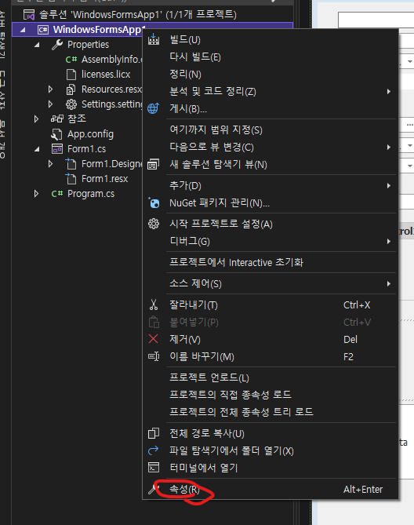
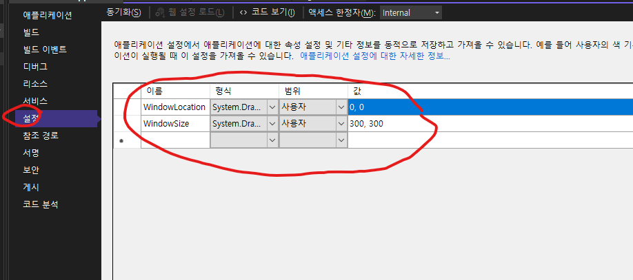
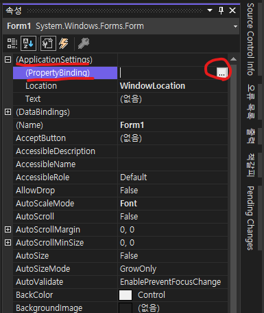
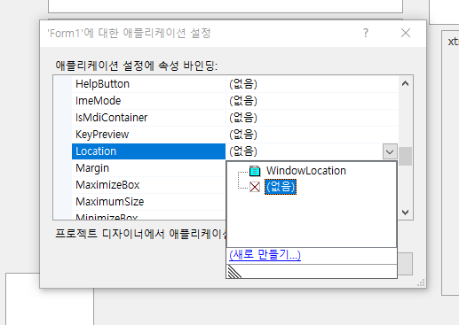
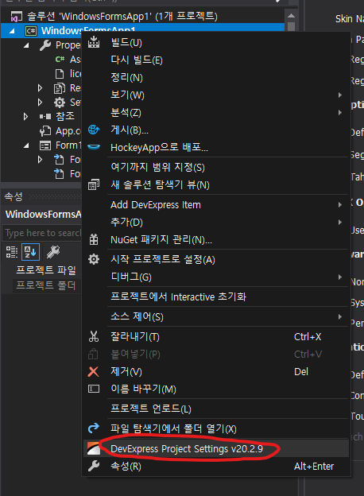
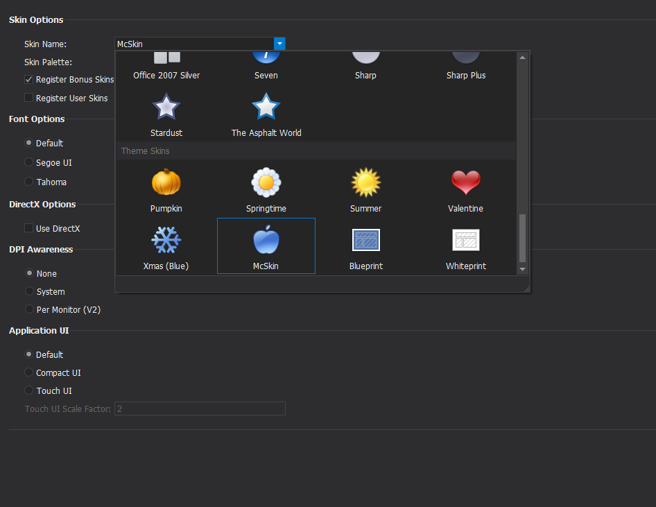
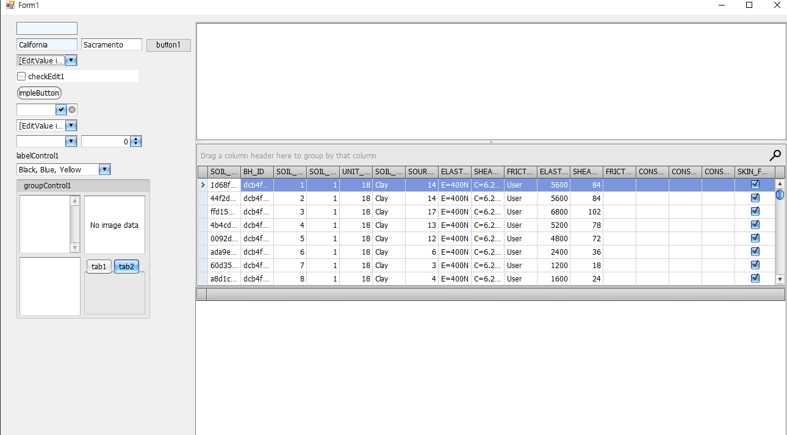
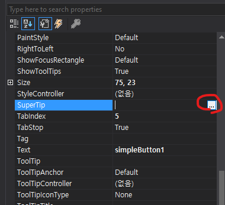
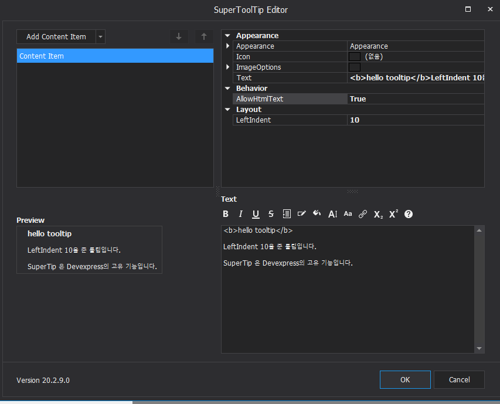
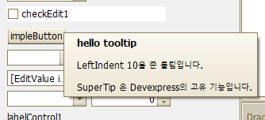

# 컨트롤 공통속성

목차

1. [ApplicationSettings(MS)](#1-applicationsettings)
2. [DataBindings(MS)](#2-databindings)
3. [AllowDrop(MS)](#3-allowdrop)
4. [AllowHtmlTextInToolTip(DevExpress)](#4-allowhtmltextintooltip)
5. [GenerateMember, Modifiers(MS)](#5-generatemember-and-modifiers)
6. [ImeMode(MS)](#6-imemode)
7. [Menumanager(DevExpress)](#7-menumanager)
8. [StyleController(DevExpress)](#8-stylecontroller)
9. [SuperTip(DevExpress)](#9-supertip)
10. [ToolTipAnchor(DevExpress)](#10-tooltipanchor)
11. Tag
12. UseWaitCursor

<hr />
<br />

## 1. ApplicationSettings

이 속성은 모든 컨트롤에 있는 속성인데 사용자가 값을 바꾸면 셋팅값으로 저장했다가 다시 불러오는 기능입니다. 쉽게 설명하자면 윈도우 사이즈를 사용자가 줄이거나 늘렸을때 프로그램을 끄고 다시키면 사용자가 설정한 값을 다시 불러오는 기능입니다. 물론 이건 하나의 예시고 다른용도입니다. 아래는 예시입니다.

먼저 프로젝트에 셋팅값 변수를 생성해 주어야 합니다. 프로젝트를 오른쪽 클릭한 후 속성을 눌러주세요.



프로젝트의 셋팅값 변수를 할당합니다. 여기에 이름과 형식 법위 값이 중요한데 값이 없으면 nullexception을 냅니다. 형식에 따라서 ApplicationSettings 하위에 PropertyBinding 속성에 바인딩 할 수 있는 속성이 달라집니다.



메인 폼 컨트롤의 속성으로 들어가면 ApplicationsSettings 하위에 PropertyBinding속성 컬렉션이 있습니다. 눌러줍니다.



아래와 같이 팝업이 뜨면서 바인딩할 변수를 선택해 줄 수 있습니다. 위에서 작성한 WindowLocation이 보이죠? 이걸 인제 선택할 수 있습니다. 



이로써 사용자가 프로그램을 실행하고 사용할 때 프로그램의 위치를 기억해서 프로젝트의 WindowLocation 변수에 값을 저장했다가 다시 프로그램을 실행시키면 그 위치로 생성됨을 알 수 있습니다. 

이와 달리 코드단에서도 더 많은 기능을 수행할 수 있습니다. 이벤트를 사용해서 초기 셋팅값을 주는 방식입니다. 아래는 예제 코드입니다. 

```C#
public partial class Form1 : Form
{     
    public Form1()
    {
        InitializeComponent();
        SetControls();
    }

    private void SetControls()
    {
        this.Load += FormMain_Load; //Form1의 Load 이벤트 핸들러에게 FormMain_Load를 등록합니다.          
    }

    private void FormMain_Load(object sender, EventArgs e)
    {
        // Set window location
        if (Settings.Default.WindowLocation != null)
        {
            this.Location = Settings.Default.WindowLocation;
        }

        // Set window size
        if (Settings.Default.WindowSize != null)
        {
            this.Size = Settings.Default.WindowSize;
        }
        this.FormClosing += FormMain_FormClosing;
    }

    private void FormMain_FormClosing(object sender, FormClosingEventArgs e)
    {
        // Copy window location to app settings
        Settings.Default.WindowLocation = this.Location;

        // Copy window size to app settings
        if (this.WindowState == FormWindowState.Normal)
        {
            Settings.Default.WindowSize = this.Size;
        }
        else
        {
            Settings.Default.WindowSize = this.RestoreBounds.Size;
        }

        // Save settings
        Settings.Default.Save();
    }
}
```

위와같이 컨트롤마다 컨트롤 생성 이벤트 핸들러에 위의 FormMain_Load, FormMain_FormClosing이벤트를 등록해주는 방법이 있습니다만 그러면 컨트롤 개수마다 
커스텀한 이벤트들을 작성해 주어야 하므로 코드양이 매우 길어질 수 있습니다. 따라서 모든 컨트롤에는 속성값으로 ApplicationSettings와 하위에 
PropertyBinding 속성을 제공합니다. 여기에 필요한 셋팅값을 줄 수 있습니다. 

<hr />
<br />

## 2. DataBindings

데이터 바인딩은 컨트롤단에서 사용자가 값을 바꾸면 연결된 데이터 모델/db도 자동으로 수정되게 만드는 기능입니다. Binding이란 뜻이 우리나라 말로 "묶다"라는 의미를 가지고 있습니다. 즉 컨트롤과 데이터를 한데로 묶어서 연결시킨다~ 라는 개념입니다. 모델이나 db등에 데이터가 바뀐다면 자연스럽게 묶여버린 컨트롤에도 값이 바뀌겠죠. 

가령 예를 들어 Devexpress의 TextEdit 컨트롤과 모델클래스를 바인딩 해보겠습니다. 아래 평범한 모델 Person.cs를 생성합니다.

```C#
public class Person 
{
    public string Name {get;set;}
    public DateTime DateOfBirth {get;set;}
}
```

그리고 나서 TextEdit컨트롤에 (ControlBindingsCollection)Databinding 프로퍼티의 Add메서드를 호출해줍니다. 첫 인자는 컨트롤의 속성(프로퍼티) 두번째 인자는 모델, 세번째 인자는 모델의 속성 (프로퍼티)을 차례대로 넣어줍니다.

```C#
this.textEdit1.DataBindings.Add("Text", person, "Name");
```

그런데 이렇게만 하면 사용자가 값을 아무리 바꾸어도 모델의 값이 바뀌지 않습니다. 이유는 바인딩은 되었지만 UI에게 값이 바뀌었다고 알려주지 않았기 때문입니다(속성값이 변경되었음을 클라이언트에게 알려줌). 모델에 INotifyPropertyChanged 인터페이스를 상속받게 하고 UI에게 값이 바뀌었다고 알려줘야 합니다. 참으로.. 이게 뭔상황인지.. 그래서 Person.cs를 아래와 같이 고쳐줘야 합니다. 

```C#
public class Person : INotifyPropertyChanged
{
    private string name;
    public string Name
    {
        get { return name; }
        set
        {
            name = value;
            NotifyPropertyChanged("name");
        }
    }
    private DateTime dateOfBirth;
    public DateTime DateOfBirth
    {
        get { return dateOfBirth; }
        set
        {
            dateOfBirth = value;
            NotifyPropertyChanged("dateOfBirth");
        }
    }

    public event PropertyChangedEventHandler PropertyChanged;

    private void NotifyPropertyChanged(String info)
    {
        var handler = PropertyChanged;
        if (handler != null)
        {
            handler(this, new PropertyChangedEventArgs(info));
        }
    }
}
```

또한 바인딩의 Add메서드의 아규먼트 formattingEnabled와 updateMode에 각각 true와 DataSourceUpdateMode.OnPropertyChanged를 넣어줘야 합니다. 

```C#
this.textEdit1.DataBindings.Add("Text", person, "Name", true, DataSourceUpdateMode.OnPropertyChanged);
```

보면 여기서 DateOfBirth도 있는데 상식적으로 생각해보면 컨트롤에서 TextEdit은 입력값을 하나만 받아서 속성으로 "Text"라는것이 있는데 이거는 이미 Person클래스의 Name과 바인딩 했습니다. 그러면 DatOfBirth도 바인딩을 하고싶어도 못합니다. 다른 컨트롤을 사용해야합니다. 아니면 TextEdit의 컨트롤을 하나더 생성해서 DateOfBirth와 바인딩 해도 됩니다. 

근데 DataSource는 컬렉션을 줄 수도 있습니다. 하나의 MSDN으로 부터 가져온 예제를 보면 알 수 있습니다. 먼저 폼에 TextEdit 2개를 만들고 Button하나를 생성합니다. 그리고 아래와 같이 State.cs클래스를 하나 만들어봅니다. 

```C#
public class State
{
    private string stateName;
    public string Name
    {
        get { return stateName; }
    }

    private string stateCapital;
    public string Capital
    {
        get { return stateCapital; }
    }

    public State(string name, string capital)
    {
        stateName = name;
        stateCapital = capital;
    }
}
```

아래와 같이 코드를 작성하면 버튼을 누를때마다 ArrayList에 있는 State모델들을 하나씩 꺼내서 보여주게 됩니다. 여기서 중요한점은 DataBinding 프로퍼티에게 DataSource를 넘길때 컬랙션 스타일을 넘겨도 된다는 것입니다. 

```C#
public partial class Form1 : Form
{
    ArrayList states;
    BindingSource bindingSource1;

    public Form1()
    {
        InitializeComponent();
        SetTextEditAndBox();
    }

    private void SetTextEditAndBox()
    {              
        states = new ArrayList();
        states.Add(new State("California", "Sacramento"));
        states.Add(new State("Oregon", "Salem"));
        states.Add(new State("Washington", "Olympia"));
        states.Add(new State("Idaho", "Boise"));
        states.Add(new State("Utah", "Salt Lake City"));
        states.Add(new State("Hawaii", "Honolulu"));
        states.Add(new State("Colorado", "Denver"));
        states.Add(new State("Montana", "Helena"));

        bindingSource1 = new BindingSource();
        bindingSource1.DataSource = states;

        this.textEdit1.DataBindings.Add("Text", bindingSource1, "Name");
        this.textEdit2.DataBindings.Add("Text", bindingSource1, "Capital");

        this.button1.Click += button1_Click;        
    }

    private void button1_Click(object sender, EventArgs e)
    {
        // If items remain in the list, remove the first item.
        if (states.Count > 0)
        {
            states.RemoveAt(0);

            // Call ResetBindings to update the textboxes.
            bindingSource1.ResetBindings(false);
        }
    }
}
```

위의 코드 또한 INotifyPropertyChanged State.cs에 부여하지 않았기 때문에 컨트롤에서 값을 바꾸어도 모델값은 바뀌지 않습니다. 아래는 완전히 정리한 예제 입니다. 아래의 NotifyPropertyChanged의 구현이 위와는 다릅니다. [CallerMemberName]속성을 파라미터에 부여했는데요. 이는 호출한 프로퍼티의 멤버이름을 자동으로 가져옵니다. 따라서 NotifyPropertyChanged(stateName);이렇게 하지 않고 NotifyPropertyChanged();만 프로퍼티 안에서 호출해주면 자동으로 stateName이 파라미터값으로 들어가게 됩니다. 

```C#
public class State : INotifyPropertyChanged
    {
        private string stateName;
        public string Name
        {
            get { return stateName; }
            set 
            {
                if(value != stateName)
                {
                    stateName = value;
                    NotifyPropertyChanged();
                }
            }
        }

        private string stateCapital;

        public string Capital
        {
            get { return stateCapital; }
            set
            {
                if(value != stateCapital)
                {
                    stateCapital = value;
                    NotifyPropertyChanged();
                }                    
            }
        }

        public State(string name, string capital)
        {
            stateName = name;
            stateCapital = capital;
        }

        public event PropertyChangedEventHandler PropertyChanged;
        // This method is called by the Set accessor of each property.  
        // The CallerMemberName attribute that is applied to the optional propertyName  
        // parameter causes the property name of the caller to be substituted as an argument.  
        private void NotifyPropertyChanged([CallerMemberName] String propertyName = "")
        {
            PropertyChanged?.Invoke(this, new PropertyChangedEventArgs(propertyName));
        }    
    }


public partial class Form1 : Form
{
    ArrayList states;
    BindingSource bindingSource1;

    public Form1()
    {
        InitializeComponent();
        SetTextEditAndBox();
    }

    private void SetTextEditAndBox()
    {              
        states = new ArrayList();
        states.Add(new State("California", "Sacramento"));
        states.Add(new State("Oregon", "Salem"));
        states.Add(new State("Washington", "Olympia"));
        states.Add(new State("Idaho", "Boise"));
        states.Add(new State("Utah", "Salt Lake City"));
        states.Add(new State("Hawaii", "Honolulu"));
        states.Add(new State("Colorado", "Denver"));
        states.Add(new State("Montana", "Helena"));

        bindingSource1 = new BindingSource();
        bindingSource1.DataSource = states;

        //바인딩 파라미터로 true 와 DataSourceUpdateMode.OnPropertyChanged를 넘겨줘야 합니다. 
        this.textEdit1.DataBindings.Add("Text", bindingSource1, "Name", true, DataSourceUpdateMode.OnPropertyChanged);
        this.textEdit2.DataBindings.Add("Text", bindingSource1, "Capital", true, DataSourceUpdateMode.OnPropertyChanged);

        this.button1.Click += button1_Click;        
    }

    private void button1_Click(object sender, EventArgs e)
    {
        // If items remain in the list, remove the first item.
        if (states.Count > 0)
        {
            states.RemoveAt(0);

            // Call ResetBindings to update the textboxes.
            bindingSource1.ResetBindings(false);
        }
    }
}
```

<hr />
<br />

## 3. AllowDrop

컨트롤에 데이터를 끌어서 놓을 수 있는지 여부를 나타냅니다(Boolean값). 아래는 예제 입니다. 아무 Form을 생성하고 거기에 AllowDrop을 true로 설정합니다. 그리고 관련된 이벤트를 작성합니다. 이미지 파일을 폼에 드래그 앤 드롭할 수 있게됩니다. 컨트롤 클래스이기 때문에 Control클래스를 상속받는 모든 컨트롤에 속성값으로 존재합니다.

```C#
private Image picture;
private Point pictureLocation;

public Form1()
{
   // Enable drag-and-drop operations and 
   // add handlers for DragEnter and DragDrop.
   this.AllowDrop = true;
   this.DragDrop += new DragEventHandler(this.Form1_DragDrop);
   this.DragEnter += new DragEventHandler(this.Form1_DragEnter);
}

protected override void OnPaint(PaintEventArgs e)
{
   // If there is an image and it has a location, 
   // paint it when the Form is repainted.
   base.OnPaint(e);
   if(this.picture != null && this.pictureLocation != Point.Empty)
   {
      e.Graphics.DrawImage(this.picture, this.pictureLocation);
   }
}

private void Form1_DragDrop(object sender, DragEventArgs e)
{
   // Handle FileDrop data.
   if(e.Data.GetDataPresent(DataFormats.FileDrop) )
   {
      // Assign the file names to a string array, in 
      // case the user has selected multiple files.
      string[] files = (string[])e.Data.GetData(DataFormats.FileDrop);
      try
      {
         // Assign the first image to the picture variable.
         this.picture = Image.FromFile(files[0]);
         // Set the picture location equal to the drop point.
         this.pictureLocation = this.PointToClient(new Point(e.X, e.Y) );
      }
      catch(Exception ex)
      {
         MessageBox.Show(ex.Message);
         return;
      }
   }

   // Handle Bitmap data.
   if(e.Data.GetDataPresent(DataFormats.Bitmap) )
   {
      try
      {
         // Create an Image and assign it to the picture variable.
         this.picture = (Image)e.Data.GetData(DataFormats.Bitmap);
         // Set the picture location equal to the drop point.
         this.pictureLocation = this.PointToClient(new Point(e.X, e.Y) );
      }
      catch(Exception ex)
      {
         MessageBox.Show(ex.Message);
         return;
      }
   }
   // Force the form to be redrawn with the image.
   this.Invalidate();
}

private void Form1_DragEnter(object sender, DragEventArgs e)
{
   // If the data is a file or a bitmap, display the copy cursor.
   if (e.Data.GetDataPresent(DataFormats.Bitmap) || 
      e.Data.GetDataPresent(DataFormats.FileDrop) ) 
   {
      e.Effect = DragDropEffects.Copy;
   }
   else
   {
      e.Effect = DragDropEffects.None;
   }
}
```

## 4. AllowHtmlTextInToolTip

<hr />
<br />

## 5. GenerateMember and Modifiers

GenerateMember는 Default값이 true이고 디자이너에 맴버로 생성합니다. 왠만하면 건드릴 일이 없어보입니다. Modifers는 맴버의 한정자를 선택하는 기능을 제공합니다. 

```C#
private void InitializeComponent()
{
    // button3 is declared in a local scope, because
    // its GenerateMember property is false.
    System.Windows.Forms.Button button3;
    this.button1 = new System.Windows.Forms.Button();
    this.button2 = new System.Windows.Forms.Button();
    button3 = new System.Windows.Forms.Button();
}
```

```C#
// The Modifiers property for button1 is "private".
private Button button1;

// The Modifiers property for button2 is "protected".
protected Button button2;

// button3 is not a member, because
// its GenerateMember property is false.
```

<hr />
<br />

## 6. ImeMode

선택된 객체의 입력기의 상태를 선택할 수 있습니다. 제품의 infrastructure를 위한것이지 코드단에서 사용하는것이 아니랍니다. IME(Input Method Editor)를 사용하면, 중국어, 일본어, 및 한국어 문자를 입력하고 편집할 수 있습니다. 보통 인코딩할 수 있는것보다 많은 문자를 지원합니다. IME는 개별 문자 또는 문자그룹을 설명하는 기본 문자 시퀀스를 사용하여 더 많은 문자 집합을 입력할 수 있도록 합니다. 기본문자 중에는 한글 음절의 구성문자 등이 있습니다. 

아래는 예제입니다. 폼의 InputLanguageChanged 이벤트 핸들러에 작성한 이벤트를 등록합니다. 

```C#
using System;
using System.Drawing;
using System.Collections;
using System.ComponentModel;
using System.Windows.Forms;
using System.Data;

public class Form1 : System.Windows.Forms.Form
{
    RichTextBox rtb = new RichTextBox();
    public Form1()
    {
        this.Controls.Add(rtb);
        rtb.Dock = DockStyle.Fill;
        this.InputLanguageChanged += new InputLanguageChangedEventHandler(languageChange);
    }
    private void languageChange(Object sender, InputLanguageChangedEventArgs e)
    {
        //한국어로 설정합니다.        
        if (e.InputLanguage.Culture.TwoLetterISOLanguageName.Equals("ko"))
        {
            rtb.ImeMode = System.Windows.Forms.ImeMode.Hangul;
        }
    }
    public static void Main(string[] args)
    {
        Application.Run(new Form1());
    }
}
```

<hr />
<br />

## 7. Menumanager

타입은 DevExpress.Utils.Menu.IDXMenuManager	이고 기본값은 null입니다. popup menu의 look and feel을 컨트롤 합니다. MenuManager프로퍼티는 프로그래머로부터 IDXMenuManager 객체를 선택할 수 있게 합니다. 프로퍼티가 현재 null값이라면 컨트롤의 popup menus는 컨트롤 자신이 그리게 됩니다. 

현재는 IDXMenuManager 인터페이스는 BarManager 컴포넌트로부터 상속되어있습니다. BarManager는 DevExpress.Ribbon, Menu, Docking 라이브러리에 있습니다. 

만약 MenuManager프로퍼티를 BarManager객체로 할당하면 좀더 다른 Look and Feel을 줄 수 있습니다. 이런경우 look and feel의 셋팅값은 BarManager에서 사용하는 BarAndDockingController 의 BarAndDockingController.LookAndFeel 프로퍼티로 컨트롤됩니다. 

번외로 스킨에 대해서 알아보겠습니다. 어플리케이션의 모든 컴포넌트들에 스킨을 씌우는것이 Look And Feel과 관련이 있습니다. 먼저 프로젝트를 오른쪽 클릭하고 DevExpress 설정을 눌러줍니다.



여기서 스킨에 관련된 설정을 할 수 있는데 클래스가 static전역으로 되어있는것 같습니다. 여튼 여기서 원하는 스킨을 골라줍니다. 저는 McSkin을 골라봤습니다.



아래의 코드를 코드단에 넣어줘야합니다. DevExpress.LookAndFeel은 전역입니다.

```C#
 DevExpress.LookAndFeel.UserLookAndFeel.Default.SetSkinStyle("McSkin");
```
아래와 같이 스킨이 씌워진것을 확인할 수 있습니다.



<hr />
<br />

## 8. StyleController

스타일 컨트롤러 객체를 생성하고 그 객체의 속성을 원하는 값으로 바꿔준다음 BaseControl을 상속하는 모든 객체들에게 BaseControl.StyleController에 할당하면 원하는 값으로 바뀌게 됩니다. 도구상자에서 StyleController를 가져다가 놓을 수도 있지만 코드단에서 객체를 생성하고 관리하는것이 좀더 좋아보입니다. 이렇게 한다면 여러개의 컨트롤들에게, 원하는만큼 동일한 스타일을 부여할 수 있습니다. 

```C#
using DevExpress.XtraEditors;
// Create and customize the Style Controller.
StyleController styleController1 = new StyleController();
// Set the background color.
styleController1.Appearance.BackColor = Color.LightYellow;
// Customize the LookAndFeel settings.
//스킨 이름은 데브의 LookAndFeel관련 항목을 보면 됩니다. 
styleController1.LookAndFeel.UseDefaultLookAndFeel = false;
styleController1.LookAndFeel.SkinName = "Office 2016 Colorful"; 
// Assign the StyleController to editors.
buttonEdit1.StyleController = styleController1;
lookUpEdit1.StyleController = styleController1;
```

<hr />
<br />

## 9. SuperTip

SuperTip은 컨트롤에 마우스 커서를 가져다 대면 나오는 작은 메모입니다. 사용자에게 컨트롤의 힌트를 주는 방법입니다. 코드단에서 설정할 수도 있고 VisualStudio의 Property 속성 변경을 통해서도 가능합니다. 

먼저 SuperTip속성을 찾습니다.



다음으로 속성을 관리하는 윈도우창이 생성되는데 여기서 메모의 형식과 내용을 작성해 줍니다.



짜란~



<hr />
<br />

## 10. ToolTipAnchor

컨트롤의 툴팁이 마우스 포인터에 상대적으로 고정되는지 아니면 소유하는 컨트롤에 상대적으로 고정되는지 여부를 지정하는 앵커 값입니다. 기본 디폴트값으로는 Default가 지정되어 있고, 기본이라면 마우스 포인터에 상대적으로 툴팁이 고정되어 보입니다. 

만약 아래와 같이 다른 컨트롤의 툴팁정보를 가져와 이벤트 GetActiveObjectIfo로 할당하면 툴팁엥커는 상관없어지게 됩니다. 아래는 groupControl1에 다가 button1 에서 가져온 툴팁정보를 넣어줄때 예시입니다. 

```C#
private void SetTooltipAnchor()
{
    this.groupControl1.ToolTipController.GetActiveObjectInfo += toolTipController1_GetActiveObjectInfo;
}

private void toolTipController1_GetActiveObjectInfo(object sender, DevExpress.Utils.ToolTipControllerGetActiveObjectInfoEventArgs e)
{
    //버튼이 가지고 있는 툴팁컨트롤을 가져옵니다. 
    ToolTipControlInfo info = new ToolTipControlInfo(this.button1, "hihi");
    info.SuperTip = new SuperToolTip();
    info.SuperTip.Items.Add(new ToolTipTitleItem() { Text = "안녕하세요" });
    info.SuperTip.Items.Add(new ToolTipItem() { Text = "ㅎㅇㅎㅇ" });
    info.ObjectBounds = e.SelectedControl.RectangleToScreen(e.SelectedControl.ClientRectangle);
    e.Info = info;
}
```
