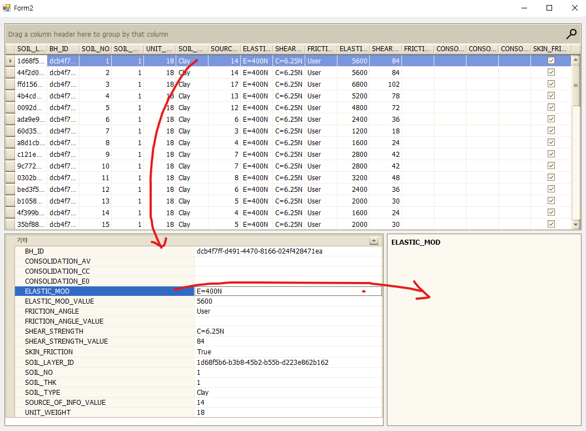
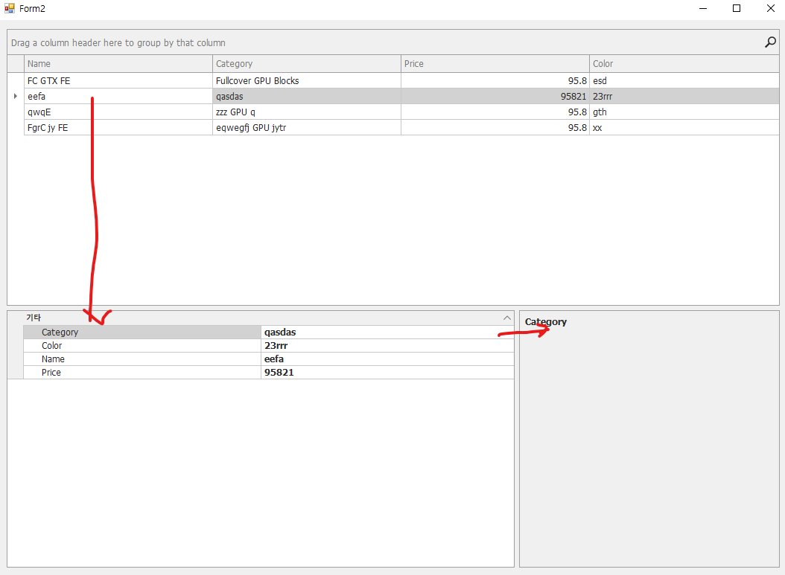

# PropertyGridControl



1. 간단한 예제
2. PropertyDescriptionControl
3. 프로퍼티 컨틀롤로 속성값 변경

<hr />
<br />

## 1. 간단한 예제 

아래와 같이 먼저 간단한 모델을 하나 만듭니다. Product클래스 입니다.

```C#
//Create a business object.
public class Product
{
    public Product(string name, string category, float price, string color)
    {
        Name = name; Category = category; Price = price; Color = color;
    }
    public string Name { get; set; }
    public string Category { get; set; }
    public float Price { get; set; }
    public string Color { get; set; }
}
```

폼을 하나 생성하고 initSampleData()메서드로 그리드 컨트롤에 데이터소스를 바인딩해줍니다. 그리드의 포커스된 로우가 바뀔때 호출하는 이벤트를 등록해줍니다. 이렇게 되면 그리드의 항목을 누를때마다 PropertyGridControl에 해당에 맞는 프로퍼티를 보여주게 됩니다. (Product)gridView.GetRow(gridView1.FocusedRowHandle)를 SelectedObject프로퍼티에 할당했는데요 Object[] 형식이어서 왠만한 형식의 데이터소스는 다 받습니다. (Product)클래스로 다운

```C#
public partial class Form2 : Form
{
    public Form2()
    {
        InitializeComponent();
        SetGridControl();
    }

    private void SetGridControl()
    {
        //Bind the lookup editor to a data source.
        this.gridControl1.DataSource = this.initSampleData();                                    
        this.gridView1.FocusedRowChanged += GridView1_FocusedRowChanged;
        this.propertyDescriptionControl1.PropertyGrid = this.propertyGridControl1;
    }

    //Assign the selected object to the Property Grid.    
    private void GridView1_FocusedRowChanged(object sender, DevExpress.XtraGrid.Views.Base.FocusedRowChangedEventArgs e)
    {
        GridView gridView = sender as GridView;
        //프로퍼티 그리드에 데이터를 등록해줍니다. 
        propertyGridControl1.SelectedObject = (Product)gridView.GetRow(gridView1.FocusedRowHandle);
    }

    //Create a list of products.
    public List<Product> initSampleData()
    {
        List<Product> result = new List<Product>();
        result.Add(new Product("FC GTX FE", "Fullcover GPU Blocks", 95.80f, "esd"));
        result.Add(new Product("eefa", "qasdas", 95821.0f, "23rrr"));
        result.Add(new Product("qwqE", "zzz GPU q", 95.80f, "gth"));
        result.Add(new Product("FgrC jy FE", "eqwegfj GPU jytr", 95.80f, "xx"));
        //. . .
        return result;
    }
}
```

결과는 아래사진과 같습니다.

