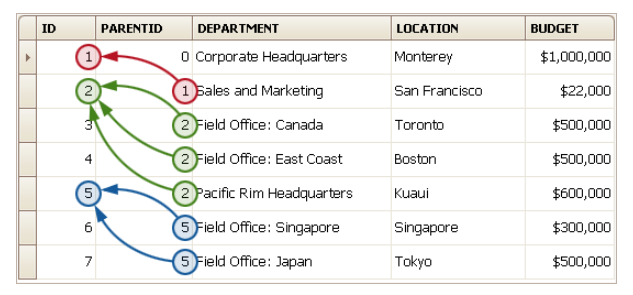
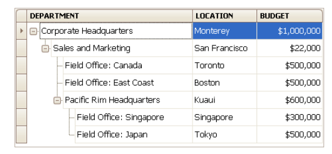
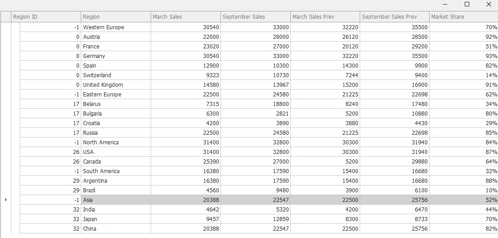
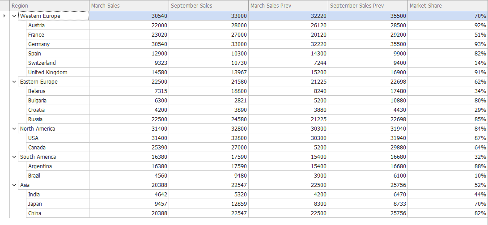

# TreeList

- [TreeList](#treelist)
  - [1. DataBinding](#1-databinding)
    - [1). 부모-자식 관계](#1-부모-자식-관계)
    - [2). Root Nodes](#2-root-nodes)
    - [3). Unbound 컬럼 추가](#3-unbound-컬럼-추가)

<hr />
<br />

## 1. DataBinding

TreeList 컨트롤은 계층적인 데이터 구조를 가지고 있습니다. 부모와 자식노드 관계를 가지고 있습니다. 여기서는 어떻게 부모-자식관계를 데이터소스 레벨에서 정의하는지 알아봅니다.

### 1). 부모-자식 관계

TreeList에 data source bound할때는 두개의 필드를 요구합니다.

1. Key Field
2. Parent Field

- Key Field는 고유한 값을가져서 데이터소스의 레코드를 인식하는데 사용됩니다. Key Field의 필드이름을 TreeList.KeyFieldName 프로퍼티에 할당해야 합니다.

- Parent Field 필드는 해당 부모노드의 키 필드를 나타냅니다. 이 필드 이름을 TreeList.ParentFieldNmae프로퍼티에 할당해야 합니다. 

아래 이미지는 Key Field이 포함된 ID컬럼을 가지는 데이터 소스입니다. PARENTID 컬럼은 부모 행을 식별하는 Parent Field입니다. 



아래의 이미지는 위와같은 데이터 소스입니다. TreeList.KeyFieldName 프로퍼티에 "ID"가 할당되고, TreeList.ParentFieldName프로퍼티에 "PARENTID"가 할당되었습니다. 



### 2). Root Nodes

루트노드들은 부모가 없습니다. 위의 이미지에서 Corporate Headquarters를 보면 알 수 있습니다. 모든 루트 노드들은 자신들의 Parent Field(TreeList.ParentFieldName)값들이 TreeList.RootValue에 할당되어야 합니다. 기본값은 0 입니다.

부모가 없는 노드들 중에 Parent Field값이 TreeList.RootValue에 없으면 루트노드로 인식됩니다. 만약 컨트롤에 이러한 부모가 없는 노드들을 포함하게 된다면 컨트롤은 계층구조를 여러가지형태로 다시 만들어냅니다(데이터가 수정되거나 정렬될때). 그러면 예상치 못한 깜빡임과 스크롤할 때 이상하게 보일 수 있습니다. 따라서 Parent Field값과 TreeList.RootValue값이 일치하도록 싱크를 맞춰주는것을 권장합니다. 

아래의 이미지는 TreeList.KeyFieldName프로퍼티와 TreeList.ParentFieldName프로퍼티에 컬럼이름을 할당하지 않았을때 입니다.



아래의 이미지는 TreeList.KeyFieldName프로퍼티에 "ID"를 할당하고 TreeList.ParentFieldName프로퍼티에 "RegionID"를 할당했을때 입니다. 잘 되는것을 확인할 수 있습니다. 




아래는 실행 코드입니다. 

```C#
public class SalesDataGenerator
{
    public static List<SalesData> CreateData()
    {
        List<SalesData> sales = new List<SalesData>();
        sales.Add(new SalesData(0, -1, "Western Europe", 30540, 33000, 32220, 35500, .70));
        sales.Add(new SalesData(1, 0, "Austria", 22000, 28000, 26120, 28500, .92));
        sales.Add(new SalesData(2, 0, "France", 23020, 27000, 20120, 29200, .51));
        sales.Add(new SalesData(3, 0, "Germany", 30540, 33000, 32220, 35500, .93));
        sales.Add(new SalesData(4, 0, "Spain", 12900, 10300, 14300, 9900, .82));
        sales.Add(new SalesData(5, 0, "Switzerland", 9323, 10730, 7244, 9400, .14));
        sales.Add(new SalesData(6, 0, "United Kingdom", 14580, 13967, 15200, 16900, .91));

        sales.Add(new SalesData(17, -1, "Eastern Europe", 22500, 24580, 21225, 22698, .62));
        sales.Add(new SalesData(18, 17, "Belarus", 7315, 18800, 8240, 17480, .34));
        sales.Add(new SalesData(19, 17, "Bulgaria", 6300, 2821, 5200, 10880, .8));
        sales.Add(new SalesData(20, 17, "Croatia", 4200, 3890, 3880, 4430, .29));
        sales.Add(new SalesData(21, 17, "Russia", 22500, 24580, 21225, 22698, .85));

        sales.Add(new SalesData(26, -1, "North America", 31400, 32800, 30300, 31940, .84));
        sales.Add(new SalesData(27, 26, "USA", 31400, 32800, 30300, 31940, .87));
        sales.Add(new SalesData(28, 26, "Canada", 25390, 27000, 5200, 29880, .64));

        sales.Add(new SalesData(29, -1, "South America", 16380, 17590, 15400, 16680, .32));
        sales.Add(new SalesData(30, 29, "Argentina", 16380, 17590, 15400, 16680, .88));
        sales.Add(new SalesData(31, 29, "Brazil", 4560, 9480, 3900, 6100, .10));

        sales.Add(new SalesData(32, -1, "Asia", 20388, 22547, 22500, 25756, .52));
        sales.Add(new SalesData(34, 32, "India", 4642, 5320, 4200, 6470, .44));
        sales.Add(new SalesData(35, 32, "Japan", 9457, 12859, 8300, 8733, .70));
        sales.Add(new SalesData(36, 32, "China", 20388, 22547, 22500, 25756, .82));
        return sales;
    }
}
```

```C#
public class SalesData
{
    static int UniqueID = 37;
    public SalesData()
    {
        ID = UniqueID++;
    }
    public SalesData(int id, int regionId, string region, decimal marchSales, decimal septemberSales, decimal marchSalesPrev, decimal septermberSalesPrev, double marketShare)
    {
        ID = id;
        RegionID = regionId;
        Region = region;
        MarchSales = marchSales;
        SeptemberSales = septemberSales;
        MarchSalesPrev = marchSalesPrev;
        SeptemberSalesPrev = septermberSalesPrev;
        MarketShare = marketShare;
    }
    public int ID { get; set; }
    public int RegionID { get; set; }
    public string Region { get; set; }
    public decimal MarchSales { get; set; }
    public decimal SeptemberSales { get; set; }
    public decimal MarchSalesPrev { get; set; }
    public decimal SeptemberSalesPrev { get; set; }

    [DisplayFormat(DataFormatString = "p0")]
    public double MarketShare { get; set; }
}
```

```C#
public partial class XtraForm1 : DevExpress.XtraEditors.XtraForm
{
    public XtraForm1()
    {
        InitializeComponent();
        
        treeList1.DataSource = SalesDataGenerator.CreateData();
        treeList1.KeyFieldName = "ID";
        treeList1.ParentFieldName = "RegionID";    
    }
}
```

### 3). Unbound 컬럼 추가

```C#
public partial class XtraForm1 : DevExpress.XtraEditors.XtraForm
{
    public XtraForm1()
    {
        InitializeComponent();
        
        CreateColumns(this.treeList1);
        CreateNodes(this.treeList1);    
    }
}

private void CreateColumns(TreeList treeList)
{
    treeList.BeginUpdate();
    TreeListColumn column1 = treeList.Columns.Add();
    column1.Caption = "Customer";
    column1.VisibleIndex = 0;
    TreeListColumn column2 = treeList.Columns.Add();
    column2.Caption = "Location";
    column2.VisibleIndex = 1;
    TreeListColumn column3 = treeList.Columns.Add();
    column3.Caption = "Phone";
    column3.VisibleIndex = 2;
    treeList.EndUpdate();
}

private void CreateNodes(TreeList treeList)
{
    treeList.BeginUnboundLoad();
    TreeListNode parentForRootNodes = null;
    TreeListNode rootNode = treeList.AppendNode(new object[] { "AAAAAA", "BBBBBB", "000-0000-0000" }, parentForRootNodes);
    treeList.AppendNode(new object[] { "CCCCCC", "DDDDDDD", "1111-1111-1111" }, rootNode);
    treeList.AppendNode(new object[] { "ABB", "ADDADA", "222-2222-1111" }, rootNode);
    treeList.EndUnboundLoad();
}
```